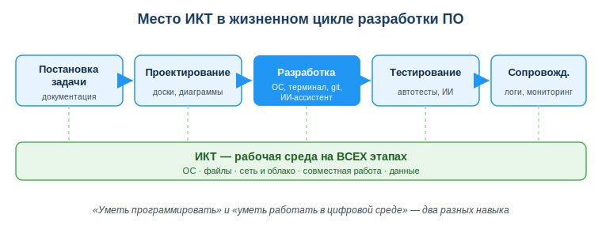
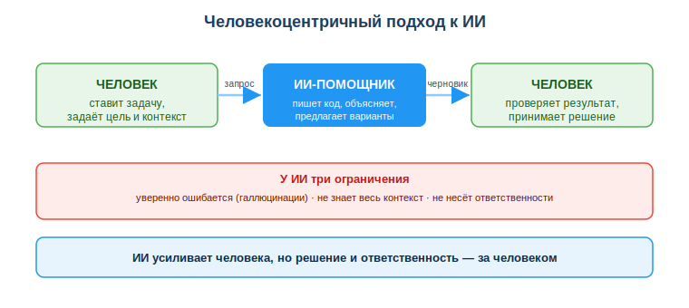

# Изучить роль ИКТ и цифровых технологий в разработке ПО

## Практическая ситуация

Ты получил тестовое задание на стажировку: «развернуть проект и добавить одну функцию». Кода ты не боишься — но проект не запускается: не та версия окружения, не настроен терминал, не клонируется репозиторий. Час уходит не на функцию, а на борьбу со средой.

Рядом коллега просит ИИ-ассистента написать функцию проверки пароля. ИИ выдаёт код, который запускается, и коллега сдаёт его как есть. Позже выясняется: пароли хранятся в открытом виде. Два разных провала — но причина одна: инструменты были, а владения средой и контроля над результатом не хватило.

## Что ты научишься делать

- объяснять, где именно ИКТ работают на каждом этапе создания ПО;
- отличать «инструмент усиливает меня» от «инструмент решает за меня»;
- формулировать, почему за код и данные отвечает разработчик, даже если их сгенерировал ИИ;
- защищать персональные данные при работе с ИИ-сервисами.

## Почему это важно

Между идеей и работающей программой стоит целая цепочка инструментов: операционная система, терминал, git, облако, мессенджеры, базы знаний и всё чаще — ИИ-ассистенты. Чем лучше ты владеешь этой средой, тем больше времени остаётся на главное — решать задачу, а не воевать с окружением.

Связь с профессией: работодатель оценивает не только то, как ты пишешь код, но и то, как быстро ты входишь в проект, работаешь в команде через git, проверяешь чужой (в том числе ИИ-сгенерированный) код и не допускаешь утечек данных. Это и есть «уметь работать в цифровой среде» — навык, который ценится наравне с языком программирования.

## Учимся читать схему

Посмотри на схему «Место ИКТ в жизненном цикле разработки ПО» выше. Ответь на вопросы:

- на каком этапе ИКТ-инструментов больше всего и почему он выделен цветом?
- что общего у всех этапов — что показано зелёной полосой внизу?
- почему «уметь программировать» и «уметь работать в цифровой среде» — это два разных навыка?

## Главное понятие

> **ИКТ** — методы и средства сбора, хранения, обработки и передачи информации с помощью компьютеров и сетей.

Для разработчика ИКТ — не отдельная дисциплина «на потом», а среда, в которой ты работаешь каждый день: ОС и файловая система, терминал, сеть и облако, инструменты совместной работы, данные.

## Где ИКТ включаются в жизненном цикле ПО

ИКТ работают не на одном этапе, а на всех — меняется только набор инструментов.

| Этап | Что реально используешь |
|---|---|
| Постановка задачи | справочные системы, документация, переписка с заказчиком |
| Проектирование | онлайн-доски, диаграммы, совместные документы |
| Разработка | ОС, терминал, репозиторий (git/GitHub), ИИ-ассистент |
| Тестирование | автотесты, ИИ для поиска ошибок |
| Сопровождение | мониторинг, логи, данные обратной связи |

Вывод: «уметь программировать» и «уметь работать в цифровой среде» — это два разных навыка, и второй не менее важен.

## Цифровая трансформация: контекст, в котором ты работаешь

**Цифровая трансформация** — перестройка процессов и услуг вокруг данных и цифровых технологий. В Казахстане это видно на каждом шагу: eGov, цифровой банкинг (Kaspi), электронные госуслуги, открытые данные. Как разработчик ты не просто пользуешься этими сервисами — завтра ты будешь их строить.

## Человекоцентричный подход к ИИ

ИИ-ассистент быстро пишет код, объясняет ошибку, генерирует тест. Но у него есть три свойства, которые меняют правила игры:

- он **уверенно ошибается** (галлюцинации) — выдаёт правдоподобный, но неверный ответ;
- он **не понимает контекст** твоего проекта целиком;
- он **не несёт ответственности** за последствия.

Поэтому современный подход (его закрепляет ЮНЕСКО в рамке ИИ-компетенций, 2024) называется **человекоцентричным**: специалист — ответственный пользователь и создатель ИИ, а не пассивный потребитель.

Это значит на практике:

- ИИ **усиливает** тебя, но финальное решение и проверку делаешь ты;
- любой результат ИИ ты **критически оцениваешь** перед использованием;
- ты соблюдаешь **права человека, приватность и законы РК** (нельзя скармливать ИИ чужие персональные данные).

### Мини-кейс

Студент попросил ИИ написать функцию проверки пароля. ИИ выдал код, который «работает», но хранит пароли в открытом виде. Студент сдал как есть.

Вопрос: кто виноват в утечке — ИИ или студент? Следующий шаг: всегда проверять сгенерированный код на безопасность, а не только на «запускается ли». Ответственность за результат остаётся на человеке, который этот код применил.

## Разбор типичной ошибки

**Ошибка.** «ИИ сказал — значит правильно».

**Почему это ошибка.** ИИ генерирует правдоподобный текст, а не истину; он не проверяет факты и не знает контекст твоего проекта целиком.

**Как правильно.** Относиться к ответу ИИ как к черновику от стажёра — перепроверять код, факты и решения перед тем, как принять их.

## Практика

Не пересказывай теорию — **сделай руками** и покажи результат. Работаешь в своей ОС, с реальным ИИ-ассистентом (любой доступный: чат-бот, помощник в редакторе). Итог сдаёшь одним файлом `praktika_01.md` (или скриншотами) — так, чтобы преподаватель увидел не рассуждение, а твоё действие.

**Задание 1. Поймай ИИ на «уверенной ошибке» (свойство №1).**
Открой любой ИИ-ассистент и задай ему фактический вопрос по своему варианту (номер в журнале):
- чётный номер: «Есть ли в Python встроенная функция для проверки, простое ли число? Как она называется?»
- нечётный номер: «Назови точный номер и год Закона РК о персональных данных».

Скопируй ответ ИИ **как есть**. Теперь проверь его сам: для Python — открой документацию python.org (раздел built-in functions), для закона — найди его на adilet.zan.kz. Запиши в файл три строки: (1) что ответил ИИ, (2) что оказалось на самом деле по официальному источнику, (3) совпало или нет. Если ИИ ответил верно — переформулируй вопрос покаверзнее и повтори, пока не поймаешь неточность: это и есть тренировка на свойство «ИИ уверенно ошибается».

**Задание 2. Проследи одну задачу через пять этапов — на своём примере.**
Возьми маленькую, но настоящую задачу («добавить кнопку выхода», «сделать список дел», «форму обратной связи» — любую свою). Пройди по ней все пять этапов жизненного цикла и для каждого **назови конкретный инструмент, который ты бы реально открыл**, а не «инструмент вообще». Оформи таблицей:

| Этап | Что делаю по МОЕЙ задаче | Какой инструмент открываю |
|---|---|---|
| Постановка | … | … |
| Проектирование | … | … |
| Разработка | … | … |
| Тестирование | … | … |
| Сопровождение | … | … |

**Задание 3. Сравни два пути с ИИ на живом коде.**
Попроси ИИ написать короткую функцию (например, проверку e-mail или подсчёт средней оценки). Проделай **путь «усиление»**: прочитай функцию построчно, запусти её у себя, прогони на трёх входах — обычном, пустом и «сломанном» (например, пустая строка). Запиши, что вернула функция на каждом входе и нашёл ли ты в ней слабое место. Затем в одном абзаце опиши, чем этот путь отличался бы от «перекладывания» (вставил не читая и сдал) — на твоём собственном примере, а не общими словами.

**Что сдать:** файл `praktika_01.md` с результатами трёх заданий (текст + таблица + вывод по коду). К заданию 3 приложи скриншот запуска функции с выводом на трёх входах.

**Образец (фрагмент задания 1):** «ИИ ответил: "В Python есть встроенная функция `is_prime()`". Проверил на python.org — такой встроенной функции нет, надо писать проверку самому. Не совпало: ИИ уверенно выдумал функцию. Вывод: даже простой факт от ИИ проверяю по официальному источнику, прежде чем вставлять в код».

**Образец (фрагмент задания 3):** «Путь усиления — прочитал функцию проверки e-mail, понял логику, запустил: на `a@b.kz` вернула True, на пустой строке — тоже True (ошибка!), значит функцию надо чинить. Я это нашёл, потому что читал и тестировал. Если бы я просто вставил её не глядя (перекладывание), баг ушёл бы в проект, а отвечать за него всё равно мне».

## Самопроверка

- Я знаю, где ИКТ работают на каждом этапе разработки ПО.
- Я умею отличать «ИИ усиливает меня» от «ИИ решает за меня».
- Я понимаю, почему за результат ИИ отвечает человек, и как защищать персональные данные.

## Подумай

- Какую часть твоей учёбы или будущей работы ИИ мог бы ускорить — и где ты обязан сам проверить результат?
- Почему передать ИИ реальные данные клиентов «ради скорости» — это не экономия времени, а риск?

## Итог

- Воспринимай ИКТ как рабочую среду — вкладывайся в неё так же, как в язык программирования.
- Используй ИИ как ускоритель, но **проверяй каждый его результат** (код, данные, факты).
- Помни: за код, данные и решения отвечаешь ты, а не инструмент.
- Никогда не передавай ИИ персональные данные без обезличивания.

## Полезные ссылки

- [UNESCO — Рамка ИИ-компетенций для учащихся (AI Competency Framework for Students)](https://www.unesco.org/en/articles/ai-competency-framework-students)
- [Закон РК «О персональных данных и их защите» (adilet.zan.kz)](https://adilet.zan.kz/rus/docs/Z1300000094)
- [Портал электронного правительства РК — eGov.kz](https://egov.kz)

---

*Источник: UNESCO AI Competency Framework for Students (2024); DigComp 2.2; Закон РК «О персональных данных и их защите».*

*Разработал: преподаватель ИКТ, магистр управления и информационной безопасности Калиаскаров Д.А.*

*Материал одобрен к использованию в обучении решением Педагогического совета ТОО «Колледж Хекслет Казахстан».*
