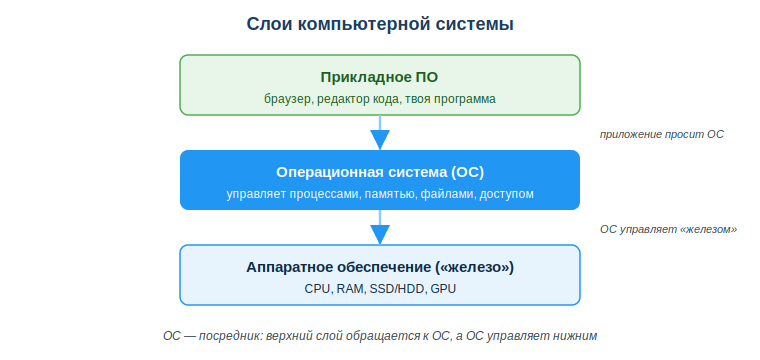
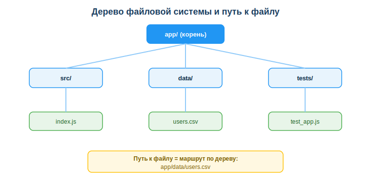

# Устройство ПК, операционные системы и файловая система

## Практическая ситуация

«У меня работает, а у него — нет». Знакомая фраза? Ты написал программу, у тебя на ноутбуке всё запускается, а у одногруппника или на сервере падает с ошибкой «файл не найден». Чаще всего дело не в коде, а в окружении: другая операционная система, другой путь к файлу, не та версия, неверный регистр в имени.

Чтобы такие проблемы не съедали часы, разработчику нужно понимать, на чём и где выполняется его программа. Любая программа работает не в пустоте: под ней — слои аппаратного обеспечения, операционной системы и файловой системы. Посмотри на эти слои.



## Что ты научишься делать

- объяснять, какие компоненты ПК влияют на скорость разработки и запуска программ;
- описывать, что делает операционная система, и зачем разработчику Linux;
- ориентироваться в файловой системе: строить пути, читать расширения, держать структуру проекта;
- избегать типичных ошибок с путями, регистром и именами файлов.

## Почему это важно

Окружение — это фундамент, на котором стоит твой код. Не понимаешь фундамент — тратишь часы на загадочные ошибки, которые «появляются сами». Понимаешь — собираешь рабочую среду осознанно и быстро находишь причину сбоя.

Связь с профессией: разработчик ежедневно работает в терминале, ставит окружение, разворачивает код на серверах под управлением Linux. Умение читать пути, выбирать ПК под задачи и держать структуру проекта в порядке отличает того, у кого «просто работает», от того, кто постоянно борется с настройкой.

## Учимся читать схему

Посмотри на схему слоёв системы выше. Ответь на вопросы:

- какой слой находится между твоей программой и «железом»?
- к кому обращается прикладная программа, когда ей нужно прочитать файл или выделить память?
- почему ОС называют посредником?

## Главное понятие

> **Операционная система (ОС)** — программа-посредник между пользователем, приложениями и аппаратным обеспечением; она управляет процессами, памятью, файлами и доступом.

Проще: ты и твои программы не управляете «железом» напрямую. За это отвечает ОС: она решает, кому выделить память, какой процесс выполнить, где хранить файл и кто имеет к нему доступ.

## Из чего состоит компьютер (и что важно разработчику)

| Компонент | За что отвечает | Почему важно тебе |
|---|---|---|
| Процессор (CPU) | вычисления | скорость сборки, запуска тестов |
| Оперативная память (RAM) | данные «здесь и сейчас» | сколько программ/вкладок/контейнеров потянешь |
| Накопитель (SSD/HDD) | хранение файлов | SSD кратно ускоряет работу проекта |
| Видеокарта (GPU) | графика, вычисления | нужна для игр, графики, обучения ИИ |

Вывод: для разработки критичнее всего **RAM и SSD**, а не «самый мощный процессор».

## Операционная система: что она делает

ОС управляет четырьмя вещами:

- процессами (что выполняется),
- памятью (кому сколько RAM),
- файлами (где что хранится),
- доступом (кто что может).

### Windows или Linux?

- **Windows** — привычная среда, много прикладных программ.
- **Linux** — на нём работает большинство серверов в мире. Разработчику важно уметь в нём ориентироваться: туда «уезжает» твой код в продакшене.

Знать обе ОС — норма для разработчика. Часто на Windows ставят Linux-окружение (WSL, контейнеры), чтобы среда совпадала с сервером и не возникало ошибок «работает только у меня».

## Файловая система: где живут твои файлы

Файлы хранятся не вперемешку, а в виде дерева: папки вложены в папки, в них лежат файлы. Чтобы добраться до файла, ты проходишь по этому дереву — это и есть **путь**.



**Путь** — адрес файла. Бывает:

- **абсолютный** — от корня: `C:\projects\app\index.js` (Windows) или `/home/user/app/index.js` (Linux);
- **относительный** — от текущей папки: `./src/index.js`, `../data/file.csv`.

Важные детали:

- **Расширение** (`.js`, `.py`, `.csv`) подсказывает тип файла, но не гарантирует его содержимое.
- **Регистр**: в Linux `File.js` и `file.js` — это **разные** файлы, в Windows — один. Отсюда баг «работает у меня, не работает на сервере».
- **Скрытые файлы** (`.gitignore`, `.env`) начинаются с точки.

### Структура проекта — это порядок

Типовой проект:

```
app/
  src/      исходный код
  tests/    тесты
  docs/     документация
  data/     данные
  README.md описание
```

Порядок в файлах = меньше ошибок и быстрее работа в команде.

### Мини-кейс

Код запускается на твоём компьютере, но падает на сервере с ошибкой «файл не найден». В коде путь: `Data/users.csv`. На сервере файл называется `data/users.csv`.

Причина: Linux чувствителен к регистру. Следующий шаг: договориться о единых именах (нижний регистр, без пробелов и кириллицы) и использовать относительные пути.

## Разбор типичной ошибки

**Ошибка.** Пробелы и кириллица в именах файлов и путях (`мой проект/файл 1.py`), а также жёстко прописанный абсолютный путь вроде `C:\Users\Ivan\app\data.csv`.

**Почему это ошибка.** Пробелы и кириллица ломают команды терминала, импорт и развёртывание. Абсолютный путь к твоей папке у коллеги или на сервере не существует — код не запустится.

**Как правильно.** Имена — латиницей, в нижнем регистре, через дефис или подчёркивание: `my-project/file1.py`. Пути — относительные, от корня проекта.

## Практика

Ответь письменно:

1. Дан проект на сервере Linux. В коде путь `SRC/Main.js`, а на диске папка называется `src`, файл — `main.js`. Объясни, запустится ли код и почему, и как исправить.
2. Тебе нужно выбрать ноутбук под веб-разработку с несколькими контейнерами. Что важнее — топовый процессор или больше RAM и SSD? Обоснуй.

**Образец (часть ответа на пункт 1):** «Код не запустится: Linux чувствителен к регистру, поэтому `SRC/Main.js` и `src/main.js` — разные пути. Нужно привести путь в коде к фактическому имени в нижнем регистре и впредь использовать единый стиль имён».

## Самопроверка

- Я умею объяснить, какие компоненты ПК важны для разработки и почему.
- Я знаю, что делает ОС, и понимаю, зачем разработчику Linux.
- Я умею отличать абсолютный путь от относительного и избегать ошибок с регистром и именами.

## Подумай

- Какую часть твоего учебного окружения (ОС, структура папок, имена файлов) стоит привести в порядок уже сейчас, чтобы потом не ловить ошибки?
- Почему привычка «латиница, нижний регистр, относительные пути» экономит время именно в командной работе и на сервере?

## Итог

- Оценивай компьютер под задачи по RAM и SSD, а не только по процессору.
- ОС — посредник между приложениями и «железом»; привыкай к Linux, твой код будет работать там.
- Используй относительные пути и единый стиль имён (латиница, нижний регистр, без пробелов).
- Держи структуру проекта в порядке с первого дня.

## Полезные ссылки

- [Microsoft Learn — WSL: запуск Linux в Windows](https://learn.microsoft.com/ru-ru/windows/wsl/)
- [Командная строка для начинающих (Ubuntu)](https://ubuntu.com/tutorials/command-line-for-beginners)
- [GitHub Docs — начало работы и структура репозитория](https://docs.github.com/ru/get-started)
- [MDN — что такое файловые пути (URL и относительные пути)](https://developer.mozilla.org/ru/docs/Learn/Common_questions/Web_mechanics/What_are_URLs)

---

*Источник: ГОСО ТиПО (приказ МП РК № 348); документация Microsoft Learn (WSL); учебные материалы по операционным системам Linux и файловым системам.*

*Материал разработан рабочей группой ТОО «Колледж Хекслет Казахстан» и одобрен к использованию в обучении решением Педагогического совета.*
