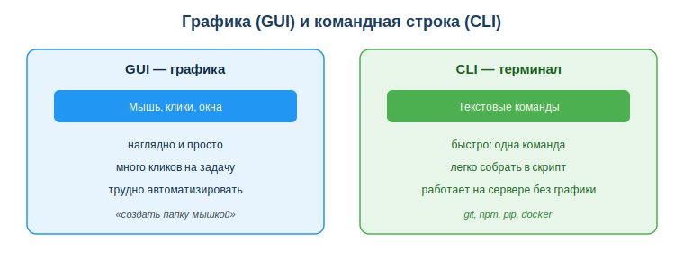
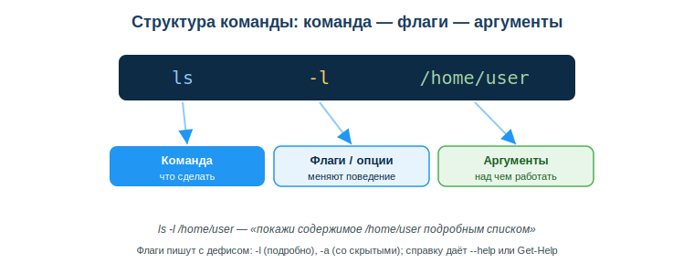

# Командная строка и терминал

## Практическая ситуация

Тебе дали доступ к учебному серверу и сказали: «разверни проект, поставь зависимости, запусти тесты». Ты подключаешься — а там нет ни рабочего стола, ни мышки, ни привычных окон. Только чёрный экран и мигающий курсор. Всё, что нужно, делается текстовыми командами.

Тот, кто умеет работать в терминале, спокойно вводит несколько строк и видит результат. Тот, кто привык только к мышке, останавливается и зависит от чужих подсказок. Этот урок — про то, как уверенно двигаться по системе и управлять файлами командами.



## Что ты научишься делать

- объяснять, зачем разработчику терминал, если есть мышка;
- перемещаться по файловой системе и управлять файлами командами;
- читать структуру команды (команда, флаги, аргументы);
- находить справку по любой незнакомой команде.

## Почему это важно

Терминал — это рабочий инструмент разработчика на каждый день. Развернуть проект, установить пакеты, закоммитить код, запустить тесты на сервере — всё это быстрее и надёжнее делается командами. Одна строка заменяет десяток кликов, а серия команд собирается в скрипт и повторяется автоматически.

Связь с профессией: программные инструменты разработчика — git, npm, pip, docker — управляются из терминала. На удалённой машине графики часто просто нет. Разработчик, который боится командной строки, работает медленно и теряет контроль над процессом. Уверенная работа в терминале — базовый профессиональный навык, без которого не обойтись.

## Учимся читать схему

Посмотри на сравнение графики (GUI) и командной строки (CLI) выше. Ответь на вопросы:

- что используешь для управления в GUI, а что — в CLI?
- почему одна команда часто быстрее, чем те же действия мышкой?
- почему на сервере без графики работает только терминал?

## Главное понятие

> **Терминал (командная строка, CLI)** — текстовый интерфейс, в котором ты управляешь компьютером, вводя команды строками, а компьютер выполняет их и выводит результат текстом.

Проще: в графике ты **показываешь мышкой**, что сделать, а в терминале **пишешь словами**. Команды короткие и точные, поэтому их легко повторять и собирать в скрипты.

## Как устроена команда

Любая команда читается по одной схеме: сначала что сделать, потом как именно, потом над чем.

```
команда  флаги      аргументы
  ls      -l         /home/user
```

- **Команда** — что сделать (`ls`, `cd`, `mkdir`).
- **Флаги (опции)** меняют поведение (`-l` — подробно, `-a` — со скрытыми файлами). Пишутся с дефисом.
- **Аргументы** — над чем работать (путь, имя файла).



Когда ты видишь незнакомую строку, разбери её по этой схеме — и сразу понятно, что она делает.

## Базовый набор (Linux/bash и Windows/PowerShell)

| Действие | bash | PowerShell |
|---|---|---|
| где я | `pwd` | `Get-Location` (`pwd`) |
| список файлов | `ls -l` | `Get-ChildItem` (`ls`) |
| перейти в папку | `cd src` | `cd src` |
| на уровень вверх | `cd ..` | `cd ..` |
| создать папку | `mkdir app` | `mkdir app` |
| создать файл | `touch f.txt` | `New-Item f.txt` |
| копировать | `cp a b` | `Copy-Item a b` |
| удалить | `rm f.txt` | `Remove-Item f.txt` |
| справка | `ls --help` | `Get-Help ls` |

Набор почти одинаков: на 90% команды совпадают по логике между bash и PowerShell.

### Мини-кейс

Нужно создать структуру проекта: папку `app` с подпапками `src` и `tests`. Вместо десяти кликов — три команды:

```
mkdir app
cd app
mkdir src tests
```

Следующий шаг: проверь результат командой `ls` — папки на месте. Заметь, как `mkdir src tests` создаёт сразу две папки одной командой с двумя аргументами.

## Разбор типичной ошибки

**Ошибка.** Выполнить `rm -rf` в неизвестной папке «чтобы почистить», не проверив, где находишься.

**Почему это ошибка.** В терминале нет корзины — удаление необратимо. Если ты ошибся папкой, данные не вернуть. А путь с пробелом без кавычек (`cd Мои файлы`) терминал примет за два разных аргумента и выдаст ошибку.

**Как правильно.** Сначала `pwd` и `ls` — убедись, что ты там, где думаешь, и видишь, что удаляешь. Пути с пробелами бери в кавычки: `cd "Мои файлы"`. Опасные команды применяй осознанно.

## Практика

Ответь письменно:

1. Разбери команду `cp -r ./src ./backup` на части: где команда, где флаг, где аргументы, и что она делает.
2. Запиши серию команд (bash или PowerShell), которая создаст папку `project` с подпапками `src` и `tests`.

**Образец (часть ответа на пункт 1):** «Команда — `cp`; флаг — `-r` (рекурсивно, со всем содержимым папки); аргументы — `./src` и `./backup`; команда копирует папку src в backup».

## Самопроверка

- Я знаю, зачем разработчику терминал, и могу назвать минимум два преимущества перед графикой.
- Я умею перемещаться по файловой системе и создавать/копировать/удалять файлы командами.
- Я могу разобрать любую команду на команду, флаги и аргументы и найти по ней справку.

## Подумай

- Какие действия в учёбе или работе ты сейчас делаешь мышкой, но мог бы ускорить одной командой?
- Почему привычка начинать с `pwd`/`ls` снижает риск дорогой ошибки в работе разработчика?

## Итог

- Терминал управляет компьютером текстовыми командами — это быстрее графики и работает даже на сервере без мышки.
- Команда читается по схеме: команда → флаги → аргументы.
- Базовый набор почти одинаков в bash и PowerShell — выучи его один раз.
- Начинай с `pwd`/`ls`, незнакомую команду проверяй через `--help`/`Get-Help`, опасные команды применяй осознанно.

## Полезные ссылки

- [Командная строка для начинающих (Ubuntu)](https://ubuntu.com/tutorials/command-line-for-beginners)
- [Microsoft Learn — основы PowerShell](https://learn.microsoft.com/ru-ru/powershell/scripting/learn/ps101/01-getting-started)
- [Microsoft Learn — WSL (Linux в Windows)](https://learn.microsoft.com/ru-ru/windows/wsl/)

---

*Источник: Ubuntu Command Line Tutorial; Microsoft Learn (PowerShell, WSL); ГОСО ТиПО (приказ МП РК № 348).*

*Материал разработан рабочей группой ТОО «Колледж Хекслет Казахстан» и одобрен к использованию в обучении решением Педагогического совета.*
