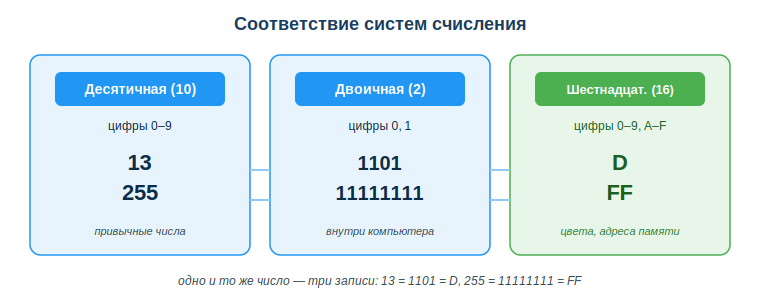
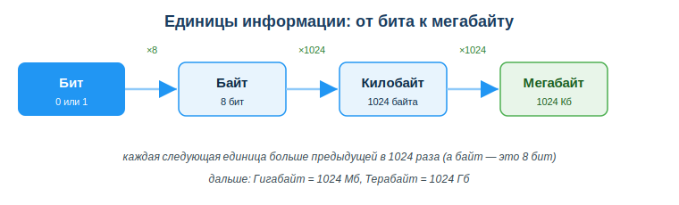

# Понять представление и кодирование информации (системы счисления)

## Практическая ситуация

Ты открываешь присланный коллегой файл, а вместо текста — `Привет`. В коде сайта видишь цвет `#FF0000`, а в логе программы `0.1 + 0.2` внезапно равно `0.30000000000000004`. Что общего у этих трёх загадок? Все они — про то, как компьютер кодирует информацию.

Внутри машины нет ни букв, ни цветов, ни «обычных» чисел — только нули и единицы. Понять, как из них собирается всё остальное, нужно не ради теории: именно отсюда растут реальные баги с кодировками, цветами и дробями, которые разработчик встречает каждый день.



## Что ты научишься делать

- объяснять, почему компьютер хранит всю информацию в двоичном виде;
- переводить числа между двоичной, десятичной и шестнадцатеричной системами;
- разбирать запись цвета в HEX по компонентам R-G-B;
- объяснять, как кодируется текст (Unicode/UTF-8) и почему появляются «кракозябры».

## Почему это важно

Любой файл, картинка, строка кода, цвет на экране — это в конечном счёте последовательность битов. Если не понимать кодирование, баги выглядят «мистикой»: текст ломается, цвет получается не тот, числа считаются «неправильно». А если понимать — те же ситуации становятся предсказуемыми и быстро чинятся.

Связь с профессией: разработчик постоянно работает с HEX-цветами в вёрстке, с кодировками при чтении файлов и API, с адресами памяти при отладке. Умение мыслить «в системах счисления» отличает того, кто чинит баг за минуту, от того, кто ищет его полдня.

## Учимся читать схему

Посмотри на схему соответствия систем счисления выше. Ответь на вопросы:

- какие цифры используются в каждой из трёх систем и почему их именно столько?
- как одно и то же число 255 выглядит в десятичной, двоичной и шестнадцатеричной записи?
- почему шестнадцатеричную запись удобно применять для цветов и адресов памяти?

## Главное понятие

> **Система счисления** — способ записи чисел с помощью набора цифр; основание показывает, сколько разных цифр используется (2, 10 или 16) и во сколько раз «весит» каждый следующий разряд.

Проще: одно и то же количество можно записать по-разному. Число «тринадцать» — это `13` в десятичной, `1101` в двоичной и `D` в шестнадцатеричной системе. Меняется запись, а само число одно.

## Почему всё двоичное

Внутри процессора — миллиарды переключателей, у каждого два состояния: есть ток или нет, 1 или 0. Поэтому базовая единица информации — **бит** (0 или 1), а 8 бит = **байт**. Любая информация (число, буква, картинка) сводится к последовательности битов.



Единицы укрупняются: байт — это 8 бит, а дальше каждая единица больше предыдущей в 1024 раза: килобайт = 1024 байта, мегабайт = 1024 Кб, гигабайт = 1024 Мб.

## Системы счисления

| Система | Основание | Цифры | Где встречается |
|---|---|---|---|
| Двоичная | 2 | 0, 1 | внутреннее представление |
| Десятичная | 10 | 0–9 | привычные числа |
| Шестнадцатеричная (HEX) | 16 | 0–9, A–F | цвета, адреса памяти |

### Перевод десятичное → двоичное
Делим на 2, собираем остатки снизу вверх. Число 13:
```
13 / 2 = 6 ост. 1
 6 / 2 = 3 ост. 0
 3 / 2 = 1 ост. 1
 1 / 2 = 0 ост. 1
13 = 1101
```

### Двоичное → десятичное
Складываем степени двойки, где стоит 1: `1101 = 8 + 4 + 0 + 1 = 13`.

### Зачем HEX
Один HEX-символ заменяет ровно 4 бита — это компактно и удобно. Цвет `#FF0000`: FF = 255 (красный по максимуму), 00 — зелёный, 00 — синий, то есть чистый красный.

## Кодирование текста

Каждому символу сопоставлен номер (код). Стандарт **Unicode** покрывает символы всех языков мира; **UTF-8** — самый распространённый способ хранить эти коды в байтах. Если файл сохранён в одной кодировке, а открыт в другой — байты истолковываются неправильно и получаются «кракозябры».

### Мини-кейс
Скрипт прочитал русский CSV и выдал `Привет` вместо «Привет». Причина: файл сохранён в UTF-8, а прочитан как Windows-1251. Следующий шаг: явно указывать кодировку при чтении (`encoding="utf-8"`).

## Почему `0.1 + 0.2` не равно ровно `0.3`

Вернёмся к загадке из начала урока: программа считает `0.1 + 0.2` и печатает `0.30000000000000004`. Это не баг и не ошибка в твоём коде — это прямое следствие того, что компьютер хранит дробные числа в двоичной системе.

Вспомни, как мы переводили целые числа в двоичную запись. С дробями делают то же самое, только дробную часть раскладывают на «половинки»: 1/2, 1/4, 1/8, 1/16 и так далее. Проблема в том, что не всякую привычную нам дробь можно точно собрать из таких кусочков.

Аналогия из десятичной системы: попробуй записать 1/3 десятичной дробью. Получится `0.3333333…` — бесконечно, точно не запишешь никогда, приходится где-то оборвать и округлить. То же самое происходит с числами `0.1` и `0.2`, но уже в двоичной системе: в двоичном виде это **бесконечные периодические дроби**. Компьютер хранит не бесконечность, а ограниченное число битов (формат с плавающей точкой), поэтому он вынужден округлить `0.1` и `0.2` до ближайшего значения, которое помещается.

Дальше простая арифметика: сложили два уже слегка округлённых числа — и накопленная погрешность вылезла в последних знаках. Отсюда и берётся «хвост» `…04`. Само сложение процессор делает правильно; неточны исходные числа, потому что их невозможно записать точно в двоичном виде.

**Что с этим делать на практике:**

- Никогда не сравнивай дробные числа на точное равенство (`итог == 0.3`) — сравнивай с небольшим допуском: «разница меньше очень маленького числа — считаем равными».
- Для денег и других расчётов, где важна копейка, используют либо специальные типы для точных десятичных чисел (например, `Decimal` в Python), либо хранят суммы в целых единицах — в тиынах/центах, а не в тенге/долларах с дробью.

Главное: странный «хвост» в дробях — это про кодирование чисел, а не про поломанный код. Понимая причину, ты не тратишь полдня на поиск несуществующего бага.

## Разбор типичной ошибки

**Ошибка.** Считать, что «текст есть текст», и не думать о кодировке при чтении и записи файлов.

**Почему это ошибка.** Одни и те же байты в разных кодировках означают разные символы. Без явной кодировки программа угадывает её — и часто ошибается, выдавая «кракозябры».

**Как правильно.** Везде использовать UTF-8 и указывать кодировку явно при чтении и записи (`encoding="utf-8"`).

## Практика

Ответь письменно:

1. Переведи число 25 из десятичной системы в двоичную, показав деление с остатками, и проверь обратным переводом.
2. Разбери цвет `#00FF00` по компонентам R-G-B и назови, какой это цвет.

**Образец (часть ответа на пункт 2):** «В записи `#00FF00` первые два символа — канал R = 00 (нет красного), следующие два — G = FF = 255 (зелёный по максимуму), последние — B = 00 (нет синего). Значит, это чистый зелёный цвет».

## Самопроверка

- Я могу объяснить, почему компьютер хранит всё в двоичном виде.
- Я умею переводить числа между двоичной, десятичной и шестнадцатеричной системами.
- Я знаю, что такое UTF-8 и почему появляются «кракозябры».

## Подумай

- Где в твоей будущей работе разработчика уже встречаются HEX и кодировки (вёрстка, файлы, API)?
- Почему баг «0.1 + 0.2 ≠ 0.3» — это не ошибка программиста, а следствие двоичного хранения дробей?

## Итог

- Внутри компьютера всё двоичное; HEX — компактная запись битов.
- Умей переводить между системами — пригодится для цветов, адресов и масок.
- Сохраняй и читай текст в UTF-8, указывая кодировку явно.
- Дробные числа сравнивай с допуском, а не на точное равенство.

## Полезные ссылки

- [Unicode и UTF-8 — объяснение (MDN)](https://developer.mozilla.org/ru/docs/Glossary/Unicode)
- [HEX-цвета (MDN, CSS color)](https://developer.mozilla.org/ru/docs/Web/CSS/color_value)
- [Системы счисления — материалы по информатике](https://ru.wikipedia.org/wiki/Система_счисления)

---

*Источник: ГОСО ТиПО (приказ МП РК № 348); материалы MDN по Unicode и HEX-цветам; учебные материалы по системам счисления.*

*Разработал: преподаватель ИКТ, магистр управления и информационной безопасности Калиаскаров Д.А.*

*Материал одобрен к использованию в обучении решением Педагогического совета ТОО «Колледж Хекслет Казахстан».*
