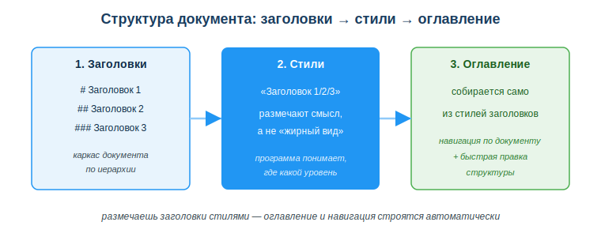
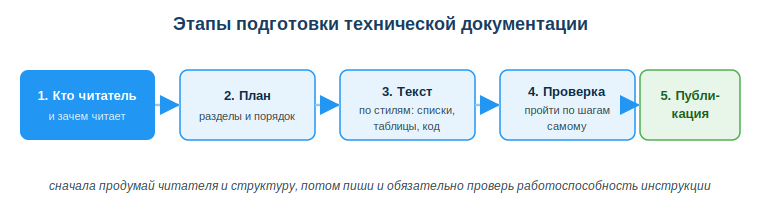

# Оформлять техническую документацию в текстовом редакторе

## Практическая ситуация

Ты сдаёшь проект, а в README всего одна строка: «Запускается через main». Преподаватель открывает файл, пробует запустить — и не может: нет шагов установки, нет команды запуска, непонятно, что за зависимости. Проект рабочий, но воспользоваться им нельзя.

Код без документации — это «работает, но как — знаю только я». README, инструкция по установке, описание API, техзадание — всё это пишет разработчик. И пишет не «красиво», а **структурно**: чтобы другой человек (или ты сам через полгода) понял за минуту.



## Что ты научишься делать

- отличать техническую документацию от «текста ради текста»;
- структурировать документ заголовками, списками, таблицами и код-блоками;
- оформлять заголовки стилями, чтобы автоматически собиралось оглавление;
- составлять README по понятной схеме.

## Почему это важно

Документация — это не формальность «для галочки», а инструмент, которым пользуются. Хорошо оформленный документ экономит часы: человек находит нужное за минуту, а не разбирается с нуля. Плохо оформленный — заставляет всех вокруг угадывать.

Связь с профессией: разработчик пишет документацию постоянно — README, инструкции по развёртыванию, описания API, комментарии к задачам. Умение быстро собрать **структурный** документ напрямую влияет на то, примут ли твою работу в команде и сможет ли ею воспользоваться другой человек.

## Учимся читать схему

Посмотри на схему «Структура документа» выше. Ответь на вопросы:

- что является первым шагом — каркасом документа?
- что делают стили заголовков и чем они отличаются от «жирного вручную»?
- откуда берётся оглавление и зачем оно нужно?

## Главное понятие

> **Техническая документация** — структурированный текст, который помогает читателю действовать: понять, что это, как установить, как пользоваться и что делать при ошибке.

Проще: если документ не помогает действовать — он бесполезен. Цель не «написать много», а «дать читателю ответ за минуту».

## Структура важнее оформления

Любой инструмент (MS Word, Google Docs или Markdown в редакторе кода) даёт один и тот же набор средств: **заголовки, списки, таблицы, выделение, код-блоки.** Главное — не цвет и шрифт, а иерархия:

- **Заголовки** (Заголовок 1 / 2 / 3) — каркас документа, по ним строится оглавление.
- **Списки** — шаги и перечни: нумерованные, когда важен порядок; маркированные, когда порядок не важен.
- **Таблицы** — для сравнения (параметр → значение).
- **Моноширинный / код-блок** — для команд, имён файлов и кода.

Ключевой приём: размечай заголовки **стилями**, а не «жирным» вручную. Тогда программа понимает, где какой уровень, и сама собирает оглавление и навигацию.

### Схема README проекта

```
# Название проекта
Краткое описание (1–2 предложения)
## Установка
шаги по пунктам
## Использование
пример запуска
## Возможные ошибки
проблема → решение
```

## Этапы подготовки документации

Хороший документ не пишется «с конца». Сначала думаешь о читателе и структуре, потом наполняешь и обязательно проверяешь.



Пройди этапы по порядку: 1) кто читатель и зачем читает; 2) план разделов; 3) текст по стилям (списки, таблицы, код); 4) проверка — пройди инструкцию сам по шагам; 5) публикация.

### Мини-кейс

Студент сдал проект с README из одной строки «Запускается через main». Преподаватель не смог запустить. Причина: нет шагов установки и команды запуска. Следующий шаг: добавить раздел «Установка» с командами по пунктам и раздел «Использование» с примером запуска — после этого проект воспроизводится с первого раза.

## Разбор типичной ошибки

**Ошибка.** Оформлять заголовки жирным текстом вручную вместо стилей «Заголовок».

**Почему это ошибка.** По ручному «жирному» не строится оглавление, ломается навигация и структура: программа не знает, что это заголовок, и не может собрать содержание.

**Как правильно.** Использовать стили заголовков (в Word — «Заголовок 1/2/3», в Markdown — `#`, `##`, `###`). Тогда оглавление и навигация работают сами.

## Практика

Ответь письменно:

1. Назови три средства оформления, которые задают структуру документа, и объясни, для чего нужно каждое.
2. Перечисли разделы README по схеме и кратко скажи, что пишут в каждом.

**Образец (часть ответа на пункт 1):** «Заголовки задают каркас документа — по ним строится оглавление. Нумерованные списки нужны для шагов, где важен порядок. Код-блок — для команд и имён файлов, чтобы их не путали с обычным текстом».

## Самопроверка

- Я умею объяснить, чем техническая документация отличается от «текста ради текста».
- Я знаю, почему заголовки размечают стилями, а не «жирным» вручную.
- Я могу составить README по схеме: описание → установка → использование → ошибки.

## Подумай

- Какую инструкцию (по учёбе или жизни) тебе самому было трудно понять из-за плохой структуры? Что бы ты в ней исправил?
- Почему документ «для другого человека» полезно проверять, проходя по шагам самому, а не просто перечитывая?

## Итог

- Пиши документацию под действие: что это, как запустить, как пользоваться, что делать при ошибке.
- Используй стили заголовков, а не ручное форматирование, — тогда собирается оглавление.
- Команды и имена файлов оформляй моноширинным шрифтом / код-блоком.
- README составляй по схеме: описание → установка → использование → ошибки.
- Перед публикацией пройди инструкцию по шагам сам.

## Полезные ссылки

- [Основы Markdown (GitHub Docs)](https://docs.github.com/ru/get-started/writing-on-github/getting-started-with-writing-and-formatting-on-github/basic-writing-and-formatting-syntax)
- [Справка Google Документы](https://support.google.com/docs/)
- [Как писать хорошие README (makeareadme.com)](https://www.makeareadme.com/)

---

*Источник: ГОСО ТиПО (рамка по информационно-коммуникационным технологиям); GitHub Docs (Markdown); официальная справка Google Документы.*

*Разработал: преподаватель ИКТ, магистр управления и информационной безопасности Калиаскаров Д.А.*

*Материал одобрен к использованию в обучении решением Педагогического совета ТОО «Колледж Хекслет Казахстан».*
