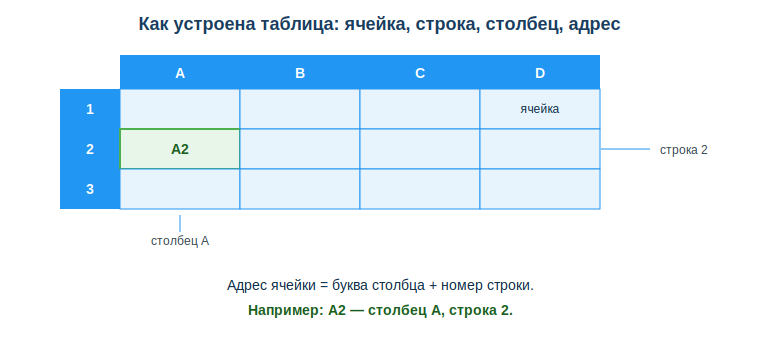
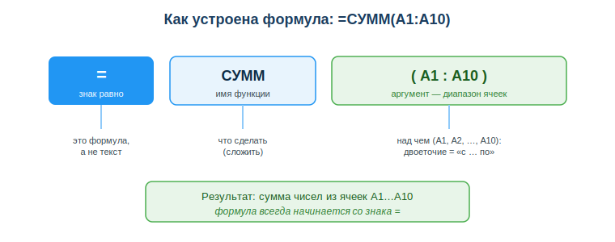

# Электронные таблицы для расчётов и данных

## Практическая ситуация

Тимлид присылает тебе файл: 200 студентов курса и их итоговые баллы. Нужно к завтрашнему утру: средний балл по группе, сколько человек сдали (≥60), и наглядный график. Писать ради этого программу — долго и не нужно.

Ты открываешь таблицу, вводишь пару формул, протягиваешь их вниз, нажимаешь «вставить диаграмму» — и через пять минут отчёт готов. Именно так электронная таблица экономит часы: она считает за тебя, как только ты правильно записал формулу и навёл порядок в данных.



## Что ты научишься делать

- определять адрес ячейки и ссылаться на ячейки (относительные и абсолютные ссылки);
- записывать формулы и применять базовые функции для расчётов;
- организовывать данные «как базу» и строить простой график;
- находить и исправлять типичные ошибки в формулах и таблицах данных.

## Почему это важно

Таблицы — это не только бухгалтерия. Для разработчика это быстрый инструмент: посчитать метрики, проверить гипотезу на данных, прикинуть бюджет проекта — без написания кода. Это первый шаг к навыку работы с данными (data literacy), который нужен в любой IT-роли.

Связь с профессией: разработчик постоянно сталкивается с данными — логами, результатами тестов, метриками. Прежде чем писать код для обработки, удобно быстро проверить данные и гипотезу в таблице. Кто умеет считать формулами и держать данные в порядке, тот тратит минуты там, где другие тратят часы.

## Учимся читать схему

Посмотри на схему структуры таблицы выше. Ответь на вопросы:

- из чего складывается адрес ячейки — что идёт первым, буква или цифра?
- какой адрес у ячейки, выделенной зелёным?
- чем строка отличается от столбца и как это видно на схеме?

## Главное понятие

> **Ячейка** — минимальная единица таблицы на пересечении столбца и строки; её адрес = буква столбца + номер строки (например, `A2`). Именно через адрес формула «достаёт» нужное значение.

Проще: таблица — это сетка. Столбцы обозначены буквами, строки — числами. Любую клетку можно назвать по имени (`B2`, `F1`), и формулы работают именно с этими именами, а не с самими числами. Поменялось число в `A1` — результат формулы пересчитается сам.

## Ячейки, ссылки, формулы

Любая формула начинается со знака `=`. Ссылка на ячейку — это её адрес (`A1`, `B2`).

- **Относительная** ссылка (`A1`) сдвигается при копировании формулы вниз или вбок.
- **Абсолютная** ссылка (`$A$1`) фиксируется — не сдвигается (например, ссылка на курс валюты или общий коэффициент).

```
=B2*C2        цена × количество
=B2*$F$1      цена × фиксированный коэффициент
```

Когда ты копируешь `=B2*C2` вниз, она сама превращается в `=B3*C3`, `=B4*C4` — это и есть удобство относительных ссылок. А `$F$1` останется `$F$1` в каждой строке.

## Базовые функции

Функция — это готовая команда, которая делает расчёт над аргументом (обычно — диапазоном ячеек).

| Функция | Что делает |
|---|---|
| `СУММ` / `SUM` | сумма диапазона |
| `СРЗНАЧ` / `AVERAGE` | среднее |
| `МИН` / `МАКС` | минимум / максимум |
| `СЧЁТ` / `COUNT` | количество чисел |
| `СЧЁТЕСЛИ` / `COUNTIF` | количество по условию |
| `ЕСЛИ` / `IF` | условие (если…то…иначе) |

Диапазон записывают через двоеточие: `A1:A10` значит «с A1 по A10». Пример с условием: `=ЕСЛИ(D2>=60; "зачёт"; "незачёт")`.



Разбери формулу `=СУММ(A1:A10)` по частям: знак `=` говорит «это формула», `СУММ` — что сделать, `(A1:A10)` — над какими ячейками.

## Данные и порядок

Таблица данных должна быть устроена «как база»: первая строка — заголовки колонок, дальше идут строки-записи, без пустых строк и объединённых ячеек внутри. Тогда корректно работают сортировка, фильтр и сводные таблицы.

### Мини-кейс

Нужно из списка 200 студентов с баллами посчитать средний балл и число сдавших (≥60). Решение: средний балл — `=СРЗНАЧ(B2:B201)`, число сдавших — `=СЧЁТЕСЛИ(B2:B201; ">=60")`. Следующий шаг: выделить данные и построить столбчатую диаграмму по результатам — отчёт для тимлида готов.

## Разбор типичной ошибки

**Ошибка.** При копировании формулы `=B2*F1` вниз результат «ломается»: ссылка на общий коэффициент `F1` съезжает на `F2`, `F3` (пустые ячейки).

**Почему это ошибка.** Использована относительная ссылка вместо абсолютной. Относительная ссылка сдвигается при копировании, а коэффициент должен оставаться в одной и той же ячейке.

**Как правильно.** Зафиксировать ячейку коэффициента через `$`: `=B2*$F$1`. Тогда при копировании `B2` меняется на `B3`, `B4`, а `$F$1` остаётся на месте.

## Практика

Ответь письменно:

1. Объясни, чем относительная ссылка `A1` отличается от абсолютной `$A$1`, и приведи пример, когда нужна именно абсолютная.
2. Запиши формулы: (а) стоимость товара = цена `B2` × количество `C2`; (б) средний балл по диапазону `B2:B201`; (в) число студентов с баллом ≥60.

**Образец (часть ответа на пункт 2):** «Стоимость — `=B2*C2`; средний балл — `=СРЗНАЧ(B2:B201)`; число сдавших — `=СЧЁТЕСЛИ(B2:B201; ">=60")`».

## Самопроверка

- Я умею определить адрес ячейки и записать ссылку на неё.
- Я знаю разницу относительной и абсолютной ссылки и где нужна каждая.
- Я могу применить `СУММ`, `СРЗНАЧ`, `СЧЁТЕСЛИ`, `ЕСЛИ` для типовых расчётов.

## Подумай

- Какую свою учебную или рабочую задачу с числами ты мог бы решить таблицей вместо ручного счёта? Какие формулы понадобятся?
- Почему разработчику бывает быстрее проверить данные в таблице, чем сразу писать для этого код?

## Итог

- Любая формула начинается со знака `=`; ссылка на ячейку — это её адрес.
- Различай относительную (`A1`) и абсолютную (`$A$1`) ссылку — это спасает при копировании.
- Освой `СУММ` / `СРЗНАЧ` / `ЕСЛИ` / `СЧЁТЕСЛИ` — это закрывает большинство задач.
- Держи данные «как базу»: заголовки + записи, без пустых строк — и строй график прямо из таблицы.

## Полезные ссылки

- [Справка Microsoft Excel](https://support.microsoft.com/ru-ru/excel)
- [Справка Google Таблицы](https://support.google.com/docs/topic/9054603)
- [Список функций Google Таблиц](https://support.google.com/docs/table/25273)

---

*Источник: ГОСО ТиПО (приказ МП РК № 348); рамка цифровых компетенций DigComp 2.2 (область «Работа с данными»); справка Microsoft Excel; справка Google Таблицы.*

*Материал разработан рабочей группой ТОО «Колледж Хекслет Казахстан» и одобрен к использованию в обучении решением Педагогического совета.*
