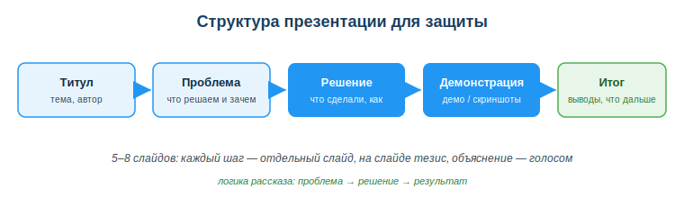
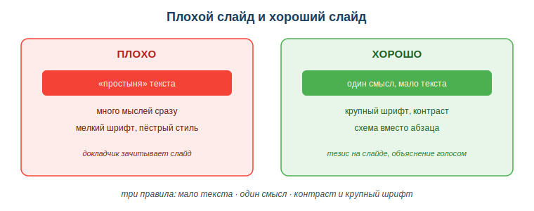

# Презентации для защиты проектов

## Практическая ситуация

Ты сделал отличный проект — он работает, код чистый, фишки продуманы. Наступает защита. Пять минут перед комиссией, и ты не успеваешь объяснить, что продукт делает и зачем. Слайды забиты текстом, ты читаешь их с экрана, комиссия теряет нить. Оценка выходит ниже, чем работа заслуживает.

Презентация — это не «слайды ради слайдов», а инструмент, который помогает донести идею за короткое время. Разработчику она нужна постоянно: защита проекта, демо для заказчика, доклад в команде. Этот урок — как собрать презентацию, которая работает на тебя.

## Что ты научишься делать

- строить презентацию по логике «проблема → решение → результат»;
- оформлять слайды так, чтобы их читали, а не разглядывали;
- готовить устную защиту, а не зачитывать слайды;
- показывать, что продукт работает, через демо или скриншоты.

## Почему это важно

Хороший продукт без понятной защиты проигрывает слабому продукту с уверенной защитой. Комиссия и заказчик видят не твой код, а то, как ты о нём рассказываешь. Умение коротко и ясно показать результат экономит время и поднимает оценку.

Связь с профессией: разработчик защищает свои решения постоянно — на ревью, на демо спринта, перед заказчиком. Тот, кто умеет за несколько слайдов объяснить «какую проблему решили и как», ценится в команде выше, чем тот, кто пишет код «в стол».

## Учимся читать схему

Посмотри на схему структуры презентации выше. Ответь на вопросы:

- в каком порядке идут слайды от титула к итогу?
- какие два блока выделены как ключевые (акцентные) и почему именно они?
- почему «демонстрацию» ставят отдельным шагом, а не прячут внутри «решения»?

## Главное понятие

> **Презентация защиты** — короткий набор слайдов (5–8), который по логике «проблема → решение → результат» помогает докладчику донести суть проекта; слайд несёт тезис, а объяснение даёт устная речь.

Проще: слайд — это **опора**, а не сценарий. Слайд поддерживает речь, а не заменяет её. Правило: **на слайде — тезис, в речи — объяснение.**

## Структура защиты проекта

Защиту удобно строить по фиксированной схеме слайдов. Каждый слайд — отдельный шаг рассказа:

| Слайд | Что показать |
|---|---|
| Титул | название, автор, тема |
| Проблема | какую задачу решаем и зачем |
| Решение | что сделали, как работает (схема) |
| Технологии | что использовали |
| Демонстрация | что получилось, демо/скриншоты |
| Итог | выводы, что дальше |

Для учебной защиты достаточно **5–8 слайдов**. Больше — внимание комиссии рассеивается, меньше — не успеваешь раскрыть проект.

## Правила оформления слайда

- **Мало текста.** Один слайд — одна мысль, не больше 5–6 строк. Тезис, а не абзац.
- **Один смысл.** Слайд раскрывает одну идею; не смешивай проблему, решение и итог на одном экране.
- **Контраст и крупный шрифт.** Заголовок ~32, текст ~24, тёмное на светлом — читаемо из зала.
- **Меньше текста, больше схем.** Диаграмма понятнее абзаца; для «было/стало» бери таблицу или диаграмму.
- **Единый стиль.** Один шрифт, 2–3 цвета, согласованное выравнивание.

### Мини-кейс
Студент вынес на слайд весь код функции мелким шрифтом и зачитал его вслух. Зал ничего не понял: текст слишком мелкий, мыслей слишком много. Следующий шаг — вместо кода поставить схему «что на входе → что делает → что на выходе», а сам код показать живьём в демо. Слайд стал читаемым, а объяснение ушло в речь.

## Разбор типичной ошибки

**Ошибка.** Вынести «простыню» текста на слайд и читать его вслух с экрана.

**Почему это ошибка.** Аудитория либо читает, либо слушает — не одновременно. Пока комиссия разбирает мелкий текст, твою речь она не воспринимает, и наоборот.

**Как правильно.** На слайде — короткий тезис и схема, а живое объяснение давать голосом. И обязательно показать демонстрацию: про код можно рассказать что угодно, комиссия хочет увидеть, что продукт работает.

## Практика

Ответь письменно:

1. Распиши структуру защиты своего проекта по слайдам (титул → проблема → решение → демонстрация → итог), по одной строке-тезису на каждый слайд.
2. Возьми перегруженный текстом слайд и перепиши его по правилу «один слайд — одна мысль»: оставь тезис, остальное переведи в устное объяснение.

**Образец (часть ответа на пункт 1):** «Слайд «Проблема»: тезис — *Студенты тратят 2 часа на ручной подсчёт; нужна автоматизация*. Объяснение голосом — конкретный пример и цифры».

## Самопроверка

- Я умею выстроить слайды защиты по логике «проблема → решение → результат».
- Я знаю три правила хорошего слайда: мало текста, один смысл, контраст.
- Я понимаю, почему демонстрацию работы продукта нужно показывать отдельно.

## Подумай

- На каком из твоих проектов защита получилась слабее самой работы? Что в слайдах можно было сделать иначе?
- Где ещё в работе разработчика пригодится умение коротко показать результат (демо спринта, ревью, разговор с заказчиком)?

## Итог

- Строй презентацию по схеме: проблема → решение → результат.
- На слайде — тезисы и схемы, объяснение — голосом.
- Держи 5–8 слайдов, крупный шрифт, единый стиль.
- Обязательно покажи, что продукт работает (демо или скриншоты).

## Полезные ссылки

- [Справка Microsoft PowerPoint](https://support.microsoft.com/ru-ru/powerpoint)
- [Справка Google Презентации](https://support.google.com/docs/topic/9052522)
- [Canva — создание презентаций](https://www.canva.com/ru_ru/prezentacii/)

---

*Источник: ГОСО ТиПО (рамка результатов обучения); официальная справка Microsoft PowerPoint, Google Презентации и Canva.*

*Материал разработан рабочей группой ТОО «Колледж Хекслет Казахстан» и одобрен к использованию в обучении решением Педагогического совета.*
