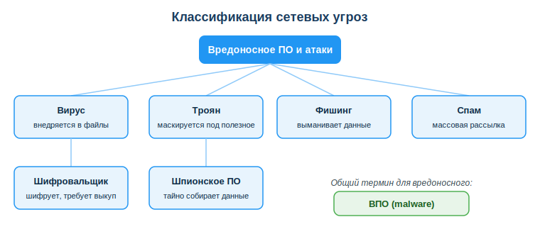
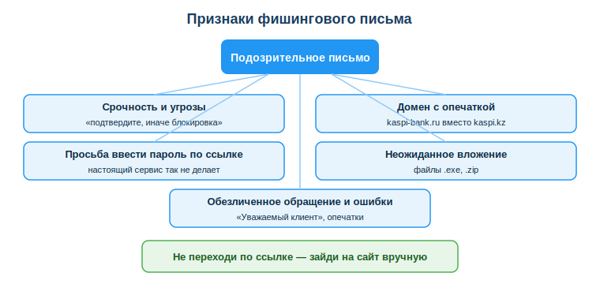

# Сетевые угрозы: фишинг, вирусы, вредоносное ПО

## Практическая ситуация

Тебе на почту приходит письмо: «Ваш аккаунт заблокирован, срочно подтвердите пароль по ссылке». Один клик — и злоумышленник получает доступ к твоей почте, репозиториям, деньгам. Для разработчика это вдвойне опасно: через тебя могут добраться до кода и данных компании.

Сетевые угрозы не выглядят страшно. Чаще всего это обычное письмо или ссылка, которая прикидывается знакомым сервисом. Этот урок — про то, как распознавать такие угрозы и не стать слабым звеном.

## Что ты научишься делать

- различать основные виды сетевых угроз (вирус, троян, фишинг, спам);
- распознавать фишинг по характерным признакам;
- выбирать безопасные действия при подозрительном письме;
- применять базовые меры защиты (2FA, обновления, менеджер паролей).

## Почему это важно

Большинство взломов начинается не с «гениального хакера», а с одного неосторожного клика обычного пользователя. Умение замечать угрозу до клика — это навык, который экономит деньги, репутацию и нервы.

Связь с профессией: разработчик работает с доступами к серверам, репозиториям, базам данных и облакам. Если злоумышленник получит твой пароль, под удар попадёт весь проект и данные клиентов. Поэтому кибергигиена — часть профессиональной ответственности программиста, а не «дело айтишников по безопасности».

## Учимся читать схему

Посмотри на классификацию сетевых угроз выше. Ответь на вопросы:

- какие угрозы относятся к вредоносному ПО (ВПО), а какие — к способам обмана и рассылки?
- чем троян отличается от вируса по способу попадания на компьютер?
- какой общий термин объединяет вирус, троян, шифровальщик и шпионское ПО?

## Главное понятие

> **Вредоносное ПО (ВПО, malware)** — любая программа, созданная, чтобы навредить: украсть данные, повредить файлы, получить контроль над устройством или вымогать деньги.

Проще: фишинг — это способ *обмануть человека*, а ВПО — это *вредная программа*. Часто они работают вместе: фишинговое письмо уговаривает тебя запустить вложение, а внутри — троян или шифровальщик.

## Основные виды угроз

| Угроза | Что делает |
|---|---|
| Фишинг | выманивает данные через поддельные письма/сайты |
| Вирус | внедряется в файлы, распространяется и вредит |
| Троян | маскируется под полезную программу |
| Шифровальщик (ransomware) | шифрует файлы и требует выкуп |
| Шпионское ПО | тайно собирает данные (пароли, ввод) |

Общий термин для всего вредоносного — **вредоносное ПО (ВПО, malware)**. Фишинг и спам стоят отдельно: это не программы, а способы доставки обмана.

## Как распознать фишинг

Признаки поддельного письма или сайта:

- **срочность и угрозы:** «срочно подтвердите, иначе блокировка»;
- **подозрительный адрес:** домен с опечаткой (`kaspi-bank.ru` вместо `kaspi.kz`);
- **просьба ввести пароль/код по ссылке;**
- **неожиданное вложение** (`.exe`, `.zip`);
- **обезличенное обращение** («Уважаемый клиент») и ошибки в тексте.

Достаточно одного-двух признаков, чтобы насторожиться. Главное правило: настоящий банк или сервис никогда не просит ввести пароль по ссылке из письма.

### Мини-кейс
На почту пришло письмо «GitHub: подозрительный вход, подтвердите пароль» со ссылкой `github-secure.com`. Студент чуть не ввёл данные. Признак: домен не `github.com`. Правильный следующий шаг — не переходить по ссылке, а открыть `github.com` вручную через закладку и проверить уведомления в аккаунте.

## Как защищаться

- Проверяй адрес отправителя и домен ссылки **перед** кликом.
- Не вводи пароли по ссылкам из писем — заходи на сайт вручную.
- Включи **двухфакторную аутентификацию** (2FA): даже украденного пароля будет мало.
- Держи ОС и антивирус **обновлёнными**.
- Не запускай вложения и программы из ненадёжных источников.
- Используй уникальные пароли и **менеджер паролей**.

## Разбор типичной ошибки

**Ошибка.** Перейти по ссылке из письма «просто чтобы проверить, настоящее оно или нет».

**Почему это ошибка.** Даже открытие поддельного сайта — уже риск (он может попытаться запустить скрипт), а ввод данных на нём означает мгновенную потерю аккаунта. Проверять подлинность на самой странице-подделке бессмысленно: она выглядит как настоящая.

**Как правильно.** Не открывать ссылку из письма. Зайти на сайт вручную через закладку или поиск и проверить, есть ли там такое же уведомление.

## Практика

Ответь письменно:

1. Перечисли минимум три признака фишингового письма и объясни, почему каждый из них подозрителен.
2. Тебе пришло письмо «банк просит подтвердить карту по ссылке `kaspi-secure.ru`». Опиши по шагам свои безопасные действия.

**Образец (часть ответа на пункт 2):** «Я не перехожу по ссылке. Замечаю, что домен `kaspi-secure.ru` не совпадает с официальным `kaspi.kz`. Открываю приложение или сайт банка вручную и проверяю уведомления там. При сомнении звоню в банк по номеру с обратной стороны карты».

## Самопроверка

- Я умею различать вирус, троян, фишинг и спам и знаю общий термин ВПО.
- Я могу назвать минимум три признака фишингового письма.
- Я знаю безопасный порядок действий при подозрительном письме и базовые меры защиты.

## Подумай

- Какие из твоих аккаунтов пострадали бы сильнее всего, если бы их взломали, и где у тебя ещё нет 2FA?
- Почему в команде разработки безопасность одного человека влияет на весь проект?

## Итог

- Знай виды угроз и общий термин ВПО; различай программы (ВПО) и обман (фишинг, спам).
- Проверяй домен и отправителя до клика; не вводи пароли по ссылкам.
- Включи 2FA и обновляй ОС/антивирус.
- Используй уникальные пароли и менеджер паролей.

## Полезные ссылки

- [Закон РК «Об информатизации» (adilet.zan.kz)](https://adilet.zan.kz/rus/docs/Z1500000418)
- [Что такое фишинг (Kaspersky, объяснение)](https://www.kaspersky.ru/resource-center/definitions/what-is-phishing)
- [Двухфакторная аутентификация (объяснение)](https://www.kaspersky.ru/resource-center/definitions/what-is-two-factor-authentication-2fa)

---

*Источник: Закон РК «Об информатизации»; рамка цифровых компетенций DigComp 2.2 (раздел «Безопасность»); материалы по кибербезопасности (Kaspersky).*

*Материал разработан рабочей группой ТОО «Колледж Хекслет Казахстан» и одобрен к использованию в обучении решением Педагогического совета.*
