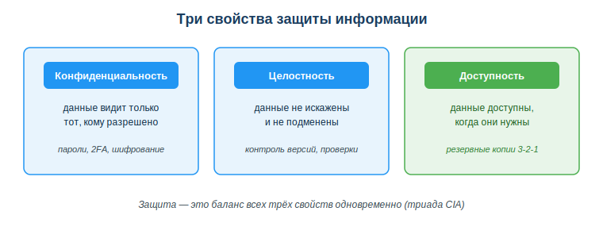
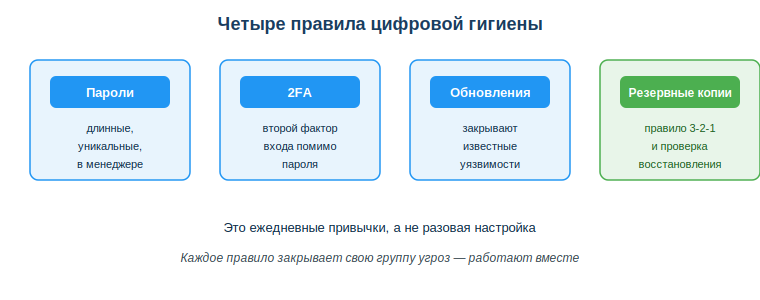

# Расширенный учебный материал по теме

## Занятие 09. Применять основы информационной безопасности и цифровой гигиены

---

**Дисциплина:** Применение информационно-коммуникационных и цифровых технологий
**Результат обучения:** РО 2.1 — владение основами ИКТ · **Объём темы:** 2 часа
**Квалификация:** 4S06130103 «Разработчик программного обеспечения»

> Это расширенный разбор темы для самостоятельного изучения. Он подробнее, чем конспект урока: здесь каждое правило защиты объясняется глубже, с примерами, разбором «как это ломается» и пошаговыми алгоритмами. Читай его как «учебник по теме» — после него ты не просто запомнишь слова «пароль» и «бэкап», а поймёшь, почему именно так, и сможешь применять это в личной жизни и в работе разработчика.

---

## 1. Введение: зачем тебе эта тема

Расскажу историю, которую видел не раз, — она короткая и очень поучительная. Человек доволен собой: решил задачу, всё работает, надо показать миру. Делает скриншот рабочего экрана — видно код, видно, что руки растут откуда надо, — и выкладывает в портфолио. Красиво. А через день приходит письмо: с его облачного аккаунта набежал счёт за тысячи запросов, которых он не делал.

Разбираемся, что видим. На том скриншоте в углу экрана была видна одна короткая строка — API-ключ. Человек её даже не заметил: мало ли какого текста на экране. Но интернет постоянно прочёсывают боты, которые ищут именно такие строки — круглосуточно, автоматически, на всех публичных площадках сразу. Они нашли ключ за минуты. А на том же экране были открыты почты клиентов — и они утекли вместе с ключом.

Обрати внимание, чего здесь НЕ было. Не было «хакера в капюшоне», который ночь напролёт ломал систему. Не было хитрой атаки. Был один невнимательный клик. И именно так теряют данные чаще всего — не из-за гениальных взломов, а из-за бытовых мелочей: один пароль на все сервисы, ключ, записанный прямо в код, файл «пароли.txt» на рабочем столе, забытая открытая сессия на чужом компьютере [3; 8]. Скажу честно: за красивыми словами «информационная безопасность» в 90% случаев стоят вот такие простые, скучные ошибки, а вовсе не кино про хакеров.

Хорошая новость в том, что защита — это не паранойя и не отдельная профессия. Это набор простых ежедневных привычек, как мытьё рук. Настраиваешь один раз — и дальше они почти не отнимают времени, но закрывают тебя каждый день. Эти привычки называют **цифровой гигиеной**, и вся тема — про то, чтобы довести их до автоматизма.

И вот почему это особенно важно именно для тебя как для будущего разработчика. Обычный пользователь отвечает за свои данные — и точка. Разработчик отвечает за гораздо большее: за код, за чужие данные, за ключи к рабочим системам. Утёкший в репозиторий ключ или незакрытая уязвимость — это уже не личная неприятность, а **инцидент**, за который отвечает вся команда, а иногда и компания перед законом. Поэтому цифровая гигиена для разработчика — не «полезный совет со звёздочкой», а часть профессиональной культуры, наравне с умением писать чистый код [1; 8]. Освоишь её сейчас, на учебных проектах, — придёшь в команду уже с правильными руками. Не освоишь — научишься после первого дорогого инцидента, а это куда обиднее.

## 2. Что ты узнаешь и чему научишься

После изучения темы ты сможешь:
- объяснять три свойства защиты информации — конфиденциальность, целостность, доступность — и понимать, какое из них нарушается в конкретной ситуации;
- составлять надёжные пароли и хранить их в менеджере паролей, а не в заметках и не в браузере на чужом ПК;
- объяснять, что такое двухфакторная аутентификация (2FA), и понимать, почему она спасает даже при утёкшем пароле;
- строить план резервного копирования по правилу 3-2-1 и понимать, почему «копия без проверки — не копия»;
- безопасно обращаться с персональными данными по требованиям закона РК и осознанно управлять своим цифровым следом;
- правильно хранить секреты в коде (`.env`, `.gitignore`) и понимать, почему ключ, попавший в историю git, считается скомпрометированным навсегда;
- проводить базовый аудит собственной цифровой безопасности.

## 3. Ключевые понятия

- **Информационная безопасность** — защита данных от утечки, искажения и потери; держится на трёх свойствах: конфиденциальности, целостности и доступности [1].
- **Цифровая гигиена** — набор повседневных привычек, поддерживающих безопасность данных, аккаунтов и устройств [8].
- **Триада CIA (КЦД)** — три свойства защиты: Confidentiality (конфиденциальность), Integrity (целостность), Availability (доступность).
- **Менеджер паролей** — программа, которая хранит все твои пароли в зашифрованном виде под одним мастер-паролем.
- **Двухфакторная аутентификация (2FA)** — вход, который требует помимо пароля второй фактор (код из приложения, push, ключ).
- **Резервная копия (бэкап)** — копия данных, по которой их можно восстановить после потери; правило хранения — 3-2-1.
- **Персональные данные** — сведения, по которым можно опознать человека (ФИО, ИИН, телефон, фото) [3].
- **Цифровой след** — все данные о тебе, остающиеся в сети после твоих действий.
- **Секрет (в коде)** — чувствительная строка (API-ключ, токен, пароль БД), которую нельзя хранить открыто и нельзя коммитить в репозиторий.

## 4. Подробная теория

### 4.1. Три свойства защиты: конфиденциальность, целостность, доступность

Прежде чем учиться «как защищаться», давай честно ответим на вопрос, который обычно проскакивают: а **что именно** мы защищаем? На первый взгляд кажется, что безопасность — это «чтобы не украли». Но воровство данных — лишь одна из угроз, и зациклившись на ней, ты проглядишь две другие. Специалисты по безопасности описывают защиту через **три свойства**, которые нужно держать одновременно. По первым буквам английских слов их называют **триадой CIA**, по-русски — КЦД. Посмотри на схему «Три свойства защиты информации» (приложение А) и разбирай каждое свойство прямо по ней.

**Конфиденциальность (Confidentiality)** — данные видит только тот, кому это разрешено. Это то, о чём думают в первую очередь, и это правильно, но это только треть картины. Конфиденциальность нарушается, когда твой пароль узнаёт чужой, когда переписка уходит не тому адресату, когда API-ключ виден на скриншоте. Инструменты защиты конфиденциальности — пароли, 2FA, шифрование, права доступа.

**Целостность (Integrity)** — данные не искажены и не подменены. Это свойство почти всегда забывают — а оно, поверь, критично, и провалы тут самые коварные, потому что незаметные. Представь: кто-то тихо изменил одну цифру в базе оценок, или в финансовом отчёте, или в коде программы. Данные на месте, никто их не «украл», сигнализация молчит — но они врут, и ты принимаешь решения по вранью. Для разработчика целостность — это ещё и про код: система контроля версий git хранит историю изменений именно для того, чтобы было видно, кто и что менял, и можно было откатить подмену. Инструменты — контроль версий, контрольные суммы, проверки и валидация данных.

**Доступность (Availability)** — данные доступны, когда они нужны. Тут новичок часто удивляется: «это же тоже безопасность?» Да, и ещё какая. Можно идеально защитить данные от чужих глаз и от подмены, но если из-за сгоревшего диска или забытого пароля ты сам не можешь до них добраться — защита провалена, результат для тебя ровно такой же, как если бы данные украли. Доступность теряется при поломке оборудования, потере устройства, атаке «отказ в обслуживании», случайном удалении. Главный инструмент защиты доступности — **резервные копии**.

Ключевая мысль, которую закрепляет нижняя подпись на схеме: **защита — это баланс всех трёх свойств одновременно**. Нельзя усилить одно, забыв про два других, — а именно это и делают новички. Ставит человек сверхсложный пароль (герой конфиденциальности), гордится собой, а бэкапа нет (доступность в нуле) — сломался диск, и весь этот сложный пароль защищал ровно ничего. Поэтому дальше мы разбираем привычки, которые закрывают **все три** свойства вместе, а не одно любимое.

Маленькая тренировка прямо сейчас — она заодно показывает, как думает специалист. Определи, какое свойство нарушено:
- твой пароль узнал чужой человек — нарушена **конфиденциальность**;
- кто-то незаметно изменил данные в базе — нарушена **целостность**;
- из-за поломки диска файлы стали недоступны — потеряна **доступность**.

Если ты разделяешь эти три случая, ты уже думаешь как специалист по безопасности: не «ой, что-то плохое случилось», а «какое именно свойство мы потеряли и каким инструментом его защищать». Это и есть разница между паникой и работой.

### 4.2. Что такое цифровая гигиена и почему «один антивирус» не спасает

> **Цифровая гигиена** — набор повседневных привычек и правил, которые поддерживают безопасность твоих данных, аккаунтов и устройств: надёжные пароли, 2FA, обновления, резервные копии и осторожность с данными [8].

Главное заблуждение новичка — искать «волшебную кнопку»: один мощный антивирус, одну программу, которая «защитит всё разом, я поставил — и свободен». Такой кнопки нет и не будет. Безопасность складывается из множества мелких ежедневных действий, и работают они только вместе, как команда, а не поодиночке. Аналогия с мытьём рук тут не для красоты, а по делу: ни одно отдельное мытьё не «делает тебя здоровым навсегда» — здоровье даёт привычка, повторяемая каждый день. С безопасностью ровно так же.

Посмотри на схему «Четыре правила цифровой гигиены» (приложение Б). На ней четыре блока — пароли, 2FA, обновления, резервные копии. И вот тут важно прочитать схему правильно, потому что почти все читают неверно: это **не меню, из которого выбирают одно** блюдо по вкусу, а четыре привычки, которые действуют одновременно, и каждая закрывает свою группу угроз. Пароли и 2FA защищают конфиденциальность (чужой не войдёт), обновления закрывают известные уязвимости (чужой не пролезет через дыру в программе), резервные копии защищают доступность (ты не потеряешь данные). Нижняя подпись схемы говорит прямо: «это ежедневные привычки, а не разовая настройка».

Дальше разберём каждую привычку подробно — что это, зачем, как она ломается на практике и как делать правильно. Разбор «как ломается» тут не пугалка, а самый полезный кусок: пока не увидишь, как именно защита проваливается, не поймёшь, зачем её вообще держать.

### 4.3. Пароли: длина важнее сложности, и уникальность важнее всего

Пароль — это первый и часто единственный барьер между чужим человеком и твоими данными. И вот на этом-то барьере большинство людей делают сразу две ошибки: берут **короткий** пароль и ставят **один и тот же** везде. Разберём обе по очереди, потому что лечатся они по-разному.

**Почему длина важнее «сложности».** Есть школьная привычка — «пароль должен содержать заглавную букву, цифру и спецсимвол». Она родила целое поколение паролей вроде `P@ss1`. Смотри, что видим: человеку такой пароль кажется сложным — символы, циферки, всё как учили. А теперь почему это самообман: программе подбора («брутфорсу») плевать на то, «сложно» ли это выглядит для человека, — она перебирает варианты, и её интересует ровно одно, сколько всего вариантов надо перебрать. А число вариантов зависит в первую очередь от длины: каждый добавленный символ увеличивает перебор в десятки раз. Короткий «сложный» пароль перебирается быстро, а длинная фраза из обычных слов — практически никогда. Сравни на цифрах-примерах:

| Пароль | Как выглядит | На самом деле |
|---|---|---|
| `123456` | короткий, очевидный | подбирается мгновенно, в любом словаре утечек |
| `Qw1!` | «сложный» | очень короткий — перебирается быстро |
| `P@ss1` | «сложный» | короткий и шаблонный — слабый |
| `dom-kniga-veter-2026` | длинная фраза | длинный — перебор практически невозможен |

Где ошибаются: гонятся за спецсимволами и жертвуют длиной. Правило наоборот — **бери длинную фразу-пароль** из нескольких несвязанных слов: её и запомнить легче, и подобрать несоизмеримо тяжелее.

**Почему уникальность важнее длины.** Ладно, допустим, ты придумал один отличный длинный пароль. И — классическая ловушка — поставил его везде: на почту, в соцсети, в банк, в учебный портал. Логика понятная: «он же сильный, чего его менять». А теперь почему это бомба замедленного действия: сервисы иногда взламывают, и базы паролей утекают — не по твоей вине, а по вине самого сервиса. Утёк твой пароль хотя бы с одного слабого сайта, где ты когда-то регистрировался и забыл, — и злоумышленник тут же пробует эту же пару «логин-пароль» на всех остальных сервисах. Это называется **credential stuffing** (подстановка учётных данных), и это автоматика, а не ручная работа. Один утёкший пароль открывает все двери сразу — потому что дверь-то одна на всех. Поэтому железно: **на каждый важный сервис — свой уникальный пароль**.

Тут возникает честный вопрос, который задаёт каждый: как в здравом уме запомнить десятки уникальных длинных паролей? Ответ честный — никак, и не надо даже пытаться. Для этого есть **менеджер паролей**.

**Менеджер паролей** — это программа (бывают встроенные в систему, бывают отдельные приложения), которая хранит все твои пароли в зашифрованном хранилище. Ты помнишь только один **мастер-пароль** от самого менеджера, а он подставляет нужные пароли сам и умеет генерировать новые случайные. Как это меняет жизнь:
- ты держишь в голове один сильный мастер-пароль вместо десятков;
- каждый сервис получает длинный уникальный случайный пароль, который ты даже в глаза не видел;
- утечка с одного сайта не задевает остальные — они все разные.

Чего **нельзя** делать с паролями (собираю сюда все грабли, на которые наступают чаще всего):
- хранить в заметках телефона, в файле `пароли.txt` на рабочем столе, в переписке с самим собой — это открытый текст, который прочтёт любой, кто получит доступ к устройству, а получить его проще, чем кажется;
- сохранять в браузере на **чужом** или общем компьютере — следующий человек, севший за эту машину, войдёт под тобой в один клик;
- пересылать пароль в чат команды (об этом отдельный, более жёсткий разговор в разделе про секреты).

Подробнее про то, что такое менеджер паролей и как он устроен внутри, читай в справочном материале [7].

### 4.4. Доступ к аккаунтам: 2FA и почему она спасает даже при утёкшем пароле

Пароль — это «что ты знаешь». А всё, что ты знаешь, у тебя, к сожалению, можно так или иначе отнять: подсмотреть из-за плеча, выманить фишингом, найти в чужой утечке. Поэтому современная защита не полагается на один пароль и добавляет второй барьер.

**Двухфакторная аутентификация (2FA)** — это вход, который требует **двух** разных подтверждений: пароля («что ты знаешь») плюс второго фактора («что у тебя есть» — телефон, приложение-аутентификатор, аппаратный ключ). Смысл прост и по-настоящему силён: даже если злоумышленник узнал твой пароль, он всё равно не войдёт, потому что второго фактора — твоего телефона — у него в руках нет. Пароль утёк, а дверь всё равно закрыта. Ради этого одного 2FA и стоит включать.

Как это выглядит на практике, чтобы не было абстракции. Ты вводишь пароль — и сервис, вместо того чтобы сразу впустить, просит код из приложения-аутентификатора на твоём телефоне (код меняется каждые 30 секунд, поэтому подсмотренный вчера уже бесполезен) либо присылает push-уведомление «это вы пытаетесь войти?». Без этого подтверждения вход не завершится, как бы правильно ни был введён пароль.

Какие бывают вторые факторы, разложу от менее к более надёжному — разница реальная:
- **SMS-код** — лучше, чем ничего, но самый слабый из вариантов: SMS можно перехватить, а SIM-карту — перевыпустить на злоумышленника по поддельным документам (это делали). Используй, если других вариантов сервис не даёт;
- **приложение-аутентификатор** (генерирует коды прямо на устройстве) — заметно надёжнее SMS, работает даже без сети, перехватить нечего;
- **аппаратный ключ** (физический USB/NFC-ключ) — самый надёжный вариант, применяется там, где безопасность критична; чтобы войти, ключ нужно физически иметь при себе.

Правило простое и без исключений: **включай 2FA везде, где она есть**. В первую очередь — на почте, и вот почему именно на ней: через почту восстанавливают доступ ко всему остальному, это главный ключ от твоей цифровой жизни. Дальше — банковские и рабочие аккаунты, репозитории кода.

Сюда же, к теме доступа, относятся ещё две привычки, про которые забывают:
- **выходи из аккаунтов на чужих устройствах.** Открытая сессия на чужом или общем компьютере — это, по сути, вход без пароля для следующего человека, который сюда сядет. Забыл выйти? В настройках аккаунта почти всегда есть кнопка «завершить все сеансы» — нажми её, как только вспомнил.
- **не давай приложениям лишних разрешений.** Когда приложение или сайт просит доступ к контактам, камере, микрофону, файлам — не жми «разрешить» на автомате. Спроси себя: нужно ли это ему для работы? Фонарику не нужны твои контакты. Лишние разрешения — это лишние открытые двери, о которых ты потом забудешь.

### 4.5. Обновления: как закрывается дыра, о которой уже все знают

Обновления раздражают, признаю честно: «обновить и перезагрузить» выскакивает всегда не вовремя, и рука тянется нажать «напомнить позже». Но давай разберём, что реально стоит за этим скучным словом, — после этого откладывать станет труднее. За «обновлением» очень часто стоит закрытие конкретной **уязвимости** — ошибки в программе, через которую систему можно взломать.

Логика угрозы такая, следи за цепочкой. В программе находят уязвимость. Разработчики выпускают исправление (патч) в обновлении. И вот ключевой момент, который переворачивает всё: с выходом патча уязвимость становится **публично известной** — теперь о ней знают не только защитники, но и злоумышленники, которые читают те же списки исправлений. Тот, кто **не обновился**, остаётся открытым для атаки, про которую уже всем известно и для которой уже написаны готовые автоматические инструменты взлома. Получается парадокс: откладывая обновление, ты не «остаёшься как был», а наоборот — добровольно держишь открытой ту самую дверь, ключ от которой в день выхода патча раздали всем желающим. До патча про дыру знали единицы, после — все.

Поэтому:
- **ставь обновления операционной системы и программ**, особенно браузера, — именно через браузер приходит большинство атак на обычного человека;
- по возможности включи **автоматические обновления**, чтобы защита не зависела от твоей дисциплины и настроения (а настроение всегда против обновлений в неподходящий момент);
- обновляй и **зависимости в своих проектах** — библиотеки, которые использует твой код. Уязвимость в чужой библиотеке автоматически становится уязвимостью твоей программы, хотя ты сам ничего плохого не написал. Это уже сугубо профессиональная привычка разработчика, и в командах за ней следят.

### 4.6. Резервные копии и правило 3-2-1

Резервные копии защищают то самое третье свойство — **доступность**. Беда в том, что их ценность люди понимают обычно уже после первой потери, задним числом: сгорел диск, украли ноутбук, шифровальщик-вымогатель заблокировал все файлы, или ты сам спросонья удалил не ту папку. И вот развилка. Копии нет — данные потеряны навсегда, вместе с курсовой, кодом за месяц и семейными фото. Копия есть — это просто неприятность на полчаса, поворчал и восстановил. Разница между катастрофой и ворчанием — в одной заранее сделанной привычке.

Главная ошибка, которую слышу постоянно: «да у меня всё на ноутбуке, этого достаточно». Разберём, почему это самообман. Один носитель — это **одна** точка отказа: сломался он один-единственный — пропало сразу всё, деваться некуда. Чтобы этого не случилось, давно придумано простое и проверенное десятилетиями **правило 3-2-1**:

- **3** копии данных (оригинал плюс две резервные) — чтобы одиночный сбой не уничтожил всё;
- на **2** разных носителях (например, внутренний диск + внешний диск) — чтобы поломка одного типа носителя не задела оба разом;
- **1** копия хранится **вне дома** или в облаке — чтобы пожар, кража или потоп не уничтожили все копии сразу в одном месте (а если они все дома на полке — уничтожат).

Разберём на конкретной ситуации из практики, чтобы правило перестало быть абстрактным. У студента все файлы только на одном ноутбуке. Считаем по-честному: это ноль резервных копий и одна точка отказа — то есть самый рискованный расклад из возможных. Строим план по правилу 3-2-1:

| Копия | Где хранится | Зачем |
|---|---|---|
| Оригинал | внутренний диск ноутбука | рабочая копия |
| Копия 1 | внешний диск / флешка | спасает при поломке ноутбука |
| Копия 2 | облачное хранилище | спасает при краже/пожаре дома (копия «вне дома») |

Проверяем: 3 копии — есть, 2 типа носителя — есть, 1 копия вне дома — есть. Все три условия выполнены, точка отказа больше не одна.

И отдельное, самое недооценённое правило, из-за которого рушатся даже настроенные бэкапы: **проверяй, что копия реально восстанавливается**. Тут кроется коварная ловушка. Человек уверен, что «копия делается» — иконка мигает, всё как надо, — а на деле папка внутри пустая, архив битый, или бэкап полгода назад тихо остановился с ошибкой, которую никто не прочитал. И обнаруживается это в самый неподходящий момент — когда оригинал уже потерян и восстанавливать больше не из чего. Поэтому время от времени **бери и пробуй восстановить из копии реальный файл** — открой, убедись, что он живой. Запомни формулу намертво: **копия без проверки — это не копия, а надежда.** А на надежду данные не восстановишь.

### 4.7. Приватность, персональные данные и цифровой след (закон РК)

До сих пор мы защищали **твои** данные — это понятно и близко. Но как будущий разработчик ты постоянно работаешь и с **чужими** данными, и здесь к твоим привычкам добавляется ещё и закон, который спрашивает строго.

**Персональные данные** — это сведения, по которым можно прямо или косвенно опознать человека: ФИО, ИИН, номер телефона, адрес, фото, данные документов. Тут типичное заблуждение: студенты думают, что персональные данные — это только имя и фамилия, а телефон или ИИН «это же просто цифры». Нет. И телефон, и ИИН, и фото — полноценные персональные данные, по каждому из них человека можно вычислить. Их обработку в Казахстане регулирует **Закон РК «О персональных данных и их защите» от 21 мая 2013 года № 94-V** [3], а сферу информатизации в целом — **Закон РК «Об информатизации» от 24 ноября 2015 года № 418-V** [4].

Что из этого следует на практике, по пунктам:
- **не публикуй чужие персональные данные без согласия** человека — ни в соцсетях, ни в портфолио, ни в открытом репозитории «для примера»;
- помни про **цифровой след** — всё, что ты выкладываешь в сеть, остаётся там надолго, копируется, индексируется поисковиками, и «удалить обратно» почти невозможно, даже если очень захочется. Прежде чем что-то опубликовать, задай себе один трезвый вопрос: готов ли ты, чтобы это через пять лет увидели работодатель и незнакомые люди? Если морщишься — не публикуй;
- **для разработки используй тестовые или обезличенные данные**, а не реальные данные живых людей. На учебном проекте живые ИИН просто не нужны.

Что значит **обезличить** данные — привести их к виду, по которому человека уже нельзя опознать:
- удали идентификаторы — убери ФИО, ИИН, телефоны, адреса;
- замени на условные значения — «Клиент 1», «Клиент 2» вместо настоящих имён;
- используй выдуманные тестовые данные вместо настоящих;
- бери только необходимый минимум полей и ничего лишнего (принцип **дата-минимизации**: нет данных — нечему утекать).

Особый и, поверь, очень частый в твоей будущей работе случай — **передача данных в публичный ИИ-сервис**. Соблазн понятен: загрузить реальные ФИО, ИИН, телефоны клиентов в публичный чат-бот, «чтобы он быстренько обработал». Разбираем, почему это ловушка: такая загрузка — это передача персональных данных посторонней стороне без всяких оснований, то есть та же самая утечка и нарушение Закона № 94-V, просто оформленная как «я же по работе». Отговорки «это срочно» и «файл маленький» ничего не меняют — закон их не знает. Порядок один: сначала обезличь, потом обрабатывай.

### 4.8. Секреты в коде: почему git «помнит всё» и как с этим жить

А вот это раздел про чисто профессиональную часть темы — то, что отличает разработчика от обычного пользователя, и то, на чём горят даже неглупые люди. **Секрет** — это чувствительная строка, дающая доступ к чему-то ценному: API-ключ к платному сервису, токен доступа, пароль к базе данных, ключ облака. По сути это ключ от квартиры, только цифровой.

**Главная ошибка — записать ключ прямо в код и закоммитить его в репозиторий.** «Ну я потом уберу» — говорит новичок. Разберём по-честному, почему это опасно настолько и почему «потом уберу» не работает:

1. **Git помнит всё.** Система контроля версий хранит не текущую версию файла, а **всю историю** изменений — в этом её смысл и сила. Смотри, что происходит: ты добавил ключ в файл, закоммитил, потом спохватился, «удалил» ключ из файла и снова закоммитил. Кажется, что убрал. А на деле ключ преспокойно лежит в истории git, в том старом коммите — удаление строки из текущей версии не стирает её из прошлого, прошлое git как раз и бережёт. Чтобы по-настоящему вычистить секрет, нужно переписывать историю репозитория — это сложно, тонко и часто уже невозможно (особенно если код уже отправлен в общий репозиторий, где история есть у каждого коллеги).

2. **Боты сканируют репозитории.** Публичные репозитории круглосуточно автоматически прочёсывают боты, которые ищут именно такие строки-секреты. Утёкший ключ находят **за минуты** после публикации — быстрее, чем ты успеешь заметить свою ошибку и схватиться за голову. Дальше с твоего аккаунта идут чужие запросы, а тебе — счёт. Ровно та история из введения, только теперь ты понимаешь механику.

Как делать **правильно** — стандартный приём, который применяют вообще все, и его достаточно один раз выучить:

- секреты выносят в отдельный файл **`.env`** (от «environment» — окружение), где они хранятся как переменные окружения, а не внутри самого кода;
- этот файл **добавляют в `.gitignore`** — специальный список файлов, которые git **не отслеживает** и никогда не сохраняет в репозиторий; так `.env` остаётся только на твоей машине и в общий код не попадает физически [9];
- в репозиторий кладут лишь **пример** без реальных значений (например, файл `.env.example` с пустыми полями), чтобы коллеги видели, какие переменные нужны, но не видели самих секретов;
- если ключ **уже утёк** — попал в репозиторий, в скриншот, в чат, куда угодно, — его считают скомпрометированным навсегда, без вариантов «может, не заметят». Единственно правильное действие: **немедленно отозвать (сменить) старый ключ** в сервисе и выпустить новый. Прятать или удалять файл бесполезно — рабочий ключ уже у чужих, и им нужен именно рабочий ключ, а не файл.

Сведём весь приём в одну строку, которую стоит выучить как таблицу умножения: **секреты — в `.env`, `.env` — в `.gitignore`, утёкший ключ — сразу сменить.**

И вернёмся к скриншотам, с которых начиналась вся тема: ключ может «утечь» не только через код, но и **через картинку**, и это даже коварнее, потому что картинку не «просканируешь глазами на код». Перед публикацией любого скриншота рабочего экрана специально пробегись взглядом: не видно ли на нём токенов, чужих почт, путей вроде `C:\Users\Имя` (он, между прочим, тихо раскрывает имя пользователя системы), открытых чужих данных. Закрой, замажь или обрежь всё чувствительное — это тридцать секунд против того самого счёта.

### 4.9. Связь с профессией: почему это ответственность команды

Сведём всё к главной профессиональной мысли, ради которой тема вообще стоит в программе разработчика. Для обычного человека утечка пароля — личная неприятность, сам напортачил — сам разгребаешь. Для разработчика утечка ключа или незакрытая уязвимость — это **инцидент**, и слово это неслучайное: инцидент затрагивает не только его одного. Утёкший в репозиторий ключ открывает доступ к рабочим системам всей команды. Реальные данные клиентов, по лени оставленные в тестах, — это уже нарушение закона, за которое отвечает компания, а не «стажёр, который скопировал файлик». Поэтому в зрелых командах цифровая гигиена не висит на доброй воле, а встроена в процессы: ревью кода ловит секреты до публикации, есть чёткие правила работы с данными, обязательная 2FA, регулярные проверяемые бэкапы. Освоив привычки из этой темы сейчас, на учебных проектах, ты приходишь в команду уже с правильной культурой в руках — а не учишься всему этому в панике после первого дорогого инцидента, когда учиться уже поздно и стыдно.

## 5. Разобранные примеры

**Пример 1 — оценка паролей.** Даны `Qw1!`, `dom-kniga-veter-2026`, `123456`, `admin`. Какой надёжнее?
*Разбор:* надёжнее всех `dom-kniga-veter-2026` — это длинная фраза, перебор которой практически невозможен. `123456` и `admin` — в любом словаре утечек, подбираются мгновенно, это даже не пароли, а формальность. Отдельно про `Qw1!`: он выглядит «сложным» — есть заглавная, цифра, спецсимвол, всё как учили, — и именно поэтому обманывает. Убивает его длина: четыре символа перебираются быстро, никакие спецсимволы это не спасают. Правило из примера: **длина важнее символьной сложности**, плюс **уникальность** пароля для каждого сервиса.

**Пример 2 — резервные копии.** У студента все файлы только на одном ноутбуке.
*Разбор:* риск считаем прямо: одна точка отказа, ноль копий — при поломке, краже или шифровальщике пропадает сразу всё. План по 3-2-1: оригинал на ноутбуке + копия на внешнем диске + копия в облаке (та самая «вне дома»). И обязательный шаг, который забывают: раз в период реально проверить, что файл восстанавливается из копии, а не просто «бэкап вроде идёт».

**Пример 3 — утечка на скриншоте.** Студент собирается выложить в портфолио скриншот, где видны: токен API, e-mail клиентов, путь `C:\Users\Ivan`.
*Разбор:* пройдёмся по каждому объекту, как на реальном ревью. Токен API — это секрет, тут страдает конфиденциальность, закрыть обязательно. E-mail клиентов — это персональные данные, публикация без согласия нарушает приватность и закон, закрыть обязательно. Путь `C:\Users\Ivan` — не секрет, но он раскрывает имя пользователя системы, лишняя наводка для чужого, поэтому лучше обрезать. Правило из примера: перед публикацией любого скриншота специально проверять его на чувствительные данные, а не выкладывать на автомате.

**Пример 4 — секрет в коде.** Студент записал ключ API прямо в код и закоммитил.
*Разбор:* в чём именно ошибка — ключ теперь навсегда останется в истории git, и его найдут боты за минуты, ещё до того как студент осознает промах. Правильный порядок: вынести ключ в `.env`, добавить `.env` в `.gitignore`, а уже скомпрометированный ключ немедленно отозвать и выпустить новый. И ключевое, где ошибаются даже те, кто про `.env` слышал: просто удалить строку из текущего файла — недостаточно, она остаётся в прошлых коммитах, а рабочий ключ уже гуляет.

## 6. Частые ошибки и как их избежать

- **Ошибка:** один пароль на все сервисы. **Почему:** утечка с одного слабого сайта открывает все аккаунты сразу (credential stuffing). **Как правильно:** уникальный пароль на каждый важный сервис, все — в менеджере паролей.
- **Ошибка:** считать «сложный короткий» пароль надёжным. **Почему:** короткий пароль перебирается быстро, никакие символы не спасают. **Как правильно:** длинная фраза-пароль.
- **Ошибка:** «у меня всё на ноутбуке, копий хватит». **Почему:** один носитель — одна точка отказа, сломался — пропало всё. **Как правильно:** правило 3-2-1 и обязательная проверка восстановления.
- **Ошибка:** считать персональными данными только ФИО. **Почему:** телефон, ИИН, адрес, фото — тоже персональные данные по закону. **Как правильно:** обезличивай любой опознающий признак.
- **Ошибка:** записать ключ в код и «потом удалить». **Почему:** git хранит историю, ключ остаётся в старых коммитах даже после удаления строки. **Как правильно:** `.env` + `.gitignore`, а утёкший ключ — сразу сменить.
- **Ошибка:** откладывать обновления. **Почему:** известная уязвимость — открытая дверь, про которую после выхода патча знают все. **Как правильно:** включи автообновления, особенно для браузера.

## 7. Памятка: чек-лист цифровой гигиены

Короткий список, который можно применять с сегодняшнего дня — не читать, а сделать:
1. **Пароли** — длинные, уникальные, все хранятся в менеджере паролей.
2. **2FA** — включена на почте, банке, рабочих и учебных аккаунтах.
3. **Обновления** — система и браузер обновляются автоматически.
4. **Резервные копии** — настроены по правилу 3-2-1, восстановление проверено на реальном файле.
5. **Приватность** — не публикую чужие данные, слежу за своим цифровым следом.
6. **Секреты** — в `.env` и `.gitignore`, не в коде и не на скриншотах.
7. **Проверка ссылок и сессий** — не перехожу по подозрительным ссылкам, выхожу из аккаунтов на чужих устройствах.

## 8. Краткие итоги

- Защита держится на трёх свойствах — конфиденциальность, целостность, доступность; их нужно беречь одновременно, а не любимое одно.
- Цифровая гигиена — это ежедневные привычки, а не один «волшебный антивирус».
- Пароль: длина важнее сложности, уникальность важнее всего, хранение — в менеджере паролей.
- 2FA защищает даже при утёкшем пароле — включай её везде, где есть, в первую очередь на почте.
- Обновления закрывают известные уязвимости; откладывать их — держать открытой дверь, про которую знают все.
- Резервные копии по правилу 3-2-1 с проверкой восстановления спасают доступность данных.
- Чужие персональные данные защищены законом РК; для разработки бери тестовые/обезличенные данные.
- Секреты — в `.env` и `.gitignore`; утёкший ключ скомпрометирован навсегда, его сразу меняют.

## 9. Вопросы для самопроверки

1. Назови три свойства защиты информации и приведи по одной ситуации, где нарушается каждое из них.
2. Почему длинная фраза-пароль надёжнее короткого «сложного» пароля? Что важнее длины?
3. Зачем нужен менеджер паролей и какой единственный пароль тебе придётся помнить при его использовании?
4. Что такое 2FA и почему она защищает аккаунт даже тогда, когда пароль уже утёк?
5. Сформулируй правило 3-2-1 и объясни, зачем нужна копия «вне дома».
6. Почему «копия без проверки — не копия»?
7. Какие данные считаются персональными по закону РК и как безопасно использовать данные людей при разработке?
8. Почему ключ, однажды попавший в репозиторий git, считается скомпрометированным, и что нужно сделать в первую очередь?

## 10. Глоссарий

- **2FA (двухфакторная аутентификация)** — вход, требующий помимо пароля второго фактора (код из приложения, push, ключ).
- **Бэкап (резервная копия)** — копия данных для восстановления после потери; хранится по правилу 3-2-1.
- **Дата-минимизация** — принцип брать и передавать только необходимый минимум данных.
- **Доступность** — свойство защиты: данные доступны, когда они нужны.
- **Информационная безопасность** — защита данных от утечки, искажения и потери.
- **Менеджер паролей** — программа, хранящая пароли в зашифрованном виде под одним мастер-паролем.
- **Обезличивание данных** — удаление опознающих признаков, чтобы по данным нельзя было опознать человека.
- **Персональные данные** — сведения, по которым можно опознать конкретного человека (ФИО, ИИН, телефон, фото).
- **Правило 3-2-1** — 3 копии данных на 2 носителях, 1 копия вне дома или в облаке.
- **Секрет** — чувствительная строка (API-ключ, токен, пароль БД), которую нельзя хранить открыто.
- **Триада CIA (КЦД)** — три свойства защиты: конфиденциальность, целостность, доступность.
- **Уязвимость** — ошибка в программе, через которую возможен взлом; закрывается обновлением.
- **Целостность** — свойство защиты: данные не искажены и не подменены.
- **Цифровая гигиена** — повседневные привычки защиты данных, аккаунтов и устройств.
- **Цифровой след** — все данные о тебе, остающиеся в сети после твоих действий.
- **`.env` / `.gitignore`** — файл для хранения секретов вне кода и список файлов, которые git не отслеживает.

## 11. Источники и что почитать для углубления

**Основная литература:**
1. Шыныбеков Д.А., Ускенбаева Р.К. Информационно-коммуникационные технологии. — Алматы, 2017 (глава «Сети и безопасность»).

**Дополнительно:**
- Кадиркулов Р.А. Информационно-коммуникационные технологии. — 2018.
- Кобдикова Ж. Информационно-коммуникационные технологии. — 2019.
- Брыксина О.Ф., Пономарёва Е.А., Сонина М.Н. ИКТ в образовании. — М.: ИНФРА-М, 2024.

**Нормативные источники РК:**
3. Закон РК «О персональных данных и их защите» от 21.05.2013 № 94-V — https://adilet.zan.kz/rus/docs/Z1300000094
4. Закон РК «Об информатизации» от 24.11.2015 № 418-V — https://adilet.zan.kz/rus/docs/Z1500000418
5. ГОСО ТиПО — приказ Министра просвещения РК № 348 от 03.08.2022 (Приложение 5) — https://adilet.zan.kz/rus/docs/V2200029031

**Электронные ресурсы и документация:**
7. Что такое менеджер паролей (объяснение) — https://www.kaspersky.ru/resource-center/definitions/password-manager
9. GitHub Docs (рус.): игнорирование файлов (`.gitignore`) — https://docs.github.com/ru/get-started/getting-started-with-git/ignoring-files

**Международные рамки:**
8. DigComp 2.2: The Digital Competence Framework for Citizens (JRC, ЕС), область «Безопасность» — https://publications.jrc.ec.europa.eu/repository/handle/JRC128415

## 12. Приложения

- **Приложение А.** Схема «Три свойства защиты информации» — `assets/09_shema-triada-zaschity.svg`. Три блока — конфиденциальность (пароли, 2FA, шифрование), целостность (контроль версий, проверки) и доступность (резервные копии 3-2-1). Читается так: защита — это баланс всех трёх свойств одновременно (триада CIA).
- **Приложение Б.** Схема «Четыре правила цифровой гигиены» — `assets/09_shema-pravila-gigieny.svg`. Четыре привычки — пароли, 2FA, обновления, резервные копии — каждая закрывает свою группу угроз; это ежедневные привычки, а не разовая настройка, и работают они только вместе.
- **Приложение В.** Памятка-чек-лист цифровой гигиены — раздел 7 этого материала; используй его как практический инструмент для аудита своей безопасности.

---

*Материал подготовлен на основе урока темы (`urok.md`) и приведённых в конце источников; он расширяет и углубляет содержание урока для самостоятельного изучения. Источники приведены главами и ссылками (без номеров страниц); нормативные акты — с реквизитами.*

*Разработал: преподаватель ИКТ, магистр управления и информационной безопасности Калиаскаров Д.А.*

*Материал одобрен к использованию в обучении решением Педагогического совета ТОО «Колледж Хекслет Казахстан».*
