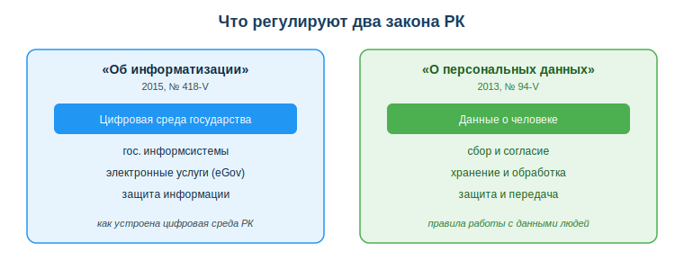
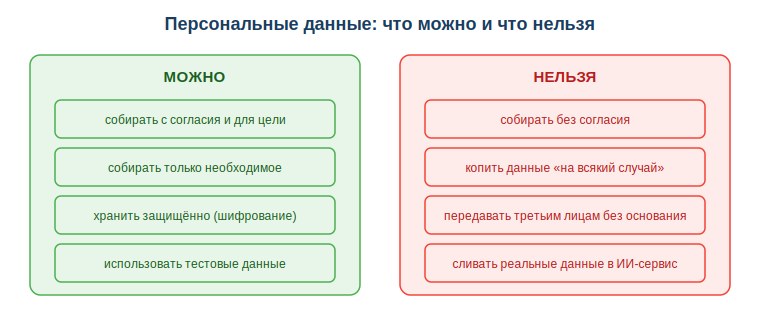

# Законы РК «Об информатизации» и «О персональных данных»

## Практическая ситуация

Ты пишешь приложение, которое собирает имена, телефоны и ИИН пользователей. Можно ли хранить их где угодно? Передавать третьим лицам? Отправить таблицу в зарубежный ИИ-сервис «чтобы быстро обработать»? Кажется, что это технический вопрос. На самом деле — правовой.

Ответ дают законы РК. И за их нарушение отвечает не «приложение», а разработчик и компания. Этот урок — про правовые рамки работы с информацией в Казахстане: какие два закона задают правила и как не нарушить их в своём проекте.

## Что ты научишься делать

- называть, что регулируют два ключевых ИТ-закона РК;
- определять, какие сведения являются персональными данными;
- применять принципы согласия, минимизации и защиты при сборе данных;
- отличать допустимые действия с данными от нарушений.

## Почему это важно

Любое приложение, которое работает с людьми, собирает их данные: при регистрации, заказе, записи на услугу. Если делать это «как удобно», легко нарушить закон, получить штраф и потерять доверие пользователей. Знание правил защищает и пользователя, и тебя как разработчика.

Связь с профессией: разработчик закладывает работу с данными прямо в код — какие поля собирать, где хранить, кому передавать. Поэтому он обязан знать правовые рамки не хуже технических: правильная форма сбора данных начинается не с верстки, а с закона.

## Учимся читать схему

Посмотри на схему «Что регулируют два закона РК» выше. Ответь на вопросы:

- какой из двух законов описывает работу государственных сервисов и eGov, а какой — работу с данными человека?
- к какому закону относится правило «собирать данные только с согласия»?
- если приложение хранит ИИН и телефоны клиентов, требования какого закона ты обязан соблюдать в первую очередь?

## Главное понятие

> **Персональные данные** — сведения, относящиеся к конкретному человеку: ФИО, ИИН, дата рождения, адрес, телефон, e-mail, фото, биометрия. Среди них есть данные ограниченного доступа (например, о здоровье) — к ним требования строже.

Проще: если по записи можно понять, о ком именно идёт речь, — это персональные данные, и закон защищает их.

## Два ключевых закона

| Закон | О чём | Что важно разработчику |
|---|---|---|
| «Об информатизации» (2015, № 418-V) | государственные информсистемы, электронные услуги, защита информации | как устроена цифровая среда и госуслуги РК |
| «О персональных данных и их защите» (2013, № 94-V) | сбор, хранение, обработка персональных данных | правила работы с данными пользователей |

Первый закон отвечает на вопрос «как устроена цифровая среда государства», второй — «как обращаться с данными конкретных людей». В работе с пользователями чаще всего применяется именно второй.

## Базовые правила обработки данных

- **Согласие.** Собирать данные можно с согласия человека и только для конкретной, заранее названной цели.
- **Минимизация.** Собирать только то, что реально нужно для этой цели, без полей «на всякий случай».
- **Защита.** Хранить безопасно: шифрование, ограничение доступа, резервные копии.
- **Ограничение передачи.** Не передавать данные третьим лицам и в сторонние сервисы без основания и согласия.

Эти четыре правила — основа любой корректной работы с данными. Нарушение хотя бы одного уже создаёт правовой риск.

### Мини-кейс

Команда отправила таблицу с ИИН и телефонами клиентов в публичный ИИ-сервис «чтобы быстро обработать данные». Это передача персональных данных без согласия и без контроля над тем, где они окажутся, — нарушение закона. Правильный следующий шаг: обезличить данные (убрать ИИН и имена) или обрабатывать их локально, не выгружая во внешний сервис.

## Разбор типичной ошибки

**Ошибка.** «Это же учебный проект, можно тестировать на реальной базе клиентов знакомого».

**Почему это ошибка.** Закон не делает исключений для учебных проектов: обработка чужих персональных данных без согласия — это нарушение независимо от цели.

**Как правильно.** Использовать тестовые или обезличенные данные, а реальную базу — только с согласия людей и для конкретной задачи.

## Практика

Ответь письменно:

1. Для формы «запись на консультацию» перечисли поля, которые действительно нужны, и одно поле, которое будет избыточным. Объясни выбор через принцип минимизации.
2. Опиши, что не так в ситуации мини-кейса и как исправить обработку данных, не нарушая закон.

**Образец (часть ответа на пункт 1):** «Нужны: имя, контакт для связи, желаемое время — этого достаточно для цели "записать на консультацию". Избыточно поле "уровень дохода": оно не нужно для записи, а его сбор нарушает принцип минимизации и повышает риск при утечке».

## Самопроверка

- Я знаю, что регулируют законы «Об информатизации» и «О персональных данных».
- Я умею определять, какие сведения являются персональными данными.
- Я понимаю и могу применить правила согласия, минимизации и защиты.

## Подумай

- Какими своими персональными данными ты делишься с приложениями каждый день и какие из них действительно нужны сервису?
- Почему разработчику выгоднее собирать меньше данных, а не больше — что он теряет и что выигрывает?

## Итог

- Два закона РК задают правила: «Об информатизации» — для цифровой среды государства, «О персональных данных» — для работы с данными людей.
- Персональные данные позволяют опознать конкретного человека; данные ограниченного доступа требуют особой защиты.
- Собирай данные с согласия, по минимуму и храни их защищённо.
- Не передавай чужие данные третьим лицам и в сторонние сервисы без основания — отвечает разработчик и компания.

## Полезные ссылки

- [Закон РК «Об информатизации» (adilet.zan.kz)](https://adilet.zan.kz/rus/docs/Z1500000418)
- [Закон РК «О персональных данных и их защите» (adilet.zan.kz)](https://adilet.zan.kz/rus/docs/Z1300000094)
- [Портал eGov.kz — раздел о защите данных](https://egov.kz)

---

*Источник: Закон РК «Об информатизации» (№ 418-V); Закон РК «О персональных данных и их защите» (№ 94-V); ГОСО ТиПО; DigComp 2.2 (компетенции работы с данными).*

*Материал разработан рабочей группой ТОО «Колледж Хекслет Казахстан» и одобрен к использованию в обучении решением Педагогического совета.*
