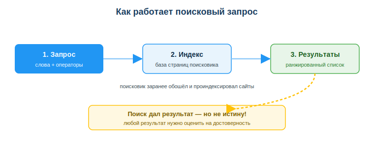
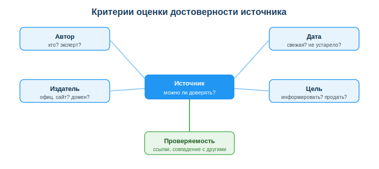

# Пользоваться браузерами, поиском и оценкой достоверности информации

## Практическая ситуация

Ты пишешь код, и вдруг — ошибка `ModuleNotFoundError`. Ты вбиваешь в поиск «не работает программа», получаешь сотни ссылок и тратишь полчаса, перебирая чужие истории. А коллега рядом за минуту нашёл точный ответ: он скопировал текст ошибки, добавил название библиотеки и оператор `site:` — и попал прямо в нужное обсуждение.

Разработчик ищет в интернете постоянно. Но не всё, что в выдаче, — правда: устаревшие ответы, чужие баги, рекламные статьи и даже выдуманные ИИ факты. Навык быстро найти и **проверить** информацию экономит часы и спасает от неверных решений.

## Что ты научишься делать

- формулировать точные поисковые запросы и применять операторы (`"…"`, `site:`, `-`);
- оценивать достоверность источника по понятным признакам;
- отличать надёжную документацию от сомнительного поста;
- безопасно работать в браузере (вкладки, история, расширения).

## Почему это важно

Поиск — это не «вбил слово и взял первое». Это рабочий инструмент: тот, кто ищет точно и проверяет, решает задачи быстрее и реже ошибается. А тот, кто доверяет первой ссылке, рискует вставить в проект чужой баг или устаревшее решение.

Связь с профессией: разработчик ежедневно ищет, как исправить ошибку, как работает метод, какой подход выбрать. Умение **сформулировать запрос и оценить источник** — это часть профессионального навыка работы с информацией, без которого не обойтись ни на учёбе, ни на работе.

## Учимся читать схему

Посмотри на схему поискового запроса выше. Ответь на вопросы:

- что происходит между твоим запросом и списком результатов?
- почему поисковик отвечает почти мгновенно, хотя сайтов миллиарды?
- почему даже первый результат в выдаче нельзя считать истиной?

## Главное понятие

> **Достоверность источника** — степень, в которой информации можно доверять; оценивается по автору, дате, издателю, цели публикации и проверяемости фактов.

Проще: поиск находит **много** страниц, но твоя задача — отобрать те, которым можно **верить**. Поисковик ранжирует выдачу по релевантности и популярности, а не по правдивости.

## Эффективный поиск

Хороший запрос — половина успеха. Несколько правил:

- **Конкретизируй запрос:** не «питон ошибка», а точный текст ошибки + язык/библиотека.
- **Операторы поиска:** кавычки `"точная фраза"`, минус `-реклама`, `site:` для поиска по сайту (`site:stackoverflow.com`).
- **Язык запроса:** по технической теме на английском результатов больше и они свежее, ближе к первоисточникам.
- **Читай дату:** ответ 2015 года может быть устаревшим — API и синтаксис библиотек меняются.

## Оценка достоверности

Спроси себя про любой найденный источник: **кто, когда, зачем** опубликовал и можно ли это **проверить**?

| Признак надёжности | Признак сомнительности |
|---|---|
| официальная документация, свежая дата | нет автора и даты |
| автор-эксперт, ссылки на источники | громкие заголовки, эмоции |
| совпадает с другими источниками | противоречит остальным |
| проверяемые факты | «сенсация», призыв срочно действовать |

> Для разработчика лучший источник — **официальная документация** (Python, MDN, Microsoft). Stack Overflow полезен, но проверяй дату ответа и количество голосов.

### Мини-кейс
Студент скопировал решение с форума 2014 года, и оно не сработало в новой версии библиотеки. Причина: устаревший ответ — изменился API. Следующий шаг: свериться с актуальной документацией, посмотреть дату ответа и выбрать решение под текущую версию.

## Разбор типичной ошибки

**Ошибка.** Доверять первому результату или ответу ИИ без проверки.

**Почему это ошибка.** Выдача ранжируется по релевантности, а не по правдивости; ИИ может «галлюцинировать» — уверенно назвать несуществующий метод или факт.

**Как правильно.** Сверить найденное с официальной документацией и ещё одним независимым источником, прежде чем использовать.

## Практика

Ответь письменно:

1. Перепиши «слабый» запрос `не работает программа` в точный — для ситуации с ошибкой `ModuleNotFoundError: No module named 'pandas'` в Python. Какие операторы добавишь?
2. Даны два источника по одной теме: официальная документация 2025 года и пост на форуме без автора и даты с громким заголовком. Какой надёжнее и почему? Назови минимум 3 признака.

**Образец (часть ответа на пункт 1):** «`"ModuleNotFoundError: No module named pandas" python site:stackoverflow.com` — взял точный текст ошибки в кавычки, указал язык, ограничил поиск по сайту с ответами разработчиков».

## Самопроверка

- Я умею формулировать точный запрос и применять операторы `"…"`, `site:`, `-`.
- Я могу оценить источник по признакам: автор, дата, издатель, цель, проверяемость.
- Я знаю, что выдачу и ответ ИИ нужно сверять с документацией.

## Подумай

- В какой своей учебной или рабочей ситуации ты недавно поверил источнику без проверки? Чем это могло обернуться?
- Почему для разработчика «понять чужой код перед вставкой» важнее, чем «найти готовое решение быстрее»?

## Итог

- Формулируй точные запросы и используй операторы (`"…"`, `site:`, `-`).
- Оценивай источник: кто, когда, зачем и можно ли проверить; смотри дату.
- Опирайся на официальную документацию, перепроверяй форумы и ответы ИИ.
- Понимай код, прежде чем вставлять его в проект.

## Полезные ссылки

- [Операторы поиска Google (справка)](https://support.google.com/websearch/answer/2466433)
- [Документация MDN (веб-технологии)](https://developer.mozilla.org/ru/)
- [Как оценивать достоверность источников (медиаграмотность, IFLA)](https://www.ifla.org/publications/node/11174)

---

*Источник: учебные материалы по цифровой грамотности и работе с информацией (рамка DigComp 2.2, область «Информационная грамотность»); справка поисковых систем; официальная документация веб-технологий (MDN).*

*Разработал: преподаватель ИКТ, магистр управления и информационной безопасности Калиаскаров Д.А.*

*Материал разработан рабочей группой ТОО «Колледж Хекслет Казахстан» и одобрен к использованию в обучении решением Педагогического совета.*
