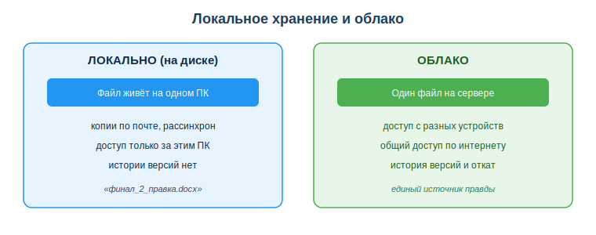
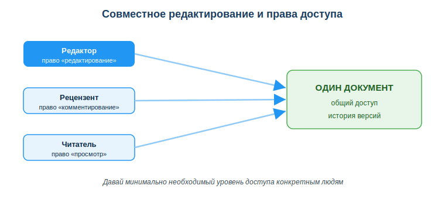

# Облачные сервисы и совместная работа

## Практическая ситуация

Команда готовит отчёт. По почте летает файл «итоговый_финал_2_правка.docx» — уже в пяти версиях, и никто не знает, какая из них настоящая. Один правит копию у себя, другой — у себя, потом эти правки нужно как-то свести вместе. Это типичная боль локального хранения: файл живёт на одном компьютере, а команде нужен общий и всегда актуальный документ.

Облачные сервисы решают проблему: один документ, общий доступ, совместное редактирование и история версий. Для разработчика облако — это и хранилище, и среда командной работы, и (в перспективе) место, где живёт его приложение. Этот урок — про грамотную и безопасную работу с облаком.

## Что ты научишься делать

- объяснять, что такое облачные технологии и зачем они команде;
- настраивать общий доступ и уровни прав без хаоса;
- пользоваться историей версий, чтобы не бояться редактировать;
- соблюдать базовые правила безопасности облака.

## Почему это важно

Современная разработка — это командная работа над общими файлами и кодом. Без облака команда тонет в копиях, рассинхроне версий и потерянных правках. Облако даёт единый источник правды: все видят один и тот же актуальный документ.

Связь с профессией: разработчик ежедневно работает в облаке — общий диск с документацией, совместные таблицы, а позже и облачная инфраструктура, где запускается приложение. Умение настроить доступ правильно (минимум прав, конкретным людям) — это и про продуктивность, и про безопасность данных проекта.

## Учимся читать схему

Посмотри на сравнение локального хранения и облака выше. Ответь на вопросы:

- где «живёт» файл при локальном хранении, а где — в облаке?
- что появляется в облаке такого, чего нет при копиях по почте?
- почему облако называют «единым источником правды»?

## Главное понятие

> **Облачные технологии** — хранение и обработка данных на удалённых серверах с доступом через интернет.

Проще: твои файлы лежат не на одном компьютере, а на сервере провайдера, и ты открываешь их с любого устройства, где есть интернет и доступ к аккаунту.

## Модели облачных сервисов

Облачные сервисы различают по уровню готовности к использованию:

- **Хранилище** (Google Drive, OneDrive, Yandex Disk) — файлы и совместная работа.
- **Сервисы-приложения** (Google Docs, Sheets) — работа прямо в браузере, без установки программ.
- **Инфраструктура для разработчиков** (облачные серверы, базы данных) — там запускают и размещают приложения.

## Совместная работа без хаоса

Совместное редактирование — это когда несколько пользователей работают над одним документом, а права доступа определяют, что каждому можно. Главные правила:

- **Один источник правды:** один файл или папка с общим доступом, а не копии по почте.
- **Уровни доступа:** «просмотр», «комментирование», «редактирование» — давай минимально необходимый.
- **История версий:** можно откатиться к любому прошлому состоянию — не бойся редактировать.
- **Комментарии и задачи** прямо в документе вместо длинной переписки.

### Мини-кейс
Команда вела отчёт в общем Google-документе. Один участник «всё удалил». Паника? Нет: открыли историю версий и восстановили нужное состояние за минуту. Следующий шаг — настроить право «комментирование» тем, кто не должен править текст напрямую.

## Риски и безопасность

- **Доступ по ссылке «всем, у кого есть ссылка»** = фактически публикация. Давай доступ конкретным людям по приглашению.
- **Конфиденциальные данные** не клади в личное облако без согласования — только в защищённое корпоративное хранилище.
- **2FA** (двухфакторная аутентификация) на облачный аккаунт обязательна — там вся твоя работа.
- Помни: файл в облаке доступен, пока есть интернет и аккаунт активен.

## Разбор типичной ошибки

**Ошибка.** «Расшарить» документ с рабочими данными ссылкой «для всех, у кого есть ссылка».

**Почему это ошибка.** Такая ссылка легко утечёт — попадёт в чат, в письмо, в историю браузера — и данные станут публичными для любого, кто её получит.

**Как правильно.** Давать доступ по приглашению конкретным аккаунтам и ровно тот уровень прав, который человеку реально нужен.

## Практика

Ответь письменно:

1. Назови три модели облачных сервисов и приведи по примеру к каждой.
2. Рецензенту нужно оставлять замечания, но не править текст. Какой уровень доступа ты ему дашь и почему?

**Образец (часть ответа на пункт 2):** «Дам уровень „комментирование“: он сможет оставлять замечания прямо в документе, но не изменит текст. Это принцип минимально необходимого доступа».

## Самопроверка

- Я могу объяснить, что такое облачные технологии и назвать их модели.
- Я умею выбрать правильный уровень доступа для разных участников.
- Я знаю, как восстановить документ через историю версий и зачем нужна 2FA.

## Подумай

- Какие свои учебные или рабочие файлы тебе стоило бы перенести в облако с общим доступом? Кому и какой уровень прав ты бы дал?
- Почему «дать доступ всем по ссылке» удобнее, но опаснее, чем «пригласить конкретных людей»?

## Итог

- Используй облако как единый источник правды, а не копии по почте.
- Давай минимально необходимый уровень доступа конкретным людям.
- Пользуйся историей версий — не бойся редактировать.
- Включи 2FA и не клади конфиденциальные данные в личное облако.

## Полезные ссылки

- [Справка Google Диск](https://support.google.com/drive)
- [Microsoft OneDrive — справка](https://support.microsoft.com/ru-ru/onedrive)
- [Совместная работа в Google Документах](https://support.google.com/docs/answer/2494822)

---

*Источник: учебные материалы по применению ИКТ и цифровых технологий (рамка DigComp 2.2); официальная справка Google Workspace и Microsoft 365.*

*Материал разработан рабочей группой ТОО «Колледж Хекслет Казахстан» и одобрен к использованию в обучении решением Педагогического совета.*
