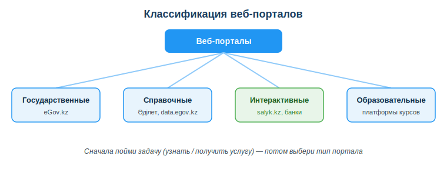
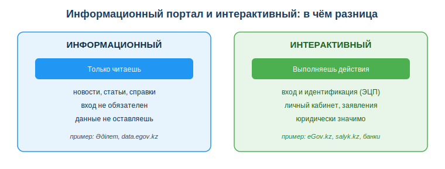

# Изучить виды информационно-справочных и интерактивных веб-порталов

## Практическая ситуация

Тебя берут на первую подработку, и HR просит принести справку о несудимости. Ты слышал, что «это делается онлайн», гуглишь — и попадаешь на eGov.kz. Заходишь, а там сотни услуг, разделы, «войдите через ЭЦП», личный кабинет — ты тычешься минут двадцать и не понимаешь, где вообще заказывать. Бросаешь, идёшь спрашивать у знакомых. А оказалось, что справка заказывается на eGov в три клика — но только если сначала понять, что тебе нужен именно **сервисный** портал (где заказывают услугу), а не справочный (где просто читают). Перепутал тип задачи — потерял время.

В день ты заходишь на десятки сайтов, но это разные по сути вещи: где-то ты только читаешь (новости, гайд по игре), где-то ищешь готовые данные (расписание, текст закона), а где-то совершаешь действия с реальными последствиями — заказываешь справку, платишь, подаёшь заявление. От типа портала зависит, что ты можешь там сделать, какие данные оставляешь и насколько надо быть осторожным.

## Что ты научишься делать

- различать информационные, справочные и интерактивные порталы;
- выбирать портал, который решает именно твою задачу;
- распознавать интерактивные порталы и связанные с ними риски;
- проверять, что ты на официальном сайте, прежде чем вводить данные.

## Почему это важно

Почти любая рабочая и бытовая задача сегодня решается через веб-портал: получить справку, оплатить налог, найти нормативный акт, подать заявление. Если путать типы порталов, теряешь время и можешь оставить данные не там, где нужно.

Связь с профессией: разработчик постоянно работает с веб-сервисами — и как пользователь, и как создатель. Понимая, чем информационный портал отличается от интерактивного, ты будешь грамотнее проектировать интерфейсы, формы входа и сценарии, где у действия есть последствия (платёж, отправка заявки).

## Учимся читать схему

Посмотри на классификацию веб-порталов выше. Ответь на вопросы:

- какие четыре группы порталов показаны на схеме?
- к какой группе относится eGov.kz, а к какой — Әділет?
- что схема советует сделать ПЕРВЫМ — выбрать портал или понять задачу?

## Главное понятие

> **Веб-портал** — крупный сайт-точка входа, который объединяет информацию и сервисы по одной теме. По характеру работы пользователя порталы делят на информационные (только читаешь), информационно-справочные (ищешь и получаешь данные) и интерактивные (совершаешь действия с последствиями).

Проще: на одном портале ты **получаешь информацию**, на другом — **выполняешь действие**. Это и есть главная граница, которую нужно видеть.

## Три типа порталов

| Тип | Что делает пользователь | Примеры (РК) |
|---|---|---|
| Информационный | читает контент, новости | сайты СМИ, гос. органов |
| Информационно-справочный | ищет и получает справки/данные | Әділет (НПА), data.egov.kz, nelk.kz |
| Интерактивный (сервисный) | совершает действия, получает услуги | eGov.kz, salyk.kz, eLicense.kz, банки |

Главное различие: на интерактивном портале ты **что-то делаешь** (подаёшь заявление, платишь, подписываешь) — и это имеет последствия. На информационном и справочном ты только получаешь сведения.

## Признаки интерактивного портала

- требуется **вход и идентификация** (логин, ЭЦП);
- есть **личный кабинет**;
- действия **юридически значимы** (заявления, платежи);
- хранятся твои **персональные данные**.

Если хотя бы половина этих признаков есть — перед тобой интерактивный портал, и относиться к нему нужно внимательнее.

### Мини-кейс
Разберём правило «сначала задача — потом портал» на двух похожих задачах. Задача А: «хочу **прочитать** текст закона об ЭЦП» — это «узнать», значит нужен справочный портал (Әділет), и там ты ничего не оставляешь. Задача Б: «хочу **заказать** справку о несудимости» — это «получить услугу», значит нужен сервисный портал (eGov.kz) со входом по ЭЦП. Слова похожие («узнать про справку» и «заказать справку»), а порталы разные. Поэтому первый шаг всегда один: сформулируй, что именно ты делаешь — читаешь или совершаешь действие, — и только потом открывай сайт.

## Разбор типичной ошибки

**Ошибка.** Искать справочную информацию там, где оформляют услуги (например, текст закона — в личном кабинете банка), и наоборот.

**Почему это ошибка.** Ты тратишь время на портале не того типа, не находишь нужного и можешь по привычке ввести данные там, где это не требуется.

**Как правильно.** Сначала определи тип задачи (узнать информацию или получить услугу), а потом подбери портал под этот тип. И всегда проверяй домен официального сервиса перед вводом ЭЦП.

## Практика

Ответь письменно:

1. Распредели по типам (информационный / справочный / интерактивный): новостной сайт, Әділет, eGov.kz, интернет-банк, data.egov.kz.
2. Назови минимум 3 признака, по которым понятно, что портал интерактивный.

**Образец (часть ответа на пункт 1):** «Новостной сайт — информационный (только читаешь); Әділет и data.egov.kz — информационно-справочные (ищешь и получаешь данные); eGov.kz и интернет-банк — интерактивные (совершаешь действия с последствиями)».

## Самопроверка

- Я умею различать информационные, справочные и интерактивные порталы.
- Я знаю признаки интерактивного портала (вход, личный кабинет, юридически значимые действия, персональные данные).
- Я понимаю, почему сначала надо определить задачу, а потом выбирать портал.

## Подумай

- Какими порталами ты пользовался за последнюю неделю и к каким типам они относятся?
- Почему на интерактивном портале риск выше, чем на информационном, — что именно ты там оставляешь и совершаешь?

## Итог

- Различай информационные, справочные и интерактивные порталы.
- Сначала пойми задачу (узнать / получить услугу), потом выбирай портал.
- На интерактивных порталах будь внимателен: там данные и юридически значимые действия.
- Всегда проверяй домен официального сервиса перед входом.

## Полезные ссылки

- [Портал eGov.kz (интерактивный, госуслуги)](https://egov.kz)
- [Әділет — справочно-правовая система](https://adilet.zan.kz)
- [Портал открытых данных data.egov.kz](https://data.egov.kz)

---

*Источник: ГОСО ТиПО (рамки результатов обучения); официальные порталы Республики Казахстан (eGov.kz, Әділет, data.egov.kz).*

*Разработал: преподаватель ИКТ, магистр управления и информационной безопасности Калиаскаров Д.А.*

*Материал одобрен к использованию в обучении решением Педагогического совета ТОО «Колледж Хекслет Казахстан».*
