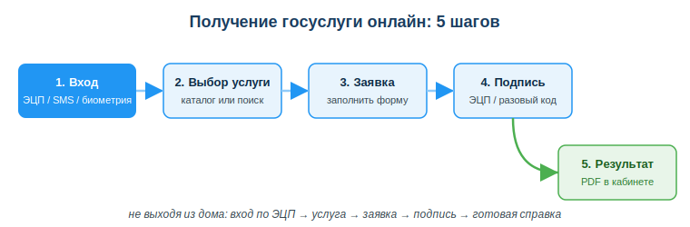
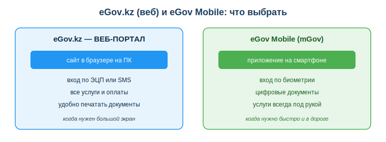

# Использовать портал eGov.kz и mGov: получение госуслуг

## Практическая ситуация

Вечером в воскресенье студенту срочно понадобилась адресная справка для заселения в общежитие. ЦОН закрыт, очередь — только в понедельник, а документ нужен утром. Раньше это означало бы пропущенные пары и потерянный день.

Сегодня всё иначе: студент открыл приложение eGov Mobile, вошёл по отпечатку пальца, выбрал услугу, подписал заявку одноразовым кодом и через две минуты скачал готовую справку в PDF. Уметь так делать — базовый навык цифрового гражданина РК, а для будущего разработчика — ещё и живой пример того, как устроены настоящие электронные госуслуги.

## Что ты научишься делать

- ориентироваться на портале eGov.kz и в приложении eGov Mobile;
- находить и заказывать электронные услуги и справки;
- проходить алгоритм услуги: вход → выбор → заявка → подпись → результат;
- безопасно входить и проверять полученный документ.

## Почему это важно

Электронное правительство экономит главное — время. Вместо очереди в ЦОН ты получаешь справку из любого места и в любой час. Цифровые госуслуги в Казахстане давно стали нормой, и не уметь ими пользоваться сегодня — всё равно что не уметь оплачивать покупки картой.

Связь с профессией: eGov.kz и eGov Mobile — это работающий пример большой информационной системы с идентификацией пользователя, электронной подписью, каталогом услуг и личным кабинетом. Разработчику полезно видеть изнутри логику таких сервисов: как пользователь входит, как подтверждает действие, где хранится результат. Эти же принципы ты будешь применять, проектируя собственные приложения.

## Учимся читать схему

Посмотри на схему «Получение госуслуги онлайн: 5 шагов» выше. Ответь на вопросы:

- какими способами можно войти на первом шаге?
- на каком шаге заявка превращается в юридически значимый документ?
- куда и в каком виде приходит готовый результат?

## Главное понятие

> **Электронное правительство (eGov)** — система получения государственных услуг онлайн: гражданин подаёт заявку через интернет, подписывает её электронной подписью и получает готовый результат в личный кабинет, не посещая госорган лично.

Проще: eGov переносит окно ЦОНа к тебе в браузер и смартфон. Портал **eGov.kz** работает в браузере на ПК, а приложение **eGov Mobile (mGov)** — тот же сервис в телефоне.

## Что такое eGov и mGov

- **eGov.kz** — единый портал электронного правительства РК: справки, заявления, оплаты, запись в очередь. Удобен на ПК: большой экран, легко печатать документы.
- **eGov Mobile (mGov)** — мобильное приложение с теми же услугами плюс цифровые документы (удостоверение личности, дипломы) и быстрый вход по биометрии. Удобно, когда нужно быстро и в дороге.

## Как получить услугу: общий алгоритм

1. **Войти** — через ЭЦП, SMS или биометрию в приложении. Биометрия лишь разблокирует приложение вместо пароля — она не подписывает заявление.
2. **Найти услугу** — в каталоге или через поиск.
3. **Заполнить** заявление — часть данных подтянется автоматически из баз.
4. **Подписать** — ЭЦП или одноразовым кодом. Юридически значимое действие подтверждает именно подпись; для физлица проще всего подписать ЭЦП через мобильное QR-подписание в eGov Mobile (отсканировать QR с портала, подтвердить PIN-кодом или биометрией — без файла-ключа и NCALayer).
5. **Получить результат** — готовую справку в PDF в личном кабинете.

Типовые услуги: адресная справка, справка о несудимости, регистрация ИП, запись в очередь, оплаты налогов и штрафов.

### Мини-кейс
Студенту срочно нужна адресная справка для общежития. Вместо поездки в ЦОН он за 2 минуты заказал её в eGov Mobile, вошёл по биометрии, подписал кодом и скачал PDF. Следующий шаг: открыть документ и проверить, что ФИО, ИИН и адрес верны, прежде чем отправлять в общежитие.

## Разбор типичной ошибки

**Ошибка.** Искать «eGov» в поисковике и переходить по первой попавшейся ссылке — например, на `egov-services.ru`.

**Почему это ошибка.** Сайты-двойники маскируются под официальный портал, чтобы украсть твои логин, пароль и ЭЦП. Через украденную подпись мошенник может оформить документы от твоего имени.

**Как правильно.** Заходить только на домен `egov.kz` напрямую (набрать адрес вручную) или через официальное приложение eGov Mobile из App Store / Google Play.

## Практика

Ответь письменно:

1. Перечисли по порядку 5 шагов получения услуги на eGov и укажи, чем можно подписать заявку.
2. Объясни, как отличить официальный портал от сайта-двойника и почему это важно.

**Образец (часть ответа на пункт 1):** «1) Войти — по ЭЦП, SMS или биометрии; 2) найти услугу в каталоге; 3) заполнить заявление; 4) подписать — ЭЦП или одноразовым кодом; 5) получить результат в PDF в личном кабинете».

## Самопроверка

- Я знаю, чем отличается портал eGov.kz от приложения eGov Mobile.
- Я могу назвать 5 шагов получения услуги и способы входа и подписи.
- Я умею распознать сайт-двойник и проверить данные в полученной справке.

## Подумай

- Какую госуслугу тебе или твоей семье было бы удобно получить онлайн уже сейчас? Какие шаги для этого нужны?
- Как разработчик, какие меры защиты ты бы заложил в систему входа и подписи, чтобы у пользователей не крали ЭЦП?

## Итог

- Используй eGov.kz и eGov Mobile для госуслуг вместо очередей в ЦОН.
- Помни алгоритм: вход → поиск услуги → заявление → подпись → результат.
- Заходи только на официальный домен `egov.kz` или через официальное приложение.
- Всегда проверяй данные (ФИО, ИИН, адрес) в полученном документе.

## Полезные ссылки

- [Портал eGov.kz](https://egov.kz)
- [Каталог услуг eGov.kz](https://egov.kz/cms/ru/services)
- [Мобильное приложение eGov Mobile (о приложении)](https://egov.kz/cms/ru/articles/egov-mobile)

---

*Источник: ГОСО ТиПО (приказ МП РК); официальный портал eGov.kz и приложение eGov Mobile; DigComp 2.2 (цифровые компетенции гражданина).*

*Материал разработан рабочей группой ТОО «Колледж Хекслет Казахстан» и одобрен к использованию в обучении решением Педагогического совета.*
