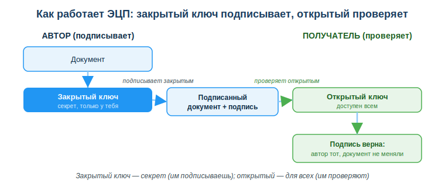
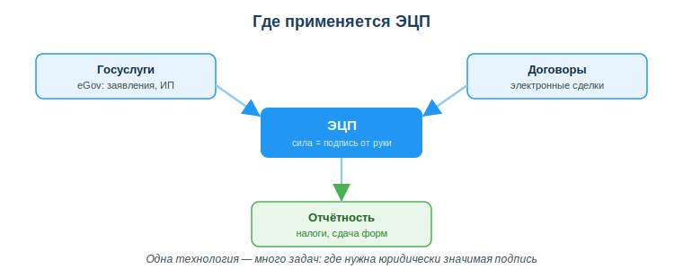

# Оформлять и применять электронную цифровую подпись (ЭЦП)

## Практическая ситуация

Тебе нужно подать заявление на eGov, зарегистрировать ИП или подписать договор с заказчиком, но ты не в одном городе с ним и не хочешь ехать в офис. Как поставить подпись, которая по силе равна подписи от руки, не вставая со стула? Ответ — электронная цифровая подпись (ЭЦП).

ЭЦП — это ключ, которым ты подтверждаешь свою личность и согласие в цифровом мире. Для разработчика это ещё и наглядный пример того, как криптография работает на практике: за «галочкой подписать» стоит пара математически связанных ключей.

## Что ты научишься делать

- объяснять, что такое ЭЦП и какую юридическую силу она имеет;
- описывать, как устроена пара ключей (закрытый/открытый) и кто чем пользуется;
- получать и применять ЭЦП в РК (мобильное QR-подписание через eGov Mobile и программа NCALayer);
- безопасно хранить ключ и действовать при его утечке.

## Почему это важно

ЭЦП — это вход в цифровое государство: без неё не подашь заявление, не оформишь сделку, не сдашь отчётность онлайн. Понимать, как она устроена, важно, чтобы не отдать свою «цифровую руку» чужому человеку и не потерять контроль над юридически значимыми действиями.

Связь с профессией: разработчик постоянно встречает асимметричную криптографию — в HTTPS, в подписи кода и пакетов, в токенах и API-ключах. ЭЦП — простейший и самый понятный пример этой же идеи: один ключ секретный, другой публичный. Разобравшись с ЭЦП, ты легче поймёшь безопасность в своих проектах.

## Учимся читать схему

Посмотри на схему «Как работает ЭЦП» выше. Ответь на вопросы:

- каким ключом автор подписывает документ, а каким получатель проверяет подпись?
- какой из двух ключей нельзя никому отдавать и почему?
- что именно подтверждает успешная проверка подписи — только авторство или ещё что-то?

## Главное понятие

> **Электронная цифровая подпись (ЭЦП)** — реквизит электронного документа, подтверждающий его автора и неизменность; по Закону РК она равнозначна собственноручной подписи.

Проще: ЭЦП не «картинка подписи», а результат криптографического преобразования документа закрытым ключом. Любой может проверить этот результат открытым ключом и убедиться, что подписал именно ты и документ после подписания не меняли.

## Что такое ЭЦП и пара ключей

**Электронная цифровая подпись** подтверждает две вещи сразу: **авторство** (подписал именно ты) и **неизменность** (документ не правили после подписания). По Закону РК ЭЦП равнозначна собственноручной подписи — значит, всё подписанное ею юридически твоё.

ЭЦП работает на **паре ключей** (асимметричная криптография):

- **Закрытый (приватный) ключ** — секретный, хранится только у тебя; им ты подписываешь.
- **Открытый ключ** — доступен всем; им проверяют твою подпись.

Логика простая: подписал закрытым → любой проверил открытым, что подписал именно ты и документ не меняли. Подделать подпись без закрытого ключа практически невозможно — на этом и держится доверие.

## Как получить и применять ЭЦП в РК

1. Получить ключи в **НУЦ РК** (Национальный удостоверяющий центр) — на eGov, в ЦОНе или онлайн (с 2025 года онлайн-получение проходит через биометрическую идентификацию).
2. Хранить файл-ключ безопасно: личный защищённый носитель (флешка, удостоверение личности, защищённое хранилище).
3. Подписать документ одним из двух способов:
   - **мобильное QR-подписание через приложение eGov Mobile** — самый удобный способ для физлиц: сканируешь QR-код с экрана и подтверждаешь подпись на телефоне (PIN или биометрия), без файла-ключа и без установки программ;
   - **через программу NCALayer на компьютере** — она связывает браузер и твой файл-ключ; нужна для десктоп-сценариев.
4. После подписания подпись прикрепляется к документу, и его можно проверить открытым ключом.

Одна и та же технология закрывает много задач: госуслуги на eGov, электронные договоры и сделки, налоговая и иная отчётность — везде, где нужна юридически значимая подпись.

### Мини-кейс
Студент скачал ключ ЭЦП и оставил его в папке «Загрузки» на общем компьютере колледжа. Риск: любой, кто сядет за этот ПК, может подписать документ от его имени — и ответственность будет на студенте. Следующий шаг: перенести ключ на личный защищённый носитель и не хранить на чужих устройствах.

## Разбор типичной ошибки

**Ошибка.** Передать файл-ключ ЭЦП и пароль другому человеку «чтобы он подписал за меня».

**Почему это ошибка.** Это всё равно что отдать свою подпись и паспорт: любое подписанное действие юридически считается твоим. Если ключ используют не так, отвечать будешь ты.

**Как правильно.** ЭЦП использует только владелец. Если нужно делегировать действие — оформляют доверенность или отдельный ключ для уполномоченного лица, но не передают свой.

## Практика

Ответь письменно:

1. Объясни своими словами, почему закрытый ключ нельзя никому передавать, а открытый — можно публиковать.
2. Опиши по шагам, как получить и применить ЭЦП в РК (от НУЦ до подписания через eGov Mobile по QR или через NCALayer).

**Образец (часть ответа на пункт 1):** «Закрытым ключом ставится подпись, поэтому тот, у кого он есть, может подписывать от моего имени — а это юридически значимо. Открытый ключ только проверяет подпись и ничего не подписывает, поэтому его безопасно отдавать всем».

## Самопроверка

- Я знаю, что ЭЦП по Закону РК равнозначна собственноручной подписи.
- Я умею объяснить роль закрытого и открытого ключей (кто подписывает, кто проверяет).
- Я понимаю, как получить ЭЦП через НУЦ РК и подписать документ (по QR через eGov Mobile или через NCALayer), и как безопасно хранить ключ.

## Подумай

- Где в твоей жизни уже могла бы пригодиться ЭЦП и какие действия она бы упростила?
- ЭЦП — это та же идея, что и HTTPS-сертификаты или подпись кода. Почему разработчику полезно понимать асимметричную криптографию не только ради ЭЦП?

## Итог

- ЭЦП равна собственноручной подписи и основана на паре ключей (асимметричная криптография).
- Закрытый ключ — секрет, не передавай никому; открытый — для проверки, доступен всем.
- Получай ЭЦП через НУЦ РК, подписывай по QR через eGov Mobile (для физлиц удобнее всего) или через NCALayer на компьютере.
- Храни ключ на защищённом носителе; при утечке немедленно отзови его.

## Полезные ссылки

- [eGov.kz — получение и работа с ЭЦП](https://egov.kz/cms/ru/articles/eds)
- [Национальный удостоверяющий центр РК (pki.gov.kz)](https://pki.gov.kz)
- [Закон РК «Об электронном документе и ЭЦП»](https://adilet.zan.kz/rus/docs/Z030000370_)

---

*Источник: Закон РК «Об электронном документе и электронной цифровой подписи»; материалы eGov.kz и НУЦ РК; рамка цифровых компетенций (DigComp 2.2).*

*Разработал: преподаватель ИКТ, магистр управления и информационной безопасности Калиаскаров Д.А.*

*Материал одобрен к использованию в обучении решением Педагогического совета ТОО «Колледж Хекслет Казахстан».*
