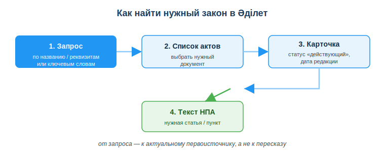
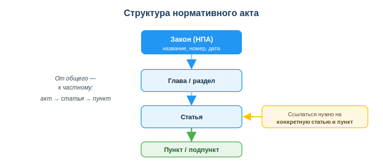

# Использовать справочно-правовые системы (Әділет, online.zakon.kz)

## Практическая ситуация

«А это вообще законно?» — вопрос, который у разработчика возникает постоянно: можно ли так обрабатывать персональные данные клиентов, нужна ли лицензия на продукт, как корректно оформить договор с заказчиком. Ответ всегда один: он записан в законах. А быстро найти нужный закон помогают справочно-правовые системы.

В команде ты слышишь: «вроде бы хранить данные дольше года нельзя». Кто-то прочитал это в чате, кто-то — в блоге 2014 года. Полагаться на пересказ опасно: закон мог измениться. Умение открыть официальный первоисточник и прочитать конкретную статью отличает профессионала от того, кто верит слухам.

## Что ты научишься делать

- находить нормативные правовые акты РК в системе Әділет;
- проверять статус и актуальность редакции закона;
- читать структуру акта и переходить к нужной статье/пункту;
- ссылаться на конкретную норму, а не на пересказ.

## Почему это важно

Право — это не «дело юристов». Любой цифровой продукт работает с данными, договорами и лицензиями, а значит подчиняется законам. Найти и прочитать первоисточник за минуту умеет тот, кто владеет справочно-правовой системой; остальные тратят часы или верят неточным пересказам.

Связь с профессией: разработчику регулярно нужно проверять правовые требования — к обработке персональных данных, к лицензиям на используемые библиотеки, к условиям договора с заказчиком. Ссылка на конкретную статью действующего закона делает твою позицию весомой в споре с заказчиком, коллегой или проверяющим.

## Учимся читать схему

Посмотри на схему «Как найти нужный закон в Әділет» выше. Ответь на вопросы:

- с чего начинается поиск — с реквизитов акта или с готового текста статьи?
- что нужно проверить в карточке документа, прежде чем читать текст?
- почему итоговый блок (текст НПА) выделен зелёным, а не синим?

## Главное понятие

> **Справочно-правовая система (СПС)** — база нормативных правовых актов с поиском, актуальными редакциями и связями между документами.

В Казахстане главный официальный ресурс — **Әділет (adilet.zan.kz)**: это государственная информационно-правовая система НПА. Есть и коммерческие системы (**online.zakon.kz**, Параграф) — с удобным поиском, комментариями и дополнительными сервисами. Для ссылки на официальную норму бери Әділет; коммерческие удобны для быстрой ориентировки.

## Как искать в Әділет

1. Открыть **adilet.zan.kz**.
2. Искать по **названию** акта, его **реквизитам** (номер, дата) или **ключевым словам**.
3. Проверить **статус и редакцию:** должно быть «действующий» и видна дата последней редакции.
4. Перейти к нужной **статье/пункту** и прочитать формулировку.

Закон часто меняется. Всегда смотри **актуальную редакцию** и дату, а не первую попавшуюся версию.

## Структура нормативного акта

Чтобы сослаться точно, надо понимать, как устроен акт. Он идёт от общего к частному: сам **акт** делится на **главы/разделы**, главы — на **статьи**, а статьи — на **пункты и подпункты**. Корректная ссылка указывает не «где-то в законе», а конкретную статью и пункт.

Например: «Закон РК «О персональных данных и их защите» (№ 94-V, 2013), статья 7, пункт 1» — это адрес нормы, по которому её найдёт любой.

### Мини-кейс

Студент сослался на «закон о персональных данных» по статье из блога 2014 года. Но закон с тех пор редактировался. Следующий шаг: открыть Әділет, найти **действующую** редакцию, проверить статус и дату, перейти к нужной статье и сослаться на неё с указанием номера закона и даты.

## Разбор типичной ошибки

**Ошибка.** Верить пересказу закона в чате или блоге и использовать старую редакцию как действующую.

**Почему это ошибка.** Пересказ может быть неточным, а норма с тех пор могла измениться или утратить силу. Решение, принятое по устаревшей версии, окажется неверным.

**Как правильно.** Читать первоисточник в официальной СПС (Әділет), проверять статус «действующий» и дату последней редакции, ссылаться на конкретную статью.

## Практика

Ответь письменно:

1. Опиши по шагам, как найти в Әділет действующую редакцию Закона РК «О персональных данных и их защите» и убедиться, что она актуальна.
2. Перепиши ссылку «как-то в законе сказано про согласие» в корректную форму ссылки на НПА (название, реквизиты, статья).

> **Образец (часть ответа на пункт 1):** «Открываю adilet.zan.kz, ищу по названию закона. В списке выбираю нужный акт, открываю карточку: проверяю статус "действующий" и дату последней редакции. Затем перехожу к статье о согласии и читаю формулировку».

## Самопроверка

- Я умею найти нужный НПА в Әділет по названию или реквизитам.
- Я знаю, что проверять статус и дату редакции обязательно.
- Я могу сослаться на конкретную статью и пункт, а не на пересказ.

## Подумай

- В каком рабочем споре с заказчиком тебе пригодится ссылка на конкретную статью действующего закона?
- Почему опасно полагаться на пересказ закона из чата, даже если его прислал опытный коллега?

## Итог

- Для правовых вопросов используй официальную СПС — **Әділет (adilet.zan.kz)**.
- Ищи по названию, реквизитам или ключевым словам; проверяй статус и редакцию.
- Понимай структуру акта: акт → глава → статья → пункт.
- Ссылайся на конкретную статью с датой, а не на пересказ.
- Помни: законы меняются — всегда бери актуальную версию.

## Полезные ссылки

- [Әділет — информационно-правовая система НПА РК](https://adilet.zan.kz)
- [online.zakon.kz — правовая база](https://online.zakon.kz)
- [Закон РК «О персональных данных и их защите»](https://adilet.zan.kz/rus/docs/Z1300000094)

---

*Источник: ГОСО ТиПО (приказ МП РК № 348); официальные ресурсы Әділет (adilet.zan.kz) и online.zakon.kz.*

*Разработал: преподаватель ИКТ, магистр управления и информационной безопасности Калиаскаров Д.А.*

*Материал одобрен к использованию в обучении решением Педагогического совета ТОО «Колледж Хекслет Казахстан».*
