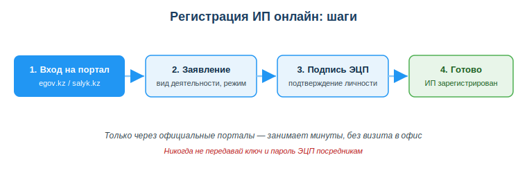
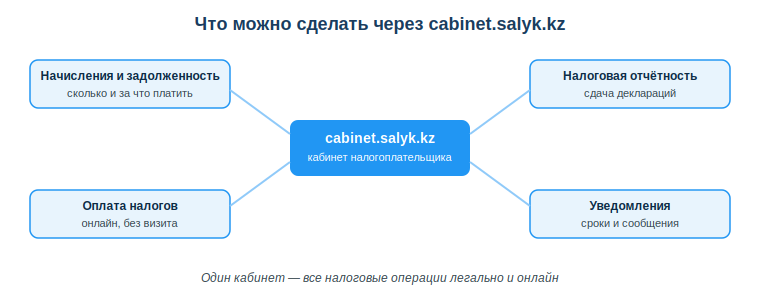

# Работать с налоговыми и бизнес-сервисами (salyk.kz, регистрация ИП)

## Практическая ситуация

Ты — студент-разработчик и берёшь заказы на фрилансе. Сначала клиенты переводят оплату на личную карту, и всё устраивает. Но приходит крупный заказчик — компания — и просит договор и закрывающие документы. Без оформления ты их дать не можешь, и сделка срывается.

Чтобы работать на себя легально и брать серьёзные заказы, нужно понимать базовые цифровые сервисы для бизнеса: как зарегистрировать ИП онлайн и как вести налоги через кабинет налогоплательщика. Это не «бухгалтерия — не моё», а часть твоей профессиональной самостоятельности.

## Что ты научишься делать

- объяснять, зачем и как регистрируют ИП в РК онлайн;
- ориентироваться в налоговом кабинете cabinet.salyk.kz;
- называть базовые обязанности самозанятого/ИП (налоги, отчётность);
- распознавать риски и регистрироваться только через официальные порталы.

## Почему это важно

Легальный статус открывает то, чего нет у работающего «в тёмную»: договоры, счета, корпоративные клиенты, господдержка и сниженные налоговые режимы для малого бизнеса. А цифровые сервисы РК позволяют оформить всё это онлайн, без очередей и визита в офис.

Связь с профессией: разработчик всё чаще работает как ИП — фриланс, свой продукт, подряды. Умение быстро оформить статус и вести налоги онлайн делает тебя самостоятельным исполнителем, которому доверяют крупные заказы.

## Учимся читать схему

Посмотри на схему «Регистрация ИП онлайн: шаги» выше. Ответь на вопросы:

- с какого шага начинается регистрация и на каком портале?
- на каком шаге подтверждается личность и чем именно?
- почему последний блок выделен зелёным — что он означает?

## Главное понятие

> **ИП (индивидуальный предприниматель)** — статус физического лица, дающий право легально вести предпринимательскую деятельность: заключать договоры, выставлять счета и платить налоги по упрощённым режимам. В РК регистрируется онлайн с подтверждением ЭЦП.

Проще: ИП — это твоя легальная «работа на себя», оформленная через официальный цифровой сервис за минуты.

## Зачем регистрировать ИП

- легально принимать оплату от клиентов и компаний;
- заключать договоры, выставлять счета и давать закрывающие документы;
- платить налоги по сниженным режимам для малого бизнеса.

Регистрация ИП в РК — **онлайн за минуты** через eGov или налоговый кабинет, с подтверждением ЭЦП. Не нужно идти в офис: заявление подписывается электронной подписью.

## Налоговый кабинет (cabinet.salyk.kz)

Личный кабинет налогоплательщика — единая точка для всех налоговых операций. Через него можно:

- видеть начисления и задолженность;
- сдавать налоговую отчётность;
- оплачивать налоги онлайн;
- получать уведомления о сроках.

Для ИТ-компаний в РК есть отдельные налоговые льготы — их даёт **Astana Hub** (технопарк ИТ-стартапов). Важно не путать: эти льготы действуют для компаний на **общем** налоговом режиме и **не сочетаются с упрощёнкой**. То есть упрощённый режим — это про малый бизнес вообще (в том числе для ИП-фрилансера), а льготы Astana Hub — отдельный специальный механизм для ИТ-компаний. Детали меняются, поэтому всегда проверяй актуальные условия на официальных ресурсах (kgd.gov.kz, astanahub.com).

### Мини-кейс
Студент-фрилансер получал оплату на личную карту без оформления. При крупном заказе у заказчика возник вопрос о договоре и закрывающих документах — и сделка повисла. Следующий шаг: зарегистрировать ИП онлайн через egov.kz, выбрать упрощённый режим, подписать заявление ЭЦП. Теперь он легально работает с компаниями и спокойно ведёт налоги через cabinet.salyk.kz.

## Разбор типичной ошибки

**Ошибка.** Передать ключ и пароль ЭЦП посреднику, который «по-быстрому оформит ИП» по ссылке из объявления.

**Почему это ошибка.** ЭЦП — это твоя электронная подпись. Передав её, ты фактически отдаёшь право подписывать документы от твоего имени: тебя могут оформить на чужие долги, кредиты или фиктивные сделки.

**Как правильно.** Регистрировать ИП только самостоятельно через egov.kz или cabinet.salyk.kz, подписывая заявление своей ЭЦП и никогда не передавая её ключ и пароль другим.

## Практика

Ответь письменно:

1. Перечисли по порядку шаги онлайн-регистрации ИП и укажи, чем подтверждается личность.
2. Назови минимум три операции, которые можно выполнить в cabinet.salyk.kz.

**Образец (часть ответа на пункт 1):** «Шаг 1 — вход на официальный портал egov.kz или salyk.kz. Шаг 2 — заполнение заявления (вид деятельности, налоговый режим). Шаг 3 — подтверждение личности подписью ЭЦП…»

## Самопроверка

- Я могу объяснить, зачем разработчику-фрилансеру регистрировать ИП.
- Я знаю шаги онлайн-регистрации ИП и роль ЭЦП в них.
- Я понимаю, какие операции выполняются через cabinet.salyk.kz и почему нельзя передавать ЭЦП посредникам.

## Подумай

- Какой твой первый заказ ты мог бы взять только как ИП, а не «в тёмную»? Что бы это изменило?
- Почему государство сделало регистрацию ИП и уплату налогов онлайн, а не только в офисе? Кому это выгодно?

## Итог

- ИП — это легальная работа на себя; регистрация онлайн за минуты с подтверждением ЭЦП.
- cabinet.salyk.kz — единый кабинет: начисления, отчётность, оплата, уведомления.
- Официальный статус открывает договоры, корпоративных клиентов и льготные режимы.
- Регистрируйся только через egov.kz / cabinet.salyk.kz и никогда не передавай ЭЦП посредникам.

## Полезные ссылки

- [Кабинет налогоплательщика — cabinet.salyk.kz](https://cabinet.salyk.kz)
- [eGov.kz — регистрация индивидуального предпринимателя](https://egov.kz/cms/ru/services/for_business)
- [Комитет государственных доходов МФ РК](https://kgd.gov.kz)

---

*Источник: ГОСО ТиПО (приказ МП РК № 348); официальные порталы cabinet.salyk.kz, eGov.kz, kgd.gov.kz.*

*Материал разработан рабочей группой ТОО «Колледж Хекслет Казахстан» и одобрен к использованию в обучении решением Педагогического совета.*
