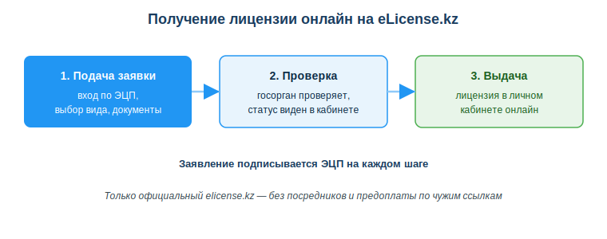
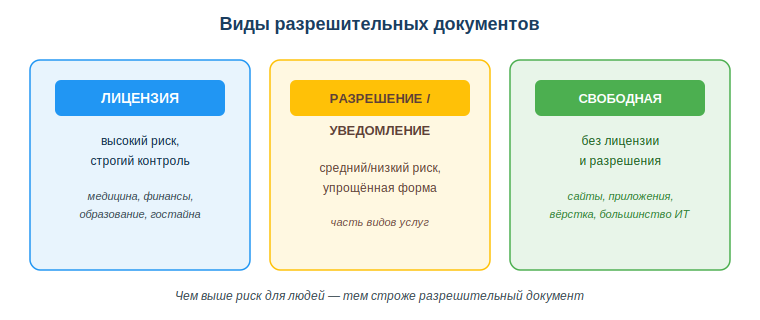

# Оформлять лицензии и разрешения через eLicense.kz

## Практическая ситуация

Твоя команда сделала приложение для аптеки: каталог лекарств, корзина, оплата. Заказчик доволен и спрашивает: «А лицензия для этого нужна? Кто её оформляет — вы или мы?» Если ответить наугад, можно подвести клиента или потерять заказ.

На самом деле часть деятельности нельзя вести «просто так»: государство требует лицензию или разрешение. Разработчик встречает это, когда делает продукт для регулируемой сферы (медицина, финансы, образование) или открывает своё дело. Получить такие документы онлайн помогает портал **eLicense.kz**.

## Что ты научишься делать

- отличать лицензируемую деятельность от свободной;
- объяснять назначение портала eLicense.kz;
- описывать порядок получения лицензии или разрешения онлайн;
- распознавать признаки мошенничества при «оформлении лицензий».

## Почему это важно

Лицензирование напрямую влияет на то, можно ли запускать продукт легально. Ошибка в этом вопросе — это не «мелкая неточность», а риск штрафов, остановки сервиса и потери доверия заказчика. Понимать, что и кому нужно оформить, важно ещё на этапе обсуждения проекта.

Связь с профессией: разработчик всё чаще консультирует заказчика на старте — нужна ли его деятельности лицензия, кто её получает, какие требования к ПО в регулируемой сфере. Это часть профессиональной грамотности, которая отличает специалиста от исполнителя «по ТЗ».

## Учимся читать схему

Посмотри на схему получения лицензии онлайн выше. Ответь на вопросы:

- какие три основных шага проходит заявка от подачи до выдачи?
- чем подписывают заявление на каждом шаге?
- почему важно оформлять лицензию только на официальном elicense.kz, а не через посредников?

## Главное понятие

> **Лицензия** — официальное право заниматься определённым (регулируемым) видом деятельности, которое выдаёт государство.

Проще: лицензия — это «зелёный свет» от государства на рисковую деятельность. Рядом существует более простая форма — **разрешение/уведомление** — для менее рисковых видов. А большинство ИТ-услуг (сайты, приложения, вёрстка) относятся к свободной деятельности и лицензии не требуют.

## Лицензия, разрешение и свободная деятельность

Разрешительные документы различаются по уровню риска деятельности:

- **Лицензия** — для регулируемых рисковых видов (медицина, финансы, образование, работа с гостайной).
- **Разрешение/уведомление** — упрощённая форма для менее рисковых видов деятельности.
- **Свободная деятельность** — не требует ни лицензии, ни разрешения (сюда относится большинство ИТ-услуг).

Важно: чаще всего лицензируется **деятельность клиента или сфера применения**, а не сам код. Разработка сайта или приложения обычно лицензии не требует. Но если продукт работает в регулируемой сфере (обработка гостайны, финуслуги, медизделия) — требования появляются, и их нужно проверять.

## Портал eLicense.kz

**eLicense.kz** — государственная база данных «Е-лицензирование»: подача заявлений, получение и проверка лицензий и разрешений онлайн.

Общий порядок:

1. Войти на портал по ЭЦП.
2. Выбрать нужную лицензию или разрешение из перечня.
3. Подать заявление с приложенными документами.
4. Подписать заявление ЭЦП.
5. Получить результат в личный кабинет; статус можно отслеживать онлайн.

### Мини-кейс
Команда делает приложение для аптек с функцией продаж. Возникает вопрос: нужна ли лицензия фармдеятельности? Следующий шаг: проверить на eLicense.kz перечень лицензируемых видов и уточнить, что лицензируется именно **деятельность аптеки (клиента)**, а требования к ПО — отдельно. Так разработчик сразу даёт заказчику корректный ответ.

## Разбор типичной ошибки

**Ошибка.** «Раз это ИТ — никаких разрешений не нужно никогда».

**Почему это ошибка.** Сама разработка обычно не лицензируется, но регулируемая сфера применения продукта может требовать лицензий или сертификации. Если этого не учесть, продукт нельзя будет легально запустить у клиента.

**Как правильно.** Проверять, в какой сфере работает продукт, и какие требования к этой сфере; уточнять, что лицензируется деятельность клиента, а не сам код. Оформлять документы только через официальный elicense.kz.

## Практика

Ответь письменно:

1. Назови три ИТ-продукта: один из свободной деятельности и два из регулируемых сфер. Для каждого укажи, нужна ли лицензия и кому.
2. Перечисли по порядку шаги получения лицензии онлайн на eLicense.kz.

**Образец (часть ответа на пункт 1):** «Сайт-визитка для кафе — свободная деятельность, лицензия не нужна. Приложение для аптеки с продажами — лицензируется фармдеятельность аптеки (клиента), а не само приложение».

## Самопроверка

- Я умею отличать лицензируемую деятельность от свободной.
- Я знаю назначение портала eLicense.kz и порядок подачи заявления онлайн.
- Я понимаю, что лицензируется деятельность клиента/сфера, а не сам код, и распознаю мошенников.

## Подумай

- Какой из твоих учебных или будущих проектов мог бы попасть в регулируемую сферу? Кому в нём понадобится лицензия?
- Почему оформлять лицензию через посредника с предоплатой опаснее, чем сделать это самому на elicense.kz?

## Итог

- Различай лицензируемую и свободную деятельность по уровню риска.
- Для большинства ИТ-услуг лицензия не нужна, но всегда проверяй сферу применения.
- Лицензии и разрешения оформляй онлайн через eLicense.kz с ЭЦП.
- Не доверяй посредникам — используй только официальный портал.

## Полезные ссылки

- [eLicense.kz — государственная база «Е-лицензирование»](https://elicense.kz)
- [eGov.kz — лицензии и разрешения](https://egov.kz/cms/ru/services/licenses)
- [Закон РК «О разрешениях и уведомлениях»](https://adilet.zan.kz/rus/docs/Z1400000202)

---

*Источник: Закон РК «О разрешениях и уведомлениях»; материалы порталов elicense.kz и eGov.kz; ГОСО ТиПО (приказ МП РК № 348).*

*Разработал: преподаватель ИКТ, магистр управления и информационной безопасности Калиаскаров Д.А.*

*Материал одобрен к использованию в обучении решением Педагогического совета ТОО «Колледж Хекслет Казахстан».*
