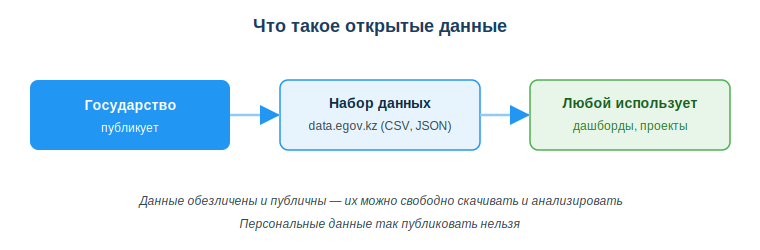
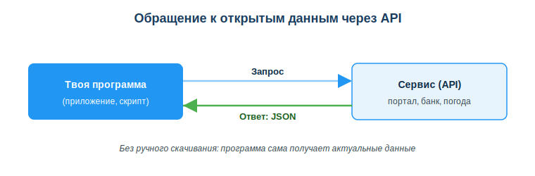

# Использовать порталы открытых данных (data.egov.kz) и их API

## Практическая ситуация

Тебе нужно сделать дашборд: население городов Казахстана по годам. Ты можешь «прикинуть» цифры на глаз — но тогда выводы будут недостоверны, и работу не примут всерьёз. А можно зайти на портал, где государство само выложило настоящую статистику, и взять проверенные числа.

Именно для этого существуют **порталы открытых данных**: государство публикует наборы данных, а ты берёшь их и используешь в проекте. А если данные меняются часто (курс валют, погода), их удобнее получать не вручную, а через **API** — программный интерфейс.



## Что ты научишься делать

- находить и скачивать наборы открытых данных на data.egov.kz;
- объяснять, что такое API и зачем он нужен;
- различать форматы данных (CSV, JSON, XLSX) и оценивать их пригодность;
- не путать открытые данные с персональными.

## Почему это важно

Реальные данные — основа любого серьёзного проекта: дашборда, прототипа, учебного анализа, обучения моделей. Открытые данные дают их легально и бесплатно, потому что они обезличены и опубликованы для свободного использования.

Связь с профессией: разработчик постоянно работает с данными — загружает наборы, подключается к чужим сервисам через API, разбирает ответы в формате JSON. Уметь находить открытые данные и понимать API — базовый навык для работы с данными и интеграций.

## Учимся читать схему

Посмотри на схему «Что такое открытые данные» выше. Ответь на вопросы:

- кто публикует открытые данные и где?
- что делает с набором данных тот, кто его скачал?
- почему персональные данные нельзя публиковать как открытые?

## Главное понятие

> **Открытые данные** — наборы, опубликованные свободно и бесплатно для повторного использования; они обезличены и доступны любому.

Проще: это данные, которые государство или организация выложили в открытый доступ, чтобы любой мог их скачать и применить — без нарушения приватности.

## Открытые данные и портал data.egov.kz

Главный портал открытых данных Казахстана — **data.egov.kz**. Там опубликованы статистика, справочники, показатели по регионам и отраслям: число школ по областям, население городов, экономические показатели и многое другое. Наборы можно искать по теме, просматривать и скачивать — портал отдаёт их в форматах **XLSX (Excel), JSON и XML**.

Зачем разработчику: реальные данные для дашбордов, прототипов, учебных проектов и обучения моделей — без выдумывания и без нарушения приватности (данные обезличены и публичны).

## Что такое API

**API (Application Programming Interface)** — способ одной программы запрашивать данные или функции у другой. Вместо того чтобы скачивать файл вручную, программа делает **запрос** и получает **ответ** — обычно в формате JSON.



Пример из жизни: твоё приложение запрашивает курс валют через API банка и сразу показывает актуальные цифры — без ручного обновления.

У портала data.egov.kz тоже есть API. Реальный GET-запрос можно отправить прямо из адресной строки браузера:

```
https://data.egov.kz/api/v4/<имя_набора>/<версия>?apiKey=ВАШ_КЛЮЧ
```

В ответ сервер вернёт данные в формате JSON, например:

```json
[
  {"region": "Алматы", "year": 2024, "population": 2228000},
  {"region": "Астана", "year": 2024, "population": 1430000}
]
```

Ключ `apiKey` выдаётся после регистрации на портале. Главное преимущество API — данные приходят свежими и автоматически, без ручного скачивания файла.

## Форматы данных

| Формат | Что это | Удобство |
|---|---|---|
| CSV | таблица, значения через запятую | просто, открывается в Excel |
| JSON | структура «ключ–значение» | удобно для API и кода |
| XLSX | таблица Excel | для людей, не для кода |

Правило простое: CSV и JSON удобны для кода и автоматической обработки, XLSX — для просмотра человеком. Сам портал data.egov.kz отдаёт наборы в XLSX, JSON и XML (CSV там нет, но это распространённый формат у других источников данных).

### Мини-кейс
Студент для учебного дашборда «придумал» цифры населения городов. Преподаватель попросил реальные. Следующий шаг: зайти на data.egov.kz, найти набор по населению, скачать его (XLSX или JSON) и построить дашборд на настоящих данных. Если бы данные обновлялись постоянно — стоило бы получать их через API.

## Разбор типичной ошибки

**Ошибка.** Использовать выдуманные данные в проекте «для вида» или считать, что «открытые данные» = «можно публиковать что угодно о людях».

**Почему это ошибка.** Выдуманные цифры делают выводы недостоверными, а проект несерьёзным. А персональные данные (ФИО, телефоны конкретных людей) публиковать как открытые нельзя — открытые данные всегда обезличены.

**Как правильно.** Брать реальные наборы из официальных источников (data.egov.kz) и работать только с обезличенными данными, уважая приватность.

## Практика

Ответь письменно:

1. Объясни своими словами, чем открытые данные отличаются от персональных и почему первые можно публиковать, а вторые нет.
2. Опиши, что произойдёт при обращении к API: что отправляет программа, что она получает в ответ и в каком формате.

**Образец (часть ответа на пункт 2):** «Программа отправляет сервису запрос, сервис возвращает ответ с данными, обычно в формате JSON — структуре "ключ–значение". Так приложение получает актуальные данные автоматически, без ручного скачивания файла».

## Самопроверка

- Я знаю, где найти открытые данные РК и как скачать набор (data.egov.kz).
- Я умею объяснить, что такое API и как идёт обмен «запрос → ответ JSON».
- Я различаю форматы CSV, JSON, XLSX и не путаю открытые данные с персональными.

## Подумай

- Какой набор данных с data.egov.kz пригодился бы для твоего учебного проекта и почему?
- Когда лучше один раз скачать файл, а когда — получать данные через API? Приведи пример из жизни.

## Итог

- Бери реальные данные с портала открытых данных data.egov.kz, а не выдумывай их.
- Понимай API как способ программно получать данные: запрос → ответ (обычно JSON).
- Различай форматы: CSV/JSON — для кода, XLSX — для людей.
- Не путай открытые данные с персональными: открытые всегда обезличены.

## Полезные ссылки

- [Портал открытых данных data.egov.kz](https://data.egov.kz)
- [Что такое API (MDN, введение)](https://developer.mozilla.org/ru/docs/Learn/JavaScript/Client-side_web_APIs/Introduction)
- [Формат JSON (MDN)](https://developer.mozilla.org/ru/docs/Learn/JavaScript/Objects/JSON)

---

*Источник: официальная документация портала data.egov.kz; материалы MDN Web Docs (API, JSON); рамка цифровых компетенций DigComp 2.2.*

*Материал разработан рабочей группой ТОО «Колледж Хекслет Казахстан» и одобрен к использованию в обучении решением Педагогического совета.*
