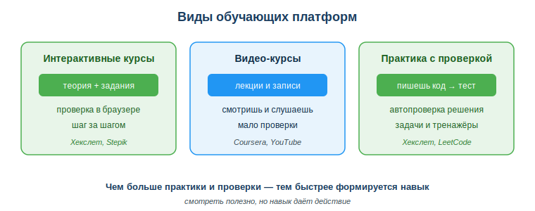
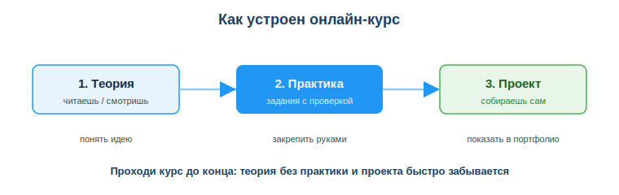

# Использовать образовательные платформы (Stepik, Coursera, Хекслет)

## Практическая ситуация

Ты устроился джуниор-разработчиком, и через месяц в команде решают перейти на новый фреймворк, которого ты не знаешь. Курса в колледже по нему не было — никто не «прошёл» его за тебя. Нужно за пару недель самому разобраться: найти хороший курс, пройти теорию, сделать практику и собрать маленький проект, чтобы показать команде, что справишься.

Именно так выглядит работа в ИТ: технологии меняются быстро, и главный навык — **учиться самому всю карьеру**. Образовательные платформы дают для этого структуру: курсы с теорией, практикой и проверкой. Уметь выбирать платформу и курс, учиться эффективно и подтверждать навыки — часть профессии.

## Что ты научишься делать

- ориентироваться в популярных образовательных платформах и различать их типы;
- выбирать курс под конкретную цель и оценивать его качество;
- учиться эффективно: регулярно, с практикой и закреплением на проекте;
- подтверждать результат — проектами и сертификатами.

## Почему это важно

В ИТ то, что ты выучил в этом году, через три года дополнится новым. Дипломом обучение не заканчивается — оно становится постоянной частью работы. Тот, кто умеет быстро и самостоятельно осваивать новое по онлайн-курсам, ценится выше: он не зависит от того, есть ли «готовый курс» в компании.

Связь с профессией: разработчику почти каждый месяц приходится изучать новую библиотеку, язык или инструмент. Образовательные платформы — твой рабочий инструмент роста наравне с редактором кода. Умение выбрать курс и довести его до результата экономит недели и прямо влияет на зарплату и карьеру.

## Учимся читать схему

Посмотри на схему «Виды обучающих платформ» выше. Ответь на вопросы:

- чем интерактивные курсы отличаются от видео-курсов по способу проверки?
- какой тип платформы быстрее формирует навык и почему?
- к какому типу ты отнесёшь Хекслет, а к какому — обычный ролик на YouTube?

## Главное понятие

> **Образовательная платформа** — онлайн-сервис со структурированными учебными курсами, который объединяет теорию, практику и проверку результата, чтобы помочь освоить навык самостоятельно.

Проще: платформа — это не просто видео, а маршрут «теория → практика → проект» с проверкой на каждом шаге. Поэтому курс на платформе обычно эффективнее, чем разрозненные ролики или статьи без заданий.

## Какие бывают платформы

| Платформа | Особенность |
|---|---|
| Хекслет | практико-ориентированное обучение разработке на русском, с автопроверкой кода |
| Stepik | курсы по программированию и не только, много бесплатных |
| Coursera | курсы университетов и компаний, сертификаты |
| Документация + YouTube | бесплатно, но без структуры и проверки |

Типы платформ по способу обучения: **интерактивные курсы** (теория + задания с проверкой), **видео-курсы** (лекции, мало проверки), **практика с проверкой кода** (пишешь решение — система проверяет автоматически).

## Как выбрать курс

- **Цель:** что конкретно хочешь уметь после курса (конкретный навык, а не «всё про веб»).
- **Практика:** есть ли задания и проверка, а не только видео.
- **Актуальность:** дата выхода, версия технологий, отзывы.
- **Уровень:** соответствует твоему (новичок / средний / продвинутый).

## Как устроен онлайн-курс

Хороший курс ведёт тебя по трём ступеням: сначала **теория** (понять идею), затем **практика** (закрепить руками на заданиях с проверкой), и наконец **проект** (собрать что-то своё и положить в портфолио). Пропустишь практику и проект — теория быстро забудется.

## Как учиться эффективно

- учись **регулярно** понемногу, а не «всё за ночь»;
- **делай практику**, не только смотри;
- закрепляй на **своём мини-проекте**;
- не бойся возвращаться к основам.

### Мини-кейс
Студент купил большой курс «всё про веб за 100 часов», посмотрел 10% и забросил. Следующий шаг: выбрать короткий курс под конкретную цель (например, «основы HTML/CSS»), пройти его с практикой до конца, собрать маленький проект, затем переходить к следующему курсу.

## Разбор типичной ошибки

**Ошибка.** «Насмотренность» — смотреть видео-курсы часами без единой строки кода и считать, что учишься.

**Почему это ошибка.** Навык формируется действием, а не просмотром. После десятков часов видео без практики человек «всё понимает», но не может написать даже простую программу сам.

**Как правильно.** После каждого блока теории — задание или код своими руками. Закрепляй изученное на мини-проекте, а не переходи сразу к следующему видео.

## Практика

Ответь письменно:

1. Выбери конкретную цель обучения (например, «научиться делать простые сайты») и подбери под неё платформу и курс. Объясни выбор по четырём критериям: цель, практика, актуальность, уровень.
2. Назови три привычки эффективного обучения и объясни, почему «насмотренность» к ним не относится.

**Образец (часть ответа на пункт 1):** «Цель — основы вёрстки. Беру курс по HTML/CSS на Хекслете: есть автопроверка кода (практика), курс обновляется (актуальность), уровень "с нуля" мне подходит, а навык реально применить в учебном проекте».

## Самопроверка

- Я знаю основные образовательные платформы и различаю их типы.
- Я умею выбирать курс под цель по четырём критериям.
- Я понимаю, почему практика и проект важнее простого просмотра видео.

## Подумай

- Какой навык тебе нужно подтянуть прямо сейчас и какой курс под него ты выберешь?
- Почему работодатель чаще доверяет проекту в портфолио, чем стопке сертификатов без реальных работ?

## Итог

- Воспринимай обучение как постоянную часть профессии разработчика.
- Различай типы платформ: интерактивные курсы, видео, практика с проверкой кода.
- Выбирай курс под конкретную цель — с практикой и проверкой.
- Учись регулярно и закрепляй знания на своих проектах.
- Подтверждай навыки делом (проекты), а не только сертификатами.

## Полезные ссылки

- [Хекслет (kz.hexlet.io)](https://kz.hexlet.io)
- [Stepik](https://stepik.org)
- [Coursera](https://www.coursera.org)

---

*Источник: ГОСО ТиПО (приказ МП РК № 348); рамка цифровых компетенций DigComp 2.2; материалы платформ Хекслет, Stepik, Coursera.*

*Разработал: преподаватель ИКТ, магистр управления и информационной безопасности Калиаскаров Д.А.*

*Материал одобрен к использованию в обучении решением Педагогического совета ТОО «Колледж Хекслет Казахстан».*
