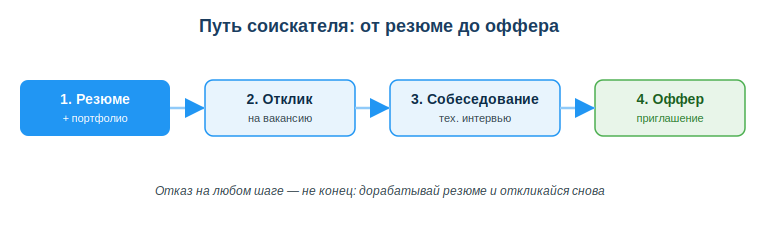
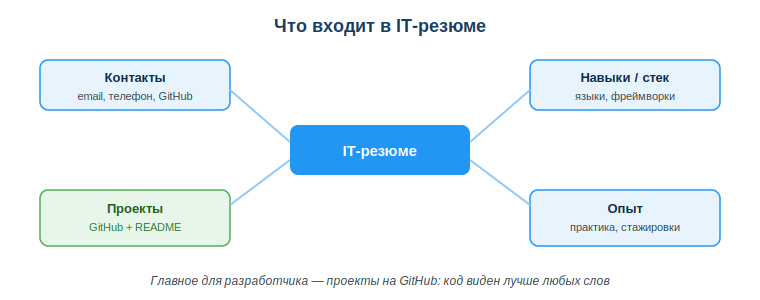

# Порталы поиска работы в ИТ (Enbek.kz, hh.kz, LinkedIn)

## Практическая ситуация

Ты заканчиваешь учиться программировать и хочешь свою первую работу или стажировку. Открываешь интернет — и теряешься: сотни вакансий, незнакомые слова «junior», «стек», «middle», требования на полстраницы. С чего начать и куда вообще отправлять резюме?

Оказывается, поиск работы в ИТ — это тоже понятный процесс с цифровыми инструментами. Есть порталы вакансий (Enbek.kz, hh.kz), мировые профессиональные сети (LinkedIn), каналы сообществ. А есть твоё цифровое резюме и портфолио на GitHub, которые работают на тебя круглосуточно. Научишься этим пользоваться — найдёшь работу быстрее.

## Что ты научишься делать

- ориентироваться в порталах поиска работы РК (Enbek.kz, hh.kz) и мировых (LinkedIn);
- читать вакансию по структуре и сопоставлять её со своими навыками;
- собирать резюме и онлайн-портфолио разработчика на GitHub;
- адаптировать отклик под конкретную вакансию.

## Почему это важно

Уметь программировать — это половина дела. Вторая половина — суметь устроиться на работу. Даже сильный разработчик без понятного резюме и портфолио рискует остаться незамеченным, а слабые отклики «вслепую» тратят время впустую. Цифровые инструменты поиска работы экономят недели.

Связь с профессией: уже на учебной практике и стажировке тебе понадобится искать вакансии, читать требования и показывать свой код. Профиль на hh.kz, аккаунт LinkedIn и проекты на GitHub — это рабочие инструменты разработчика, а не формальность. Тот, кто умеет ими пользоваться, получает приглашения на собеседования чаще.

## Учимся читать схему

Посмотри на схему «Путь соискателя» выше. Ответь на вопросы:

- с какого шага начинается путь к офферу и что нужно подготовить заранее?
- что происходит между откликом и оффером?
- почему отказ на любом шаге не означает конец поиска?

## Главное понятие

> **Портал поиска работы** — онлайн-площадка, где работодатели публикуют вакансии, а соискатели размещают резюме и откликаются на подходящие предложения.

Проще: портал — это «биржа», где встречаются те, кто ищет сотрудников, и те, кто ищет работу. В Казахстане главные площадки — государственная **Enbek.kz** и коммерческая **hh.kz**; для мирового рынка и нетворкинга — **LinkedIn**.

## Где искать работу в ИТ

| Портал | Особенность |
|---|---|
| Enbek.kz | государственная электронная биржа труда РК |
| hh.kz | крупнейший портал вакансий в РК |
| LinkedIn | мировая профессиональная сеть, нетворкинг |
| GitHub / Telegram-каналы | вакансии напрямую от компаний и сообществ |

Начни с Enbek.kz и hh.kz — там много вакансий по РК, включая junior-позиции. LinkedIn пригодится для общения с коллегами и поиска в международных компаниях. А в Telegram-каналах ИТ-сообществ и на GitHub часто появляются вакансии напрямую, без посредников.

## Как читать вакансию

В описании вакансии ищи четыре блока:

- **обязанности** — что предстоит делать;
- **требования** — что нужно знать и уметь;
- **стек** — конкретные технологии (языки, фреймворки, базы данных);
- **уровень** — junior / middle / senior.

Сопоставь вакансию со своими навыками: что у тебя уже есть, а что нужно подтянуть. Для первой работы выбирай позиции уровня junior — там не ждут большого опыта.

## Резюме и портфолио разработчика

- **Резюме:** коротко (1–2 страницы), по делу — навыки/стек, проекты со ссылками, опыт, контакты.
- **Портфолио:** твои проекты на **GitHub** с README — код виден лучше любых слов.
- **Профиль LinkedIn:** фото, должность-цель, навыки, ссылки на проекты.

Главное отличие IT-резюме от обычного — упор на проекты и стек, а не на красивые общие фразы. Работодатель хочет увидеть твой код.

### Мини-кейс
Студент откликнулся на 50 вакансий одним и тем же резюме без проектов — ни одного ответа. Следующий шаг: добавить 2–3 проекта на GitHub с README и адаптировать резюме под конкретные вакансии (выделить нужный стек, убрать лишнее). После этого пошли первые приглашения на собеседования.

## Разбор типичной ошибки

**Ошибка.** Рассылать одно и то же резюме без проектов на все вакансии подряд, не читая требования.

**Почему это ошибка.** Работодателю не видно, что ты умеешь: нет ссылок на код, нет совпадения со стеком вакансии. Такие отклики теряются среди сотен других, а ты тратишь время на неподходящие позиции.

**Как правильно.** Приложи GitHub с проектами и README, сопоставляй стек вакансии со своими навыками и адаптируй резюме под каждую конкретную вакансию — выделяй то, что нужно именно этому работодателю.

## Практика

Ответь письменно:

1. Открой hh.kz или Enbek.kz, найди вакансию junior-разработчика и выпиши из неё четыре блока: обязанности, требования, стек, уровень.
2. Составь список из 4–6 пунктов, что положишь в своё IT-резюме (контакты, навыки/стек, проекты, опыт), и укажи, какой проект разместишь на GitHub.

**Образец (часть ответа на пункт 1):** «Стек: Python, Django, PostgreSQL. Требования: знание ООП, базовый SQL, Git. Уровень: junior. Обязанности: дорабатывать модули backend под руководством наставника».

## Самопроверка

- Я знаю порталы поиска работы РК (Enbek.kz, hh.kz) и мировые (LinkedIn) и понимаю, чем они отличаются.
- Я умею читать вакансию по структуре: обязанности, требования, стек, уровень.
- Я знаю, что входит в IT-резюме и почему проекты на GitHub важнее общих фраз.

## Подумай

- Какие 2–3 проекта ты мог бы разместить на GitHub уже сейчас, чтобы усилить своё будущее резюме?
- Почему адаптировать резюме под конкретную вакансию выгоднее, чем рассылать одно и то же всем сразу?

## Итог

- Используй Enbek.kz, hh.kz, LinkedIn и каналы ИТ-сообществ.
- Читай вакансию по структуре: обязанности, требования, стек, уровень.
- Собери резюме (кратко, 1–2 стр.) и портфолио на GitHub с README.
- Адаптируй отклик под конкретную вакансию — это повышает шансы.

## Полезные ссылки

- [Enbek.kz — электронная биржа труда РК](https://www.enbek.kz)
- [hh.kz — поиск работы](https://hh.kz)
- [LinkedIn](https://www.linkedin.com)
- [GitHub — размещение портфолио кода](https://github.com)

---

*Источник: ГОСО ТиПО (приказ МП РК); официальные порталы Enbek.kz, hh.kz, LinkedIn; DigComp 2.2 (цифровые компетенции для трудоустройства).*

*Материал разработан рабочей группой ТОО «Колледж Хекслет Казахстан» и одобрен к использованию в обучении решением Педагогического совета.*
