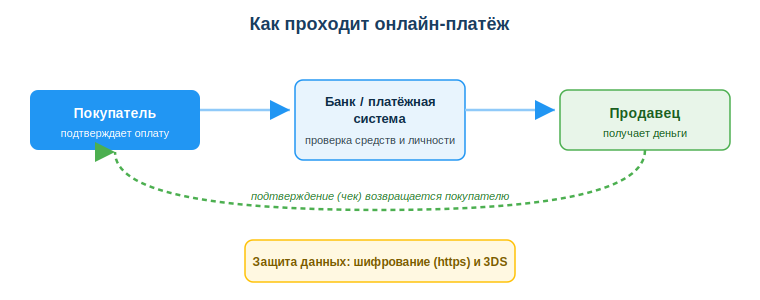
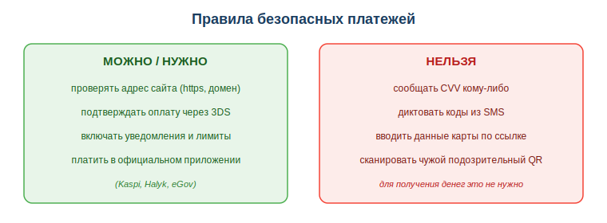

# Использовать электронные платежи и онлайн-банкинг (Kaspi, Halyk, QR)

## Практическая ситуация

Ты продаёшь старый ноутбук на OLX. Через час пишет «покупатель»: «Готов оплатить, скинь номер карты, срок, CVV и код, который придёт в SMS — иначе перевод не уйдёт». Звучит логично? На самом деле нет: для получения денег чужие данные карты и коды не нужны вообще. Если ты их продиктуешь — деньги уйдут не к тебе, а с твоего счёта.

Казахстан — одна из самых «безналичных» стран: оплата картой, переводы по номеру телефона, QR на кассе. Разработчику это близко вдвойне: как пользователю — каждый день, как профессионалу — потому что платежи интегрируют в приложения и магазины. Этот урок — про то, как безопасно платить онлайн и понимать, как устроен электронный платёж.

## Что ты научишься делать

- безопасно пользоваться онлайн-банкингом и QR-платежами;
- объяснять, как в общих чертах проходит электронный платёж;
- распознавать мошенничество с платежами;
- настраивать базовую защиту банковского приложения (уведомления, лимиты, 3DS).

## Почему это важно

Деньги сегодня двигаются онлайн, и ошибка в платеже стоит дороже многих других: её часто нельзя «откатить». Один продиктованный код из SMS — и счёт пуст. Поэтому понимать, как устроен платёж и где именно подстерегает мошенник, — навык на каждый день.

Связь с профессией: разработчик не «переписывает деньги вручную» — он подключает к приложению **платёжный шлюз/API** банка. Чтобы делать это правильно, нужно понимать поток платежа и требования безопасности (https, 3DS, защита данных карты). Это фундамент, на котором строятся профильные модули по интеграции платежей.

## Учимся читать схему

Посмотри на схему «Как проходит онлайн-платёж» выше. Ответь на вопросы:

- кто участвует в платеже и в каком порядке движутся деньги?
- на каком этапе банк проверяет средства и личность плательщика?
- что возвращается покупателю в конце и зачем нужна «защита данных» снизу схемы?

## Главное понятие

> **Электронный платёж** — перевод денег в безналичной форме через банк или платёжную систему, который покупатель подтверждает онлайн (картой, по номеру телефона или QR-кодом), а получатель видит зачисление и чек.

Проще: ты подтверждаешь оплату в приложении, банк проверяет деньги и личность, продавец получает зачисление, а тебе приходит чек. Наличные при этом не нужны — всё происходит между счетами.

## Виды электронных платежей

- **Оплата картой** (онлайн и офлайн, в том числе бесконтактно);
- **Перевод по номеру телефона** (Kaspi, Halyk);
- **QR-платёж:** сканируешь код — оплачиваешь;
- **Оплата услуг** (ЖКХ, штрафы, налоги) в приложении банка или на eGov.

## Как примерно проходит платёж

1. Ты подтверждаешь оплату в приложении.
2. Банк проверяет средства и личность (PIN / биометрия / код / 3DS).
3. Деньги списываются и зачисляются получателю.
4. Приходит подтверждение (чек).

Для разработчика: интеграция платежей в приложение делается через **платёжный шлюз/API** банка, а не «вручную» — детали изучают в профильных модулях.

## Безопасность платежей

Самое уязвимое место платежа — не техника, а человек. Мошенник почти всегда пытается выманить данные карты и коды. Держи правила перед глазами.

- Плати только на **официальных** сайтах и в приложениях (проверяй домен и https).
- Никому не сообщай **CVV, коды из SMS, полный номер карты**.
- Подтверждай онлайн-оплату через **3DS** (код подтверждения от банка) — не отключай его.
- Включи **уведомления** об операциях и **лимиты**.
- Осторожно с QR: не сканируй коды из подозрительных мест.

### Мини-кейс
«Покупателю» на OLX продавец прислал ссылку «для получения оплаты», где просят ввести данные карты и код из SMS. Это мошенничество: для получения денег данные карты не нужны. Правильный следующий шаг: не вводить данные и получать оплату только переводом на свой счёт по номеру карты или телефона.

## Разбор типичной ошибки

**Ошибка.** Ввести CVV и код из SMS, «чтобы получить перевод».

**Почему это ошибка.** Для получения денег это не требуется. CVV и код из SMS — ключи к списанию, а не к зачислению; продиктовав их, ты разрешаешь мошеннику снять деньги с твоего счёта.

**Как правильно.** Для получения достаточно номера карты или телефона. Коды из SMS и CVV не давать никому — даже «менеджеру банка» по телефону.

## Практика

Ответь письменно:

1. Опиши по шагам, как проходит онлайн-платёж (от подтверждения до чека), и укажи, где банк проверяет личность.
2. Перечисли минимум три правила безопасных платежей и поясни, почему нельзя сообщать код из SMS.

**Образец (часть ответа на пункт 2):** «Проверять адрес сайта (https и правильный домен), не сообщать CVV и коды из SMS, включить уведомления и лимиты. Код из SMS подтверждает списание, поэтому, продиктовав его, ты разрешаешь чужую операцию по своей карте».

## Самопроверка

- Я могу объяснить, как проходит электронный платёж и кто в нём участвует.
- Я знаю, какие данные нельзя сообщать никому (CVV, коды из SMS, полный номер карты).
- Я умею проверить, что плачу на официальном сайте, и включить защиту (3DS, уведомления, лимиты).

## Подумай

- Какие платежи ты совершаешь онлайн чаще всего и где в этой цепочке тебя проще всего обмануть?
- Как разработчику стоит думать о безопасности, когда он подключает платёжный API к приложению?

## Итог

- Электронный платёж идёт по цепочке: покупатель → банк/платёжная система → продавец, и завершается чеком.
- Используй онлайн-банкинг и QR, но проверяй официальность сервиса (домен, https).
- Никогда не сообщай CVV и коды из SMS; для получения денег они не нужны.
- Включи уведомления, лимиты и 3DS — это базовая защита.

## Полезные ссылки

- [Что такое CVV и почему его нельзя сообщать (объяснение)](https://www.kaspersky.ru/resource-center/definitions/what-is-cvv)
- [Безопасные онлайн-платежи (рекомендации)](https://www.kaspersky.ru/resource-center/threats/online-payment-security)
- [Портал eGov.kz — оплаты услуг](https://egov.kz)

---

*Источник: ГОСО ТиПО (рамка содержания); материалы по безопасности электронных платежей; портал eGov.kz (оплаты услуг).*

*Разработал: преподаватель ИКТ, магистр управления и информационной безопасности Калиаскаров Д.А.*

*Материал одобрен к использованию в обучении решением Педагогического совета ТОО «Колледж Хекслет Казахстан».*
