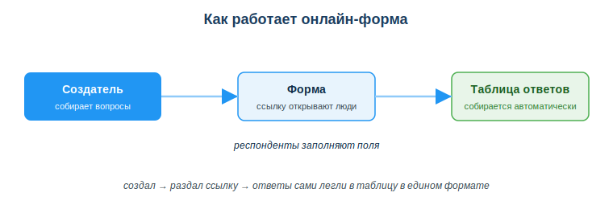
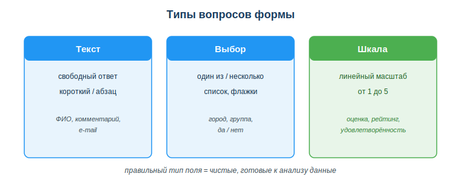

# Работать с интерактивными формами и сервисами совместной работы

## Практическая ситуация

Староста просит группу скинуть данные для справки: ФИО, номер группы, телефон. Кто-то пишет в чат, кто-то в личку, кто-то с ошибкой в формате. К концу дня половина сообщений потерялась, а собрать всё в одну таблицу — отдельная мука.

А можно иначе: за пять минут собрать онлайн-форму, раздать одну ссылку — и ответы сами лягут в таблицу в едином формате. Тебе как будущему разработчику такие сервисы нужны вдвойне: и чтобы работать в команде, и чтобы понимать, как устроены продукты, которые ты будешь создавать.

## Что ты научишься делать

- создавать онлайн-формы и опросы для сбора данных;
- выбирать правильный тип вопроса (текст, выбор, шкала) под задачу;
- организовывать командную работу: доски задач, общие документы, чат;
- соблюдать приватность и минимизировать сбор персональных данных.

## Почему это важно

Готовые интерактивные сервисы экономят часы рутины: не нужно писать код, чтобы собрать опрос, спланировать спринт или вести общий документ. Один раз настроил форму — и данные собираются сами, без ручного переписывания.

Связь с профессией: разработчик почти не работает в одиночку. Командные доски задач, общие документы и чаты — это его ежедневная среда. А ещё формы и опросы — это тот самый сбор требований и обратной связи от пользователей, без которого не построить нормальный продукт.

## Учимся читать схему

Посмотри на схему «Как работает онлайн-форма» выше и ответь на вопросы:

- что делает создатель формы и что получают остальные участники?
- через что проходит путь от вопроса до готовой таблицы ответов?
- почему ответы оказываются в едином формате, а не вразнобой, как в чате?

## Главное понятие

> **Онлайн-форма** — интерактивный сервис (Google Forms, МойОфис Формы), который по одной ссылке собирает ответы многих людей и автоматически складывает их в таблицу в едином формате.

Проще: ты один раз описываешь вопросы, а сервис сам принимает ответы и наводит порядок. Применение: опросы, регистрация на события, тесты, сбор обратной связи.

## Формы и опросы

Сила формы — в правильно подобранных типах вопросов. Каждому типу — своя задача:

- **текст** — свободный ответ (ФИО, комментарий, e-mail);
- **выбор** — один из вариантов или несколько (группа, город, «да/нет»);
- **шкала** (линейный масштаб) — оценка от 1 до 5 (рейтинг, удовлетворённость).

Хорошая форма: понятные вопросы, правильные типы полей, помечены обязательные поля и **не запрашивает лишних персональных данных**. Чем точнее тип поля, тем чище данные на выходе — их сразу можно анализировать.

## Сервисы совместной работы

Форма решает сбор данных. Но команде нужно ещё планировать, писать документы и общаться. Под каждую задачу — свой сервис:

| Тип | Примеры | Для чего |
|---|---|---|
| Доски задач | Trello, kanban в таблице | планирование, спринты |
| Общие документы | Google Docs/Sheets | совместное редактирование |
| Мессенджеры/звонки | Telegram, видеоконференции | коммуникация команды |
| Дизайн-доски | Miro, FigJam | схемы, мозгоштурм |

Команде нужны правила: где обсуждаем (чат), где задачи (доска), где документы (облако). Это убирает хаос «всё в личке», когда информация теряется и нет прозрачности.

### Мини-кейс
Староста собирал данные группы для справки через сообщения в чате — половина потерялась, формат у всех разный. Следующий шаг: создать Google-форму с полями ФИО (текст), группа (выбор), оценка организации (шкала). Ответы сами соберутся в таблицу в едином формате, и справку можно делать сразу из неё.

## Разбор типичной ошибки

**Ошибка.** Собирать в форме лишние персональные данные «на всякий случай» — например, ИИН и адрес, когда нужны только ФИО и e-mail.

**Почему это ошибка.** Это нарушает принцип минимизации данных и повышает риск утечки: чем больше лишнего ты хранишь, тем выше цена ошибки.

**Как правильно.** Запрашивать только необходимое для конкретной задачи и заранее сообщить респондентам цель сбора.

## Практика

Ответь письменно:

1. Тебе нужно записать одногруппников на хакатон. Перечисли 4 поля формы и укажи тип каждого (текст / выбор / шкала). Объясни, почему такой тип.
2. Команда из 4 человек начинает проект. Распиши, где вы ведёте задачи, где документы и где общаетесь, и почему именно так.

**Образец (часть ответа на пункт 1):** «ФИО — текст (свободный ответ); группа — выбор (список фиксированных вариантов, чтобы не было разнобоя); готовность к ночному кодингу — шкала 1–5 (удобно сравнивать); e-mail — текст».

## Самопроверка

- Я умею создать онлайн-форму и выбрать правильный тип поля под вопрос.
- Я знаю, какой сервис совместной работы взять под задачу (доска / документ / чат).
- Я понимаю принцип минимизации данных и зачем указывать цель сбора.

## Подумай

- Какой сбор данных в твоей учёбе или подработке можно перевести с чата на форму? Что это упростит?
- Почему «всё в личке» удобно сегодня, но вредит команде через месяц работы над проектом?

## Итог

- Для сбора данных используй онлайн-формы — ответы попадают в таблицу автоматически и в едином формате.
- Выбирай тип вопроса под задачу: текст, выбор или шкала.
- Организуй командную работу: доска задач + общие документы + чат, с понятными правилами.
- Запрашивай только необходимые данные и сообщай цель сбора.

## Полезные ссылки

- [Google Формы — справка](https://support.google.com/docs/answer/6281888)
- [Trello — как начать (доски задач)](https://trello.com/guide)
- [Совместная работа в Google Документах](https://support.google.com/docs/answer/2494822)

---

*Источник: ГОСО ТиПО (приказ МП РК); рамка цифровых компетенций DigComp 2.2; официальная документация Google Forms/Docs и Trello.*

*Материал разработан рабочей группой ТОО «Колледж Хекслет Казахстан» и одобрен к использованию в обучении решением Педагогического совета.*
