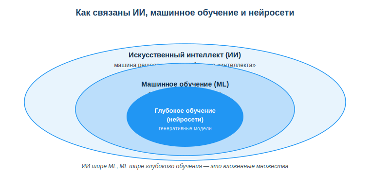
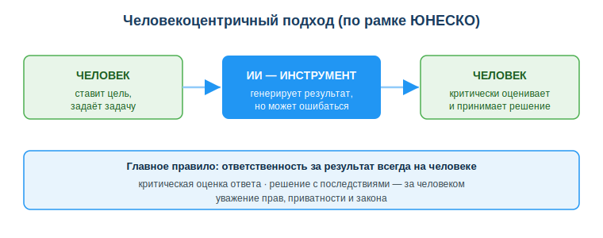

# Введение в ИИ, машинное обучение и человекоцентричный подход к ИИ

## Практическая ситуация

Ты пишешь код и просишь ИИ-ассистента подсказать функцию. Он уверенно «называет» метод библиотеки — ты вставляешь его, запускаешь, а код падает: такого метода вообще нет. ИИ не соврал нарочно — он просто предсказал «правдоподобное» продолжение. Это и есть галлюцинация.

«Искусственный интеллект» сегодня везде: в поиске, переводчике, ленте соцсетей, в ассистенте, который пишет код. Но что это на самом деле, чем ИИ отличается от обычной программы и почему он иногда «уверенно врёт»? Этот урок открывает раздел про ИИ и задаёт главную рамку: ИИ — мощный инструмент, но ответственность за результат всегда на человеке.

## Что ты научишься делать

- объяснять простыми словами, что такое ИИ и машинное обучение;
- отличать обычную программу от системы на машинном обучении;
- распознавать галлюцинации генеративного ИИ и проверять его ответы;
- применять человекоцентричный подход при работе с ИИ.

## Почему это важно

ИИ перестал быть «технологией будущего» — он уже встроен в инструменты, которыми ты пользуешься каждый день. Понимать, как он устроен и где ошибается, — это базовая цифровая грамотность, а не узкая специализация.

Связь с профессией: разработчик всё чаще пишет код вместе с ИИ-ассистентом. Чтобы не тащить в проект несуществующие функции и чужие ошибки, нужно понимать ограничения ИИ и проверять его ответы по документации. Это превращает ИИ из источника багов в реальное ускорение работы.

## Учимся читать схему

Посмотри на схему вложенности выше. Ответь на вопросы:

- какое понятие самое широкое, а какое — самое узкое?
- машинное обучение — это часть ИИ или наоборот?
- к какому из трёх кругов относятся современные генеративные модели?

## Главное понятие

> **Машинное обучение (ML)** — подход, при котором программа учится на данных и сама находит закономерности, а не работает по заранее прописанным правилам «если — то».

Проще: обычной программе правила пишет программист, а модель ML «выводит» правила сама из множества примеров.

## ИИ, машинное обучение, нейросети

- **Искусственный интеллект (ИИ)** — способность машины выполнять задачи, требующие «интеллекта»: понимать речь, распознавать образы, принимать решения.
- **Машинное обучение (ML)** — подход, при котором программа **учится на данных**, а не работает по жёстко прописанным правилам.
- **Нейросети (глубокое обучение)** — один из методов ML, вдохновлённый строением мозга; на них работают современные генеративные модели.

### Обычная программа vs ML
- Обычная: «если X, то Y» — правила пишет программист.
- ML: показываем много примеров → модель сама находит закономерности.

Пример: чтобы отличить спам, не пишут тысячи правил — обучают модель на размеченных письмах.

## Генеративный ИИ

Современные модели (ChatGPT, Copilot, Gemini) **генерируют** текст, код, изображения. Они предсказывают «что обычно идёт дальше» на основе обучающих данных. Отсюда сила (быстро создаёт) и слабость — **галлюцинации**: модель уверенно выдаёт фактически неверное.

## Человекоцентричный подход

ИИ — инструмент усиления человека, а не замена ответственности. Принципы (по рамке ЮНЕСКО):

- человек **критически оценивает** результат ИИ;
- решения с последствиями принимает **человек**;
- использование ИИ уважает **права, приватность и закон**.

### Мини-кейс
Студент спросил ИИ, и тот «назвал» функцию, которой нет в библиотеке. Код не запустился. Причина: галлюцинация. Следующий шаг: проверять ответы ИИ по документации, а не принимать на веру.

## Разбор типичной ошибки

**Ошибка.** Считать ИИ «всезнающим разумом», который всегда прав, и переложить на него ответственность за решение.

**Почему это ошибка.** Генеративный ИИ — это статистическая модель предсказания: она не «понимает» смысл и регулярно ошибается (галлюцинации). Отвечает за результат человек, а не инструмент.

**Как правильно.** Относись к ИИ как к быстрому, но неточному помощнику: проверяй ответы по документации, а решения с последствиями принимай и проверяй сам.

## Практика

Ответь письменно:

1. Объясни на примере фильтра спама разницу «правила vs обучение на данных».
2. Опиши своими словами, что такое галлюцинация ИИ, и приведи пример из разработки.

**Образец (часть ответа на пункт 1):** «Вместо того чтобы вручную писать тысячи правил вида „если в письме слово ‘выигрыш’ — это спам“, модели показывают много размеченных писем (спам / не спам), и она сама находит признаки спама».

## Самопроверка

- Я могу объяснить разницу между обычной программой и системой на ML.
- Я знаю, что такое галлюцинация генеративного ИИ и почему она возникает.
- Я понимаю принцип человекоцентричного подхода и где лежит ответственность.

## Подумай

- В каких сервисах, которыми ты пользуешься каждый день, уже работает ИИ? Что он там делает?
- Почему опасно сдавать код или текст от ИИ без проверки — и чем это грозит именно в профессии разработчика?

## Итог

- Различай: обычная программа работает по правилам, ML учится на данных.
- ИИ ⊃ машинное обучение ⊃ глубокое обучение (нейросети) — это вложенные понятия.
- Помни про галлюцинации генеративного ИИ — всегда проверяй результат.
- Используй ИИ как усилитель, ответственность оставляй за собой; уважай приватность и закон.

## Полезные ссылки

- [UNESCO — Рамка ИИ-компетенций для учащихся](https://www.unesco.org/en/articles/ai-competency-framework-students)
- [Что такое машинное обучение (Google, базовое объяснение)](https://developers.google.com/machine-learning/intro-to-ml)
- [Введение в ИИ (обзорные материалы)](https://ru.wikipedia.org/wiki/Искусственный_интеллект)

---

*Источник: материалы по применению ИИ и цифровой грамотности (DigComp 2.2; UNESCO AI Competency Framework, 2024); обзорные публикации по ИИ и машинному обучению.*

*Материал разработан рабочей группой ТОО «Колледж Хекслет Казахстан» и одобрен к использованию в обучении решением Педагогического совета.*
