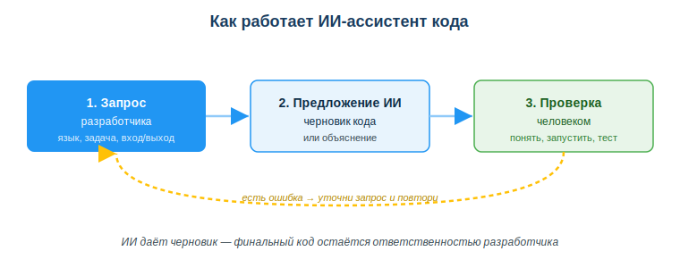
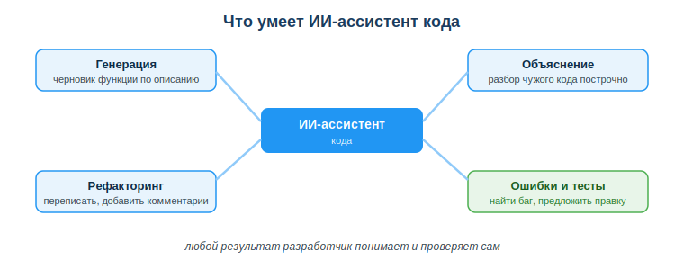

# Использовать ИИ-ассистенты (ChatGPT/Copilot/Gemini) для генерации и объяснения кода

## Практическая ситуация

Тебе дали задачу: написать функцию, которая считает сумму чётных чисел из списка. Ты открываешь ИИ-ассистента (ChatGPT, GitHub Copilot, Gemini), описываешь задачу — и через секунду получаешь готовый черновик. Кажется, что работа сделана: остаётся скопировать и сдать.

Но именно здесь начинается настоящая работа разработчика. ИИ дал черновик, а отвечаешь за код ты. Если не понять и не проверить ответ, можно сдать функцию, которая падает при делении на ноль или утекает чужие данные. Этот урок — про то, как сделать ИИ-ассистента помощником, а не источником багов.

## Что ты научишься делать

- использовать ИИ-ассистента для генерации и объяснения кода;
- формулировать запрос так, чтобы получить полезный ответ;
- критически проверять и тестировать сгенерированный код;
- не передавать ИИ секреты и персональные данные.

## Почему это важно

ИИ-ассистенты уже стали частью повседневной работы программиста: они пишут черновики функций, объясняют чужой код, подсказывают синтаксис, помогают разобрать ошибку. Это сильно ускоряет работу — но только если ты умеешь ставить задачу и проверять результат.

Связь с профессией: работодатель ценит не того, кто умеет «нажать кнопку и скопировать», а того, кто умеет **поставить ИИ точную задачу и проверить ответ**. Навык продуктивной и ответственной работы с ИИ-ассистентом сегодня — обязательная часть профессии разработчика.

## Учимся читать схему

Посмотри на схему «Как работает ИИ-ассистент кода» выше. Ответь на вопросы:

- из каких трёх шагов состоит работа с ассистентом?
- что входит в хороший запрос разработчика на первом шаге?
- что делает разработчик, если в предложении ИИ нашлась ошибка?

## Главное понятие

> **ИИ-ассистент кода** — программа на основе ИИ, которая по запросу разработчика генерирует черновик кода, объясняет код, помогает находить и исправлять ошибки; финальное решение всегда принимает и проверяет человек.

Проще: ИИ даёт **черновик**, а финальный код — твоя ответственность. Ассистент ускоряет рутину, но не отвечает за качество и безопасность твоей программы.

## Что умеет ИИ-ассистент

- **Сгенерировать** черновик функции по описанию.
- **Объяснить** незнакомый код построчно.
- **Найти и объяснить ошибку**, предложить исправление.
- **Подсказать** синтаксис, методы, примеры.
- **Переписать** код (рефакторинг), добавить комментарии и тесты.

## Как формулировать запрос

Чем точнее запрос — тем лучше ответ. Указывай:

- **язык и версию** (Python 3, JavaScript);
- **что нужно** (функция, которая делает …);
- **вход и выход** (на входе список чисел, на выходе сумма чётных);
- **ограничения** (без сторонних библиотек).

Плохо: «напиши код». Хорошо: «Напиши на Python функцию, которая принимает список чисел и возвращает сумму чётных; без библиотек; добавь короткие комментарии».

## Проверка сгенерированного кода

Прежде чем использовать код от ИИ:

1. **Пойми**, что делает каждая строка (можешь объяснить — значит понял).
2. **Запусти** и проверь на разных данных, включая крайние случаи.
3. **Проверь безопасность** (нет утечек, инъекций, секретов).
4. **Сверь с документацией**, если есть сомнения.

### Мини-кейс

ИИ сгенерировал функцию деления, которая падает при делении на ноль. Студент сдал её без проверки — и программа завершилась с ошибкой на первом же тесте. Как правильно: протестировать на крайних случаях (ноль, пустой ввод, отрицательные числа) и добавить обработку, прежде чем сдавать.

## Разбор типичной ошибки

**Ошибка.** Вставлять сгенерированный код в проект, не читая.

**Почему это ошибка.** В черновике от ИИ могут быть скрытые баги, уязвимости и лишний код. Ты сдаёшь то, чего не понимаешь, и не сможешь это исправить или защитить.

**Как правильно.** Сначала понять код, затем протестировать (включая крайние случаи), проверить безопасность — и только потом использовать. И никогда не отправляй ИИ реальные пароли, ключи API и персональные данные: их нужно обезличивать.

## Практика

Ответь письменно:

1. Сформулируй точный запрос к ИИ для функции, которая принимает строку и возвращает количество гласных букв (укажи язык, вход/выход, ограничения).
2. Перечисли по порядку шаги проверки кода, полученного от ИИ.

**Образец (часть ответа на пункт 1):** «Напиши на Python 3 функцию, которая принимает строку и возвращает количество гласных букв (a, e, i, o, u); без сторонних библиотек; добавь короткие комментарии и пример вызова».

## Самопроверка

- Я умею сформулировать точный запрос к ИИ-ассистенту (язык, задача, вход/выход, ограничения).
- Я знаю шаги проверки сгенерированного кода: понять → запустить → крайние случаи → безопасность.
- Я понимаю, что нельзя передавать ИИ секреты и персональные данные.

## Подумай

- В каких твоих учебных задачах ИИ-ассистент уже мог бы сэкономить время, а где его ответу нельзя доверять без проверки?
- Почему за код, написанный с помощью ИИ, отвечает разработчик, а не ассистент?

## Итог

- Используй ИИ для черновика, объяснения кода и разбора ошибок.
- Формулируй точный запрос: язык, задача, вход/выход, ограничения.
- Всегда проверяй: понимание → запуск → крайние случаи → безопасность.
- Не передавай ИИ секреты и персональные данные — финальный код твоя ответственность.

## Полезные ссылки

- [GitHub Copilot — документация](https://docs.github.com/ru/copilot)
- [Документация Python (для проверки кода)](https://docs.python.org/3/)
- [OpenAI — советы по запросам (prompt) для кода](https://platform.openai.com/docs/guides/prompt-engineering)

---

*Источник: материалы по применению ИИ в разработке (DigComp 2.2; UNESCO AI Competency Framework, 2024); официальная документация GitHub Copilot, Python, OpenAI.*

*Материал разработан рабочей группой ТОО «Колледж Хекслет Казахстан» и одобрен к использованию в обучении решением Педагогического совета.*
