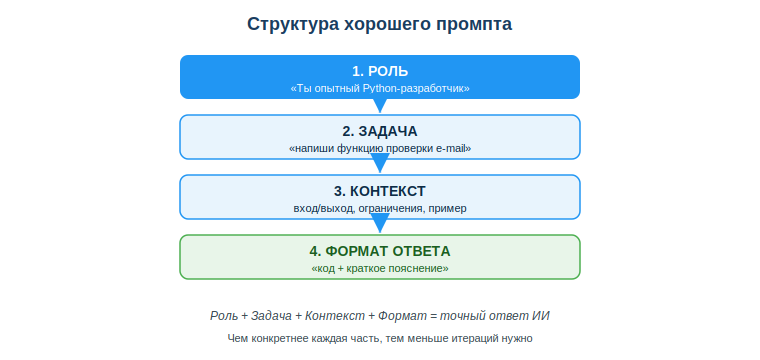
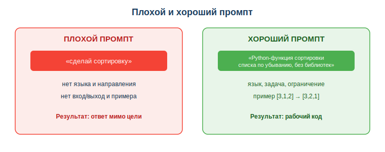

# Освоить основы промпт-инжиниринга для кодовых задач

## Практическая ситуация

Ты пишешь ИИ-ассистенту: «помоги с кодом» — и получаешь общий, бесполезный ответ. Сосед по парте пишет тому же ИИ: «Ты опытный Python-разработчик. Напиши функцию проверки e-mail: на входе строка, на выходе True/False, только стандартная библиотека, дай код и короткое пояснение» — и получает почти готовое решение.

Модель одна, разница — в **промпте** (запросе). Умение формулировать запрос так, чтобы получить качественный код, называется **промпт-инжиниринг**. Для разработчика это прямой множитель продуктивности: тот же ассистент при хорошем промпте экономит часы.

## Что ты научишься делать

- строить структурированный промпт для кодовой задачи (роль + задача + контекст + формат);
- применять приёмы: роль, контекст, примеры (few-shot), формат ответа;
- отличать плохой промпт от хорошего и переписывать первый во второй;
- итеративно улучшать промпт по полученному результату.

## Почему это важно

Сегодня разработчик почти всегда работает в паре с ИИ-ассистентом: автодополнение, генерация функций, разбор ошибок, объяснение чужого кода. Качество этой работы зависит не от модели, а от того, как ты ставишь задачу. Плохой промпт даёт правдоподобный, но неверный код, который потом дольше отлаживать, чем писать с нуля.

Связь с профессией: на собеседованиях и в реальных командах всё чаще ценят не «знание синтаксиса», а умение быстро получать рабочее решение с помощью инструментов. Промпт-инжиниринг — это и есть навык «разговаривать» с ассистентом на языке точных требований, как ты формулировал бы задачу младшему коллеге.

## Учимся читать схему

Посмотри на структуру хорошего промпта выше. Ответь на вопросы:

- из каких четырёх частей состоит хороший промпт по схеме?
- какая часть отвечает за конкретику (вход, выход, ограничения, пример)?
- почему, если каждая часть конкретна, нужно меньше итераций?

## Главное понятие

> **Промпт** — это запрос (текстовая инструкция) к ИИ-модели, по которому она формирует ответ. **Промпт-инжиниринг** — навык составлять такие запросы так, чтобы получать точный и полезный результат.

Проще: промпт — это твоё техническое задание для ИИ. Чем точнее ТЗ, тем ближе ответ к тому, что нужно. Размытый промпт — размытый ответ; точный промпт — почти готовый код.

## Анатомия хорошего промпта

Хороший промпт для кодовой задачи собирается из частей:

| Часть | Зачем | Пример |
|---|---|---|
| Роль/контекст | задать рамку и стиль | «Ты опытный Python-разработчик» |
| Задача | что нужно сделать | «напиши функцию валидации e-mail» |
| Вход/выход | конкретика данных | «на входе строка, на выходе True/False» |
| Ограничения | рамки решения | «только стандартная библиотека» |
| Формат ответа | как оформить | «код + краткое объяснение» |

## Приёмы промпт-инжиниринга

- **Конкретика вместо общего:** «функция суммы чётных чисел списка» вместо «посчитай числа».
- **Примеры (few-shot):** дай 1–2 примера вход→выход — это резко повышает точность.
- **Пошаговость:** «сначала объясни план по шагам, потом дай код» — модель реже ошибается.
- **Итерация:** не получилось — уточни запрос: добавь деталь, пример или текст ошибки.

Сравни два запроса на схеме: «сделай сортировку» против развёрнутого. Видно, что хороший промпт сам подсказывает модели язык, направление, ограничение и проверяемый пример.

### Мини-кейс

Запрос «сделай парсер» дал бесполезный ответ. Уточнённый промпт: «Напиши на Python функцию, которая из строки `имя=значение` возвращает словарь; пример: `a=1;b=2` → `{'a':'1','b':'2'}`; без сторонних библиотек» — дал рабочее решение с первого раза. Вывод на будущее: всегда добавлять хотя бы один пример вход→выход.

## Разбор типичной ошибки

**Ошибка.** Написать слишком общий промпт («помоги с кодом») и сразу принять первый ответ как готовый.

**Почему это ошибка.** Без языка, входа/выхода и ограничений модель угадывает детали — ответ почти наверняка мимо. А первый ответ часто требует одной-двух уточняющих итераций; код, принятый без проверки, ломается на крайних случаях (пустая строка, ноль, None).

**Как правильно.** Сначала собери промпт по частям: язык, задача, вход/выход, ограничения, пример. Затем прочитай ответ, уточни промпт по результату (добавь пример, опиши ошибку) и обязательно проверь код тестами.

## Практика

Ответь письменно:

1. Разбери промпт «Ты Python-разработчик. Напиши функцию подсчёта гласных в строке: вход — строка, выход — число; без сторонних библиотек; код и пояснение» на четыре части (роль, задача, контекст, формат). Что бы ты добавил для надёжности?
2. Перепиши плохой промпт «сделай функцию для дат» в структурированный промпт с примером вход→выход.

**Образец (часть ответа на пункт 1):** «Роль — "Ты Python-разработчик"; задача — "функция подсчёта гласных"; контекст — "вход строка, выход число, без библиотек"; формат — "код и пояснение". Для надёжности добавлю пример: `"окно"` → `2` и требование обработать пустую строку».

## Самопроверка

- Я умею назвать четыре части хорошего промпта и привести пример каждой.
- Я могу переписать расплывчатый промпт в структурированный с примером вход→выход.
- Я понимаю, зачем нужна итерация и почему даже хороший промпт не отменяет проверку кода.

## Подумай

- Какую свою недавнюю задачу по коду ты сформулировал бы для ИИ лучше, если бы знал про роль/контекст/формат? Что именно ты бы добавил?
- Почему в команде разработчиков умение точно ставить задачу ИИ похоже на умение ставить задачу младшему коллеге?

## Итог

- Хороший промпт собирается из частей: роль + задача + контекст (вход/выход, ограничения) + формат ответа.
- Примеры вход→выход (few-shot) — самый быстрый способ повысить качество ответа.
- Итерируй: уточняй запрос по результату, пока решение не станет рабочим.
- Даже идеальный промпт не отменяет чтение и тестирование полученного кода.

## Полезные ссылки

- [OpenAI — руководство по промпт-инжинирингу](https://platform.openai.com/docs/guides/prompt-engineering)
- [Google — введение в промптинг](https://ai.google.dev/gemini-api/docs/prompting-intro)
- [GitHub Copilot — советы по запросам](https://docs.github.com/ru/copilot/using-github-copilot/prompt-engineering-for-github-copilot)

---

*Источник: материалы по применению ИИ в разработке (DigComp 2.2; UNESCO AI Competency Framework, 2024); официальные руководства по промпт-инжинирингу (OpenAI, Google, GitHub Copilot).*

*Материал разработан рабочей группой ТОО «Колледж Хекслет Казахстан» и одобрен к использованию в обучении решением Педагогического совета.*
