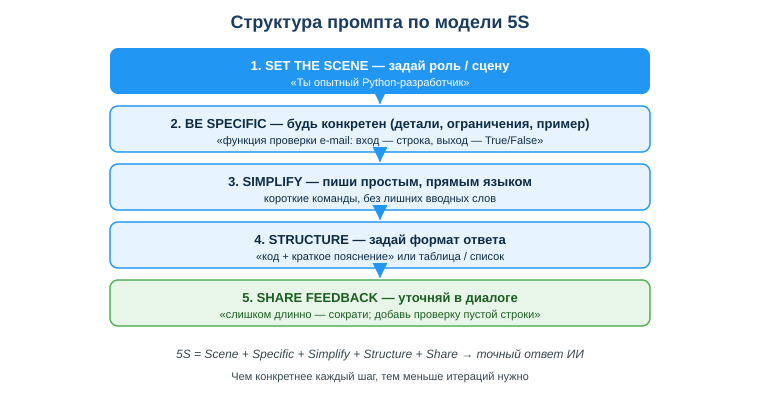

# Освоить основы промпт-инжиниринга для кодовых задач

## Практическая ситуация

Ты пишешь ИИ-ассистенту: «помоги с кодом» — и получаешь общий, бесполезный ответ. Сосед по парте пишет тому же ИИ: «Ты опытный Python-разработчик. Напиши функцию проверки e-mail: на входе строка, на выходе True/False, только стандартная библиотека, дай код и короткое пояснение» — и получает почти готовое решение.

Модель одна, разница — в **промпте** (запросе). Умение формулировать запрос так, чтобы получить качественный код, называется **промпт-инжиниринг**. Для разработчика это прямой множитель продуктивности: тот же ассистент при хорошем промпте экономит часы.

## Что ты научишься делать

- строить промпт для кодовой задачи по модели **5S** (Set the Scene → Be Specific → Simplify → Structure the Output → Share Feedback);
- применять приёмы: роль/сцену, конкретику и примеры (few-shot), простой язык, формат ответа;
- отличать плохой промпт от хорошего и переписывать первый во второй;
- давать обратную связь и итеративно улучшать промпт по полученному результату.

## Почему это важно

Сегодня разработчик почти всегда работает в паре с ИИ-ассистентом: автодополнение, генерация функций, разбор ошибок, объяснение чужого кода. Качество этой работы зависит не от модели, а от того, как ты ставишь задачу. Плохой промпт даёт правдоподобный, но неверный код, который потом дольше отлаживать, чем писать с нуля.

Связь с профессией: на собеседованиях и в реальных командах всё чаще ценят не «знание синтаксиса», а умение быстро получать рабочее решение с помощью инструментов. Промпт-инжиниринг — это и есть навык «разговаривать» с ассистентом на языке точных требований, как ты формулировал бы задачу младшему коллеге.

## Учимся читать схему

Посмотри на структуру промпта по модели 5S выше. Ответь на вопросы:

- из каких пяти шагов состоит промпт по модели 5S?
- какой шаг отвечает за конкретику (вход, выход, ограничения, пример)?
- почему, если каждый шаг конкретен, нужно меньше итераций?

## Главное понятие

> **Промпт** — это запрос (текстовая инструкция) к ИИ-модели, по которому она формирует ответ. **Промпт-инжиниринг** — навык составлять такие запросы так, чтобы получать точный и полезный результат.

Проще: промпт — это твоё техническое задание для ИИ. Чем точнее ТЗ, тем ближе ответ к тому, что нужно. Размытый промпт — размытый ответ; точный промпт — почти готовый код.

## Анатомия хорошего промпта: модель 5S

Хороший промпт для кодовой задачи собирается по модели **5S** — пять шагов, каждый шаг усиливает следующий:

| Шаг 5S | Что делает | Пример (код) |
|---|---|---|
| 1. **Set the Scene** (задай роль/сцену) | кем «быть» ИИ, рамка и стиль | «Ты опытный Python-разработчик» |
| 2. **Be Specific** (будь конкретен) | детали, вход/выход, ограничения **и пример вход→выход (few-shot)** | «функция валидации e-mail: вход — строка, выход — True/False; только стандартная библиотека; пример `user@mail.kz` → True» |
| 3. **Simplify** (упрости язык) | короткие прямые команды, без канцеляризмов и лишних вводных слов | «Напиши функцию…» вместо «Не мог бы ты, если не сложно, написать…» |
| 4. **Structure the Output** (задай формат) | как выглядит ответ | «код + краткое пояснение» / таблица / список |
| 5. **Share Feedback** (дай обратную связь) | уточняй в диалоге, итерации | «слишком длинно — сократи; добавь тест на пустую строку» |

> **Не путать:** модель 5S здесь — про запросы к ИИ; это не 5S организации рабочего места (бережливое производство).

Ключевая мысль: **пример вход→выход (few-shot)** входит в шаг **Be Specific** — не теряй его, это самый быстрый способ поднять точность. А шаг **Simplify** новый: убери из запроса «воду» («будь добр», «мне очень нужно»), оставь суть — модели важна конкретика, а не вежливость.

## Приёмы усиления

Когда пяти шагов мало (задача сложная или ответ «мимо»), добавь именованные приёмы:

- **Рассуждай шаг за шагом (Chain of Thought):** «Сначала опиши алгоритм медианы по шагам (сортировка, чёт/нечёт длины), потом дай код; учти пустой список» — модель реже пропускает крайние случаи.
- **Наводящие вопросы (reverse prompting):** «Задай мне наводящие вопросы, чтобы вместе составить план функции экспорта данных в CSV, прежде чем писать код» — ИИ сам вытянет из тебя вход/выход и ограничения.
- **Адвокат дьявола / самокритика:** «Раскритикуй свой код: найди 3 слабых места (крайние случаи, читаемость, производительность) и перепиши с их учётом» — модель находит собственные баги.

Сравни два запроса на схеме: «сделай сортировку» против развёрнутого. Видно, что хороший промпт сам подсказывает модели язык, направление, ограничение и проверяемый пример.

### Мини-кейс

Запрос «сделай парсер» дал бесполезный ответ. Уточнённый промпт: «Напиши на Python функцию, которая из строки `имя=значение` возвращает словарь; пример: `a=1;b=2` → `{'a':'1','b':'2'}`; без сторонних библиотек» — дал рабочее решение с первого раза. Вывод на будущее: всегда добавлять хотя бы один пример вход→выход.

## Разбор типичной ошибки

**Ошибка.** Написать слишком общий промпт («помоги с кодом») и сразу принять первый ответ как готовый.

**Почему это ошибка.** Без языка, входа/выхода и ограничений модель угадывает детали — ответ почти наверняка мимо. А первый ответ часто требует одной-двух уточняющих итераций; код, принятый без проверки, ломается на крайних случаях (пустая строка, ноль, None).

**Как правильно.** Сначала собери промпт по частям: язык, задача, вход/выход, ограничения, пример. Затем прочитай ответ, уточни промпт по результату (добавь пример, опиши ошибку) и обязательно проверь код тестами.

## Практика

Ответь письменно:

1. Разбери промпт «Ты Python-разработчик. Напиши функцию подсчёта гласных в строке: вход — строка, выход — число; без сторонних библиотек; код и пояснение» по пяти шагам модели 5S (Set the Scene, Be Specific, Simplify, Structure the Output, Share Feedback). Что бы ты добавил для надёжности?
2. Перепиши плохой промпт «сделай функцию для дат» по модели 5S с примером вход→выход.

**Образец (часть ответа на пункт 1):** «Set the Scene — "Ты Python-разработчик"; Be Specific — "функция подсчёта гласных, вход строка, выход число, без библиотек" + пример `"окно"` → `2`; Simplify — короткая прямая команда без лишних слов; Structure the Output — "код и пояснение"; Share Feedback — если модель не учтёт пустую строку, уточню: "добавь обработку `""` → `0`"».

## Самопроверка

- Я умею назвать пять шагов модели 5S (Set the Scene, Be Specific, Simplify, Structure the Output, Share Feedback) и привести пример каждого.
- Я могу переписать расплывчатый промпт по модели 5S с примером вход→выход.
- Я понимаю: мусор на входе — мусор на выходе, поэтому «проверка» здесь означает уточнить и переформулировать сам промпт по шагам 5S (сцена, конкретика, простой язык, формат, обратная связь), а не просто перезапросить.

## Подумай

- Какую свою недавнюю задачу по коду ты сформулировал бы для ИИ лучше по модели 5S? Что именно ты бы добавил на шагах Be Specific и Structure the Output?
- Почему в команде разработчиков умение точно ставить задачу ИИ похоже на умение ставить задачу младшему коллеге?

## Итог

- Хороший промпт собирается по модели 5S: Set the Scene → Be Specific → Simplify → Structure the Output → Share Feedback.
- Примеры вход→выход (few-shot) на шаге Be Specific — самый быстрый способ повысить качество ответа.
- Приёмы усиления: рассуждай шаг за шагом (Chain of Thought), наводящие вопросы (reverse prompting), самокритика («адвокат дьявола»).
- Итерируй через Share Feedback: уточняй запрос по результату, пока решение не станет рабочим.
- Качество ответа зависит от качества запроса: мусор на входе — мусор на выходе, поэтому «проверка» в этой теме — это уточнить и переформулировать промпт, а не переспросить то же самое.

## Полезные ссылки

- [OpenAI — руководство по промпт-инжинирингу](https://platform.openai.com/docs/guides/prompt-engineering)
- [Google — введение в промптинг](https://ai.google.dev/gemini-api/docs/prompting-intro)
- [GitHub Copilot — советы по запросам](https://docs.github.com/ru/copilot/using-github-copilot/prompt-engineering-for-github-copilot)

---

*Источник: материалы по применению ИИ в разработке (DigComp 2.2; UNESCO AI Competency Framework, 2024); официальные руководства по промпт-инжинирингу (OpenAI, Google, GitHub Copilot).*

*Разработал: преподаватель ИКТ, магистр управления и информационной безопасности Калиаскаров Д.А.*

*Материал одобрен к использованию в обучении решением Педагогического совета ТОО «Колледж Хекслет Казахстан».*
