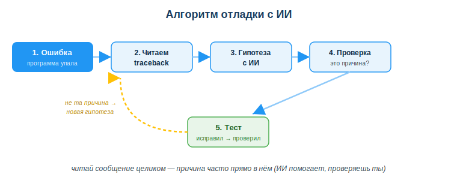
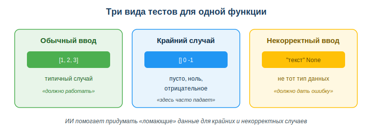

# Применять ИИ для отладки и тестирования кода

## Практическая ситуация

Ты дописал функцию, запускаешь — и программа падает с красным сообщением на пол-экрана. Раньше в таком случае начинают менять строки наугад: «а вдруг заработает». Время уходит, причина непонятна, а баг возвращается в другом месте.

Сегодня рядом есть ИИ-ассистент. Он умеет прочитать сообщение об ошибке, объяснить его простыми словами и подсказать вероятную причину, а ещё — придумать тесты, на которых код сломается. Но решение принимаешь и проверяешь ты. Этот урок — про то, как отлаживать и тестировать код вместе с ИИ, не теряя контроль.

## Что ты научишься делать

- читать сообщение об ошибке (traceback) и находить в нём подсказку;
- формулировать запрос к ИИ, чтобы он объяснил ошибку и предложил причину;
- проверять гипотезу ИИ, а не чинить код «методом тыка»;
- придумывать с ИИ набор тестов: обычные, крайние и некорректные случаи.

## Почему это важно

Код почти никогда не работает с первого раза. Большую часть рабочего времени разработчик не пишет новый код, а **ищет и исправляет ошибки** в уже написанном. Кто умеет быстро находить причину бага и закрывать его тестом — экономит часы и не выпускает в продакшн поломанную программу.

Связь с профессией: отладка и тестирование — это ежедневная работа разработчика ПО. ИИ ускоряет разбор ошибок и генерацию тестов, но ответственность за качество кода остаётся на человеке. Умение работать с ИИ как с помощником, а не как с «оракулом», которому слепо верят, — ключевой профессиональный навык.

## Учимся читать схему

Посмотри на схему «Алгоритм отладки с ИИ» выше. Ответь на вопросы:

- с чего начинается отладка — с переписывания кода или с чтения сообщения об ошибке?
- на каком шаге подключается ИИ и зачем?
- что делать, если гипотеза о причине оказалась неверной?

## Главное понятие

> **Traceback (трассировка)** — сообщение об ошибке, которое выводит программа при падении: тип ошибки, строка кода и описание. Это первая и часто главная подсказка о причине бага.

Проще: traceback — не «страшный красный текст», а карта, которая показывает, где и что сломалось. Читать её нужно целиком, особенно последние строки.

## Отладка: от ошибки к причине

Когда программа падает, она выдаёт **traceback**: тип ошибки, строку и описание. Разумный алгоритм:

1. Прочитай сообщение целиком — часто причина прямо в нём (например, `ZeroDivisionError: division by zero` — где-то делишь на ноль).
2. Если непонятно — попроси ИИ **объяснить ошибку**. Вставь текст ошибки и фрагмент кода — но без секретов: реальных паролей, ключей и персональных данных.
3. Проверь гипотезу ИИ: правда ли это причина? ИИ может ошибаться.
4. Исправь и **перепроверь** — лучше тестом.

> ИИ хорош в объяснении ошибок и идеях, но может предложить неверное или маскирующее решение — проверяй сам.

## Тестирование с ИИ

**Тест** — это код, который проверяет, что твой код работает правильно. Вместо того чтобы каждый раз запускать программу руками, ты пишешь тесты, и они проверяют код автоматически. ИИ помогает:

- предложить **набор тестов**, включая крайние случаи;
- придумать «ломающие» данные, на которых код сломается;
- объяснить, почему тест не проходит.

Хороший набор тестов проверяет три вида случаев: **обычный** (типичные данные), **крайний** (ноль, пусто, отрицательное) и **некорректный ввод** (не тот тип данных).

### Мини-кейс
Функция суммы списка работает на примере `[1, 2, 3]`, но падает на пустом списке. ИИ предложил тест с `[]` — баг обнаружен. Следующий шаг: добавить обработку пустого ввода и тест на него, чтобы баг больше не вернулся.

## Разбор типичной ошибки

**Ошибка.** Чинить код «методом тыка», не читая сообщение об ошибке, или сразу принимать «исправление» от ИИ без проверки.

**Почему это ошибка.** Меняя строки наугад, ты теряешь время и не понимаешь причину — баг возвращается. А «исправление» от ИИ может **маскировать** баг (например, обернуть всё в `try/except` и «глотать» ошибки), а не устранять его причину.

**Как правильно.** Прочитать traceback, при необходимости спросить ИИ объяснить ошибку, понять причину и проверить исправление тестами — обычными, крайними и некорректными.

## Практика

Ответь письменно:

1. Дана ошибка `ZeroDivisionError: division by zero` в строке деления. Назови причину и где её искать. Сформулируй запрос к ИИ: что вставить и что НЕ вставлять.
2. Для функции «среднее арифметическое списка» назови 4 теста, включая крайние и некорректный случаи.

**Образец (часть ответа на пункт 2):** «обычный список `[2, 4, 6]`; список из одного элемента `[5]`; пустой список `[]` (крайний — деление на ноль); нечисловой ввод `["a", "b"]` (некорректный — должна быть ошибка)».

## Самопроверка

- Я умею прочитать traceback и найти в нём тип ошибки и строку.
- Я знаю, что вставлять в запрос к ИИ об ошибке, а что нельзя (секреты, реальные данные).
- Я понимаю три вида тестов: обычный, крайний, некорректный ввод.

## Подумай

- Вспомни случай, когда ты чинил что-то «методом тыка». Как помог бы алгоритм «traceback → гипотеза → проверка»?
- Почему тест важнее, чем «я просто запустил и вроде работает»? Что тест даёт в командной работе?

## Итог

- Сначала читай сообщение об ошибке — там часто причина.
- Используй ИИ, чтобы объяснить ошибку и предложить тесты, но без секретов в запросе.
- Проверяй гипотезы и исправления ИИ — не принимай на веру.
- Покрывай код тестами: обычные, крайние и некорректные случаи.

## Полезные ссылки

- [Документация Python — обработка ошибок и отладка](https://docs.python.org/3/tutorial/errors.html)
- [Как читать traceback в Python (объяснение)](https://realpython.com/python-traceback/)
- [Введение в тестирование (pytest)](https://docs.pytest.org/en/stable/getting-started.html)

---

*Источник: официальная документация Python (раздел «Errors and Exceptions»), материалы Real Python и pytest; рамка цифровых компетенций DigComp 2.2; UNESCO AI Competency Framework, 2024.*

*Разработал: преподаватель ИКТ, магистр управления и информационной безопасности Калиаскаров Д.А.*

*Материал одобрен к использованию в обучении решением Педагогического совета ТОО «Колледж Хекслет Казахстан».*
