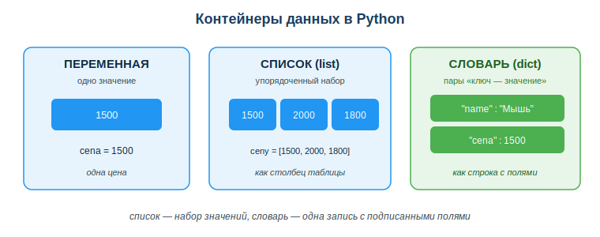
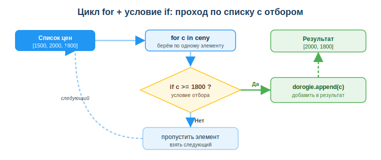

# Освоить основы Python для обработки данных

## Практическая ситуация

Тебе скинули список цен из интернет-магазина: `[1500, 2000, 1800]` — и попросили быстро ответить: на какую сумму товары, какая средняя цена, какие из них дороже 1800. Открывать калькулятор и считать вручную долго, а если цен будет не три, а три тысячи?

Именно для таких задач и нужен Python. Несколько строк кода — и компьютер сам пройдёт по всему списку, посчитает сумму, среднее и отберёт нужное. Тебе не обязательно быть гуру языка: достаточно понять несколько строительных блоков — переменную, список, словарь, цикл и условие.



## Что ты научишься делать

- хранить данные в переменных, списках и словарях;
- проходить по данным циклом `for` и отбирать нужное условием `if`;
- считать простые показатели: сумму, количество, среднее, максимум и минимум;
- понимать, какой блок кода за что отвечает, и не путать список со словарём.

## Почему это важно

Python — главный язык для работы с данными: от простого подсчёта до анализа и ИИ. Любой отчёт, любая аналитика, любая модель машинного обучения начинается с того, что данные нужно где-то хранить, прочитать, отфильтровать и свести. Эти базовые операции — фундамент, на котором держится всё остальное.

Связь с профессией: разработчик ПО постоянно обрабатывает данные — записи из базы, ответы от сервера, строки из файла. Умение выбрать правильный контейнер, пройти по нему циклом и отобрать нужное условием — это ежедневный рабочий навык, без которого не написать ни одного полезного модуля.

## Учимся читать схему

Посмотри на схему контейнеров данных выше. Ответь на вопросы:

- сколько значений хранит переменная, а сколько — список?
- чем словарь отличается от списка: как в нём находят нужное поле?
- если нужно сохранить одну запись о товаре (название и цену), какой контейнер ты выберешь?

## Главное понятие

> **Контейнер данных** — способ хранения значений в программе. Переменная хранит одно значение, список — упорядоченный набор значений, словарь — пары «ключ — значение».

Проще: переменная — одна ячейка, список — это как столбец таблицы, а словарь — как одна строка с подписанными полями. Из этих трёх контейнеров собираются почти любые данные.

## Где хранить данные

Самые частые контейнеры:

- **переменная** — одно значение: `cena = 1500`;
- **список** (`list`) — упорядоченный набор: `ceny = [1500, 2000, 1800]`;
- **словарь** (`dict`) — пары «ключ — значение»: `tovar = {"name": "Мышь", "cena": 1500}`.

К элементу списка обращаются по номеру (индексу), считая с нуля: `ceny[0]` — это `1500`. К полю словаря — по ключу: `tovar["name"]` — это `"Мышь"`.

## Проход по данным: цикл for

Чтобы что-то сделать с каждым элементом, используют **цикл** `for`:

```python
ceny = [1500, 2000, 1800]
itog = 0
for c in ceny:
    itog = itog + c
print(itog)   # 5300
```

Цикл взял каждую цену по очереди и прибавил к сумме. Так считают итоги, количество, ищут максимум.

## Отбор данных: условие if

**Условие** `if` оставляет только то, что нужно. Часто цикл и условие работают вместе: проходим по списку и отбираем подходящие элементы в новый список.

```python
ceny = [1500, 2000, 1800]
dorogie = []
for c in ceny:
    if c >= 1800:
        dorogie.append(c)
print(dorogie)   # [2000, 1800]
```



Цикл берёт элемент за элементом, условие проверяет каждый, и метод `append` добавляет подходящие в новый список. Не прошедшие проверку просто пропускаются.

## Простые показатели

Для списка чисел Python уже умеет считать всё нужное готовыми функциями:

```python
ceny = [1500, 2000, 1800]
print(sum(ceny))            # 5300 — сумма
print(len(ceny))            # 3 — количество
print(sum(ceny)/len(ceny))  # 1766.6... — среднее
print(max(ceny), min(ceny)) # 2000 1500 — максимум и минимум
```

Это и есть основа обработки данных: посчитать, отфильтровать, свести.

### Мини-кейс
Дан список оценок группы: `[4, 5, 3, 5, 2]`. Нужно найти средний балл и количество отличников (оценка 5). Средний считаем как `sum/len = 19/5 = 3.8`. Отличников находим циклом с условием `if o == 5` — увеличиваем счётчик на каждой пятёрке: их 2.

## Разбор типичной ошибки

**Ошибка.** Делить сумму на `len` без проверки пустого списка: `print(sum(spisok)/len(spisok))`.

**Почему это ошибка.** На пустом списке `len` равно нулю, получается деление на ноль — программа падает с ошибкой `ZeroDivisionError`.

**Как правильно.** Сначала проверить, что данные есть: `if len(spisok) > 0:` — и только потом считать среднее. Заодно не путай контейнеры: к списку обращаются по индексу `[0]`, к словарю — по ключу `["name"]`.

## Практика

Ответь письменно:

1. Дан список температур `[12, 18, 9, 21, 15]`. Опиши словами или кодом, как оставить только значения выше 14 и посчитать, сколько их.
2. Объясни, что выведет `sum([10, 20, 30]) / len([10, 20, 30])` и почему.

**Образец (часть ответа на пункт 1):** «Создаю пустой список `tepl = []`, прохожу циклом `for t in temp`, внутри проверяю `if t > 14` и делаю `tepl.append(t)`. В результате `[18, 21, 15]`, количество — `len(tepl) = 3`».

## Самопроверка

- Я умею выбрать контейнер под задачу: переменная, список или словарь.
- Я могу пройти по списку циклом `for` и отобрать элементы условием `if`.
- Я знаю функции `sum`, `len`, `max`, `min` и помню про проверку пустого списка.

## Подумай

- Какие данные в твоей учёбе или жизни удобно хранить списком, а какие — словарём? Приведи пример каждого.
- Почему перед делением суммы на количество важно проверить, что список не пустой? Что случится в реальной программе, если этого не сделать?

## Итог

- Выбирай контейнер по задаче: список — набор значений, словарь — запись с подписанными полями.
- Проходи данные циклом `for`, отбирай нужное условием `if`, добавляй результат через `append`.
- Считай итоги готовыми функциями: `sum`, `len`, `max`, `min`.
- Всегда проверяй пустые данные, прежде чем делить или брать элемент.

## Полезные ссылки

- [Python для начинающих — официальный учебник](https://docs.python.org/3/tutorial/index.html)
- [Списки и словари в Python (Real Python)](https://realpython.com/python-lists-tuples/)
- [Циклы и условия — основы](https://docs.python.org/3/tutorial/controlflow.html)

---

*Источник: официальная документация Python (The Python Tutorial); учебные материалы по основам программирования и обработке данных; DigComp 2.2.*

*Разработал: преподаватель ИКТ, магистр управления и информационной безопасности Калиаскаров Д.А.*

*Материал разработан рабочей группой ТОО «Колледж Хекслет Казахстан» и одобрен к использованию в обучении решением Педагогического совета.*
