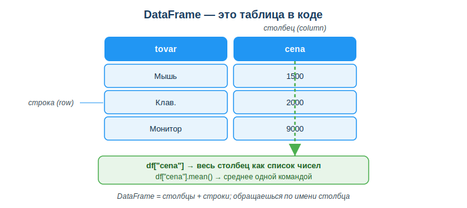
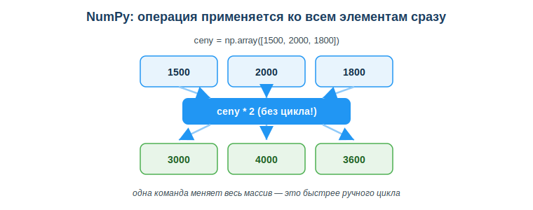

# Применять библиотеки Pandas и NumPy (загрузка, очистка, анализ)

## Практическая ситуация

Тебе скинули файл с тысячей заказов интернет-магазина и просят к завтрашнему дню: средний чек, число дорогих заказов и список товаров дороже 5000. Считать это вручную циклами `for` с `if` и `append` можно, но долго и легко ошибиться — одна опечатка, и весь отчёт неверный.

В реальной работе так не делают. Подключают готовые библиотеки: **NumPy** для быстрых расчётов над числами и **Pandas** для таблиц. С ними одна строка заменяет целый цикл, а отчёт собирается за минуты, а не за вечер.



## Что ты научишься делать

- объяснять, зачем нужны NumPy и Pandas и чем они отличаются;
- создавать NumPy-массив и считать по нему `mean()`, `sum()`;
- представлять таблицу как DataFrame и обращаться к столбцу;
- фильтровать строки таблицы по условию одной командой.

## Почему это важно

Без библиотек обработка данных превращается в длинные циклы, где легко допустить ошибку и которые медленно работают на больших объёмах. NumPy и Pandas — это базовый инструмент любого, кто работает с данными: аналитика, отчёты, подготовка данных для машинного обучения.

Связь с профессией: разработчик ПО постоянно достаёт данные из базы или файла и считает по ним показатели. Знание Pandas и NumPy — это то, что в вакансиях пишут как «обязательно», а не «будет плюсом». Эти же навыки — фундамент для анализа данных и ML.

## Учимся читать схему

Посмотри на схему DataFrame выше. Ответь на вопросы:

- где на схеме столбец, а где строка?
- что возвращает запись `df["cena"]`?
- как из одного столбца получить среднее значение одной командой?

## Главное понятие

> **DataFrame** — главный объект Pandas: таблица с именованными столбцами и строками, к каждому столбцу которой можно обратиться по имени и сразу посчитать по нему показатели.

Проще: DataFrame — это «Excel внутри кода». Ты обращаешься к столбцу по имени (`df["cena"]`), и он ведёт себя как список чисел, но с готовыми методами расчёта.

## NumPy: массивы чисел

**NumPy** — библиотека для работы с массивами чисел. Массив похож на список, но операции над ним считаются быстро и сразу над всеми элементами:

```python
import numpy as np
ceny = np.array([1500, 2000, 1800])
print(ceny.mean())   # 1766.67 — среднее
print(ceny.sum())    # 5300
print(ceny * 2)      # [3000 4000 3600] — умножили все сразу
```

NumPy — внешняя библиотека, её нет в Python по умолчанию: один раз её ставят в терминале командой `pip install numpy`, а строка `import numpy as np` подключает её в программу (и даёт короткое имя `np`). То же и для Pandas ниже — `pip install pandas`.

Не нужен цикл — `mean()`, `sum()`, умножение применяются ко всему массиву сразу. Это называется векторной операцией.



## Pandas: таблицы данных

**Pandas** работает с таблицами. Главный объект — **DataFrame** (таблица со столбцами и строками):

```python
import pandas as pd
data = {"tovar": ["Мышь", "Клав.", "Монитор"],
        "cena":  [1500, 2000, 9000]}
df = pd.DataFrame(data)
print(df["cena"].mean())   # среднее по столбцу
print(df["cena"].max())    # максимум
```

Столбец `df["cena"]` ведёт себя как список чисел, но с готовыми методами: `mean()`, `sum()`, `max()`, `min()`, `count()`.

## Фильтрация строк

Чтобы оставить только строки, удовлетворяющие условию:

```python
dorogie = df[df["cena"] >= 2000]
print(dorogie)
```

Одна строка вместо цикла с `if` и `append`. Это и есть сила Pandas: меньше кода, понятнее результат, меньше шансов ошибиться.

### Мини-кейс

В таблице 1000 заказов со столбцом `summa`. Нужно: средний чек и число заказов дороже 5000.

```python
sredniy = df["summa"].mean()
mnogo   = len(df[df["summa"] > 5000])
```

Две строки вместо длинного цикла. Вернёмся к ситуации из начала урока — задача «на вечер» решается за пару минут.

## Разбор типичной ошибки

**Ошибка.** Обратиться к столбцу с другим регистром: `df["Cena"]`, когда столбец называется `cena`.

**Почему это ошибка.** Имена столбцов в Pandas чувствительны к регистру. `"Cena"` и `"cena"` — разные имена, Pandas такого столбца не находит и выдаёт `KeyError`. Похожая беда — забыть `import pandas as pd` или `import numpy as np`: тогда Python не знает имён и выдаёт `NameError`.

**Как правильно.** Делай импорты в начале файла и проверяй точные имена столбцов через `df.columns` — копируй имя оттуда, а не пиши по памяти.

## Практика

Ответь письменно:

1. Дан массив `np.array([2, 4, 6])`. Какие значения вернут `.mean()` и `.sum()`? Объясни, почему цикл здесь не нужен.
2. Есть DataFrame `df` со столбцом `summa`. Напиши строку, которая оставит только заказы дороже 5000, и строку, которая посчитает средний `summa`.

**Образец (часть ответа на пункт 1):** «`.mean()` вернёт 4.0 (среднее), `.sum()` вернёт 12. Цикл не нужен, потому что NumPy применяет операцию сразу ко всем элементам массива — это векторная операция».

## Самопроверка

- Я умею создать NumPy-массив и посчитать по нему `mean()` и `sum()`.
- Я знаю, что DataFrame — это таблица, и умею обратиться к столбцу через `df["имя"]`.
- Я умею отфильтровать строки условием `df[df["поле"] > значение]`.

## Подумай

- Какую рутинную задачу с данными (в учёбе или подработке) ты мог бы ускорить с Pandas вместо ручного цикла?
- Почему на больших данных «одна команда над всем столбцом» надёжнее, чем цикл, который ты пишешь сам?

## Итог

- Бери NumPy для быстрых расчётов над массивами чисел — операция применяется ко всем элементам сразу.
- Бери Pandas для таблиц: DataFrame = таблица со столбцами и строками.
- Считай показатели по столбцу: `df["поле"].mean()`, `.sum()`, `.max()`.
- Фильтруй строки условием `df[df["поле"] > значение]`.
- Проверяй имена столбцов через `df.columns` и не забывай импорты.

## Полезные ссылки

- [Pandas — 10 минут до старта](https://pandas.pydata.org/docs/user_guide/10min.html)
- [NumPy для начинающих](https://numpy.org/doc/stable/user/absolute_beginners.html)
- [Pandas: знакомство с DataFrame (Real Python)](https://realpython.com/pandas-dataframe/)

---

*Источник: официальная документация Pandas (User Guide) и NumPy (Absolute Beginners); обзорные материалы по анализу данных на Python.*

*Разработал: преподаватель ИКТ, магистр управления и информационной безопасности Калиаскаров Д.А.*

*Материал одобрен к использованию в обучении решением Педагогического совета ТОО «Колледж Хекслет Казахстан».*
