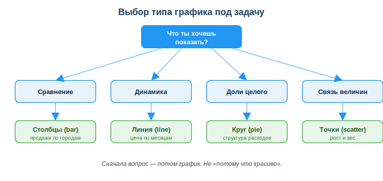
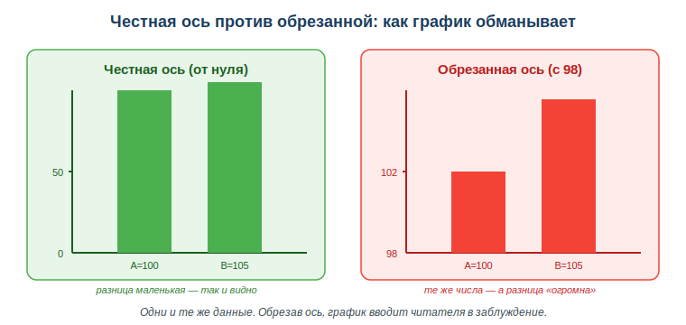

# Создавать визуализацию данных

## Практическая ситуация

Тебе прислали таблицу из тысячи строк: продажи по городам и месяцам. Заказчик спрашивает: «В каком городе дела идут лучше?». Ты вглядываешься в столбцы цифр — и не видишь ответа сразу. Глаз тонет в числах.

Ты строишь один график — и ответ виден за секунду: вот город-лидер, вот провал, вот странный выброс. Визуализация превращает числа в картинку, которую сразу понимает и заказчик, и преподаватель, и ты сам. А ещё это быстрый способ проверить данные: на графике сразу заметно, если что-то не так.



## Что ты научишься делать

- выбирать тип графика под задачу (сравнение, динамика, доли, связь);
- строить простой график по данным на Python (Matplotlib);
- читать график и подписывать заголовок и оси;
- замечать обман через обрезанную ось и не повторять его.

## Почему это важно

Глаз человека замечает на картинке то, что в таблице не видно: тренд, аномалию, соотношение. Поэтому визуализация нужна, чтобы понять данные самому (быстрая проверка), показать результат другим (отчёт, защита проекта) и найти ошибку — резкий выброс на графике часто оказывается опечаткой в данных.

Связь с профессией: разработчик постоянно работает с данными — из базы, из лога, из выгрузки. Прежде чем строить отчёт или принимать решение, эти данные надо увидеть. Умение быстро построить честный график — рабочий инструмент, а не украшение.

## Учимся читать схему

Посмотри на схему выбора графика выше. Ответь на вопросы:

- с чего начинается выбор графика — с типа диаграммы или с вопроса?
- какой график выберешь, если надо сравнить продажи трёх городов?
- какой график подойдёт, чтобы показать изменение цены по месяцам?

## Главное понятие

> **Визуализация данных** — представление чисел в виде графика или диаграммы, чтобы человек увидел в данных тренд, соотношение или аномалию быстрее, чем при чтении таблицы.

Проще: таблица отвечает на вопрос «какое точное число?», а график — на вопрос «что здесь происходит в целом?». Для быстрого понимания и для отчёта почти всегда нужен график.

## Какой график выбрать

Тип графика зависит от того, что ты хочешь показать:

- **столбчатый (bar)** — сравнить категории (продажи по городам);
- **линейный (line)** — показать изменение во времени (цена по месяцам);
- **круговой (pie)** — доли целого (структура расходов);
- **точечный (scatter)** — связь двух величин (рост и вес).

Главное правило: выбирай график под вопрос, а не «потому что красиво».

## Как построить график (на коде)

В Python чаще всего берут **Matplotlib** — простую библиотеку для графиков. Она хорошо работает в паре с Pandas:

```python
import matplotlib.pyplot as plt
goroda = ["Алматы", "Астана", "Шымкент"]
prodazhi = [120, 90, 60]
plt.bar(goroda, prodazhi)
plt.title("Продажи по городам")
plt.show()
```

Несколько строк — и данные стали понятной картинкой. ИИ-ассистент тоже помогает: можно описать словами, какой график нужен, и попросить код — но результат всё равно проверяй сам.

## Честная ось и обман картинкой

Один и тот же набор чисел можно показать честно — и можно подтасовать. Самый частый трюк: **обрезать ось значений**, чтобы начать её не с нуля. Тогда крошечная разница выглядит огромной.



Города A=100 и B=105 различаются всего на 5 %. На честной оси (от нуля) столбцы почти равны. А если начать ось с 98 — B становится «в два раза выше» A. Числа те же, вывод у читателя — противоположный. Поэтому для столбчатых графиков ось значений начинают с нуля.

### Мини-кейс
Дан рост продаж по месяцам. Столбчатый график показывает значения, но **линейный** лучше — он подчёркивает рост во времени и непрерывность. Вывод: один и тот же набор данных читается по-разному в зависимости от типа графика, поэтому выбор графика — это уже половина ответа.

## Разбор типичной ошибки

**Ошибка.** Обрезать ось значений (начать не с нуля), чтобы разница между столбцами казалась больше.

**Почему это ошибка.** Это вводит читателя в заблуждение: маленькая разница выглядит огромной, и человек делает неверный вывод по твоему графику.

**Как правильно.** Для столбчатых графиков ось значений начинать с нуля и всегда подписывать заголовок и оси, чтобы читатель понимал, что именно показано.

## Практика

Ответь письменно:

1. Подбери тип графика для трёх задач: (а) сравнить численность населения трёх городов; (б) показать курс валюты за год; (в) показать, какую долю бюджета занимают категории расходов. Объясни выбор.
2. Объясни на примере чисел A=100 и B=105, как обрезанная ось обманывает читателя и как это исправить.

**Образец (часть ответа на пункт 1):** «Сравнить население трёх городов — это сравнение категорий, значит столбчатый график (bar): три столбца, ось от нуля, подписи городов».

## Самопроверка

- Я умею выбирать тип графика под вопрос (сравнение → столбцы, динамика → линия, доли → круг).
- Я могу построить простой столбчатый график на Matplotlib и подписать заголовок.
- Я знаю, как обрезанная ось обманывает, и начинаю ось значений с нуля.

## Подумай

- Где в твоей будущей работе с данными (отчёт, выгрузка из базы, лог) график быстрее покажет проблему, чем таблица?
- Видел ли ты в новостях или рекламе график с обрезанной осью? Какой вывод он навязывал?

## Итог

- Выбирай тип графика под вопрос: сравнение → столбцы, динамика → линия, доли → круг, связь → точки.
- Строй график несколькими строками (Matplotlib) или с помощью ИИ, но проверяй результат сам.
- Всегда подписывай заголовок и оси.
- Проверяй ось: для столбцов — от нуля, иначе картинка обманет.

## Полезные ссылки

- [Matplotlib — руководство для начинающих](https://matplotlib.org/stable/users/explain/quick_start.html)
- [Pandas: построение графиков](https://pandas.pydata.org/docs/user_guide/visualization.html)
- [Как выбрать тип диаграммы (обзор)](https://www.data-to-viz.com/)

---

*Источник: официальная документация Matplotlib и Pandas; рамка цифровых компетенций DigComp 2.2 (работа с данными).*

*Материал разработан рабочей группой ТОО «Колледж Хекслет Казахстан» и одобрен к использованию в обучении решением Педагогического совета.*
