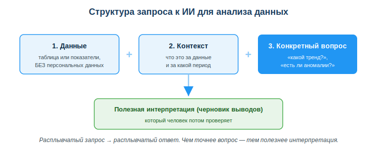
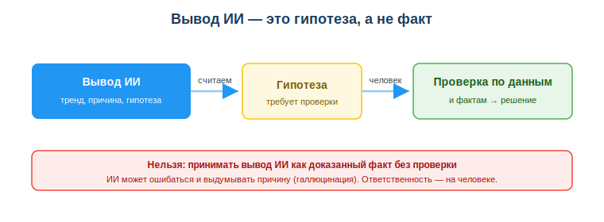

# Расширенный учебный материал по теме

## Занятие 32. Использовать ИИ для анализа и интерпретации данных

---

**Дисциплина:** Применение информационно-коммуникационных и цифровых технологий
**Результат обучения:** РО 2.3 — применение ИИ-инструментов в работе с данными и кодом · **Объём темы:** 2 часа
**Квалификация:** 4S06130103 «Разработчик программного обеспечения»

> Это расширенный разбор темы для самостоятельного изучения. Он подробнее, чем конспект урока: здесь каждый шаг работы с ИИ показан «вживую» — с реальным запросом, с тем, что ИИ реально отвечает, и с разбором ответа по числам. Читай его не как теорию «ИИ помогает с данными», а как рассказ практика о том, как из ответа ИИ сделать надёжный вывод и не подставиться — ни выдумкой ИИ, ни законом. Лучше всего — читать с калькулятором рядом и пересчитывать каждое число самому: именно этим навыком тема и держится.

---

## 1. Введение: зачем тебе эта тема

Расскажу, как это выглядит на самом деле — не в теории, а на первой рабочей задаче с данными. Тебе дают таблицу: помесячные продажи интернет-магазина за полгода. Ты честно делаешь то, чему учили в темах 29–31: считаешь среднее, медиану, строишь график. Несёшь результат руководителю — а он смотрит на цифры и спрашивает не «сколько», а совсем другое: «И что это значит? Где у нас провал? Почему он случился? Что проверить дальше и что делать?» И ты понимаешь неприятную вещь: среднее и красивый график на эти вопросы не отвечают вообще.

Дальше происходит развилка, и я видел её десятки раз. Вручную разбираться долго — надо вглядываться в каждое число, сравнивать месяцы, держать в голове десяток гипотез. И ты решаешь спросить ИИ. Вставляешь числа, пишешь «проанализируй». ИИ за минуту описывает тренд, замечает провал в марте и уверенно предлагает две причины: «сезонный спад» и «акция у конкурента». Звучит убедительно, складно, профессионально. Палец уже тянется переслать это руководителю.

Стоп. Именно здесь — та развилка, ради которой написана вся тема. Задай себе два вопроса, которых новичок не задаёт. Первый: откуда ИИ знает про акцию у конкурента? Он её видел? Нет — он её **придумал**, потому что связка «спад продаж → акция конкурента» часто встречается в текстах, на которых он обучался. Второй: а что ты вообще положил в запрос — точно ли там не было имён и телефонов реальных клиентов? Если были — ты только что отправил персональные данные посторонней компании, и это уже не «неаккуратность», а нарушение закона.

Эта тема — про то, как пройти обе развилки правильно. Анализ данных давно перестал быть занятием «аналитиков в отдельной комнате». Разработчик каждый день смотрит на данные: логи приложения, метрики производительности, результаты тестов, поведение пользователей, число ошибок в сборках. Умение быстро вытащить из этих чисел смысл — и при этом не довериться вслепую, и при этом не слить чужие данные — это прямой рабочий навык, за который платят [4; 6]. ИИ резко ускоряет этап осмысления: то, на что уходили часы, он набрасывает за минуты. Но «набрасывает» — ключевое слово. Он даёт **черновик**, а не готовый ответ. Превратить черновик в надёжный вывод — твоя работа, и научиться ей ты должен сейчас, а не на первой утечке или на первом ошибочном отчёте.

## 2. Что ты узнаешь и чему научишься

После изучения темы ты сможешь:
- объяснять, что именно ИИ умеет делать с данными на этапе их осмысления, а что — нет;
- формулировать сильный запрос для анализа по формуле «данные + контекст + конкретный вопрос»;
- относиться к любому выводу ИИ как к гипотезе и проверять его по самим данным и фактам;
- распознавать галлюцинацию ИИ в выводе о данных и опровергать её числами — своим пересчётом;
- обезличивать данные перед загрузкой в ИИ так, чтобы не нарушить Закон РК «О персональных данных и их защите»;
- применять готовый алгоритм безопасного анализа данных с помощью ИИ.

## 3. Ключевые понятия

- **Интерпретация данных** — объяснение того, что означают цифры и какой вывод из них следует (не «сколько», а «что это значит и что делать») [5].
- **Тренд** — общее направление изменения показателя во времени (рост, спад, стабильность).
- **Аномалия (выброс)** — значение, резко выпадающее из общей картины.
- **Гипотеза** — предположение о причине или закономерности, которое ещё нужно проверить.
- **Галлюцинация ИИ** — правдоподобный, но фактически неверный ответ модели; в анализе данных — выдуманная причина или ошибочный расчёт [6].
- **Контекст запроса** — пояснение, что это за данные и за какой период, без которого ИИ отвечает «в общем».
- **Персональные данные** — сведения, по которым можно опознать конкретного человека (ФИО, ИИН, телефон, адрес) [3].
- **Обезличивание** — удаление из набора данных всех признаков, по которым можно опознать человека.
- **Дата-минимизация** — принцип передавать сервису только тот минимум данных, который реально нужен для задачи.

## 4. Подробная теория

### 4.1. Что такое интерпретация и почему среднего недостаточно

Вернёмся к вопросу руководителя из введения. Между «посчитать» и «понять» лежит целый этап, который многие пропускают, а именно за него и платят. Сравни две фразы про одни и те же данные:

- «Среднемесячная выручка — 1,2 млн ₸, в марте — 0,7 млн ₸».
- «В марте выручка просела почти на 40 % относительно среднего по полугодию; это самый глубокий спад, и он не похож на обычные колебания — стоит искать конкретную причину».

Первая фраза — это **расчёт**. Вторая — **интерпретация**: она объясняет, что цифры значат и куда смотреть дальше. И заметь, откуда взялось «почти на 40 %» — это не на глаз, это пересчёт: (1,2 − 0,7) / 1,2 = 0,5 / 1,2 ≈ 0,417, то есть около 42 %, округляем осторожно вниз до «почти 40 %». Даже в интерпретации число должно быть проверяемым — иначе это не вывод, а болтовня. Ценность твоей работы с данными измеряется именно второй фразой. Заказчику, руководителю, команде нужны не числа сами по себе, а решения, которые из них следуют [5].

Интерпретация всегда отвечает на три вопроса: **что происходит** (тренд, закономерность), **что выбивается** (аномалия), **что это значит и что делать** (вывод и следующий шаг). Раньше эту работу делали медленно и вручную. Теперь ИИ умеет набросать ответ на все три вопроса за минуту — но именно набросать. Дальше начинается твоя зона ответственности, и о ней — весь остаток темы.

### 4.2. Что ИИ реально умеет с данными — и что не умеет

Чтобы пользоваться инструментом грамотно, надо точно знать его сильные и слабые стороны — не по рекламе, а по факту. У ИИ они разделены очень чётко, и граница проходит там, где кончаются числа перед тобой и начинается реальный мир, которого ИИ не видел.

**Что ИИ умеет (и делает хорошо):**

- **Объяснить показатели.** Ты спрашиваешь: «среднее выросло, а медиана упала — что это значит?» — и ИИ внятно объяснит, что, скорее всего, появились несколько очень больших значений, которые тянут среднее вверх, тогда как «типичный» случай (медиана) стал меньше. Это полезное объяснение статистики простыми словами, и тут ИИ обычно точен, потому что говорит об общем свойстве чисел, а не о твоей компании.
- **Найти закономерность.** По ряду чисел ИИ опишет тренд (растёт/падает), заметит сезонность (например, спад каждый декабрь), укажет на выброс — значение, выпадающее из общей картины. С поиском «где выбивается» он справляется хорошо: это видно прямо из данных.
- **Предложить гипотезы.** На вопрос «почему провал в марте?» ИИ выдаст список возможных причин: сезонность, технический сбой, действия конкурента, изменение цен. Это ценно как список версий для проверки — но именно версий, а не ответов.
- **Подсказать следующий шаг.** «Какой ещё срез данных посмотреть?» — и ИИ предложит разбить продажи по регионам, по дням недели, сравнить с прошлым годом. Часто дельная подсказка, куда копать.

**Чего ИИ принципиально НЕ умеет:**

- **Знать реальные внешние причины.** ИИ не был в твоей компании, не видел календарь акций, не разговаривал с отделом продаж. Когда он называет причину спада, он её **предполагает по аналогии**, а не **знает**. Это ключевое различие всей темы.
- **Гарантировать правильность расчёта.** ИИ может ошибиться в арифметике или неверно понять, какой столбец что значит, — особенно если данных много или они описаны нечётко. И — что коварно — ошибку он подаёт тем же уверенным тоном, что и правильный ответ.
- **Понимать контекст, которого ты не дал.** Если ты не сказал, что март в этом регионе — месяц массовых отпусков, ИИ этого не учтёт и спишет спад на что-нибудь другое, звучащее убедительно.
- **Нести ответственность.** За решение, принятое по выводу ИИ, отвечаешь ты, а не модель. Модель не подпишет отчёт и не ответит перед руководителем.

Вывод этого раздела простой: **ИИ силён в том, чтобы быстро сформулировать черновик осмысления, и слаб в том, чтобы гарантировать его истинность.** Ещё короче, чтобы засело: ИИ хорошо отвечает на «что происходит с числами» и плохо — на «почему это случилось в реальности». Поэтому всё, что он выдаёт про твои данные, — материал для проверки, а не готовый результат [6].

### 4.3. Как правильно спросить ИИ: формула «данные + контекст + конкретный вопрос»

Качество ответа ИИ почти полностью определяется качеством запроса. Главное правило, которое стоит повесить над столом: **расплывчатый запрос даёт расплывчатый ответ.** Если ты напишешь только «проанализируй эти числа: 120, 135, 98, 70, 150, 160», ИИ не знает, продажи это или температура за окном, за какой период и что тебе вообще нужно, — и выдаст общие слова ни о чём.

Сильный запрос для анализа состоит из трёх обязательных частей. Посмотри на схему «Структура запроса к ИИ для анализа данных» (приложение А): три синих блока слева направо — это и есть три части, а зелёный блок внизу — результат, который ты потом проверяешь.

**Часть 1 — Данные или их описание.** Сами числа (таблица, ряд значений) или их описание. Критическое требование, выделенное на схеме отдельной строкой: **БЕЗ персональных данных.** Только показатели — суммы, количества, проценты, — без имён, ID и контактов (об этом подробно в 4.6). Запомни сразу: имена ИИ для анализа чисел не нужны в принципе, он считает цифры, а не людей.

**Часть 2 — Контекст.** Что это за данные и за какой период. Без контекста ИИ отвечает «вообще», а тебе нужен ответ про твою конкретную ситуацию. «Помесячные продажи интернет-магазина за январь–июнь 2025» — это контекст. «Числа» — это не контекст.

**Часть 3 — Конкретный вопрос.** Что именно ты хочешь узнать: «какой общий тренд?», «есть ли аномалии и в каком месяце?», «назови 3 главных вывода», «какие срезы данных стоит посмотреть дополнительно?». Чем точнее вопрос, тем полезнее интерпретация. Расплывчатое «расскажи всё» — приглашение к воде.

Сравни два запроса на одних и тех же данных — разница будет наглядной.

**Плохой запрос:**
> «Проанализируй: 120, 135, 98, 70, 150, 160».

Что выйдет: ИИ напишет нечто вроде «значения колеблются, минимум — 70, максимум — 160, в целом наблюдается рост» — банально и почти бесполезно, потому что он не понял, о чём речь. Формально всё верно (70 — минимум, 160 — максимум), а пользы ноль: ни аномалии, ни причины, ни следующего шага.

**Сильный запрос:**
> «Вот помесячные продажи интернет-магазина за январь–июнь 2025 в тыс. ₸: январь — 120, февраль — 135, март — 70, апрель — 98, май — 150, июнь — 160. Данные обезличенные, без клиентов. Контекст: небольшой магазин одежды, март обычно средний месяц. Вопрос: опиши общий тренд, укажи самый аномальный месяц и предложи 2 проверяемые гипотезы, почему он выбивается».

Что выйдет: ИИ разложит тренд (спад к марту, затем устойчивый рост к июню), укажет март как аномалию (резкий провал на фоне соседей) и предложит конкретные гипотезы, которые можно проверить. Разница между двумя ответами — целиком заслуга запроса, а не «умности» модели. Одна и та же модель, одни и те же числа — а ответ полезен ровно настолько, насколько внятно ты спросил.

**Мини-чек-лист хорошего запроса:**
1. Есть числа или их понятное описание.
2. Из них убраны персональные данные.
3. Сказано, что это за данные и за какой период.
4. Задан один конкретный вопрос (а не «расскажи всё»).
5. По возможности задано, в каком виде хочешь ответ («3 вывода», «таблицей», «коротко»).

### 4.4. Вывод ИИ — это гипотеза, а не приговор

Это самое важное правило темы, ради которого стоит запомнить одну строчку: **ИИ предполагает — человек проверяет и решает.** Если из всей темы ты унесёшь только её, ты уже не совершишь главных ошибок.

Когда ИИ пишет «продажи упали в марте из-за акции конкурента», он не сообщает тебе факт. Он выдаёт **гипотезу** — правдоподобное предположение, которое нужно проверить, прежде чем оно станет выводом в отчёте. Почему так строго? Потому что у ИИ есть три способа подвести тебя именно на данных:

1. **Ошибиться в расчёте.** Неверно сложил, не так понял, какой столбец что означает, усреднил то, что усреднять бессмысленно.
2. **Не понять контекст.** Он не знает реальных обстоятельств — отпусков, ремонта, сбоя сервера, переезда склада, — поэтому объяснение может быть мимо, даже если звучит логично.
3. **Выдумать причину (галлюцинация).** Это самое коварное. ИИ генерирует **правдоподобный** текст, а не **истинный**. Если он не знает реальной причины, он не скажет «не знаю» — он сочинит причину, которая *звучит* логично. «Акция у конкурента», «сезонный спад», «изменение алгоритма поиска» — всё это может быть чистой выдумкой, поданной уверенным тоном. Уверенный тон и правота — не одно и то же; это разные вещи, и путать их дорого.

Посмотри на схему «Вывод ИИ — это гипотеза, а не факт» (приложение Б). Она читается слева направо: синий блок «Вывод ИИ» → жёлтый блок «Гипотеза (требует проверки)» → зелёный блок «Проверка по данным и фактам → решение». Под ними — красная плашка с прямым запретом: **нельзя принимать вывод ИИ как доказанный факт без проверки**, потому что ИИ может ошибаться и выдумывать, а ответственность всё равно на человеке. Запомни этот путь: вывод → гипотеза → проверка → решение. Ни один шаг нельзя пропускать.

**Как именно проверять вывод ИИ — конкретно, а не «будь внимателен»:**

- **Пересчитай ключевые числа сам.** Если ИИ говорит «спад на 40 %», проверь арифметику руками: (1,2 − 0,7) / 1,2 ≈ 0,42 — да, около 40 %, расчёт верен. А если бы у тебя вышло 15 %, это сигнал: ИИ ошибся, и остальным его числам тоже доверять нельзя. Пересчёт одного ключевого числа занимает минуту и ловит половину ошибок.
- **Проверь причину по фактам, а не по логике.** «Акция конкурента» — посмотри новости и историю рынка; «сезонный спад» — сравни с тем же месяцем прошлого года; «технический сбой» — загляни в логи. Подтверждается фактами — берёшь в отчёт. Не подтверждается — выбрасываешь, как бы складно ни звучало. Складность — не доказательство.
- **Спроси отдел или коллег.** Реальную причину провала часто знают живые люди, а не данные: «в марте две недели не работала доставка». ИИ этого знать не может в принципе — он не сидел с вами в офисе.
- **Сравни с другим срезом.** Разбей данные иначе (по дням, по регионам, по каналам) — подтверждается ли картина. Если провал есть только в одном регионе, объяснение «сезонность» рассыпается само собой.

Граница зрелого специалиста проходит не по тому, *использовал ли* он ИИ, а по тому, *проверил ли* он то, что ИИ выдал. Использовать ИИ сегодня умеют все; проверять его выводы — единицы, и именно за это ценят.

### 4.5. Разбор галлюцинации на данных: как поймать выдумку числами

Галлюцинация в анализе данных опаснее, чем в обычном тексте: цифры выглядят «объективными», за ними чувствуется математика, и им легче поверить. Разберём три случая по-настоящему — с пересчётом, чтобы ты увидел, как выдумка ловится числами.

**Случай 1 — выдуманная внешняя причина.** ИИ: «Резкий рост в мае вызван успешной рекламной кампанией в соцсетях». Проверка простая: была ли вообще рекламная кампания в мае? Смотришь план маркетинга, спрашиваешь коллег. Если в компании в мае никакой рекламы не запускали — это чистая галлюцинация. ИИ не мог знать о кампании; он её предположил, потому что «рост → реклама» — частая связка в текстах. Числами тут не проверишь, но фактом — легко: рост в мае реален (150 против 98 в апреле, это +53 %), а вот его *причина* выдумана.

**Случай 2 — неверный расчёт, поданный уверенно.** ИИ: «Средний прирост между месяцами — стабильные 25 %». Проверка: считаешь приросты сам по соседним месяцам и сравниваешь. Январь→февраль: (135 − 120)/120 = +12,5 %. Февраль→март: (70 − 135)/135 ≈ −48 %. Март→апрель: (98 − 70)/70 = +40 %. Апрель→май: (150 − 98)/98 ≈ +53 %. Май→июнь: (160 − 150)/150 ≈ +6,7 %. Приросты скачут от −48 % до +53 % — никаких «стабильных 25 %» тут нет и близко. Число, может, и получится, если тупо усреднить эти скачки, но смысла за ним ноль: усреднять взлёты и падения в «стабильные 25 %» — значит спрятать всю суть данных. Это повод не доверять и остальным расчётам ответа.

**Случай 3 — ложная закономерность.** ИИ: «Прослеживается чёткая сезонность с пиком каждый второй месяц». Проверка: смотришь ряд — 120, 135, 70, 98, 150, 160 — и ищешь обещанный ритм «через месяц». Его нет: после провала в марте идёт рост четыре месяца подряд к июню, никакого чередования «пик — спад — пик» не видно. ИИ навязал шаблон данным, в которых его нет. И отдельно: шесть точек — слишком мало, чтобы вообще говорить о сезонности; для сезонности нужны хотя бы два-три полных цикла, то есть данные за пару лет.

Общий приём ловли галлюцинации: **бери конкретное утверждение ИИ и пытайся опровергнуть его самими числами или проверяемым фактом.** Не «нравится ли мне ответ», а «могу ли я его сломать». Если опровергнуть не удаётся и факт подтверждается — гипотеза проходит. Если утверждение «висит в воздухе» (нечем подтвердить) — оно остаётся гипотезой, а не выводом, и в отчёт без пометки «предположительно» не идёт.

### 4.6. Обезличивание данных перед ИИ: требование закона РК

Теперь — вторая развилка из введения, и она не про качество анализа, а про закон. Публичный ИИ-сервис (ChatGPT, Gemini и подобные) — это **внешняя сторона**: всё, что ты туда отправил, ушло на чужие серверы, в чужую компанию, часто в другой стране. Поэтому загружать в него реальные данные людей нельзя — это не «перестраховка», а требование закона.

**Что такое персональные данные.** Это сведения, по которым можно прямо или косвенно опознать человека. Студенты часто думают, что это только ФИО, — и на этом попадаются. На самом деле персональными являются и **ИИН, номер телефона, адрес, email, фото, номера документов, а иногда и сочетание неочевидных признаков** (например, «единственный клиент из такого-то села с таким-то заказом» — имени нет, а человек опознаётся однозначно). В Казахстане обработку таких данных регулирует **Закон Республики Казахстан «О персональных данных и их защите» от 21 мая 2013 года № 94-V** [3]. Закон требует законного основания на обработку и прямо ограничивает передачу персональных данных третьим лицам — а отправка в чужой ИИ-сервис как раз и есть такая передача третьему лицу.

**Что это значит на практике.** Если ты, «чтобы было нагляднее», вставишь в ИИ таблицу с реальными ФИО, ИИН и телефонами клиентов — ты передал персональные данные посторонней компании без основания. Это утечка и нарушение закона одновременно. Оговорки «срочно», «файл маленький», «да никто не узнает» юридически не значат ничего, а для компании это штрафы, разбирательство и репутационный удар. И знать, что было нельзя, ты обязан заранее — «я не подумал» тут не оправдание.

**Как работать безопасно — приёмы обезличивания.** Прежде чем отдать данные ИИ, приведи их к виду, по которому нельзя опознать человека:
- **удали прямые идентификаторы** — ФИО, ИИН, телефоны, адреса, email;
- **замени имена на условные метки** — «Клиент 1», «Сотрудник A», «Группа Б»;
- **убери лишние столбцы** — оставь только те показатели, которые нужны для вопроса (это и есть дата-минимизация);
- **используй тестовые (выдуманные) данные**, если задача учебная и реальные числа не нужны;
- **если обезличить нельзя** (по одному оставшемуся признаку человек всё равно узнаётся) — **не отправляй данные во внешний ИИ вообще**, считай локально (Python, Excel) — код и формулы никуда не уходят.

Посмотри, как выглядит «до» и «после» обезличивания на одной строке клиентских данных:

| Поле | Реально (нельзя отдавать ИИ) | Обезличено (можно) |
|---|---|---|
| Имя | Алия Сериковна Ж. | Клиент 1 |
| ИИН | 990101400123 | — (удалено) |
| Телефон | +7 701 234 56 78 | — (удалено) |
| Город | Алматы | Город A |
| Сумма заказа | 14 500 ₸ | 14 500 ₸ |
| Месяц | март | март |

Смотри, что осталось после обезличивания: для задачи «посчитать средний чек и найти провальный месяц» осталось ровно то, что нужно (сумма и месяц), а опознать конкретного человека уже невозможно. Это и есть дата-минимизация: **отдавай сервису только необходимый минимум.** И вот важная мысль, которую студенты недооценивают: качество анализа от обезличивания не страдает ни на грамм — ИИ всё равно работает с числами, а не с именами. Имя «Алия Сериковна Ж.» не помогает посчитать средний чек, а рисков создаёт много. Убрать его — чистый выигрыш.

### 4.7. Типичные ошибки доверия — с разборами

Опаснее всего в этой теме не сам ИИ, а **избыточное доверие** к нему. Инструмент не виноват, что ему поверили без проверки. Разберём четыре типичные ошибки доверия на данных — все четыре я видел вживую.

**Ошибка 1 — «ИИ посчитал — значит правильно».** Студент берёт расчёт ИИ («средний рост 25 %») и вставляет в отчёт, не пересчитав. *Почему опасно:* ИИ ошибается в арифметике чаще, чем кажется, особенно на длинных рядах и на процентах. *Как правильно:* ключевые числа всегда пересчитывай сам — это минута работы, которая спасает отчёт от позора на совещании.

**Ошибка 2 — «причина звучит логично — значит верна».** ИИ назвал «акцию конкурента», и студент пишет это в отчёт как установленный факт. *Почему опасно:* правдоподобие ≠ истина; ИИ не мог знать о реальной акции, он её предположил. *Как правильно:* любую причину подтверждай внешним фактом (новости, отдел продаж, прошлый год); не подтвердилось — это гипотеза, а не вывод, и подаётся с пометкой «предположительно».

**Ошибка 3 — «вставлю реальные данные, так нагляднее».** Студент загружает в ИИ таблицу с ФИО и телефонами клиентов. *Почему опасно:* нарушение Закона РК № 94-V [3] и прямой риск утечки. *Как правильно:* обезличивай до отправки; имена не нужны ИИ для анализа чисел вообще, а рисков от них — на штраф компании.

**Ошибка 4 — «спрошу один раз и поверю».** Студент задаёт вопрос, получает ответ и на этом останавливается. *Почему опасно:* один ответ можно принять за истину, не заметив, что ИИ не уверен, а просто складно сформулировал. *Как правильно:* переспроси иначе, сравни ответы; расхождение между двумя формулировками одного вопроса — верный сигнал, что ИИ догадывается, а не знает.

Общий корень всех четырёх ошибок один: вывод ИИ восприняли как **конечный результат**, а не как **черновик для проверки**. Держи в голове путь со схемы Б (вывод → гипотеза → проверка → решение) — и ни одна из этих ошибок тебя не достанет.

### 4.8. Алгоритм безопасного анализа данных с помощью ИИ

Сведём всю тему к одному алгоритму, которым можно пользоваться прямо завтра на практике — по шагам, ничего не пропуская:

1. **Пойми задачу.** Что именно хочет узнать заказчик/руководитель: «что это значит и что делать», а не «сколько». Если задача не про смысл — ИИ, может, и не нужен.
2. **Подготовь данные.** Убери из них персональные данные: удали имена, ИИН, телефоны; оставь только нужные показатели (дата-минимизация). Сомневаешься, что обезличено достаточно, — не отправляй вообще, считай локально.
3. **Собери запрос по формуле.** Данные (обезличенные) + контекст (что и за период) + конкретный вопрос (тренд / аномалия / 3 вывода).
4. **Получи ответ и считай его гипотезой.** Выпиши выводы ИИ как предположения, а не факты. Прямо словом «предположительно» пометь про себя.
5. **Проверь.** Пересчитай ключевые числа сам; подтверди причины внешними фактами; сравни с другим срезом; переспроси иначе. Это шаг, который отделяет специалиста от передатчика чужих слов.
6. **Сформулируй свой вывод.** Возьми только то, что прошло проверку; сомнительное помечай как «предположительно» или выбрасывай совсем.
7. **Прими решение и помни: отвечаешь ты.** За вывод по данным и за защиту этих данных ответственность на человеке, а не на инструменте. ИИ отчёт не подпишет.

Этот алгоритм — концентрат всей темы. Шаги 2 и 5 (обезличить и проверить) — те самые две развилки из введения, на которых чаще всего ошибаются. Пройдёшь их осознанно — остальное приложится.

## 5. Разобранные примеры

**Пример 1 — провал в марте (полный цикл).** Дано: продажи за 6 месяцев в тыс. ₸: 120, 135, 70, 98, 150, 160, с явным провалом в марте. Запрос по формуле: «Помесячные продажи небольшого магазина за январь–июнь, обезличено: 120, 135, 70, 98, 150, 160. Опиши тренд, укажи аномалию и предложи 2 проверяемые причины». ИИ отвечает: тренд — спад к марту, затем рост; аномалия — март; причины — сезонный спад и акция у конкурента.
*Разбор по алгоритму 4.8.* Сначала пересчитываем сами, а не верим на слово. Сумма: 120 + 135 + 70 + 98 + 150 + 160 = 733. Среднее: 733 / 6 ≈ 122 (тыс. ₸). Провал марта: (122 − 70) / 122 = 52 / 122 ≈ 0,43, то есть около 43 % ниже среднего — да, провал реален и глубок, тут ИИ прав, март действительно аномален. Дальше проверяем *причины*: «акция конкурента» — спрашиваем отдел продаж, и выясняется, что в марте две недели не работала доставка из-за переезда склада. Значит, обе гипотезы ИИ — мимо, реальная причина совсем другая. В отчёт идёт проверенная причина (сбой доставки), а выдумки ИИ отбрасываются. Вывод, который надо унести: ИИ верно нашёл, *где* провал (это видно из чисел), но *почему* — выдумал (это он знать не мог).

**Пример 2 — обезличивание перед отправкой.** Маркетолог просит «быстро прогнать через ИИ» выгрузку клиентов: ФИО, ИИН, телефон, город, сумма заказа.
*Разбор.* Отправлять как есть нельзя — это персональные данные, нарушение Закона РК № 94-V [3]. По шагу 2 алгоритма убираем ФИО, ИИН и телефон, город заменяем на «Город A/Б», оставляем сумму и месяц. Анализ среднего чека и сезонности от этого не страдает ни капли — ИИ всё равно считает числа, а не имена. Результат тот же, риск утечки — нулевой. Безопасно и законно, и заняло это тридцать секунд.

**Пример 3 — ловля галлюцинации числами (продвинутая часть задания).** ИИ заявил: «Средний месячный прирост продаж — стабильные 25 %». Студент не верит на слово и считает приросты сам по тем же данным (120, 135, 70, 98, 150, 160): январь→февраль = (135 − 120)/120 = +12,5 %; февраль→март = (70 − 135)/135 ≈ −48 %; март→апрель = (98 − 70)/70 = +40 %; апрель→май = (150 − 98)/98 ≈ +53 %; май→июнь = (160 − 150)/150 ≈ +6,7 %.
*Разбор.* Приросты скачут от −48 % до +53 % — никакой «стабильности 25 %» и близко нет. Это галлюцинация на расчёте: число либо выдумано, либо получено бессмысленным усреднением взлётов и падений. Студент опроверг вывод ИИ конкретными числами и написал в отчёт реальную картину: «месячные приросты резко колеблются (от −48 % до +53 %), говорить о стабильном темпе роста нельзя». Именно так выглядит продвинутая часть задания — не просто не поверить ИИ, а доказать его ошибку числами.

## 6. Частые ошибки и как их избежать

- **Ошибка:** «проанализируй эти числа» без контекста. **Почему:** ИИ не знает, что это и зачем, — ответ расплывчатый и бесполезный. **Как правильно:** всегда давай данные + контекст + конкретный вопрос.
- **Ошибка:** принять вывод ИИ за факт. **Почему:** ИИ выдаёт правдоподобный текст, а не истину, и может выдумать причину уверенным тоном. **Как правильно:** считай вывод гипотезой, проверяй по данным и фактам.
- **Ошибка:** не пересчитать числа ИИ. **Почему:** ИИ ошибается в арифметике, особенно в процентах и на длинных рядах. **Как правильно:** ключевые расчёты повторяй сам — это минута.
- **Ошибка:** загрузить реальные ФИО, ИИН, телефоны. **Почему:** нарушение Закона РК № 94-V и прямой риск утечки. **Как правильно:** обезличивай до отправки, оставляй только показатели.
- **Ошибка:** считать персональными данными только имя. **Почему:** телефон, ИИН, адрес, а порой и сочетание неочевидных признаков — тоже персональные данные. **Как правильно:** убирай любой опознающий признак, а не только фамилию.

## 7. Памятка: «Прежде чем доверить данные ИИ»

Короткий чек-лист на каждый анализ:
1. понял, какой вопрос реально задают (смысл, а не «сколько»);
2. убрал из данных ФИО, ИИН, телефоны и всё опознающее;
3. собрал запрос: данные + контекст + конкретный вопрос;
4. выписал ответ ИИ как гипотезы, а не факты;
5. пересчитал ключевые числа и подтвердил причины фактами;
6. в вывод взял только проверенное, остальное пометил «предположительно»;
7. помню: за решение и за данные отвечаю я.

## 8. Краткие итоги

- Интерпретация — это «что значат цифры и что делать», а не «сколько»; в этом ценность работы с данными.
- ИИ силён в черновике осмысления (показатели, тренды, гипотезы, следующий шаг) и слаб в гарантии истинности.
- Сильный запрос = данные (без персональных) + контекст + конкретный вопрос; расплывчатый запрос даёт расплывчатый ответ.
- Любой вывод ИИ — гипотеза: путь «вывод → гипотеза → проверка → решение», ни один шаг не пропускаем.
- Галлюцинацию на данных ловят, пытаясь опровергнуть утверждение самими числами (своим пересчётом) или проверяемым фактом.
- Перед отправкой в ИИ данные обязательно обезличиваем: это требование Закона РК «О персональных данных и их защите».
- Ответственность за вывод и за защиту данных — всегда на человеке, а не на ИИ.

## 9. Вопросы для самопроверки

1. Чем интерпретация данных отличается от расчёта? Приведи пример обеих фраз на одних данных.
2. Что ИИ умеет делать с данными и что он делать не способен в принципе?
3. Из каких трёх частей состоит сильный запрос для анализа? Что обязательно убрать из части «данные»?
4. Почему вывод ИИ — это гипотеза? Опиши путь от вывода до решения по схеме.
5. Как поймать галлюцинацию ИИ на расчёте и на причине? Приведи по примеру с числами.
6. Какие сведения относятся к персональным данным по закону РК и почему телефон и ИИН тоже считаются персональными?
7. Перечисли приёмы обезличивания. Почему качество анализа от обезличивания не страдает?
8. Назови шаги алгоритма безопасного анализа данных с помощью ИИ.

## 10. Глоссарий

- **Аномалия (выброс)** — значение, резко выпадающее из общей картины ряда.
- **Галлюцинация ИИ** — правдоподобный, но фактически неверный ответ модели; на данных — выдуманная причина или ошибочный расчёт.
- **Гипотеза** — предположение о причине или закономерности, требующее проверки.
- **Дата-минимизация** — принцип передавать сервису только необходимый минимум данных.
- **Интерпретация данных** — объяснение того, что означают цифры и какой вывод из них следует.
- **Контекст запроса** — пояснение, что это за данные и за какой период.
- **Обезличивание данных** — удаление из набора признаков, по которым можно опознать человека.
- **Персональные данные** — сведения, по которым можно прямо или косвенно опознать конкретного человека.
- **Тренд** — общее направление изменения показателя во времени.

## 11. Источники и что почитать для углубления

**Основная литература:**
1. Маккинни У. Python и анализ данных (Pandas, NumPy). — М.: ДМК Пресс (главы об анализе и осмыслении табличных данных).
4. Шыныбеков Д.А., Ускенбаева Р.К. Информационно-коммуникационные технологии. — Алматы, 2017 (глава об информационных процессах: обработка и анализ информации).

**Дополнительно:**
5. Материалы по информационной и цифровой грамотности (data literacy): чтение и интерпретация данных, отличие расчёта от вывода.
- Гаврилов М.В., Климов В.А. Информатика и информационные технологии. — М.: Юрайт (раздел об обработке информации).

**Нормативные источники РК:**
3. Закон Республики Казахстан «О персональных данных и их защите» от 21 мая 2013 года № 94-V — https://adilet.zan.kz/rus/docs/Z1300000094
2. Закон Республики Казахстан «Об информатизации» от 24 ноября 2015 года № 418-V — https://adilet.zan.kz/rus/docs/Z1500000418

**Электронные ресурсы:**
- Документация Pandas — https://pandas.pydata.org/docs/
- Портал открытых данных РК — https://data.egov.kz
- Основы анализа данных (Хекслет) — https://ru.hexlet.io

**Международные рамки:**
6. UNESCO. AI Competency Framework for Students (2024) — критическое мышление и этика при работе с ИИ — https://www.unesco.org/en/articles/ai-competency-framework-students
8. DigComp 2.2: The Digital Competence Framework for Citizens (JRC, ЕС) — работа с данными и оценка информации — https://publications.jrc.ec.europa.eu/repository/handle/JRC128415

## 12. Приложения

- **Приложение А.** Схема «Структура запроса к ИИ для анализа данных» — `assets/32_shema-struktura-zaprosa.svg`. Три синих блока (данные без персональных + контекст + конкретный вопрос) дают зелёный результат внизу — черновик интерпретации, который человек потом проверяет. Читай слева направо: расплывчатый запрос → расплывчатый ответ, сильный запрос → полезная интерпретация.
- **Приложение Б.** Схема «Вывод ИИ — это гипотеза, а не факт» — `assets/32_shema-vyvod-gipoteza-proverka.svg`. Путь: вывод ИИ → считаем его гипотезой → человек проверяет по данным и фактам → решение. Красная плашка внизу напоминает: принимать вывод ИИ как доказанный факт без проверки нельзя, ответственность — на человеке.

---

*Материал подготовлен на основе урока темы (`urok.md`) и приведённых в конце источников; он расширяет и углубляет содержание урока для самостоятельного изучения. Источники приведены главами и ссылками (без номеров страниц); нормативные акты — с реквизитами.*

*Разработал: преподаватель ИКТ, магистр управления и информационной безопасности Калиаскаров Д.А.*

*Материал одобрен к использованию в обучении решением Педагогического совета ТОО «Колледж Хекслет Казахстан».*
