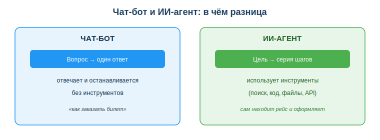
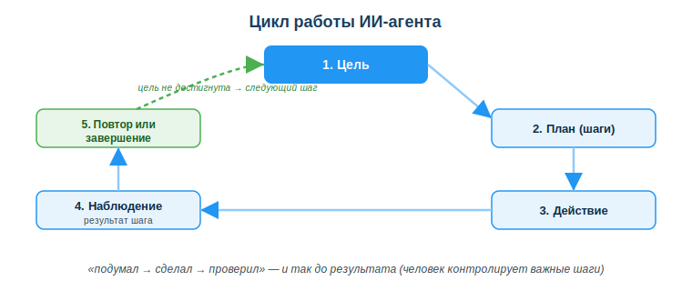

# Основы ИИ-агентов (AI agents)

## Практическая ситуация

Ты просишь обычный ИИ-чат: «найди 5 свежих статей по теме и сделай резюме». Он отвечает: «вот как искать статьи…» — и останавливается. А тебе нужно, чтобы он **сам** нашёл, открыл, прочитал и собрал результат. Именно это делает **ИИ-агент**: получает цель и идёт к ней шагами, а не одним ответом.

## Что ты научишься делать

- отличать ИИ-агента от обычного чат-бота;
- объяснять цикл работы агента (цель → действие → проверка);
- видеть возможности и риски агентов и держать человека в контроле.

## Почему это важно

Агенты — самый быстрорастущий способ применять ИИ: вместо «спросил — ответил» получается «поставил задачу — агент выполнил». Это меняет рутину: сбор данных, отчёты, проверки можно поручить агенту.

Связь с профессией: разработчику всё чаще нужно не просто писать код, а **собирать и настраивать агентов** — давать им инструменты, ограничивать права, проверять результат. Это новый и востребованный навык.

## Учимся читать схему

Посмотри на сравнение чат-бота и агента выше. Ответь на вопросы:

- что получает на вход чат-бот, а что — агент?
- чем агент пользуется, чтобы выполнить шаги?
- почему агент может сделать то, что чат-бот только опишет словами?

## Главное понятие

> **ИИ-агент** — программа на основе ИИ, которая получает цель и самостоятельно выполняет последовательность шагов с помощью инструментов (поиск, код, файлы, API), пока цель не достигнута.

Проще: чат-бот **отвечает**, агент **действует**. Чат-бот посоветует, «как заказать билет», агент — сам найдёт рейс и оформит (если ему это разрешили).

## Как работает агент

В основе — повторяющийся цикл:

1. **Цель** — что нужно получить.
2. **План** — агент разбивает цель на шаги.
3. **Действие** — выполняет шаг через инструмент (например, ищет в интернете).
4. **Наблюдение** — смотрит на результат шага.
5. **Повтор или завершение** — если цель не достигнута, делает следующий шаг.

Этот цикл «подумал → сделал → проверил» и отличает агента: он работает не одним ответом, а серией действий.

### Мини-кейс
Цель: «собрать список из 5 свежих статей по теме и сделать краткое резюме». Агент: ищет статьи → открывает каждую → извлекает суть → составляет резюме → проверяет, что статей 5. Человек получает готовый результат, но **проверяет источники** — агент мог взять нерелевантную статью.

## Возможности и риски

**Возможности:** автоматизация рутины (сбор данных, отчёты), работа с несколькими инструментами, ускорение типовых задач.

**Риски:** агент может ошибиться на одном шаге и «понести» ошибку дальше; может выполнить нежелательное действие, если ему дали слишком много прав. Поэтому ключевой принцип — **человек в контуре управления** (human-in-the-loop): важные действия подтверждает человек.

## Разбор типичной ошибки

**Ошибка.** «Раз агент сам всё делает, можно дать ему полные права и не проверять».

**Почему это ошибка.** Агент может неправильно понять задачу, взять плохой источник или ошибиться на шаге — а с полными правами одна ошибка приведёт к реальным последствиям (удалит, отправит, оплатит).

**Как правильно.** Ограничивать права, подтверждать важные шаги вручную и проверять результат — держать человека в контуре.

## Практика

Ответь письменно:

1. Назови, чем агент отличается от чат-бота (минимум 2 отличия).
2. Перечисли шаги цикла работы агента по порядку.

**Образец (часть ответа на пункт 1):** «Чат-бот отвечает одним сообщением и останавливается; агент получает цель и сам выполняет серию шагов, используя инструменты — поиск, код, API».

## Самопроверка

- Я могу объяснить, чем агент отличается от чат-бота.
- Я знаю шаги цикла агента: цель → план → действие → наблюдение → повтор.
- Я понимаю, зачем нужен человек в контуре (human-in-the-loop).

## Подумай

- Какую твою учебную или рабочую рутину мог бы взять на себя агент? Какие шаги он бы выполнял?
- Почему «дать агенту все права» опаснее, чем «дать минимум и подтверждать важное»?

## Итог

- ИИ-агент получает цель и сам выполняет шаги через инструменты — в отличие от чат-бота, который отвечает один раз.
- Цикл агента: цель → план → действие → наблюдение → повтор/завершение.
- Используй агентов для рутины, но держи человека в контуре.
- Ограничивай права агента и всегда проверяй результат.

## Полезные ссылки

- [Что такое ИИ-агенты (обзор IBM)](https://www.ibm.com/think/topics/ai-agents)
- [UNESCO — рамка ИИ-компетенций (ответственное применение)](https://www.unesco.org/en/articles/ai-competency-framework-students)
- [Введение в агентов и инструменты (обзор)](https://www.anthropic.com/research)

---

*Источник: материалы по применению ИИ и автоматизации (DigComp 2.2; UNESCO AI Competency Framework, 2024); обзорные публикации по ИИ-агентам.*

*Материал разработан рабочей группой ТОО «Колледж Хекслет Казахстан» и одобрен к использованию в обучении решением Педагогического совета.*
