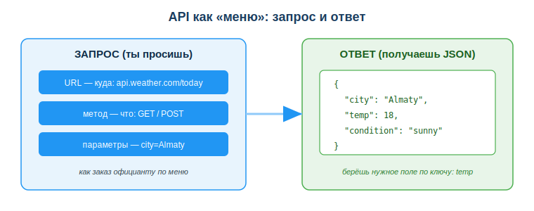
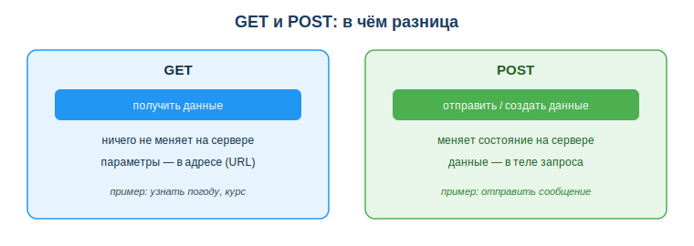

# Автоматизация через API

## Практическая ситуация

Каждое утро ты заходишь на сайт, смотришь курс валют и вручную переписываешь число в таблицу. Десять секунд — но каждый день, и легко забыть или ошибиться. А приложение погоды на телефоне само берёт свежие данные с сервера, бот в мессенджере сам отправляет сообщения, сайт магазина сам проверяет оплату в банке.

Всё это работает через **API** — способ одной программы попросить что-то у другой. Понимание API превращает тебя из пользователя готовых программ в того, кто связывает их вместе и автоматизирует рутину.



## Что ты научишься делать

- объяснять, что такое API и зачем он нужен;
- читать структуру запроса (URL, метод, параметры) и ответа (JSON);
- различать методы GET и POST и выбирать подходящий;
- видеть, как с помощью API автоматизируют повторяющиеся задачи.

## Почему это важно

Современные программы почти никогда не работают в одиночку — они постоянно обмениваются данными. Тот, кто умеет читать и составлять запросы к API, может соединить любые сервисы и поручить машине то, что раньше делал руками.

Связь с профессией: разработчик ПО почти в каждом проекте обращается к чужим API (оплата, карты, уведомления, ИИ-сервисы) и сам проектирует API своего приложения. Это базовый навык — без него современную разработку не представить.

## Учимся читать схему

Посмотри на схему «API как меню» выше. Ответь на вопросы:

- из каких трёх частей состоит запрос?
- в каком формате приходит ответ и как из него взять нужное значение?
- почему аналогия с меню и официантом подходит для API?

## Главное понятие

> **API** (Application Programming Interface) — набор правил, по которым одна программа обращается к другой: что можно попросить и в каком виде придёт ответ.

Аналогия: в кафе ты не идёшь на кухню — ты делаешь заказ официанту по меню. Меню — это и есть API: список того, что можно запросить. Ты не знаешь, как сервис устроен внутри, но знаешь, **что попросить и что получишь**.

## Из чего состоит запрос

Обращение к API по сети (REST API) обычно содержит:

- **URL (адрес)** — куда обращаемся: `https://api.weather.com/today?city=Almaty` (это схематичный пример; рабочий бесплатный адрес для погоды по Алматы, который можно открыть прямо в браузере: `https://api.open-meteo.com/v1/forecast?latitude=43.24&longitude=76.89&current=temperature_2m`);
- **метод** — что делаем: `GET` (получить данные), `POST` (отправить/создать);
- **параметры** — уточнения запроса (город, дата);
- **ответ** — данные, чаще всего в формате **JSON**.

**JSON** — текстовый формат данных в виде пар «ключ: значение»:

```json
{
  "city": "Almaty",
  "temp": 18,
  "condition": "sunny"
}
```

Программа берёт из ответа нужное поле по ключу (`temp`) и использует его — например, записывает в таблицу или показывает на экране.

## Рабочий пример на Python

Вот короткий рабочий скрипт: он делает `GET`-запрос к бесплатному сервису погоды Open-Meteo (ключ не нужен), проверяет, что ответ успешный, и достаёт температуру из JSON. Можешь сначала открыть этот URL прямо в браузере — увидишь настоящий JSON-ответ.

```python
import requests

url = "https://api.open-meteo.com/v1/forecast?latitude=43.24&longitude=76.89&current=temperature_2m"
r = requests.get(url)
if r.status_code == 200:            # 200 — запрос успешен
    data = r.json()
    print("Температура в Алматы:", data["current"]["temperature_2m"])
else:
    print("Ошибка запроса:", r.status_code)
```

Что здесь происходит: `requests.get(url)` отправляет GET-запрос; `r.status_code` показывает результат, и код `200` означает успех — поэтому данные берём только после проверки; `r.json()` разбирает JSON-ответ в обычный словарь Python, а нужное значение достаём по ключам `data["current"]["temperature_2m"]`. Координаты `43.24, 76.89` — это Алматы; поменяй их, чтобы получить погоду для другого города.

## GET и POST

Два самых частых метода различаются по назначению.



- **GET** — *получить* данные. Ничего не меняет на сервере, параметры передаются прямо в адресе. Пример: узнать погоду или курс валют.
- **POST** — *отправить или создать* данные. Меняет состояние на сервере, данные передаются в теле запроса. Пример: отправить сообщение, оформить заказ.

Простое правило: «просто посмотреть» — это GET, «что-то изменить или добавить» — это POST.

### Мини-кейс
Нужно каждое утро получать курс валют. Вручную — заходить на сайт и переписывать число. Через API — программа сама делает `GET`-запрос к сервису курсов, получает JSON, берёт нужное поле и записывает в таблицу. Один раз настроил — дальше работает само, без тебя.

## Где это применяют

- **получение данных** — погода, курсы, открытые данные (data.egov.kz);
- **отправка** — сообщения в мессенджер, запись в таблицу или базу;
- **связка сервисов** — оплата, уведомления, синхронизация между приложениями.

ИИ-ассистент здесь помогает: можно описать задачу словами и попросить готовый пример запроса к нужному API, а затем проверить и доработать его.

## Разбор типичной ошибки

**Ошибка.** Хранить ключ доступа (API-ключ) прямо в коде и выкладывать его в открытый доступ, например на GitHub.

**Почему это ошибка.** Ключ — это пароль твоей программы к сервису. Его быстро находят автоматические сканеры и используют от твоего имени: чужой расход, утечка данных, блокировка аккаунта.

**Как правильно.** Хранить ключ отдельно от кода (в переменных окружения или защищённом хранилище), не публиковать его и при утечке сразу отзывать. И всегда проверять, что ответ успешный, прежде чем брать из него данные.

## Практика

Ответь письменно:

1. Разбери запрос `GET https://api.weather.com/today?city=Almaty` на части: URL, метод, параметр. Что вернёт такой запрос? (Чтобы увидеть настоящий ответ, открой в браузере рабочий запрос `https://api.open-meteo.com/v1/forecast?latitude=43.24&longitude=76.89&current=temperature_2m` и найди в JSON поле с температурой.)
2. Дан ответ `{"city": "Almaty", "temp": 18, "condition": "sunny"}`. По каким ключам взять температуру и погодное условие? Какие значения получишь?

**Образец (часть ответа на пункт 1):** «Метод — GET (получаем данные, ничего не меняем). URL — `https://api.weather.com/today`. Параметр — `city=Almaty` (уточняет город). В ответ придёт JSON с погодой по Алматы».

## Самопроверка

- Я могу объяснить, что такое API, на примере «кафе и меню».
- Я умею назвать три части запроса и формат ответа.
- Я различаю GET и POST и понимаю, зачем хранить API-ключ отдельно.

## Подумай

- Какую твою ежедневную учебную или бытовую рутину можно автоматизировать через API? Какие запросы понадобятся?
- Почему «просто посмотреть данные» безопаснее делать через GET, а «что-то изменить» — через POST? Что будет, если перепутать?

## Итог

- Воспринимай API как «меню» запросов к чужой программе.
- Запрос — это URL + метод (GET/POST) + параметры; ответ обычно JSON.
- Бери из JSON нужное поле по ключу.
- GET — получить, POST — отправить/создать.
- Храни ключи доступа отдельно и проверяй успешность ответа.

## Полезные ссылки

- [Что такое REST API (объяснение)](https://developer.mozilla.org/ru/docs/Glossary/REST)
- [Открытые данные РК с API](https://data.egov.kz)
- [Введение в работу с JSON](https://developer.mozilla.org/ru/docs/Learn/JavaScript/Objects/JSON)

---

*Источник: материалы по применению информационно-коммуникационных технологий и автоматизации (DigComp 2.2); официальная документация MDN Web Docs (REST, JSON).*

*Материал разработан рабочей группой ТОО «Колледж Хекслет Казахстан» и одобрен к использованию в обучении решением Педагогического совета.*
