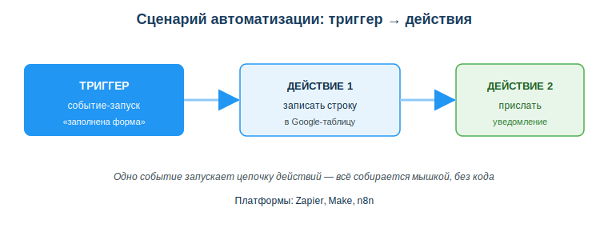
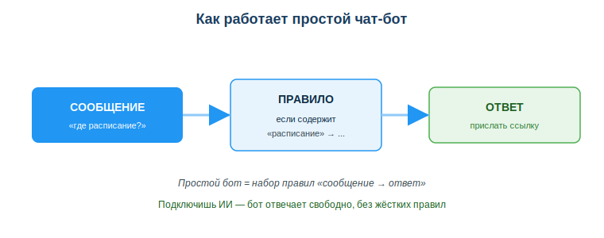

# No-code платформы (Zapier/Make) и чат-бот

## Практическая ситуация

Преподавателю каждый день приходят работы студентов через гугл-форму. Каждый ответ он вручную переносит в таблицу, а потом сам пишет студенту, что работа получена. На это уходит час в день. А ведь это типовая рутина: одно событие — и всегда одни и те же действия.

Такую цепочку можно настроить один раз и забыть про ручную работу — причём вообще без программирования, мышкой в визуальном редакторе. Именно для этого нужны **no-code платформы**: ты соединяешь готовые блоки, а платформа сама делает остальное.

## Что ты научишься делать

- объяснять, что такое no-code и когда он уместен;
- собирать сценарий автоматизации из триггера и действий;
- описывать, как работает простой чат-бот;
- ограничивать доступ сценария или бота к данным.

## Почему это важно

No-code убирает рутину без строки кода: связать сервисы, собрать бота, автоматизировать отчёт можно за несколько минут вместо часов ручной работы. Это быстрый способ проверить идею ещё до того, как писать настоящую программу.

Связь с профессией: разработчику no-code помогает **быстро собрать прототип** и сэкономить время на типовых задачах. Ты не заменяешь им программирование, а используешь как инструмент: простое и срочное — на no-code, сложное и нагруженное — кодом.

## Учимся читать схему

Посмотри на схему сценария автоматизации выше. Ответь на вопросы:

- какое событие запускает всю цепочку?
- сколько действий выполняется после одного триггера?
- что произойдёт, если триггер не сработает?

## Главное понятие

> **No-code платформа** — сервис для создания автоматизаций и приложений без написания кода, через визуальный конструктор: ты соединяешь готовые блоки «триггер» и «действия» вместо того, чтобы писать команды.

Проще: ты не пишешь код — ты собираешь сценарий мышкой. **Low-code** — почти то же самое, но иногда требует немного кода для нестандартных шагов.

## Как устроен сценарий автоматизации

Большинство no-code платформ (Zapier, Make, n8n) работают по схеме **триггер → действия**:

- **Триггер** — событие, которое запускает сценарий: «пришло новое письмо», «добавлена строка в таблицу», «отправлено сообщение боту».
- **Действия** — что сделать в ответ: «сохранить файл», «отправить уведомление», «записать в таблицу».

Пример сценария: *триггер* — заполнена форма → *действие 1* — записать ответ в Google-таблицу → *действие 2* — прислать уведомление в мессенджер. Всё собирается мышкой, без кода. Один триггер может запускать сразу несколько действий подряд.

### Мини-кейс
Преподавателю нужно: когда студент сдаёт работу через форму, ответ автоматически попадает в таблицу и приходит уведомление. В Zapier: триггер «новый ответ формы» → действие «добавить строку» → действие «отправить сообщение». Настроил один раз — работает само, тот самый час в день освобождается.

## Простой чат-бот

**Чат-бот** — программа, которая ведёт диалог: получает сообщение и отвечает. Простейший бот работает **по правилам**: «если сообщение содержит "расписание" → ответить ссылкой». Каждое правило — это пара «сообщение → ответ».

Собрать такого бота можно тоже без кода — в конструкторах ботов или прямо на no-code платформе: задаёшь триггеры (входящие сообщения) и ответы. А если подключить ИИ, бот перестаёт зависеть от жёстких правил и отвечает свободно — но и контролировать его сложнее.

## Разбор типичной ошибки

**Ошибка.** Считать, что no-code заменяет программирование везде, и давать сценарию или боту полный доступ к данным.

**Почему это ошибка.** Сложную логику, высокую производительность и нестандартные задачи no-code не вытянет. А неограниченный доступ к данным грозит утечкой персональных данных и нежелательными действиями.

**Как правильно.** No-code — для прототипов и рутины; сложное — кодом. Сценарию и боту давай **минимум прав** и проверяй, что именно автоматизируешь.

## Практика

Ответь письменно:

1. Опиши сценарий автоматизации из своей учёбы или работы: что будет триггером и какие 1–2 действия за ним последуют.
2. Придумай одно правило для простого бота в формате «если сообщение содержит … → ответить …».

**Образец (часть ответа на пункт 1):** «Триггер — преподаватель выставил оценку в таблицу. Действие 1 — отправить студенту уведомление в мессенджер. Действие 2 — записать дату в журнал».

## Самопроверка

- Я знаю, что такое no-code и когда он уместен.
- Я умею описать сценарий по схеме «триггер → действия».
- Я понимаю, как работает простой бот по правилам и зачем ограничивать доступ к данным.

## Подумай

- Какую рутину в твоей учёбе или работе можно собрать на no-code? Что станет триггером?
- Почему перед запуском сценария важно проверить, к каким данным он получает доступ?

## Итог

- Используй no-code для быстрых автоматизаций и прототипов, сложное оставляй коду.
- Думай схемой «триггер → действия»: одно событие запускает цепочку.
- Простой бот = правило «сообщение → ответ»; подключишь ИИ — отвечает свободно.
- Ограничивай доступ сценариев и ботов к данным.

## Полезные ссылки

- [Zapier — как работают Zaps (документация)](https://help.zapier.com/hc/en-us/articles/8496288690317)
- [Make (Integromat) — введение](https://www.make.com/en/help/tutorials)
- [Что такое no-code (обзор)](https://www.ibm.com/think/topics/no-code)

---

*Источник: материалы по применению цифровых технологий и автоматизации (DigComp 2.2; UNESCO AI Competency Framework, 2024); официальная документация Zapier и Make.*

*Материал разработан рабочей группой ТОО «Колледж Хекслет Казахстан» и одобрен к использованию в обучении решением Педагогического совета.*
