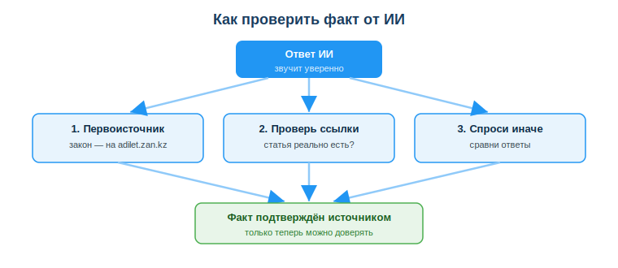
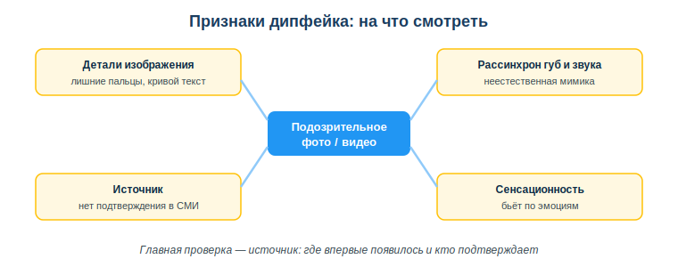

# Критически оценивать результаты ИИ: достоверность, предвзятость, галлюцинации, дипфейки

## Практическая ситуация

Ты готовишь учебный проект и просишь ИИ дать точные реквизиты закона — номер и дату. ИИ выдаёт убедительный ответ: конкретный номер, год, статью. Ты вставляешь это в работу — а на защите выясняется, что реквизиты неверные: ИИ перепутал номер и год. Сказал он это так уверенно, что никто не усомнился.

ИИ умеет уверенно говорить неправду: выдумать факт, сослаться на несуществующую статью, нарисовать фото человека, которого нет, «озвучить» голос, который этого никогда не говорил. И самое коварное из этого — подделка медиа: сегодня фото, видео и голос перестали быть доказательством. Поэтому главный навык этого занятия — **научиться проверять подлинность медиа**: не верить снимку или ролику на глаз, а проверять источник (кто и где опубликовал первым) и цифровые метки происхождения контента (C2PA, SynthID), прежде чем поверить и поделиться.

## Что ты научишься делать

- объяснять, почему ИИ выдаёт ложь уверенным тоном;
- проверять достоверность ответов ИИ у первоисточника;
- распознавать дипфейки и сгенерированный контент по признакам и цифровым меткам;
- проверять источник, прежде чем доверять и делиться;
- учитывать требования закона РК к маркировке ИИ-контента.

## Почему это важно

ИИ всё чаще встроен в работу: он пишет тексты, подсказывает код, находит факты. Но если принимать его ответы на веру, легко занести в проект, документ или новость выдумку — и отвечать за неё придётся тебе. Умение проверять — это защита твоей репутации и качества работы.

Связь с профессией: разработчик постоянно пользуется ИИ-подсказками — по библиотекам, функциям, законам о данных. Принять галлюцинацию ИИ за правду значит внести в код ошибку или нарушить требование закона. Проверка фактов у источника — часть профессиональной ответственности.

## Учимся читать схему

Посмотри на схему «Как проверить факт от ИИ» выше. Ответь на вопросы:

- с чего начинается путь проверки — что стоит в самом верху?
- какие три способа проверки показаны и чем они отличаются?
- в каком случае схема разрешает доверять факту?

## Главное понятие

> **Галлюцинация ИИ** — выдуманный, но убедительно звучащий ответ: несуществующий закон, фальшивая цитата, ссылка на статью, которой нет. ИИ не «знает» факты — он предсказывает правдоподобный текст, поэтому выдумка звучит так же уверенно, как правда.

Вывод простой: **уверенный тон ИИ — не доказательство.** Любой важный факт нужно проверять у источника.

## Как проверять ответ ИИ

ИИ не «знает» факты — он предсказывает правдоподобный текст. Поэтому он может выдать галлюцинацию: несуществующий закон, фальшивую цитату, ссылку на статью, которой нет. Опасность в том, что звучит это так же уверенно, как правда. Чтобы не попасться:

- **сверь с первоисточником** — найди факт в официальном источнике (закон — на adilet.zan.kz, а не «со слов ИИ»);
- **проверь ссылки** — реально ли существует указанная статья или страница, открывается ли она;
- **спроси иначе** — задай тот же вопрос по-другому и сравни ответы; расхождение — сигнал;
- **используй здравый смысл** — слишком гладко и удобно? возможно, выдумано.

### Мини-кейс
Студент попросил ИИ дать «закон РК о чём-то» с номером и датой. ИИ выдал убедительный номер. Проверка на adilet.zan.kz показала: такого закона нет. **Вывод:** даже точные на вид реквизиты надо проверять у источника, а не доверять уверенному тону.

## Дипфейки и сгенерированный контент

**Дипфейк** — поддельные фото, видео или аудио, созданные ИИ: лицо человека на чужом видео, фальшивый голос, несуществующее «фото события». Их используют для обмана, мошенничества и дезинформации — например, чтобы выманить деньги «голосом» родственника или подорвать чью-то репутацию.

Признаки подделки (не гарантия, но повод насторожиться):

- **детали изображения** — лишние пальцы, странные уши, «плывущий» фон, кривой текст на табличках;
- **рассинхрон губ и звука** в видео, неестественная мимика и моргание;
- **источник** сомнительный — нет подтверждения в надёжных СМИ;
- **сенсационность** — контент слишком шокирующий, провоцирует сильную эмоцию.

Главная защита — **проверять источник**: где материал впервые появился и подтверждают ли это надёжные издания. Признаки вроде «лишних пальцев» быстро устаревают — ИИ генерирует всё чище, — поэтому всё важнее **цифровые метки происхождения контента**: стандарт **C2PA / Content Credentials** (встроенная в файл история «кто и чем создал или изменил материал») и водяные знаки ИИ вроде **Google SynthID**. Если у изображения есть Content Credentials, можно проверить, было ли оно создано или изменено ИИ.

### Дипфейки и закон РК

С 18 января 2026 года дипфейки прямо регулирует **Закон РК «Об искусственном интеллекте» (№ 230-VIII)**. Ключевое для тебя:

- распространять **синтетический контент** (сгенерированные ИИ изображения, видео, аудио, текст) можно только с **маркировкой в машиночитаемой форме и видимым предупреждением** — пользователь должен понимать, что это создано ИИ;
- запрещены системы ИИ, имитирующие внешность, голос или поведение человека для обмана и причинения вреда;
- ответственность за маркировку и информирование лежит на собственнике/владельце системы ИИ.

Проще: создавать и распространять дипфейк «ради шутки» без маркировки и согласия человека теперь не только неэтично, но и незаконно.

## Разбор типичной ошибки

**Ошибка.** Доверять ответу ИИ, потому что он звучит уверенно и подробно; репостить шокирующее фото или видео сразу, не проверив.

**Почему это ошибка.** Уверенность не равна правде — это может быть галлюцинация. А мгновенный репост непроверенного материала распространяет дезинформацию и дипфейки, и ответственность ложится на того, кто поделился.

**Как правильно.** Проверять важные факты у первоисточника (например, законы — на adilet.zan.kz) и проверять источник материала, прежде чем доверять ему или делиться.

## Практика

Ответь письменно:

1. Объясни, почему уверенный тон ответа ИИ не является доказательством его правоты. Приведи пример проверки факта.
2. Перечисли минимум три признака, по которым можно заподозрить дипфейк, и назови главную защиту.

**Образец (часть ответа на пункт 1):** «ИИ не знает факты, а предсказывает правдоподобный текст, поэтому может выдать галлюцинацию — выдуманный закон или цитату. Чтобы проверить, например, закон РК, я найду его по реквизитам на adilet.zan.kz; если там его нет — ИИ выдумал».

## СДЕЛАЙ САМ: распознай подделку (пошагово)

Читать про признаки дипфейка мало — надо попробовать распознать подделку руками. Сделаем мини-расследование по одному изображению или видео и оформим вывод. Все инструменты ниже реальные и бесплатные.

**Шаг 1. Возьми материал для проверки.** Подойдёт: подозрительное «сенсационное» фото из соцсетей ИЛИ картинка, которую ты сам сгенерируешь в любом доступном ИИ-генераторе изображений (например, попроси нейросеть «фото человека, показывающего две руки крупным планом»). Второй вариант честнее для учёбы: ты точно знаешь, что это подделка, и проверяешь, поймает ли её чек-лист.

**Шаг 2. Пройди по чек-листу признаков** (отмечай, что нашёл):
- **детали** — посчитай пальцы; посмотри на зубы, уши, глаза (симметрия, блики, зрачки); есть ли «плывущий» фон и кривой текст на табличках;
- **свет и тени** — падают ли тени в одну сторону, естественны ли блики на коже и в глазах;
- **для видео** — совпадают ли губы со звуком, естественно ли моргание, нет ли «шва» по краю лица при повороте головы.

**Шаг 3. Проверь источник.** Кто и где опубликовал это ВПЕРВЫЕ? Подтверждают ли надёжные независимые СМИ? Для фото сделай **обратный поиск изображения** (Google Images — значок фотоаппарата в строке поиска, или сервис TinEye): часто «свежее фото события» оказывается старым снимком из другого года.

**Шаг 4. Проверь метки происхождения.** Загрузи файл на **contentcredentials.org** (вкладка Verify / «Inspect»): если у файла есть **C2PA / Content Credentials**, ты увидишь историю — чем создан или изменён и участвовал ли ИИ. Помни: отсутствие метки ничего не доказывает (её могли потерять при пересжатии), а вот её наличие даёт надёжную информацию. Многие генераторы также добавляют невидимый водяной знак (**Google SynthID**) — его считывает специальный детектор.

**Шаг 5. Сделай и обоснуй вывод.** Напиши одно из двух: «скорее подлинное» или «скорее подделка» — и обоснуй, опираясь на шаги 2–4. Главный аргумент должен быть про **источник и метки**, а не только про «лишние пальцы» (детали устаревают, источник — нет).

*(Здесь, в разборе, уместен иллюстративный скриншот: сам проверяемый материал с твоими пометками на подозрительных местах и/или экран проверки на contentcredentials.org.)*

**Мини-образец вывода:** «Проверял сгенерированное фото рук. По чек-листу: 6 пальцев на правой руке, тени от предметов падают в разные стороны (шаг 2). Источника нет — картинку я создал сам в генераторе (шаг 3). На contentcredentials.org файл показал метку "AI generated" (шаг 4). **Вывод: подделка**, главный довод — метка происхождения и отсутствие первоисточника».

**Что приложить:** короткий разбор (5–7 предложений) по шагам 2–5 и скриншот проверяемого материала с пометками (и/или экран проверки меток). Обязательно укажи итог: подлинное или подделка — и почему.

## Самопроверка

- Я знаю, почему ИИ может уверенно выдать ложный факт (галлюцинация).
- Я умею проверять факт от ИИ у первоисточника (например, закон — на adilet.zan.kz).
- Я могу назвать признаки дипфейка и понимаю, что главная защита — проверка источника.

## Подумай

- В каких твоих задачах цена ошибки от непроверенного ответа ИИ особенно высока (учёба, код, закон)?
- Почему привычка «сначала проверить, потом поделиться» защищает не только других, но и тебя самого?

## Итог

- ИИ предсказывает текст, а не знает истину — он может выдумать (галлюцинация).
- Уверенный тон — не доказательство; проверяй важные факты у первоисточника.
- Проверяй ссылки и реквизиты, спрашивай иначе и сравнивай ответы.
- Дипфейки распознавай по деталям, рассинхрону, источнику, сенсационности и цифровым меткам (C2PA/SynthID); не делись непроверенным.
- По Закону РК № 230-VIII синтетический ИИ-контент нужно маркировать, а дипфейки людей без согласия запрещены.

## Полезные ссылки

- [UNESCO — рамка ИИ-компетенций (критическое мышление)](https://www.unesco.org/en/articles/ai-competency-framework-students)
- [Как распознать дезинформацию и фейки (обзор ВОЗ)](https://www.who.int/health-topics/infodemic)
- [Закон РК «Об искусственном интеллекте» № 230-VIII (adilet.zan.kz)](https://adilet.zan.kz/rus/docs/Z2500000230)
- [Content Credentials / C2PA — метки происхождения контента](https://contentcredentials.org)
- [Справочно-правовая система РК (проверка законов)](https://adilet.zan.kz)

---

*Источник: Закон РК «Об искусственном интеллекте» (№ 230-VIII, 2025) по adilet.zan.kz; материалы по применению ИИ и медиаграмотности (DigComp 2.2; UNESCO AI Competency Framework, 2024); стандарт происхождения контента C2PA / Content Credentials.*

*Разработал: преподаватель ИКТ, магистр управления и информационной безопасности Калиаскаров Д.А.*

*Материал одобрен к использованию в обучении решением Педагогического совета ТОО «Колледж Хекслет Казахстан».*
