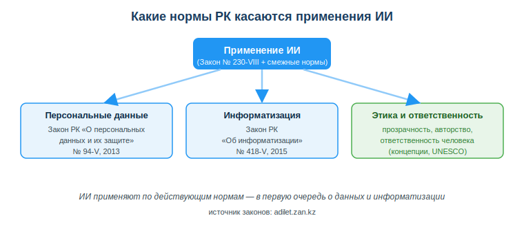
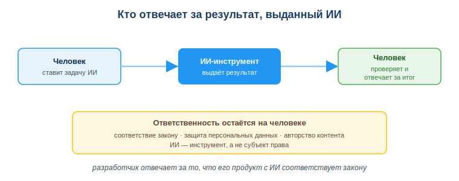

# Изучить нормативно-правовые аспекты использования ИИ в РК

## Практическая ситуация

Ты сделал чат-бота для интернет-магазина. Чтобы он отвечал клиентам, ты загрузил в ИИ-сервис базу с именами, телефонами и адресами покупателей. Бот работает отлично — но через месяц приходит жалоба: клиент не давал согласия, чтобы его данные передавали стороннему ИИ-сервису. Кто виноват и какой закон нарушен?

С начала 2026 года в Казахстане действует профильный **Закон «Об искусственном интеллекте»**. Вместе с ним применение ИИ регулируют смежные законы — о персональных данных и об информатизации. Разработчик обязан понимать, что каждый из них требует: именно он отвечает за то, чтобы продукт с ИИ не нарушал эти нормы. Точные номера и даты законов запоминать наизусть не нужно — их всегда можно сверить на adilet.zan.kz; важнее понимать смысл и практические последствия каждой нормы.

## Что ты научишься делать

- называть законы РК, которые регулируют применение ИИ;
- объяснять, кто отвечает за результат, выданный ИИ;
- проверять, соответствует ли использование данных закону о персональных данных;
- учитывать вопросы авторства, прозрачности и этики ИИ-контента.

## Почему это важно

ИИ всё чаще встраивают в реальные продукты: чат-боты, рекомендации, анализ данных. Каждый такой продукт работает с информацией о людях и должен соответствовать закону. Нарушение влечёт штрафы, блокировку сервиса и потерю доверия клиентов.

Связь с профессией: разработчик отвечает за то, чтобы его программа с ИИ соответствовала законодательству — особенно при работе с персональными данными. Это часть профессиональной ответственности, а не «дело юристов».

## Учимся читать схему

Посмотри на схему норм РК выше. Ответь на вопросы:

- какой профильный закон РК напрямую регулирует ИИ и какие два смежных закона его дополняют?
- какие требования закон предъявляет к маркировке ИИ-контента и к ответственности за результат?
- где можно найти официальные тексты этих законов?

## Главное понятие

> **Персональные данные** — сведения, относящиеся к определённому или определяемому на их основании человеку (имя, телефон, адрес, ИИН и др.). В РК их сбор и обработку регулирует Закон «О персональных данных и их защите».

Проще: как только твоя программа (в том числе с ИИ) работает с данными людей, ты обязан соблюдать закон о персональных данных — получать согласие, защищать данные, не передавать их без оснований.

## Как ИИ регулируется в РК

С 2026 года в РК есть **профильный закон об ИИ**, который работает вместе со смежными законами. Смотри не на номера, а на то, что каждый акт регулирует применительно к ИИ:

- **Закон «Об искусственном интеллекте»** — профильный: вводит понятия (система ИИ, модель, синтетические результаты), делит системы ИИ по степени риска и автономности, вводит запреты (в том числе на вредные дипфейки), требует маркировать ИИ-контент и закрепляет ответственность человека за результат.
- **Закон «О персональных данных и их защите»** — отвечает на вопрос «что можно и нельзя с данными людей»: собирать только с согласия, защищать, не передавать без оснований. Именно он нарушается, когда базу клиентов загружают в сторонний ИИ-сервис.
- **Закон «Об информатизации»** — общие правила для информационных систем, данных и цифровых сервисов, в которых работает твой ИИ-продукт.

Кроме того, действует **Концепция развития искусственного интеллекта на 2024–2029 годы** — это не запреты, а стратегический документ о том, куда государство ведёт сферу ИИ.

> **Реквизиты — один раз, для справки.** «Об искусственном интеллекте» — № 230-VIII (2025, действует с начала 2026 г.); «О персональных данных и их защите» — № 94-V (2013); «Об информатизации» — № 418-V (2015); Концепция развития ИИ — ПП РК № 592 (2024). Эти номера и даты наизусть учить не нужно — их всегда сверяют на adilet.zan.kz. От разработчика ждут понимания смысла норм, а не памяти на цифры.

Что важно знать разработчику из Закона об ИИ:

1. **Классификация по риску.** Системы ИИ делятся на минимальный, средний и высокий риск; для высокого риска — повышенные требования к безопасности. Есть и деление по автономности (где окончательное решение остаётся за человеком).
2. **Запрещённые системы ИИ.** Закон прямо запрещает ИИ для манипуляции поведением, эксплуатации уязвимости людей, социального скоринга, незаконной обработки персональных данных и дискриминации по биометрии.
3. **Маркировка синтетического контента.** Распространять «синтетические результаты» (сгенерированные ИИ изображения, видео, аудио, текст — в том числе дипфейки) можно только с маркировкой в машиночитаемой форме и видимым предупреждением. Пользователя обязаны информировать, что товар или услуга сделаны с применением ИИ.
4. **Ответственность человека.** За результат ИИ отвечает не программа, а собственник/владелец системы и человек, который её применил.
5. **Авторское право.** Произведение, созданное с ИИ, охраняется авторским правом только при творческом вкладе человека; обучать модели на чужих произведениях можно лишь при отсутствии запрета автора.

Правила в этой сфере новые и будут уточняться подзаконными актами — за ними нужно следить.

### Мини-кейс
Студент сгенерировал курсовую целиком в ИИ и сдал как свою. Проблемы сразу две: авторство (работа не его) и достоверность (ИИ мог выдумать факты и источники). Правильно — использовать ИИ как помощника, проверять факты и указывать, что и как было сгенерировано.

## Кто отвечает за результат ИИ

ИИ — это инструмент, а не субъект права. Поэтому за результат, выданный ИИ, отвечает человек, который его применил, и организация, которая выпустила продукт. Закон РК «Об искусственном интеллекте» прямо возлагает ответственность за результат и за информирование пользователей на собственников и владельцев систем ИИ.

Казахстанские нормы движутся в общем русле с международными подходами, где ответственное и этичное применение ИИ считают базовой компетенцией специалиста (подробнее — в «Полезных ссылках»).

## Разбор типичной ошибки

**Ошибка.** «Раз результат выдал ИИ, то и отвечает за него ИИ — с меня спроса нет».

**Почему это ошибка.** ИИ не является субъектом права: он не может нести ответственность. По закону отвечает человек или организация, которые применили ИИ и выпустили результат. Ссылка «так сказал ИИ» не освобождает от ответственности за нарушение закона (например, утечку персональных данных).

**Как правильно.** Считай ИИ инструментом: проверяй результат, не загружай чужие данные без согласия, указывай использование ИИ там, где это требуется, и помни, что итоговую ответственность несёшь ты.

## Практика

Ответь письменно:

1. Назови два закона РК, которые регулируют применение ИИ, и за что отвечает каждый.
2. Объясни, кто несёт ответственность за результат, выданный ИИ, и почему.

**Образец (часть ответа на пункт 1):** «Закон "О персональных данных и их защите" регулирует сбор и обработку данных людей — в том числе запрещает загружать базу клиентов в сторонний ИИ без согласия; Закон "Об информатизации" задаёт общие правила для информационных систем и данных. Точные номера не привожу по памяти — при необходимости сверяю на adilet.zan.kz».

## Самопроверка

- Я знаю профильный Закон РК об ИИ и два смежных закона, которые регулируют применение ИИ, и понимаю, что каждый из них регулирует (номера при этом помнить наизусть не обязательно).
- Я могу объяснить, кто отвечает за результат, выданный ИИ.
- Я понимаю принципы: защита данных, ответственность человека, авторство, прозрачность.

## Подумай

- В каком твоём учебном или будущем рабочем проекте ИИ будет работать с данными людей? Что нужно сделать, чтобы не нарушить закон?
- Почему закон требует маркировать ИИ-контент и информировать пользователя о применении ИИ — какие риски это снижает?

## Итог

- С начала 2026 года в РК действует профильный Закон «Об искусственном интеллекте» вместе со смежными законами о персональных данных и об информатизации.
- Важно, что регулирует каждый акт, а не его номер: профильный закон — про ИИ (риски, запреты, маркировку, ответственность человека), «О персональных данных» — про данные людей, «Об информатизации» — про информационные системы. Точные реквизиты даны один раз выше и в источниках; наизусть их учить не нужно.
- Закон об ИИ вводит классификацию систем по риску, запреты (включая вредные дипфейки), обязательную маркировку ИИ-контента и правила авторства.
- ИИ — инструмент: ответственность за результат несёт человек/организация, а разработчик отвечает за соответствие продукта закону.

## Полезные ссылки

- [Закон РК «Об искусственном интеллекте» № 230-VIII (adilet.zan.kz)](https://adilet.zan.kz/rus/docs/Z2500000230)
- [Закон РК «О персональных данных и их защите» (adilet.zan.kz)](https://adilet.zan.kz/rus/docs/Z1300000094)
- [Закон РК «Об информатизации» (adilet.zan.kz)](https://adilet.zan.kz/rus/docs/Z1500000418)
- [UNESCO — рамка ИИ-компетенций (ответственное применение)](https://www.unesco.org/en/articles/ai-competency-framework-students)
- [Портал «Әділет» — официальные тексты законов РК](https://adilet.zan.kz/rus)

---

*Источник: Закон РК «Об искусственном интеллекте» (№ 230-VIII, 2025), Закон РК «О персональных данных и их защите» (№ 94-V, 2013) и Закон РК «Об информатизации» (№ 418-V, 2015) по adilet.zan.kz; Концепция развития ИИ на 2024–2029 годы (ПП РК № 592 от 24.07.2024); UNESCO AI Competency Framework, 2024.*

*Разработал: преподаватель ИКТ, магистр управления и информационной безопасности Калиаскаров Д.А.*

*Материал одобрен к использованию в обучении решением Педагогического совета ТОО «Колледж Хекслет Казахстан».*
