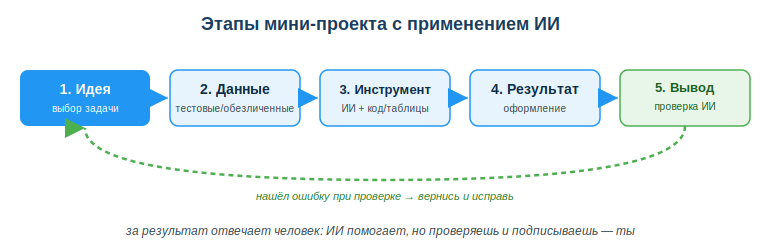
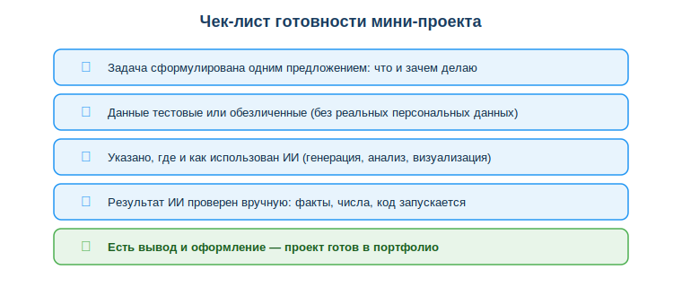

# Разработать мини-проект с применением ИИ

## Практическая ситуация

Тебе дали маленькую, но настоящую задачу: «у нас есть выгрузка заказов за месяц — посчитай, в какие дни покупают чаще, и покажи это наглядно». Раньше ты бы делал это вручную часами. Теперь у тебя есть Python, Pandas, библиотеки визуализации и ИИ-ассистент. Но сами по себе они задачу не решат: нужно правильно её поставить, выбрать инструмент, проверить результат и сделать вывод.

Мини-проект — это и есть твой первый маленький «продукт»: ты берёшь реальную задачу, применяешь инструменты курса вместе с ИИ и доводишь работу до готового результата, за который отвечаешь сам.

## Что ты научишься делать

- разбивать мини-проект на этапы: идея → данные → инструмент ИИ → результат → вывод;
- выбирать задачу по силам и подбирать под неё инструмент курса;
- ответственно применять ИИ и проверять его результат;
- оформлять работу так, чтобы её можно было положить в портфолио.

## Почему это важно

Метод проекта — это способ учиться, решая настоящую задачу от начала до конца. Знания по отдельности (синтаксис Python, формулы в таблицах, приёмы визуализации) превращаются в умение только тогда, когда ты собираешь их вместе ради конкретного результата. Мини-проект — тренировка этого навыка на маленьком масштабе.

Связь с профессией: работодатель смотрит не на оценки, а на то, что ты умеешь сделать. Готовый мини-проект — это запись в портфолио: «вот задача, вот как я её решил, вот где помог ИИ, вот что получилось». Умение довести работу до результата и честно показать вклад ИИ ценится на собеседовании.

Этот мини-проект — основа итоговой аттестации по дисциплине. Ты доводишь его до готовности к защите на занятии 39; проект и защита вместе формируют итоговую оценку по дисциплине «Применение ИКТ» (форма итогового контроля — зачёт).

## Учимся читать схему

Посмотри на схему этапов выше. Ответь на вопросы:

- с чего начинается мини-проект и чем он заканчивается?
- на каком этапе подключается инструмент ИИ?
- куда ведёт пунктирная стрелка и что она означает?

## Главное понятие

> **Мини-проект** — небольшая практическая работа, в которой ты решаешь одну конкретную задачу от постановки до готового результата, применяя инструменты курса и ИИ, и сам отвечаешь за проверку и вывод.

Проще: это не «ответ на вопрос», а «доведённое до конца дело». ИИ здесь — помощник, а не автор: он ускоряет шаги, но решения и проверку делаешь ты.

## Этапы мини-проекта

Каждый мини-проект проходит пять этапов:

1. **Идея (выбор задачи).** Сформулируй задачу одним предложением: что и зачем. Бери небольшую задачу, решаемую инструментами курса.
2. **Данные.** Найди или подготовь данные. Используй **тестовые или обезличенные** данные — без реальных имён, телефонов, адресов.
3. **Инструмент ИИ.** Выбери, чем решать: обработка данных (Python, Pandas), электронные таблицы, визуализация (графики), автоматизация, ИИ-ассистент для генерации кода или текста.
4. **Результат.** Получи и оформи результат: таблица, график, скрипт, краткий отчёт.
5. **Вывод и проверка.** Сделай вывод и **проверь результат ИИ**: верны ли числа, запускается ли код, нет ли выдумок. Нашёл ошибку — вернись на нужный этап и исправь.

Где какой инструмент применить:

| Тип задачи | Инструмент курса + ИИ |
|---|---|
| Обработка данных | Python + Pandas; ИИ помогает написать код |
| Подсчёты и сводки | электронные таблицы; ИИ подсказывает формулы |
| Наглядное представление | визуализация (графики); ИИ предлагает тип диаграммы |
| Повторяющиеся действия | автоматизация (скрипт); ИИ генерирует заготовку |
| Текст и пояснения | ИИ-ассистент; ты проверяешь и редактируешь |

### Мини-кейс
Задача: «по выгрузке заказов показать, в какие дни недели покупают чаще». Ученик берёт обезличенный CSV (без имён клиентов), просит ИИ-ассистента написать код на Pandas для подсчёта по дням недели, строит столбчатую диаграмму, проверяет числа вручную на нескольких строках и пишет вывод: «пик заказов — пятница и суббота». В отчёте отмечает: «код сгенерирован ИИ, проверен и исправлен мной».

## Разбор типичной ошибки

**Ошибка.** «ИИ написал код и дал ответ — значит, проект готов, можно сдавать как есть».

**Почему это ошибка.** ИИ может выдать код с ошибкой, перепутать столбцы, придумать несуществующие данные или дать правдоподобный, но неверный вывод. Если не проверить, ошибка попадёт в результат, а отвечать за неё будешь ты, а не ИИ.

**Как правильно.** Проверь результат: запусти код, сверь числа на нескольких строках, перечитай вывод. Укажи, где использован ИИ. Только проверенную работу можно сдавать и класть в портфолио.

## Практика

Ответь письменно:

1. Сформулируй задачу своего мини-проекта одним предложением и назови этапы, через которые ты пройдёшь.
2. Назови два способа проверить результат, который дал ИИ.

**Образец (часть ответа на пункт 1):** «Задача: по обезличенной таблице расходов за месяц построить график по категориям. Этапы: идея → данные (тестовый файл) → инструмент (Pandas + график) → результат (диаграмма) → вывод и проверка чисел».

## Самопроверка

- Я могу назвать пять этапов мини-проекта по порядку.
- Я умею выбрать инструмент курса под тип задачи.
- Я знаю, зачем проверять результат ИИ и почему данные должны быть обезличенными.

## Подумай

- Какую небольшую задачу из учёбы или жизни ты мог бы превратить в мини-проект для портфолио?
- Почему за результат, сделанный с помощью ИИ, отвечает человек, а не программа?

## Итог

- Мини-проект — это решение одной задачи от постановки до готового результата.
- Этапы: идея → данные → инструмент ИИ → результат → вывод и проверка.
- Используй тестовые или обезличенные данные и указывай, где помог ИИ.
- Всегда проверяй результат ИИ: за итог отвечаешь ты.

## Полезные ссылки

- [Python — официальная документация](https://docs.python.org/3/)
- [Pandas — работа с данными](https://pandas.pydata.org/docs/)
- [Matplotlib — визуализация данных](https://matplotlib.org/stable/index.html)
- [UNESCO — рамка ИИ-компетенций (ответственное применение)](https://www.unesco.org/en/articles/ai-competency-framework-students)

---

*Источник: материалы по применению ИИ, обработке и визуализации данных (DigComp 2.2; UNESCO AI Competency Framework, 2024); официальная документация Python, Pandas, Matplotlib.*

*Разработал: преподаватель ИКТ, магистр управления и информационной безопасности Калиаскаров Д.А.*

*Материал одобрен к использованию в обучении решением Педагогического совета ТОО «Колледж Хекслет Казахстан».*
