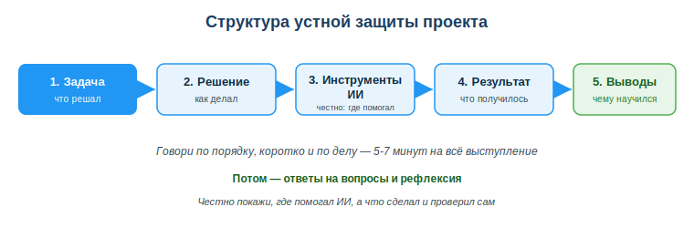
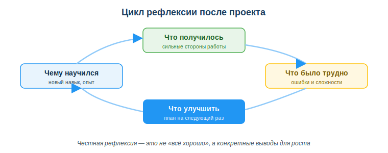

# Защитить итоговый проект и провести рефлексию

## Практическая ситуация

Ты сделал проект: написал код, собрал результат, кое-где тебе помог ИИ. И вот наступает момент — нужно встать перед группой (а в работе — перед командой или заказчиком) и за пять минут рассказать: что ты делал, как решал, что получилось. Многие в этот момент теряются: говорят сумбурно, забывают про результат, не могут ответить на вопрос «а почему ты сделал именно так?».

Хорошая новость: защита — это навык, и ему можно научиться. Если знать структуру выступления и заранее продумать ответы, защита перестаёт быть стрессом и становится спокойным рассказом о своей работе. Этому и посвящено занятие.

## Что ты научишься делать

- строить устную защиту проекта по схеме: задача → решение → инструменты ИИ → результат → выводы;
- честно показывать, где тебе помогал ИИ, а что ты сделал и проверил сам;
- спокойно отвечать на вопросы по своей работе;
- проводить рефлексию: что получилось, что было трудно, что улучшить и чему ты научился.

## Почему это важно

Уметь рассказать о своей работе — отдельный профессиональный навык, не менее важный, чем сам код. Можно сделать хороший проект, но «провалить» его на защите, если не суметь объяснить, что и зачем сделано. И наоборот — внятная защита показывает, что ты понимаешь свою работу.

Связь с профессией: разработчик постоянно защищает свои решения — на код-ревью, демо для команды, презентации заказчику. А ретроспектива (разбор «что прошло хорошо, что улучшить») — обязательная часть работы любой команды по гибким методологиям. Учиться этому стоит уже сейчас.

Важно и формально: защита проекта — это итоговый контроль по дисциплине «Применение ИКТ» (форма итогового контроля — зачёт). Итоговая оценка складывается из проекта (занятие 38) и его защиты. «Зачтено» ставится, если проект сдан, выполнены обязательные требования и пройдена устная защита, а суммарный балл за проект и защиту не ниже порога «зачтено». Конкретный порог устанавливает преподаватель / учебная часть.

## Учимся читать схему

Посмотри на схему структуры защиты выше. Ответь на вопросы:

- в каком порядке идут пять блоков выступления?
- на каком шаге нужно честно сказать, где помогал ИИ?
- чем «результат» отличается от «выводов» — что говорить в каждом блоке?

## Главное понятие

> **Защита проекта** — короткое устное выступление, в котором ты объясняешь свою работу по понятной структуре (задача, решение, инструменты, результат, выводы), честно показываешь роль ИИ и отвечаешь на вопросы.

Проще: защита — это не пересказ кода строка за строкой, а рассказ о том, какую задачу ты решал и как пришёл к результату.

## Как построить выступление

Держись пяти блоков по порядку — это и есть каркас защиты:

1. **Задача** — что нужно было сделать. Одно-два предложения: «Мне нужно было…».
2. **Решение** — как ты подошёл к задаче, какие шаги сделал, почему именно так.
3. **Инструменты ИИ** — где и как тебе помогал ИИ (подсказал идею, объяснил ошибку, сгенерировал черновик кода) и что ты при этом **проверил сам**.
4. **Результат** — что получилось: рабочая программа, файл, схема. Лучше показать вживую — это убеждает сильнее слов.
5. **Выводы** — чему ты научился, что бы сделал иначе.

Оптимально — 5–7 минут на всё выступление. Говори коротко и по делу: лучше показать результат, чем долго описывать его словами.

### Мини-кейс
Студент защищает проект-калькулятор. Он говорит: «Задача — посчитать смету. Решал так: разбил на функции ввода, расчёта и вывода. ИИ помог разобраться с форматированием чисел — я попросил пример и проверил его на своих данных. Результат — вот, считает (показывает). Вывод: в следующий раз сразу продумаю проверку ввода». Чётко, честно, с демонстрацией — отличная защита.

## Честность в указании роли ИИ

Указать, где помогал ИИ — это не слабость, а признак зрелости. Преподаватель и команда ценят честность выше, чем вид «я всё сделал сам». Скрывать применение ИИ опасно: на вопрос «объясни эту строку» ты не сможешь ответить, и обман вскроется.

Правило простое: **используешь ИИ — понимай и проверяй результат, и говори об этом открыто.** Тогда ИИ — твой инструмент, а не способ обмануть.

## Рефлексия после проекта

Рефлексия — это честный разбор своей работы. Не «всё было хорошо», а конкретные выводы. Удобно идти по кругу из четырёх вопросов:

- **Что получилось** — твои сильные стороны в этой работе.
- **Что было трудно** — где спотыкался, какие ошибки.
- **Что улучшить** — конкретный план на следующий раз.
- **Чему научился** — новый навык или опыт.

Такая рефлексия и есть ретроспектива — именно её регулярно проводят команды разработчиков, чтобы становиться лучше.

## Разбор типичной ошибки

**Ошибка.** Студент на защите начинает читать код подряд, строка за строкой, и совсем не говорит про задачу, результат и роль ИИ.

**Почему это ошибка.** Слушателям не нужен пересказ кода — им важно понять, *что* ты решал и *что* получилось. Без структуры выступление звучит сумбурно, а скрытая роль ИИ всплывёт на первом же вопросе.

**Как правильно.** Идти по схеме: задача → решение → инструменты ИИ → результат → выводы. Показать результат вживую и честно сказать, где помогал ИИ.

## Практика

Ответь письменно:

1. Составь план своего выступления по пяти блокам (по одной фразе на каждый блок) для проекта из занятия 38.
2. Сформулируй по одному предложению на каждый из четырёх вопросов рефлексии о своём проекте.

**Образец (часть ответа на пункт 1):** «Задача: сделать программу учёта оценок. Решение: разбил на ввод, хранение и вывод. Инструменты ИИ: попросил объяснить работу со списками, проверил пример сам. Результат: программа работает — покажу. Выводы: научился структурировать код по функциям».

## Самопроверка

- Я могу построить выступление по схеме: задача → решение → инструменты ИИ → результат → выводы.
- Я умею честно объяснить, где мне помогал ИИ и что я проверил сам.
- Я могу провести рефлексию по четырём вопросам: что получилось, что трудно, что улучшить, чему научился.

## Подумай

- Почему на работе важно уметь защищать свои решения перед командой и заказчиком, а не только хорошо их делать?
- Чем честный рассказ о роли ИИ полезен лично тебе, а не только преподавателю?

## Итог

- Защита проекта — это рассказ по структуре: задача → решение → инструменты ИИ → результат → выводы.
- Лучше показать результат вживую, чем долго описывать его словами; держись 5–7 минут.
- Честно указывай, где помогал ИИ, и что ты проверил сам — это признак зрелости.
- Рефлексия = разбор «что получилось / что трудно / что улучшить / чему научился»; это и есть ретроспектива команды.

## Полезные ссылки

- [Как презентовать проект: советы по структуре выступления (обзор)](https://www.mindtools.com/a0i25u0/presentation-skills)
- [UNESCO — рамка ИИ-компетенций (ответственное и честное применение)](https://www.unesco.org/en/articles/ai-competency-framework-students)
- [Что такое ретроспектива в командах разработчиков (обзор Atlassian)](https://www.atlassian.com/team-playbook/plays/retrospective)

---

*Источник: материалы по презентации и защите проектов, командной ретроспективе; UNESCO AI Competency Framework, 2024; DigComp 2.2.*

*Разработал: преподаватель ИКТ, магистр управления и информационной безопасности Калиаскаров Д.А.*

*Материал одобрен к использованию в обучении решением Педагогического совета ТОО «Колледж Хекслет Казахстан».*
