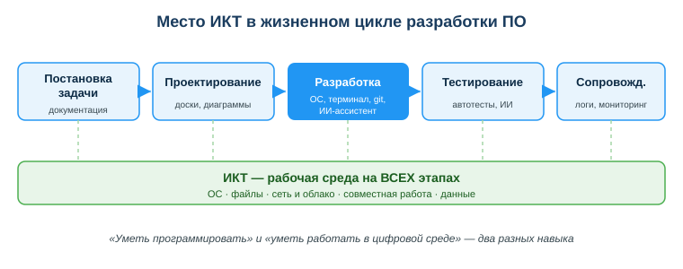
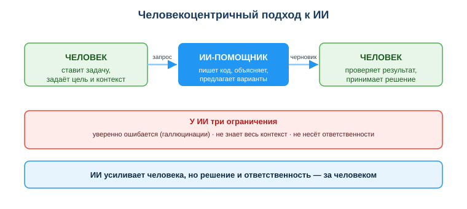

# Изучить роль ИКТ и цифровых технологий в разработке и сопровождении информационных систем

## Практическая ситуация

Первый день на практике. Тебе выдают заявку в одну строку: «подготовь рабочее место новому сотруднику и подключи его к системе». Ни командной строки, ни кода ты не боишься — но рабочее место не оживает: учётная запись не создаётся, сетевой диск не подключается, принтер не виден, а где на сервере лежат журналы, тебе никто не показал. Час уходит не на заявку, а на борьбу со средой, в которой ты оказался впервые.

Рядом коллега не мучается: он просит у ИИ-ассистента готовую команду «открыть доступ к общей папке» и применяет её на рабочем сервере не глядя. Команда отрабатывает без единой ошибки — и открывает папку с персональными данными всем пользователям сети сразу, а заодно снимает ранее настроенные ограничения. Два разных провала — но причина одна: инструменты были, а владения средой и контроля над результатом не хватило.

## Что ты научишься делать

- объяснять, где именно ИКТ работают на каждом этапе создания и сопровождения информационной системы;
- отличать «инструмент усиливает меня» от «инструмент решает за меня»;
- формулировать, почему за настроенную систему, выполненную команду и данные пользователей отвечает техник, даже если решение подсказал ИИ;
- защищать персональные данные пользователей при работе с ИИ-сервисами.

## Почему это важно

Между заявкой пользователя и работающей системой стоит целая цепочка инструментов: операционная система и файловая система, терминал, сеть и оборудование, серверы, облако, учётные записи, система заявок, мониторинг и логи, документация и всё чаще — ИИ-ассистенты. Чем лучше ты владеешь этой средой, тем больше времени остаётся на главное — решать задачу пользователя, а не воевать с окружением.

Связь с профессией: работодатель оценивает не только то, как ты пишешь код и скрипты, но и то, как быстро ты входишь в чужую, уже настроенную кем-то инфраструктуру, как работаешь по заявкам и в команде, как проверяешь чужие и ИИ-сгенерированные команды, конфигурации и код — и не допускаешь утечек данных пользователей. Это и есть «уметь работать в цифровой среде» — навык, который у техника информационных систем ценится наравне с умением программировать.

## Учимся читать схему

Посмотри на схему «Место ИКТ в жизненном цикле разработки ПО» выше. Ответь на вопросы:

- на каком этапе ИКТ-инструментов больше всего и почему он выделен цветом?
- что общего у всех этапов — что показано зелёной полосой внизу?
- почему «уметь настроить и запустить систему» и «уметь написать код» — это два разных навыка, и техник ИС нуждается в обоих?

## Главное понятие

> **ИКТ** — методы и средства сбора, хранения, обработки и передачи информации с помощью компьютеров и сетей.

Для техника ИС ИКТ — не отдельная дисциплина «на потом», а среда, в которой он работает каждый день: ОС и файловая система, терминал, сеть и оборудование, серверы, облачные сервисы, базы данных, учётные записи и права доступа, мониторинг и логи, система заявок и документация.

## Где ИКТ включаются в жизненном цикле ПО

ИКТ работают не на одном этапе, а на всех — меняется только набор инструментов. Техник ИС участвует во всём цикле, но особенно силён на внедрении, тестировании и сопровождении.

| Этап | Что реально используешь как техник ИС |
|---|---|
| Постановка задачи | заявка пользователя в системе учёта обращений, уточняющий разговор, документация на систему, паспорт рабочего места |
| Проектирование | схема сети и размещения оборудования, план учётных записей и прав доступа, требования к серверу и базе данных, совместные документы |
| Разработка | ОС и терминал, редактор кода и скриптов, репозиторий (git), конфигурационные файлы, ИИ-ассистент (ПМ 3, ПМ 4 — код, отладка, рефакторинг) |
| Тестирование | проверка на тестовой машине или в виртуальной среде, тестовый набор данных, проверка доступов и подключений, анализ ошибок в логах |
| Внедрение и сопровождение | развёртывание и настройка ПО, установка обновлений, мониторинг серверов и сети, журналы (логи), резервные копии, обработка заявок пользователей |

Вывод: «уметь программировать» и «уметь работать в цифровой среде» — это два разных навыка, и для техника ИС второй не менее важен, чем первый.

## Цифровая трансформация: контекст, в котором ты работаешь

**Цифровая трансформация** — перестройка процессов и услуг вокруг данных и цифровых технологий. В Казахстане это видно на каждом шагу: eGov, цифровой банкинг (Kaspi), электронные госуслуги, открытые данные. Как техник ИС ты не просто пользуешься этими сервисами — завтра ты будешь такие системы внедрять, настраивать и поддерживать, чтобы они реально работали у людей: на рабочих местах, на серверах, в сети и в облаке.

## Человекоцентричный подход к ИИ

ИИ-ассистент быстро выдаёт команду, объясняет ошибку в логе, генерирует скрипт и конфигурацию. Но у него есть три свойства, которые меняют правила игры:

- он **уверенно ошибается** (галлюцинации) — выдаёт правдоподобный, но неверный ответ;
- он **не понимает контекст** твоей инфраструктуры целиком;
- он **не несёт ответственности** за последствия.

Поэтому современный подход называется **человекоцентричным**: главным остаётся человек, а ИИ — его инструмент. Специалист — ответственный пользователь и создатель ИИ, а не пассивный потребитель.

Это значит на практике:

- ИИ **усиливает** тебя, но финальное решение и проверку делаешь ты;
- любой результат ИИ ты **критически оцениваешь** перед применением на рабочей системе;
- ты соблюдаешь **права человека, приватность и законы РК** (нельзя скармливать ИИ персональные данные пользователей).

### Мини-кейс

Студент на практике попросил ИИ дать команду, «чтобы коллеги могли работать с общей папкой». ИИ выдал команду, которая «работает»: доступ действительно появился — но она выдала полные права всем пользователям сети и сняла ранее настроенные ограничения. Студент применил её на рабочем сервере как есть.

Вопрос: кто виноват в открытом доступе к данным — ИИ или студент? Следующий шаг: всегда разбирать сгенерированную команду построчно и проверять её в безопасной среде, а не только смотреть, «отработала ли она без ошибки». Ответственность за результат остаётся на человеке, который эту команду выполнил.

## Разбор типичной ошибки

**Ошибка.** «ИИ сказал — значит правильно».

**Почему это ошибка.** ИИ генерирует правдоподобный текст, а не истину; он не проверяет факты и не знает контекст твоей инфраструктуры: какие у вас права доступа, где лежат данные, что уже настроено и что нельзя трогать.

**Как правильно.** Относиться к ответу ИИ как к черновику от стажёра — перепроверять команды, конфигурации, код и факты перед тем, как применить их на рабочей системе.

## Практика

Не пересказывай теорию — **сделай руками** и покажи результат. Работаешь в своей ОС, с реальным ИИ-ассистентом (любой доступный: чат-бот, помощник в редакторе). Итог сдаёшь одним файлом `praktika_01.md` (или скриншотами) — так, чтобы преподаватель увидел не рассуждение, а твоё действие.

**Задание 1. Поймай ИИ на «уверенной ошибке» (свойство №1).**
Открой любой ИИ-ассистент и задай ему фактический вопрос по своему варианту (номер в журнале):
- чётный номер: «Есть ли у команды Windows `ipconfig` ключ, который показывает список активных пользователей? Как он называется?»
- нечётный номер: «Назови точный номер и год Закона РК о персональных данных».

Скопируй ответ ИИ **как есть**. Теперь проверь его сам по официальному источнику: для команды — открой документацию Microsoft Learn (или выполни `ipconfig /?` в командной строке, а для Linux-команды — её man-страницу), для закона — найди его на adilet.zan.kz. Запиши в файл три строки: (1) что ответил ИИ, (2) что оказалось на самом деле по официальному источнику, (3) совпало или нет. Если ИИ ответил верно — переформулируй вопрос покаверзнее и повтори, пока не поймаешь неточность: это и есть тренировка на свойство «ИИ уверенно ошибается».

**Задание 2. Проследи одну задачу техника через пять этапов — на своём примере.**
Возьми маленькую, но настоящую задачу техника ИС («установить и настроить программу на рабочем месте», «подключить сетевой принтер», «завести учётную запись новому сотруднику», «отработать заявку: у пользователя не открывается база» — любую свою). Пройди по ней все пять этапов жизненного цикла и для каждого **назови конкретный инструмент, который ты бы реально открыл**, а не «инструмент вообще». Оформи таблицей:

| Этап | Что делаю по МОЕЙ задаче | Какой инструмент открываю |
|---|---|---|
| Постановка | … | … |
| Проектирование | … | … |
| Разработка / настройка | … | … |
| Тестирование | … | … |
| Внедрение и сопровождение | … | … |

**Задание 3. Разбери команду или скрипт от ИИ — прежде чем его запускать.**
Попроси ИИ дать короткую команду или скрипт по своему варианту: проверить свободное место на диске, вывести список учётных записей на компьютере, сделать резервную копию папки. Проделай **путь «усиление»**: разбери полученное **построчно** — что делает каждая строка и каждый ключ; проверь незнакомые ключи по документации. Затем запусти **только в безопасной среде**: на своей учебной машине или виртуалке, на специально созданной тестовой папке с ненужными файлами. Опиши поведение на трёх входах: обычном (существующая тестовая папка с файлами), пустом (папка без файлов или не указан путь) и «опасном» (путь с пробелом или несуществующий путь). Найди в команде слабое место: что она сделает лишнего, что удалит без резервной копии, кому откроет доступ. Затем в одном абзаце опиши, чем этот путь отличался бы от «перекладывания» (вставил не читая и выполнил на рабочем сервере) — на твоём собственном примере, а не общими словами.

> **Внимание.** Никогда не выполняй непонятную команду на рабочей системе, на сервере или на чужом компьютере. Сначала разбор — потом тестовая среда — и только потом рабочее место, с резервной копией.

**Что сдать:** файл `praktika_01.md` с результатами трёх заданий (текст + таблица + разбор команды). К заданию 3 приложи скриншот запуска в тестовой среде с выводом на трёх входах.

**Образец (фрагмент задания 1):** «ИИ ответил: "У `ipconfig` есть ключ `/users`, он выводит список активных пользователей". Проверил в документации Microsoft Learn и через `ipconfig /?` — такого ключа нет, `ipconfig` вообще про сетевые настройки, а список учётных записей выводит другая команда. Не совпало: ИИ уверенно выдумал ключ. Вывод: даже простой факт от ИИ проверяю по официальному источнику, прежде чем выполнять команду на рабочей машине».

**Образец (фрагмент задания 3):** «Путь усиления — попросил у ИИ скрипт резервного копирования папки, разобрал построчно и увидел ключ, который перед копированием очищает папку назначения. Запустил на тестовой папке: на обычной папке файлы скопировались, на пустой скрипт отработал без сообщения, а при пути с пробелом обработал не ту папку — это и есть слабое место. Я это нашёл, потому что читал и тестировал в безопасной среде. Если бы я просто выполнил его не глядя на рабочем сервере (перекладывание), я бы стёр данные пользователей без резервной копии, а отвечать за это всё равно мне».

## Самопроверка

- Я знаю, где ИКТ работают на каждом этапе создания и сопровождения информационной системы.
- Я умею отличать «ИИ усиливает меня» от «ИИ решает за меня».
- Я понимаю, почему за выполненную команду, настроенную систему и данные пользователей отвечает человек, и как эти данные защищать.

## Подумай

- Какую часть твоей учёбы или будущей работы техника ИИ мог бы ускорить — и где ты обязан сам проверить результат до того, как применишь его на рабочей системе?
- Почему передать ИИ реальные данные пользователей или выгрузку из базы «ради скорости» — это не экономия времени, а риск?

## Итог

- Воспринимай ИКТ как рабочую среду техника — вкладывайся в неё так же, как в умение писать код.
- Используй ИИ как ускоритель, но **проверяй каждый его результат** (команду, конфигурацию, код, факт) до применения на рабочей системе.
- Помни: за настроенную систему, выполненную команду и данные отвечаешь ты, а не инструмент.
- Никогда не передавай ИИ персональные данные пользователей без обезличивания.

## Полезные ссылки

- [UNESCO — Рамка ИИ-компетенций для учащихся (AI Competency Framework for Students)](https://www.unesco.org/en/articles/ai-competency-framework-students)
- [Закон РК «О персональных данных и их защите» (adilet.zan.kz)](https://adilet.zan.kz/rus/docs/Z1300000094)
- [Портал электронного правительства РК — eGov.kz](https://egov.kz)

---

*Источник: UNESCO AI Competency Framework for Students (2024); DigComp 2.2; Закон РК «О персональных данных и их защите».*

*Разработал: преподаватель ИКТ, магистр управления и информационной безопасности Калиаскаров Д.А.*

*Материал одобрен к использованию в обучении решением Педагогического совета ТОО «Колледж Хекслет Казахстан».*
