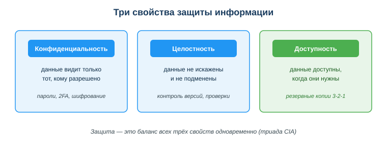
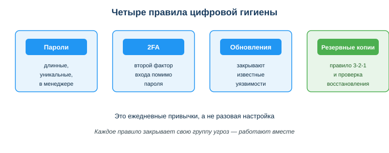

# Применять основы информационной безопасности и цифровой гигиены

## Практическая ситуация

Ты на практике как техник информационных систем. Отработал заявку, настроил доступ к общей папке, сделал скриншот рабочего экрана для отчёта — красиво, видно и терминал с командой, и окно конфигурации. А через день кто-то воспользовался API-ключом сервиса, который был виден в углу того же экрана: набежал счёт за чужие запросы. Один невнимательный шаг — и утекли и секрет от рабочей системы, и почты пользователей, открытые на соседней вкладке.

Так теряют данные чаще всего: не из-за «хакеров в капюшонах», а из-за мелких бытовых ошибок на рабочем месте. Для техника ИС защита — это не паранойя, а набор простых ежедневных привычек, которыми он держит в порядке не только свой ноутбук, но и всю инфраструктуру, которую обслуживает. Их и разбираем.

## Что ты научишься делать

- составлять и хранить надёжные пароли в менеджере, поддерживать парольную политику на рабочих местах;
- защищать аккаунты и устройства базовыми мерами (2FA, обновления и патчи безопасности, резервные копии);
- управлять правами доступа пользователей по принципу минимальных привилегий и разграничивать личное и рабочее;
- соблюдать приватность и безопасно обращаться с персональными данными пользователей и секретами проекта.

## Почему это важно

Цена ошибки растёт: один утёкший пароль или ключ открывает доступ ко всему — почте, деньгам, рабочим системам. Привычки цифровой гигиены защищают тебя каждый день и почти не отнимают времени, если настроены один раз.

Связь с профессией: техник информационных систем отвечает не только за свои данные, но и за код, инфраструктуру и данные пользователей, которых он обслуживает. Утёкший в репозиторий ключ, незакрытая уязвимость на сервере, слишком широкие права доступа у обычного пользователя или непроверенная резервная копия — это уже не личная неприятность, а инцидент, за который отвечает вся служба поддержки. Техник ИС поддерживает цифровую гигиену не только свою, но и всей организации: парольная политика, обновления и патчи на рабочих местах и серверах, разграничение прав, регулярные бэкапы. Это часть профессиональной культуры.

## Учимся читать схему

Посмотри на схему трёх свойств защиты выше. Ответь на вопросы:

- какое свойство нарушается, если твой пароль узнал чужой человек?
- какое свойство страдает, если кто-то незаметно изменил данные в базе?
- какое свойство теряется, если из-за поломки диска файлы стали недоступны?

## Главное понятие

> **Цифровая гигиена** — набор повседневных привычек и правил, которые поддерживают безопасность твоих данных, аккаунтов и устройств: надёжные пароли, 2FA, обновления, резервные копии и осторожность с данными.

Проще: безопасность — это не один «волшебный» антивирус, а ежедневные мелкие действия, как мытьё рук. Все вместе они закрывают три свойства защиты: конфиденциальность, целостность и доступность.

## Три кита защиты: пароли, доступ, резервные копии

### Пароли
- **Длина важнее сложности:** длинная фраза `dom-kniga-veter-2026` надёжнее коротких `P@ss1`.
- **Уникальный** пароль на каждый важный сервис — чтобы утечка одного не открывала всё.
- Хранить — в **менеджере паролей** под мастер-паролем, не в заметках и не в браузере на чужом ПК.

### Доступ
- Включи **двухфакторную аутентификацию (2FA)** везде, где есть: второй фактор подтверждает вход помимо пароля.
- Раздавай пользователям права по **принципу минимальных привилегий** — только то, что нужно для работы, и не больше; лишние права — лишние открытые двери.
- Разграничивай **личное и рабочее**: рабочие задачи — на рабочих аккаунтах и устройствах, не смешивай их с личными.
- Выходи из аккаунтов на чужих устройствах, не давай приложениям лишних разрешений.
- Ставь **обновления и патчи безопасности** системы и программ на рабочих местах и серверах — они закрывают известные уязвимости.

### Резервные копии
- Правило **3-2-1:** 3 копии, на 2 носителях, 1 — вне дома или в облаке.
- Проверяй, что копия реально восстанавливается, — копия без проверки не копия. Это касается и своих файлов, и данных пользователей на сервере.

## Приватность и персональные данные

**Персональные данные** (ФИО, ИИН, телефон, фото) защищены Законом РК «О персональных данных и их защите». Правила:

- не публикуй чужие данные без согласия;
- думай, что выкладываешь в соцсети — **цифровой след** (данные о тебе в сети) остаётся надолго;
- для разработки и тестирования используй **тестовые/обезличенные** данные, а не реальные данные пользователей; это же правило действует, когда выгружаешь данные в лог, прикладываешь их к тикету или передаёшь в поддержку.

### Мини-кейс
Техник ИС на практике приложил к отчёту скриншот рабочего экрана, где видны токен API интеграции и почты пользователей из открытой заявки. Это утечка: токен — секрет от рабочей системы (конфиденциальность), почты — персональные данные пользователей. Следующий шаг: перед публикацией закрывать чувствительные данные и не коммитить секреты в репозиторий — выносить их в `.env` и добавлять файл в `.gitignore`, а на сервере хранить в переменных окружения.

## Разбор типичной ошибки

**Ошибка.** Записать ключ API прямо в код и закоммитить в репозиторий.

**Почему это ошибка.** Ключ навсегда остаётся в истории git, даже если потом его удалить из файла. Боты автоматически сканируют публичные репозитории и находят такие ключи за минуты — счёт и доступ уходят чужим.

**Как правильно.** Хранить секреты в файле `.env` (а на рабочем сервере — в переменных окружения или хранилище секретов), добавить `.env` в `.gitignore`, а уже утёкший ключ немедленно сменить (отозвать старый).

## Практика

Ответь письменно:

1. Сравни пароли `Qw1!`, `dom-kniga-veter-2026`, `123456` и сформулируй правило надёжного пароля.
2. У пользователя, которого обслуживает техник ИС, все рабочие файлы только на одном ноутбуке. Распиши план резервного копирования по правилу 3-2-1.

**Образец (часть ответа на пункт 1):** «Надёжнее `dom-kniga-veter-2026`: длинная фраза. Правило — длина важнее символьной сложности, плюс уникальность пароля для каждого сервиса».

## Самопроверка

- Я умею составить надёжный пароль и знаю, где его хранить.
- Я знаю, что такое 2FA и правило резервного копирования 3-2-1.
- Я понимаю, как безопасно обращаться с персональными данными и секретами проекта.

## Подумай

- Какие из твоих личных привычек уже соответствуют цифровой гигиене, а какие нет? Что исправишь сегодня?
- Почему утечка ключа или слишком широкие права доступа в рабочей системе — это ответственность всей службы поддержки, а не только одного техника, который это допустил?

## Итог

- Длинные уникальные пароли + менеджер паролей + 2FA закрывают конфиденциальность.
- Раздавай пользователям права по принципу минимальных привилегий и разграничивай личное и рабочее.
- Ставь обновления и патчи безопасности на рабочих местах и серверах — это закрытые уязвимости.
- Делай резервные копии по правилу 3-2-1 и проверяй восстановление — это доступность.
- Не публикуй чужие персональные данные, следи за цифровым следом.
- Секреты (токены, ключи) — в `.env` и переменных окружения, не в коде и не в скриншотах.

## Полезные ссылки

- [Закон РК «О персональных данных и их защите» (adilet.zan.kz)](https://adilet.zan.kz/rus/docs/Z1300000094)
- [Что такое менеджер паролей (объяснение)](https://www.kaspersky.ru/resource-center/definitions/password-manager)
- [Как работать с .env и .gitignore (GitHub Docs)](https://docs.github.com/ru/get-started/getting-started-with-git/ignoring-files)

---

*Источник: ГОСО ТиПО (приказ МП РК № 348); Закон РК «О персональных данных и их защите»; DigComp 2.2 (область «Безопасность»); материалы по цифровой гигиене.*

*Разработал: преподаватель ИКТ, магистр управления и информационной безопасности Калиаскаров Д.А.*

*Материал одобрен к использованию в обучении решением Педагогического совета ТОО «Колледж Хекслет Казахстан».*
