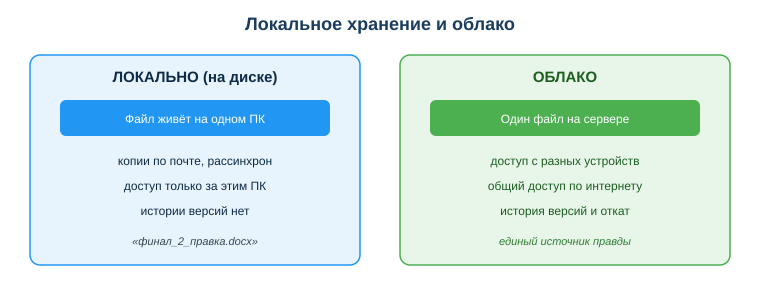
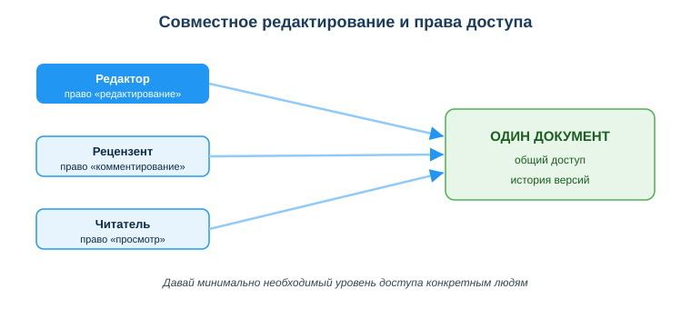

# Работать с облачными сервисами и совместной работой

## Практическая ситуация

Команда готовит отчёт. По почте летает файл «итоговый_финал_2_правка.docx» — уже в пяти версиях, и никто не знает, какая из них настоящая. Один правит копию у себя, другой — у себя, потом эти правки нужно как-то свести вместе. Это типичная боль локального хранения: файл живёт на одном компьютере, а команде нужен общий и всегда актуальный документ.

Облачные сервисы решают проблему: один документ, общий доступ, совместное редактирование и история версий. Для техника информационных систем облако — это не только хранилище и среда командной работы: это ещё и инфраструктура организации, которую он разворачивает, настраивает и сопровождает (облачные серверы, диски, базы данных, учётные записи и права доступа), и место, где живут рабочие сервисы и приложения. Этот урок — про грамотную и безопасную работу с облаком.

## Что ты научишься делать

- объяснять, что такое облачные технологии и зачем они команде;
- настраивать общий доступ и уровни прав без хаоса;
- пользоваться историей версий, чтобы не бояться редактировать;
- соблюдать базовые правила безопасности облака.

## Почему это важно

Современная разработка — это командная работа над общими файлами и кодом. Без облака команда тонет в копиях, рассинхроне версий и потерянных правках. Облако даёт единый источник правды: все видят один и тот же актуальный документ.

Связь с профессией: техник ИС ежедневно работает в облаке — от общего диска с документацией и совместных таблиц до облачной инфраструктуры организации: серверов, хранилищ и баз данных, которые он разворачивает, настраивает и сопровождает. Умение настроить доступ правильно (минимум прав, конкретным людям) — это и про продуктивность команды, и про безопасность данных всей организации, а не только твоих личных файлов.

## Учимся читать схему

Посмотри на сравнение локального хранения и облака выше. Ответь на вопросы:

- где «живёт» файл при локальном хранении, а где — в облаке?
- что появляется в облаке такого, чего нет при копиях по почте?
- почему облако называют «единым источником правды»?

## Главное понятие

> **Облачные технологии** — хранение и обработка данных на удалённых серверах с доступом через интернет.

Проще: твои файлы лежат не на одном компьютере, а на сервере провайдера, и ты открываешь их с любого устройства, где есть интернет и доступ к аккаунту.

## Модели облачных сервисов

Облачные сервисы различают по уровню готовности к использованию:

- **Хранилище** (Google Drive, OneDrive, Yandex Disk) — файлы и совместная работа.
- **Сервисы-приложения** (Google Docs, Sheets) — работа прямо в браузере, без установки программ.
- **Инфраструктура (IaaS)** — облачные серверы, сети, базы данных: техник ИС разворачивает, настраивает и сопровождает их; там запускают и размещают приложения организации.

## Совместная работа без хаоса

Совместное редактирование — это когда несколько пользователей работают над одним документом, а права доступа определяют, что каждому можно. Главные правила:

- **Один источник правды:** один файл или папка с общим доступом, а не копии по почте.
- **Уровни доступа:** «просмотр», «комментирование», «редактирование» — давай минимально необходимый.
- **История версий:** можно откатиться к любому прошлому состоянию — не бойся редактировать.
- **Комментарии и задачи** прямо в документе вместо длинной переписки.

### Мини-кейс
Команда вела отчёт в общем Google-документе. Один участник «всё удалил». Паника? Нет: открыли историю версий и восстановили нужное состояние за минуту. Следующий шаг — настроить право «комментирование» тем, кто не должен править текст напрямую.

## Риски и безопасность

- **Доступ по ссылке «всем, у кого есть ссылка»** = фактически публикация. Давай доступ конкретным людям по приглашению.
- **Конфиденциальные данные** не клади в личное облако без согласования — только в защищённое корпоративное хранилище.
- **2FA** (двухфакторная аутентификация) на облачный аккаунт обязательна — там вся твоя работа.
- Помни: файл в облаке доступен, пока есть интернет и аккаунт активен.

## Разбор типичной ошибки

**Ошибка.** «Расшарить» документ с рабочими данными ссылкой «для всех, у кого есть ссылка».

**Почему это ошибка.** Такая ссылка легко утечёт — попадёт в чат, в письмо, в историю браузера — и данные станут публичными для любого, кто её получит.

**Как правильно.** Давать доступ по приглашению конкретным аккаунтам и ровно тот уровень прав, который человеку реально нужен.

## Практика

Ответь письменно:

1. Назови три модели облачных сервисов и приведи по примеру к каждой.
2. Рецензенту нужно оставлять замечания, но не править текст. Какой уровень доступа ты ему дашь и почему?

**Образец (часть ответа на пункт 2):** «Дам уровень „комментирование“: он сможет оставлять замечания прямо в документе, но не изменит текст. Это принцип минимально необходимого доступа».

## СДЕЛАЙ САМ: расшарь документ с разными правами и откати версию

Хватит читать про совместную работу — сделай её руками, как техник ИС, настраивающий доступы. Понадобится облачный аккаунт (Google Drive/Docs, OneDrive или Yandex Disk), 2–3 одногруппника и 20 минут.

**Шаг 1. Создай документ или папку в облаке** и добавь в неё немного текста, чтобы было что редактировать.

**Шаг 2. Расшарь его с разными правами.** Открой «Настройки доступа» и пригласи трёх человек **по e-mail** с разными ролями: одному — **«Просмотр»**, другому — **«Комментирование»**, третьему — **«Редактирование»**. Для рабочих данных **не используй** «всем, у кого есть ссылка» — давай доступ конкретным аккаунтам (принцип минимума прав).

**Шаг 3. Проверь, что права работают.** Пусть комментатор оставит комментарий, редактор внесёт правку, а просмотрщик убедится, что кнопка редактирования у него недоступна. Так ты своими глазами видишь разницу между уровнями доступа.

**Шаг 4. Открой историю версий и сделай откат.** В Google Docs: «Файл → История версий → Смотреть историю версий»; в OneDrive/Office: «Журнал версий». Найди более раннюю версию, посмотри, что изменилось, и нажми **«Восстановить эту версию»** (откат). Теперь ты не боишься, что кто-то «всё сломает».

**Мини-пример: что такое облачный диск и сервер организации на практике (без абстракций).** Облачный диск организации — это по сути общая сетевая папка, которая живёт не на твоём ноутбуке, а на сервере провайдера, и открывается у всех сотрудников по их логину. Пример: в колледже есть общий диск «Группа ТИС», куда куратор кладёт расписание и методички, — студент открывает его с любого компьютера, всегда видит актуальную версию и не хранит копий у себя. Облачный сервер организации — тот же принцип, но на нём крутится рабочее приложение (например, система учёта заявок): оно установлено не на твоём ПК, а на сервере, и все заходят в него через браузер по адресу. Техник ИС такие диски и серверы разворачивает, настраивает доступы (кому «просмотр», кому «редактирование») и следит за резервными копиями — ровно то, что ты сейчас проделал руками на своём документе.

**Что должно получиться:** один документ/папка с тремя разными уровнями доступа у трёх людей и восстановленная через историю версия.

**Что приложить:** скриншот окна настроек доступа, где видно три разные роли, **и** скриншот истории версий с выполненным откатом. На скриншоте **скрой** личные e-mail приглашённых. Подпиши одним предложением, почему рецензенту дали «комментирование», а не «редактирование».

## Самопроверка

- Я могу объяснить, что такое облачные технологии и назвать их модели.
- Я умею выбрать правильный уровень доступа для разных участников.
- Я знаю, как восстановить документ через историю версий и зачем нужна 2FA.

## Подумай

- Какие свои учебные или рабочие файлы тебе стоило бы перенести в облако с общим доступом? Кому и какой уровень прав ты бы дал?
- Почему «дать доступ всем по ссылке» удобнее, но опаснее, чем «пригласить конкретных людей»?

## Итог

- Используй облако как единый источник правды, а не копии по почте.
- Давай минимально необходимый уровень доступа конкретным людям.
- Пользуйся историей версий — не бойся редактировать.
- Включи 2FA и не клади конфиденциальные данные в личное облако.

## Полезные ссылки

- [Справка Google Диск](https://support.google.com/drive)
- [Microsoft OneDrive — справка](https://support.microsoft.com/ru-ru/onedrive)
- [Совместная работа в Google Документах](https://support.google.com/docs/answer/2494822)

---

*Источник: учебные материалы по применению ИКТ и цифровых технологий (рамка DigComp 2.2); официальная справка Google Workspace и Microsoft 365.*

*Разработал: преподаватель ИКТ, магистр управления и информационной безопасности Калиаскаров Д.А.*

*Материал одобрен к использованию в обучении решением Педагогического совета ТОО «Колледж Хекслет Казахстан».*
