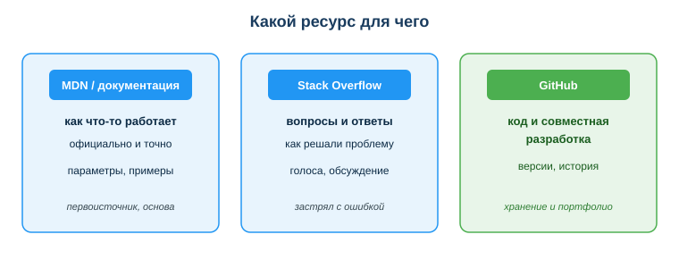
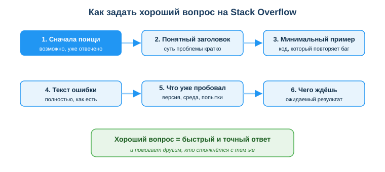

# Пользоваться проф. справочными ресурсами (документация, Stack Overflow, MDN, GitHub)

## Практическая ситуация

Ты пишешь код, и вдруг ошибка: программа падает, а сообщение непонятное. Спрашивать преподавателя долго, угадывать — бесполезно. Что делает опытный техник информационных систем? Он не держит всё в голове — он знает, **где искать ответ**.

Документация подскажет, как официально работает функция; Stack Overflow — как ту же проблему решали другие; GitHub — где хранится код и как над ним работают командой. А когда задача не в коде, а в установке ПО, настройке сервера или сетевого оборудования, выручают базы знаний вендоров (например, Microsoft Learn), официальная документация на оборудование и форумы системных администраторов. Уметь выбирать нужный ресурс и грамотно им пользоваться — профессиональный навык не меньше, чем знание языка программирования.

## Что ты научишься делать

- выбирать правильный ресурс под конкретную задачу;
- грамотно искать ответ и оценивать его достоверность;
- задавать хороший вопрос на Stack Overflow;
- ориентироваться в GitHub как месте хранения кода.

## Почему это важно

Ни один техник ИС не помнит наизусть все функции, библиотеки, команды и настройки ПО и оборудования — их слишком много, и они меняются. Профессионала отличает не «знаю всё», а «быстро нахожу нужное и понимаю, чему можно доверять». Умение работать с ресурсами экономит часы и спасает от ошибок из устаревших советов.

Связь с профессией: на реальной работе ты ежедневно будешь читать документацию — и на языки и библиотеки, и на ПО, серверы и сетевое оборудование, — искать решения на Stack Overflow и в базах знаний вендоров, спрашивать коллег на форумах системных администраторов и хранить свой код и скрипты на GitHub. Твой профиль на GitHub — это твоё портфолио, по которому тебя оценит работодатель. Эти ресурсы сопровождают техника ИС всю карьеру.

## Учимся читать схему

Посмотри на схему «Какой ресурс для чего» выше. Ответь на вопросы:

- к какому ресурсу пойти, чтобы узнать, какие параметры принимает функция?
- где искать, если ты застрял с конкретной ошибкой и хочешь увидеть чужое решение?
- какой ресурс отвечает за хранение кода, версии и совместную работу?

## Главное понятие

> **Профессиональные ресурсы техника ИС** — проверенные источники, к которым обращаются за знаниями и инструментами: официальная документация (как работает — и код, и ПО, и оборудование), Q&A-площадки и форумы администраторов (как решить проблему), базы знаний вендоров (как настроить продукт) и платформы хранения кода (где живёт и развивается код).

Проще: документация **объясняет**, Stack Overflow и форумы админов **подсказывают решение**, база знаний вендора **показывает, как настроить его продукт**, GitHub **хранит и развивает** код. У каждого ресурса своя задача — путать их неэффективно.

## Опоры техника ИС

| Ресурс | Для чего | Когда идти |
|---|---|---|
| Документация (MDN, docs.python.org) | как что-то работает официально | первоисточник, основа |
| Stack Overflow | как другие решали конкретную проблему | застрял с ошибкой в коде |
| GitHub | хранение кода, версии, командная работа | свой и чужой код |
| Базы знаний вендоров (Microsoft Learn и др.) | как установить, настроить и обслуживать ПО и сервисы | внедрение, настройка, сопровождение |
| Документация оборудования (серверы, сетевые устройства) | как подключить и настроить технику | работа с серверами и сетью |
| Форумы системных администраторов (Server Fault и др.) | как коллеги решали задачи эксплуатации | инфраструктурная проблема |

### Документация — первоисточник

Официальная документация (MDN для веб-технологий, docs.python.org для Python) — самый надёжный источник. Там описано, как работает функция, какие параметры принимает, есть рабочие примеры. Документацию пишут и проверяют разработчики самого языка или библиотеки, поэтому начинать поиск стоит именно с неё.

### Stack Overflow — опыт сообщества

Это Q&A-площадка: кто-то задал вопрос, другие ответили, а лучшие ответы поднимаются голосами сообщества. Огромная польза, но пользоваться надо с головой:

- смотри **дату** ответа и **число голосов**;
- проверяй, подходит ли ответ к **твоей версии** языка или библиотеки;
- понимай код, прежде чем его копировать.

Чтобы получить хороший ответ, важно задать хороший вопрос. Сначала поищи — возможно, проблему уже разобрали. Если нет — дай понятный заголовок, минимальный пример кода, полный текст ошибки, опиши, что уже пробовал и какой результат ждёшь.

### GitHub — дом кода

**GitHub** — платформа для хранения кода с системой контроля версий (git). Здесь живут репозитории, история всех изменений, инструменты совместной работы и миллионы открытых проектов (open source). Техник хранит на GitHub не только программы, но и скрипты автоматизации и конфигурационные файлы. Твоё портфолио тоже хранится на GitHub: по нему работодатель видит, что и как ты умеешь делать.

### Базы знаний вендоров, документация оборудования и форумы админов

Далеко не каждая задача техника — про код. Гораздо чаще нужно установить и настроить ПО, поднять сервер, подключить сетевое устройство, разобраться, почему сервис не запускается. Для этого есть свои источники:

- **Базы знаний вендоров** — официальные порталы производителей ПО и сервисов: как установить, настроить, обновить и обслуживать продукт. Крупнейший пример — **Microsoft Learn** (Windows, Windows Server, Active Directory, Office). У большинства вендоров БД, облаков и сетевого оборудования есть свои базы знаний.
- **Документация оборудования** — руководства на серверы, коммутаторы, маршрутизаторы и другую технику: как подключить, настроить, обновить прошивку. Это первоисточник при работе с «железом» и сетью.
- **Форумы системных администраторов** (например, **Server Fault**, профильные сообщества) — здесь коллеги разбирают задачи эксплуатации: настройка серверов, сети, прав доступа, диагностика сбоев. Правила те же, что и на Stack Overflow: смотри дату, репутацию автора и понимай решение, прежде чем применять его на рабочей системе.

### Мини-кейс

Студент скопировал ответ со Stack Overflow с 2 голосами от 2013 года — код не сработал. Рядом был ответ 2024 года с 300 голосами, учитывающий новую версию библиотеки. Следующий шаг: выбирать свежие ответы с высоким рейтингом и сверять их с официальной документацией.

## Разбор типичной ошибки

**Ошибка.** Копировать первый попавшийся ответ со Stack Overflow, не читая обсуждение и не проверяя дату.

**Почему это ошибка.** Ответ может быть устаревшим, написанным для другой версии или вообще не для твоего случая — и тогда код либо не запустится, либо сработает неправильно.

**Как правильно.** Смотреть дату и число голосов, читать комментарии, понимать, что делает код, и сверять его с официальной документацией перед использованием.

## Практика

Ответь письменно:

1. К какому из трёх ресурсов ты обратишься в каждой ситуации: (а) не помнишь, какие параметры принимает функция; (б) получил непонятную ошибку и хочешь чужое решение; (в) хочешь сохранить проект с историей версий? Поясни выбор.
2. Перечисли минимум 4 элемента, которые стоит включить в хороший вопрос на Stack Overflow.

**Образец (часть ответа на пункт 1):** «(а) — документация (MDN/docs.python.org), потому что это официальный первоисточник о работе функции; (б) — Stack Overflow, там сообщество разбирает конкретные ошибки…».

## Самопроверка

- Я знаю, какой ресурс выбрать под задачу (документация / Stack Overflow / GitHub).
- Я умею оценивать ответ на Stack Overflow по дате, голосам и версии.
- Я понимаю, зачем хранить код, скрипты и конфигурации на GitHub и что такое портфолио.
- Я знаю, где искать помощь по настройке ПО и оборудования: базы знаний вендоров (Microsoft Learn), документация техники, форумы администраторов.

## Подумай

- Почему «спросил Stack Overflow» не должно заменять чтение документации? В каких задачах документация надёжнее?
- Как наличие аккуратного профиля на GitHub может повлиять на твоё трудоустройство?

## Итог

- Начинай с документации — это официальный первоисточник о том, как что-то работает.
- На Stack Overflow выбирай свежие ответы с рейтингом, проверяй версию и понимай код.
- Задавай хороший вопрос: заголовок, минимальный пример, текст ошибки, что пробовал.
- Храни код на GitHub: версии, история, совместная работа, портфолио.
- Любой найденный код проверяй, прежде чем использовать.

## Полезные ссылки

- [MDN Web Docs (веб-технологии)](https://developer.mozilla.org/ru/)
- [Stack Overflow](https://stackoverflow.com)
- [GitHub Docs — начало работы](https://docs.github.com/ru/get-started)
- [Документация Python](https://docs.python.org/3/)
- [Microsoft Learn — документация и обучение по ПО и серверам](https://learn.microsoft.com/ru-ru/)
- [Server Fault — Q&A для системных администраторов](https://serverfault.com)

---

*Источник: учебные материалы по применению ИКТ и цифровых технологий; официальная документация MDN Web Docs, GitHub Docs, Stack Overflow.*

*Разработал: преподаватель ИКТ, магистр управления и информационной безопасности Калиаскаров Д.А.*

*Материал одобрен к использованию в обучении решением Педагогического совета ТОО «Колледж Хекслет Казахстан».*
