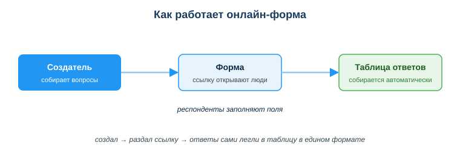
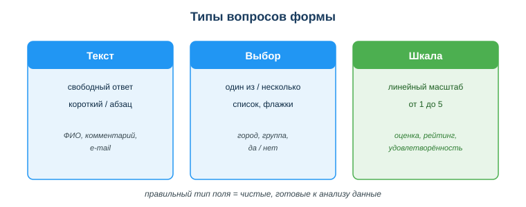

# Работать с интерактивными формами и сервисами совместной работы

## Практическая ситуация

Ты — техник информационных систем, и на тебе техподдержка колледжа. Утро, а в рабочем чате уже свалка: «не печатает», «инет тупит, каб. 210», «СРОЧНО проектор не видит ноут, пара через 15 минут!!!», кто-то звонит на мобильный, кого-то ловишь в коридоре — «слушай, глянь мышку». Половина заявок без кабинета, без внятного описания, без понимания, что горит, а что подождёт. К обеду ты уже не помнишь, кому помог, кому обещал и забыл, а пара обращений просто растворилась в ленте между мемами и «когда обед». Знакомая картина?

А можно иначе: одна онлайн-форма «Заявка в техподдержку» с полями кабинет, что не работает и срочность — и любое обращение приходит сразу с нужными данными и само ложится в таблицу. Ты открываешь таблицу — все заявки в одном месте, можно отсортировать по срочности, ничего не потеряно и не надо переспрашивать «а вы из какого кабинета?». Пять минут на настройку формы — и хаос из чата превращается в аккуратную очередь задач. И это лишь один сценарий: те же формы и сервисы совместной работы нужны технику ИС каждый день — чтобы собирать обратную связь, работать в команде и не терять информацию.

## Что ты научишься делать

- создавать онлайн-формы и опросы для сбора данных;
- выбирать правильный тип вопроса (текст, выбор, шкала) под задачу;
- организовывать командную работу: доски задач, общие документы, чат;
- запрашивать в форме только нужные данные и указывать цель сбора.

## Почему это важно

Готовые интерактивные сервисы экономят часы рутины: не нужно писать код, чтобы собрать опрос, спланировать спринт или вести общий документ. Один раз настроил форму — и данные собираются сами, без ручного переписывания.

Связь с профессией: техник ИС почти не работает в одиночку. Командные доски задач, общие документы и чаты — это его ежедневная среда. А ещё формы — это удобный канал приёма заявок пользователей в техподдержку и сбора обратной связи: одна ссылка вместо разрозненных звонков и сообщений, а обращения сами ложатся в таблицу для обработки.

## Учимся читать схему

Посмотри на схему «Как работает онлайн-форма» выше и ответь на вопросы:

- что делает создатель формы и что получают остальные участники?
- через что проходит путь от вопроса до готовой таблицы ответов?
- почему ответы оказываются в едином формате, а не вразнобой, как в чате?

## Главное понятие

> **Онлайн-форма** — интерактивный сервис (Google Forms, МойОфис Формы), который по одной ссылке собирает ответы многих людей и автоматически складывает их в таблицу в едином формате.

Проще: ты один раз описываешь вопросы, а сервис сам принимает ответы и наводит порядок. Применение: опросы, регистрация на события, тесты, сбор обратной связи и приём заявок пользователей в техподдержку.

## Формы и опросы

Сила формы — в правильно подобранных типах вопросов. Каждому типу — своя задача:

- **текст** — свободный ответ (ФИО, комментарий, e-mail);
- **выбор** — один из вариантов или несколько (группа, город, «да/нет»);
- **шкала** (линейный масштаб) — оценка от 1 до 5 (рейтинг, удовлетворённость).

Хорошая форма: понятные вопросы, правильные типы полей, помечены обязательные поля. Чем точнее тип поля, тем чище данные на выходе — их сразу можно анализировать. И одно короткое правило по данным: **запрашивай только то, что реально нужно для задачи**, и в начале формы одной строкой скажи, зачем собираешь данные (например: «для обработки заявок в техподдержку»). Лишние поля вроде ИИН или адреса «на всякий случай» пользы не дают, а риск создают.

## Сервисы совместной работы

Форма решает сбор данных. Но команде нужно ещё планировать, писать документы и общаться. Под каждую задачу — свой сервис:

| Тип | Примеры | Для чего |
|---|---|---|
| Доски задач | Trello, kanban в таблице | планирование, спринты |
| Общие документы | Google Docs/Sheets | совместное редактирование |
| Мессенджеры/звонки | Telegram, видеоконференции | коммуникация команды |
| Дизайн-доски | Miro, FigJam | схемы, мозгоштурм |

Команде нужны правила: где обсуждаем (чат), где задачи (доска), где документы (облако). Это убирает хаос «всё в личке», когда информация теряется и нет прозрачности.

### Мини-кейс
Староста собирал данные группы для справки через сообщения в чате — половина потерялась, формат у всех разный. Следующий шаг: создать Google-форму с полями ФИО (текст), группа (выбор), оценка организации (шкала). Ответы сами соберутся в таблицу в едином формате, и справку можно делать сразу из неё.

## Практика

Собери руками **настоящую форму приёма заявок в техподдержку** — Google-форму (или МойОфис Формы), как из ситуации в начале урока, — и **покажи результат**: ссылку или скриншот.

Требования к форме:

1. **Минимум 4 поля**, у каждого — осознанно выбранный тип: хотя бы один **текст**, один **выбор** (один из вариантов) и одна **шкала** 1–5. Форма должна реально годиться для приёма обращений: по ответу должно быть понятно, кто, откуда и что не работает.
2. **Обязательные поля:** отметь галочкой «Обязательный вопрос» те, без которых заявку не обработать (кабинет, суть проблемы). Если собираешь e-mail для ответа — включи проверку формата (в настройках вопроса «Проверка ответов» → «Электронная почта»).
3. **Без лишнего:** только то, что нужно для обработки заявки. ИИН, домашний адрес, паспорт — не собираем.
4. **Проверь сам:** пройди форму как пользователь, отправь тестовую заявку и убедись, что она попала в связанную таблицу.

Приложи: ссылку на форму (в режиме заполнения) **или** скриншот, где видно поля и их типы, плюс скриншот таблицы с твоей тестовой заявкой.

**Образец набора полей:** кабинет — выбор или короткий текст; что не работает — выбор (компьютер / сеть / принтер / проектор / другое); срочность — шкала 1–5; описание проблемы — текст (абзац); e-mail для ответа — текст с проверкой формата. Обязательные: кабинет, что не работает, описание.

## Самопроверка

- Я умею создать онлайн-форму и выбрать правильный тип поля под вопрос.
- Я знаю, какой сервис совместной работы взять под задачу (доска / документ / чат).
- Я понимаю принцип минимизации данных и зачем указывать цель сбора.

## Подумай

- Какой сбор данных в твоей учёбе или подработке можно перевести с чата на форму? Что это упростит?
- Почему «всё в личке» удобно сегодня, но вредит команде через месяц работы над проектом?

## Итог

- Для сбора данных используй онлайн-формы — ответы попадают в таблицу автоматически и в едином формате.
- Выбирай тип вопроса под задачу: текст, выбор или шкала.
- Организуй командную работу: доска задач + общие документы + чат, с понятными правилами.
- Запрашивай только необходимые данные и сообщай цель сбора.

## Полезные ссылки

- [Google Формы — справка](https://support.google.com/docs/answer/6281888)
- [Trello — как начать (доски задач)](https://trello.com/guide)
- [Совместная работа в Google Документах](https://support.google.com/docs/answer/2494822)

---

*Источник: ГОСО ТиПО (приказ МП РК); рамка цифровых компетенций DigComp 2.2; официальная документация Google Forms/Docs и Trello.*

*Разработал: преподаватель ИКТ, магистр управления и информационной безопасности Калиаскаров Д.А.*

*Материал одобрен к использованию в обучении решением Педагогического совета ТОО «Колледж Хекслет Казахстан».*
