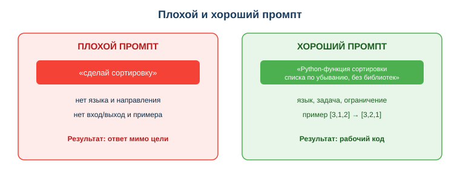

# Освоить основы промпт-инжиниринга для кодовых задач

## Практическая ситуация

Ты пишешь ИИ-ассистенту: «помоги с кодом» — и получаешь общий, бесполезный ответ. Сосед по парте пишет тому же ИИ: «Ты опытный Python-разработчик. Напиши функцию проверки e-mail: на входе строка, на выходе True/False, только стандартная библиотека, дай код и короткое пояснение» — и получает почти готовое решение.

Модель одна, разница — в **промпте** (запросе). Умение формулировать запрос так, чтобы получить качественный код, называется **промпт-инжиниринг**. Для техника информационных систем это прямой множитель продуктивности: тот же ассистент при хорошем промпте экономит часы.

## Что ты научишься делать

- строить структурированный промпт для кодовой задачи по модели 5S (пять шагов);
- применять шаги 5S: задать роль/сцену, быть конкретным (с примером few-shot), упрощать язык, задавать формат, давать обратную связь;
- отличать плохой промпт от хорошего и переписывать первый во второй;
- итеративно улучшать промпт по полученному результату (обратная связь).

## Почему это важно

Сегодня техник ИС почти всегда работает в паре с ИИ-ассистентом: автодополнение, генерация функций, разбор ошибок, объяснение чужого кода. Качество этой работы зависит не от модели, а от того, как ты ставишь задачу. Плохой промпт даёт правдоподобный, но неверный код, который потом дольше отлаживать, чем писать с нуля.

Связь с профессией: на собеседованиях и в реальных командах всё чаще ценят не «знание синтаксиса», а умение быстро получать рабочее решение с помощью инструментов. Промпт-инжиниринг — это и есть навык «разговаривать» с ассистентом на языке точных требований, как ты формулировал бы задачу младшему коллеге.

## Учимся читать схему

Посмотри на структуру промпта по модели 5S выше. Ответь на вопросы:

- из каких пяти шагов (модель 5S) состоит хороший промпт по схеме?
- какой шаг отвечает за конкретику (детали, вход/выход, ограничения, пример)?
- почему, если каждый шаг конкретен, нужно меньше итераций?

## Главное понятие

> **Промпт** — это запрос (текстовая инструкция) к ИИ-модели, по которому она формирует ответ. **Промпт-инжиниринг** — навык составлять такие запросы так, чтобы получать точный и полезный результат.

Проще: промпт — это твоё техническое задание для ИИ. Чем точнее ТЗ, тем ближе ответ к тому, что нужно. Размытый промпт — размытый ответ; точный промпт — почти готовый код.

## Структура промпта: модель 5S

Хороший промпт собирается по модели **5S** — это пять шагов, названных по первым буквам английских слов. Проходи их по порядку — от роли до обратной связи.

> Уточнение: здесь **5S — это про запросы к ИИ**, не путать с 5S организации рабочего места (сортировка, соблюдение порядка и т. д.).

| Шаг (5S) | Что делаешь | Пример |
|---|---|---|
| 1. **Set the Scene** (задай роль/сцену) | задать роль, рамку и стиль ответа | «Ты опытный Python-разработчик» / «Ты системный администратор Linux» |
| 2. **Be Specific** (будь конкретен) | детали, ограничения, вход/выход **и пример вход→выход (few-shot)** | «функция проверки e-mail: вход — строка, выход — True/False, только стандартная библиотека; пример: `user@mail.kz` → True» |
| 3. **Simplify** (упрости язык) | короткие прямые команды, без лишних вводных слов | «Напиши функцию…», а не «Не мог бы ты, если не трудно, попробовать сделать…» |
| 4. **Structure the Output** (задай формат) | как оформить ответ | «код + краткое пояснение» / таблица / пошаговая инструкция |
| 5. **Share Feedback** (дай обратную связь) | уточняй в диалоге, итерации по результату | «слишком длинно — сократи; добавь проверку пустой строки» |

Запомни главное про шаги. **Set the Scene** одним движением задаёт уровень и стиль. **Be Specific** — самый весомый шаг: сюда входят язык, вход/выход, ограничения, крайние случаи и обязательно **пример вход→выход (few-shot)** — именно он резче всего поднимает точность. **Simplify** экономит внимание модели: короткая прямая команда понятнее вежливого многословия. **Structure the Output** экономит уже твоё время — ответ приходит в нужном виде. **Share Feedback** — это штатная итерация: почти никогда не получаешь идеал с первого раза, и это нормально.

## Приёмы усиления

Три приёма, которые заметно поднимают качество ответа (работают на шагах Be Specific и Share Feedback):

- **«Рассуждай шаг за шагом» (Chain of Thought):** попроси модель сначала расписать план, потом решение. Для кода: «Сначала опиши алгоритм подсчёта медианы по шагам, потом дай функцию». Для эксплуатации: «Разбери этот лог по шагам — что за ошибка, вероятная причина, чем проверить».
- **Наводящие вопросы (reverse prompting):** переверни диалог — «Прежде чем писать скрипт бэкапа `/var/www`, задай мне уточняющие вопросы, если данных не хватает». Модель сама вытянет из тебя вход/выход и ограничения.
- **«Адвокат дьявола» / самокритика:** «Раскритикуй свой ответ, найди слабые места и крайние случаи». Для кода модель заметит необработанный `None`; для команды/скрипта — предупредит, что `rm -rf` без проверки пути или отсутствие проверки прав опасны.

Сравни два запроса на схеме: «сделай сортировку» против развёрнутого. Видно, что хороший промпт сам подсказывает модели язык, направление, ограничение и проверяемый пример.

### Мини-кейс

Запрос «сделай парсер» дал бесполезный ответ. Уточнённый промпт: «Напиши на Python функцию, которая из строки `имя=значение` возвращает словарь; пример: `a=1;b=2` → `{'a':'1','b':'2'}`; без сторонних библиотек» — дал рабочее решение с первого раза. Вывод на будущее: всегда добавлять хотя бы один пример вход→выход.

Те же шаги 5S работают и для скриптов администрирования — второй половины работы техника ИС. Промпт «Ты системный администратор. Напиши на Bash скрипт резервного копирования каталога `/var/www` в архив с датой в имени; учти пустой каталог; дай код и одну строку пояснения» задаёт сцену, конкретику и формат так же чётко, как промпт для функции на Python, — и черновик скрипта приходит почти готовым.

## Разбор типичной ошибки

**Ошибка.** Написать слишком общий промпт («помоги с кодом») и сразу принять первый ответ как готовый.

**Почему это ошибка.** Без языка, входа/выхода и ограничений модель угадывает детали — ответ почти наверняка мимо. А первый ответ часто требует одной-двух уточняющих итераций; код, принятый без проверки, ломается на крайних случаях (пустая строка, ноль, None).

**Как правильно.** Сначала собери промпт по модели 5S: сцена, конкретика (язык, вход/выход, ограничения, пример), простой язык, формат. Затем дай обратную связь: прочитай ответ, уточни промпт по результату (добавь пример, опиши ошибку) и обязательно проверь код тестами.

## Практика

Ответь письменно:

1. Разбери промпт «Ты Python-разработчик. Напиши функцию подсчёта гласных в строке: вход — строка, выход — число; без сторонних библиотек; код и пояснение» по модели 5S: какие шаги закрыты, а каких не хватает? Что бы ты добавил для надёжности?
2. Перепиши плохой промпт «сделай функцию для дат» в структурированный промпт с примером вход→выход.

**Образец (часть ответа на пункт 1):** «Set the Scene (сцена) — "Ты Python-разработчик"; Be Specific (конкретика) — "подсчёт гласных, вход строка, выход число, без библиотек"; Structure (формат) — "код и пояснение". Не хватает примера (шаг Be Specific) и обратной связи. Для надёжности добавлю пример `"окно"` → `2` и требование обработать пустую строку».

## Самопроверка

- Я умею назвать пять шагов модели 5S и привести пример каждого.
- Я могу переписать расплывчатый промпт в структурированный с примером вход→выход.
- Я понимаю: мусор на входе — мусор на выходе, поэтому «проверка» здесь означает уточнить и переформулировать сам промпт (сцена, конкретика, простой язык, формат), а не просто перезапросить.

## Подумай

- Какую свою недавнюю задачу по коду ты сформулировал бы для ИИ лучше, если бы знал про модель 5S (сцену, конкретику, простой язык, формат, обратную связь)? Что именно ты бы добавил?
- Почему в команде техников ИС умение точно ставить задачу ИИ похоже на умение ставить задачу младшему коллеге?

## Итог

- Хороший промпт собирается по модели 5S: сцена + конкретика (с примером) + простой язык + формат + обратная связь.
- Примеры вход→выход (few-shot) на шаге «будь конкретен» — самый быстрый способ повысить качество ответа.
- Итерируй (обратная связь): уточняй запрос по результату, пока решение не станет рабочим.
- Качество ответа зависит от качества запроса: мусор на входе — мусор на выходе, поэтому «проверка» в этой теме — это уточнить и переформулировать промпт по шагам 5S, а не переспросить то же самое.

## Полезные ссылки

- [OpenAI — руководство по промпт-инжинирингу](https://platform.openai.com/docs/guides/prompt-engineering)
- [Google — введение в промптинг](https://ai.google.dev/gemini-api/docs/prompting-intro)
- [GitHub Copilot — советы по запросам](https://docs.github.com/ru/copilot/using-github-copilot/prompt-engineering-for-github-copilot)

---

*Источник: материалы по применению ИИ в разработке (DigComp 2.2; UNESCO AI Competency Framework, 2024); официальные руководства по промпт-инжинирингу (OpenAI, Google, GitHub Copilot).*

*Разработал: преподаватель ИКТ, магистр управления и информационной безопасности Калиаскаров Д.А.*

*Материал одобрен к использованию в обучении решением Педагогического совета ТОО «Колледж Хекслет Казахстан».*
